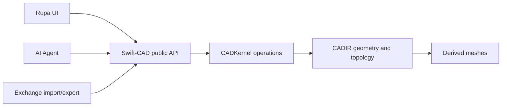
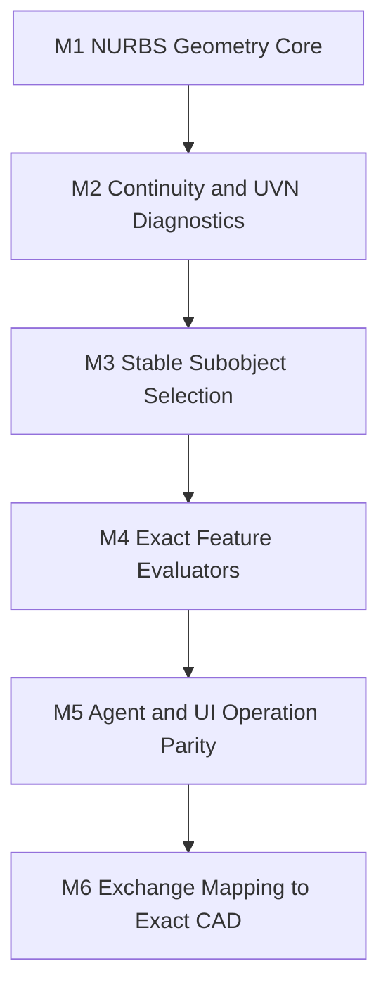

# CAD Kernel Requirements

Swift-CAD must expose the modeling kernel that Rupa, UI tools, and automation agents can share. The kernel is the source of geometric truth; UI controls and agent commands should call the same typed operations rather than maintaining separate approximations.

## Rupa Requirement Breakdown

| Requirement layer | Rupa need | Kernel stance | Implementation pressure |
|---|---|---|---|
| Exact geometry | Curves, arcs, circles, NURBS curves, NURBS surfaces, and UVN frames must remain editable after each operation. | CADIR owns exact parametric geometry; mesh output is derived and cannot be the modeling truth. | Add exact primitives before UI affordances depend on them. |
| Curve-on-surface | Face trims, bridge edges, surface matching, projected curves, and sweep guides need parameter-space curves linked to surfaces. | Trim and continuity tools must consume typed UV curves instead of sampled polylines where exact input exists. | Promote rational UV B-spline curves into `SurfaceParameterCurve`. |
| Subobject operation | Users and agents must select bodies, faces, edges, vertices, spans, knots, CVs, and trims with stable references. | Selection references belong to the kernel and must survive feature recomputation. | Extend stable naming from generated bodies and faces into trim and surface-output references. |
| Continuity diagnostics | Bridge, match, fillet, patch, curvature combs, and zebra-style checks require measurable G0/G1/G2 quality. | Continuity is a typed request/evaluator contract, not a viewport-only overlay. | Feed exact surface parameter curves into surface continuity sampling. |
| Feature parity | Rupa UI controls and AI agent commands must call the same operations. | Public SwiftCAD operations wrap the same FeatureOperation and validation path; builder APIs cover sketch, extrude, sweep, bridge curve, curve edit, exact line/circle/arc curve offset, exact curve trim, PolySpline, FaceLoopOffset, and FaceKnife; Codable agent command schemas can append shared feature operations through the same graph validation path. | Continue exposing new kernel operations through builder/facade APIs and agent command schemas as they are added. |
| Performance | Large models and WASM execution need allocation-light evaluation and explicit ownership. | Evaluators should avoid materializing homogeneous control nets or sampled replacements in hot paths. | Keep rational evaluation loop-based; add borrowed/COW buffers for dense data later. |

## Completion Matrix

| Requirement | Why it matters | Current state | Completion target | First implementation slice |
|---|---|---|---|---|
| Parametric curve model | Sketching, sweep paths, bridge curves, tangent snaps, and dimensions need editable curves with stable parameters. | Lines, circles, arcs as exact circles with finite domains, and rational B-spline curves are modeled with evaluation, derivatives, curvature, domains, knots, weights, exact sketch line/circle/arc curve outputs, exact line/circle/arc curve offsets, exact curve trim features, exact/fallback curve projection queries, and history-preserving B-spline CV/knot/weight edit features. Generated-curve constraints need expansion. | Lines, arcs, circles, Bezier, B-spline, and rational NURBS curves with evaluation, derivatives, domains, knots, spans, weights, and projection references. | Add generated-curve constraints and continuity-ready endpoint frames. |
| Parametric surface model | NURBS surfaces are the foundation for Plasticity-class loft, bridge, sweep, patch, continuity, and curvature tools. | B-spline surfaces support degree/order, knots, control points, positive weights, rational evaluation, differential geometry, surface trim references, UV trim-curve queries for face loop edges, rational B-spline UV parameter curves, exact pcurve storage on oriented edge uses, PolySpline boundary pcurve emission, and planar FaceLoopOffset/FaceKnife generated pcurves. Trim loop topology still needs broader feature evaluators to emit exact parameter curves. | NURBS surfaces with degree/order, knot vectors, control nets, positive weights, rational evaluation, derivatives, normals, UVN frames, and trim-ready parameter domains. | Connect projection, topology repair, and additional feature evaluators to exact parameter curves. |
| Differential geometry and UVN frame | Curvature combs, zebra diagnostics, surface snapping, continuity matching, and deformation need first and second derivatives. | Surface differential geometry uses rational B-spline derivatives for position, tangents, second derivatives, normals, curvature, face-based surface query frames, closest-point projection, direction-based projection, and planar line-loop trim bounds back to UVN frames. | Shared evaluators for position, tangent U/V, normal, principal curvature, principal directions, and orientation-stable UVN frames on analytic and NURBS surfaces. | Add curve-on-surface trim domains and projection diagnostics over non-planar trims. |
| Continuity contracts | Bridge, fillet, blend, and surface matching need explicit G0/G1/G2/G3 targets rather than visual-only alignment. | Curve G0/G1/G2 and surface G0/G1/G2 requests are represented as kernel contracts with position, tangent/normal angle, curvature deviations, surface boundary/trim sampling helpers, an initial G0/G1/G2 bridge-curve solver, and bridge curve feature output. Blend and patch solve inputs still need expansion. | Typed curve and surface continuity evaluators with deviation metrics, tangent/curvature constraints, and solve-ready diagnostics. | Add continuity-driven solve inputs for blend surfaces and patch construction. |
| Topology and stable naming | Object, face, edge, vertex, CV, knot, span, and trim selection must survive feature recomputation and agent operations. | B-rep tables, generated persistent names, evaluated curve output tables, curve subobject references, face-based surface subobject references, and indexed surface trim references exist for basic feature, curve, surface, and trim-edge selection. | Stable references for bodies, faces, edges, vertices, trims, surface spans, curve spans, knots, and control vertices. | Extend generated names and selection references to trims and generated surface outputs. |
| Solid and sheet B-rep robustness | CAD edits must preserve watertight solids, sheet bodies, trim loops, and validation semantics. | Basic B-rep validation exists for planar/cylindrical/B-spline boundary cases, oriented edge uses can store exact surface parameter curves, and validation checks endpoint plus sampled 3D edge consistency for stored pcurves. | Manifold validation, trim loop validation, orientation repair diagnostics, and exact curve-on-surface constraints. | Move generated feature trim checks from endpoint approximations toward parameter-space trim curves. |
| Feature evaluators | Users and agents need high-level operations: extrude, revolve, sweep, loft, bridge, fillet, chamfer, shell, boolean, and patch. | Extrude, face loop offset, knife, sweep contracts, poly-spline surface generation, and bridge curve generation are represented. PolySpline, FaceLoopOffset, and FaceKnife now emit exact pcurves for supported generated trims. Bridge curves produce exact B-spline curve outputs that downstream features can consume as paths or guides. | Feature evaluators that produce exact B-rep or exact curve/surface outputs with stable subshape names, with mesh as derived output. | Use NURBS surfaces as the result type for sweep/loft/bridge instead of temporary mesh-like approximations. |
| Snapping and dimensions | Accurate sketching and construction workflows need exact snapping and editable dimensions. | Sketch dimensions exist, solver-ready constraint graph equations preserve dimension target values, sketch dimension evaluation reports measured values and residuals, a direct sketch dimension solver handles line length, point-to-point distance, line angle, arc span, radius, and diameter dimensions, the SwiftCAD facade can apply sketch dimension solves to document features with downstream invalidation, and kernel query APIs expose evaluated curve endpoints, midpoints, parameters, tangents, curvature, closest-point and direction-based curve projection, B-spline spans, knots, control points, B-rep edge endpoints/frames/projection, surface UVN/knot/span/CV queries, closest-point surface projection, direction-based surface projection, planar trimmed-face projection bounds, and intent-filtered snap candidates for vertices, edges, generated/evaluated curves, and faces. | Kernel queries for endpoints, midpoints, centers, tangencies, projected points, construction planes, distances, angles, and editable dimension constraints. | Add non-planar trim-aware projection and general editable dimension constraint solving. |
| Performance and memory | WASM and large models require avoiding unnecessary copies at byte, mesh, and control-net boundaries. | ByteSource/ByteSink boundaries are explicit; control nets currently use value arrays. | Borrowed or copy-on-write views for dense points, weights, indices, and imported byte ranges where API ownership permits. | Keep rational evaluation loop-based and allocation-light; avoid temporary homogeneous control nets. |
| Exchange boundary | USD mesh exchange, STEP/IGES CAD exchange, and native documents must map into the same kernel model. | USD mesh exchange and pure Swift USD readers exist as trait-gated modules. | Mesh exchange remains mesh exchange; CAD exchange maps to exact curves, surfaces, trims, topology, units, and metadata. | Preserve USD as mesh exchange while strengthening NURBS/B-rep for native CAD workflows. |

## Rupa Priority Map

| Rupa workflow | Kernel requirement | Current state | Next gap |
|---|---|---|---|
| Subobject selection | Bodies, faces, edges, vertices, curve spans, surface spans, knots, and CVs need stable references. | Bodies, faces, edges, vertices, generated persistent names, typed edge parameter references, curve output references, curve span/knot/CV references, face surface span/knot/CV references, evaluated curve tables, shared intent-filtered snap candidates for topology and curve outputs, edge projection queries, curve projection queries, and face-to-UV projection queries exist for core feature outputs. | Extend references to trims, generated surface outputs, and topology-to-parameter projection references. |
| Curve authoring | Lines, arcs, circles, Bezier, B-spline, rational NURBS, offsets, bridge curves, tangent snaps, and dimensions must share exact curve types. | Lines, circles, finite-domain arcs, rational B-spline curves, sketch splines, curve continuity, bridge curve output, exact line/circle/arc offset operations, exact curve trim operations, exact/fallback curve query and projection APIs, and typed B-spline CV/knot/weight edit operations are available. | Add sketch constraints over generated curves. |
| Surface editing | Sweep, loft, bridge, patch, PolySpline, continuity matching, UVN frames, and curvature diagnostics must be exact geometry first. | Rational B-spline surfaces, rational B-spline UV parameter curves, oriented-edge pcurve storage, PolySpline boundary pcurve emission, planar FaceLoopOffset/FaceKnife pcurve emission, surface continuity checks, surface sampling, sweep, PolySpline surface generation, surface query frames, and UV trim-curve queries are partially available. | Add feature evaluators that emit exact trimmed surfaces beyond planar generated loops, loft/bridge surface solvers, and diagnostic projection APIs. |
| Operation parity | UI tools and AI agents must call the same typed operation requests. | FeatureOperation is the shared IR, generated curves flow through the same evaluation context as sketch curves, the SwiftCAD builder exposes bridge curve, curve edit, curve offset, curve trim, sweep, PolySpline, FaceLoopOffset, and FaceKnife operations, Codable agent commands append shared feature operations through graph validation, and the SwiftCAD facade exposes intent-filtered snap queries and document-level sketch dimension solving. | Keep public SwiftCAD-level builder APIs and agent command schemas aligned with every new feature operation. |
| Performance | WASM, interactive editing, and agent batch edits need allocation-light geometry evaluation. | Curve and surface evaluation uses typed arrays and avoids homogeneous control-net materialization in the hot path. | Add borrowed/copy-on-write buffer views for dense imported meshes, control nets, and tessellation output. |

## Milestone Direction

| Milestone | Definition of done |
|---|---|
| M1 NURBS Geometry Core | Rational curves and surfaces evaluate position, derivatives, curvature, normals, domains, knots, spans, and weights with typed validation. |
| M2 Continuity and UVN Diagnostics | Curves and surfaces expose shared G-continuity checks, UVN frames, curvature data, and diagnostic samples. |
| M3 Stable Subobject Selection | Object, face, edge, vertex, CV, knot, span, and trim references survive recomputation and are usable by UI and agents. |
| M4 Exact Feature Evaluators | Sweep, loft, bridge, patch, fillet, chamfer, shell, and booleans produce exact B-rep where supported and fail with typed errors otherwise. |
| M5 Agent and UI Operation Parity | Every user-visible modeling action has a typed operation request that agents can call with the same validation path. |
| M6 Exchange Mapping to Exact CAD | CAD exchange maps exact geometry into curves, surfaces, trims, topology, and units; mesh exchange remains explicitly mesh-only. |
