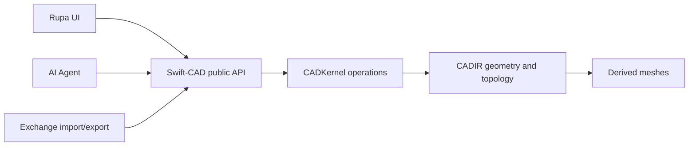
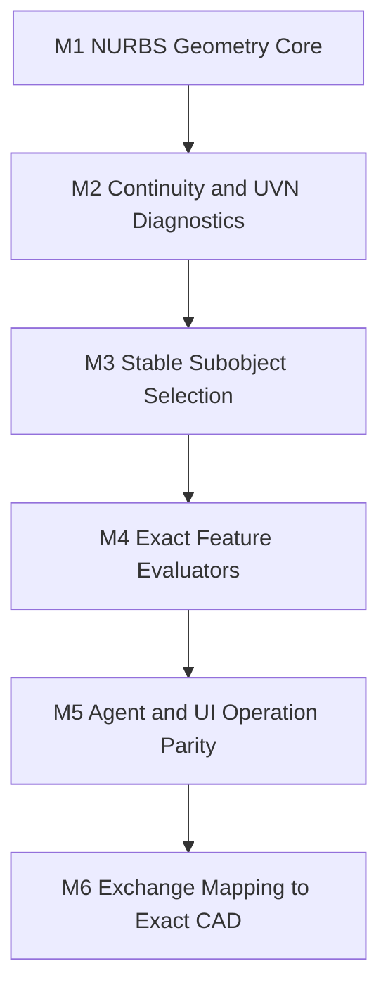

# CAD Kernel Requirements

Swift-CAD must expose the modeling kernel that Rupa, UI tools, and automation agents can share. The kernel is the source of geometric truth; UI controls and agent commands should call the same typed operations rather than maintaining separate approximations.

## Completion Matrix

| Requirement | Why it matters | Current state | Completion target | First implementation slice |
|---|---|---|---|---|
| Parametric curve model | Sketching, sweep paths, bridge curves, tangent snaps, and dimensions need editable curves with stable parameters. | Lines, circles, and rational B-spline curves are modeled with evaluation, derivatives, curvature, domains, knots, and weights. Arc-specific editing and trim semantics need expansion. | Lines, arcs, circles, Bezier, B-spline, and rational NURBS curves with evaluation, derivatives, domains, knots, spans, and weights. | Add curve trim references, curve spans, and continuity-ready endpoint frames. |
| Parametric surface model | NURBS surfaces are the foundation for Plasticity-class loft, bridge, sweep, patch, continuity, and curvature tools. | B-spline surfaces support degree/order, knots, control points, positive weights, rational evaluation, and differential geometry. Trim curves and rational curve links are missing. | NURBS surfaces with degree/order, knot vectors, control nets, positive weights, rational evaluation, derivatives, normals, UVN frames, and trim-ready parameter domains. | Add rational curve primitives and trim-ready curve-on-surface links. |
| Differential geometry and UVN frame | Curvature combs, zebra diagnostics, surface snapping, continuity matching, and deformation need first and second derivatives. | Surface differential geometry uses rational B-spline derivatives for position, tangents, second derivatives, normals, and curvature. | Shared evaluators for position, tangent U/V, normal, principal curvature, principal directions, and orientation-stable UVN frames on analytic and NURBS surfaces. | Expose kernel-level UVN frame query types across analytic and NURBS surfaces. |
| Continuity contracts | Bridge, fillet, blend, and surface matching need explicit G0/G1/G2/G3 targets rather than visual-only alignment. | Curve G0/G1/G2 requests are represented as kernel contracts with position, tangent-angle, and curvature-vector deviations. Surface continuity is still missing. | Typed curve and surface continuity evaluators with deviation metrics, tangent/curvature constraints, and solve-ready diagnostics. | Add surface continuity requests across UV boundaries and trim edges. |
| Topology and stable naming | Object, face, edge, vertex, CV, knot, span, and trim selection must survive feature recomputation and agent operations. | B-rep tables and generated persistent names exist for basic features. | Stable references for bodies, faces, edges, vertices, trims, surface spans, curve spans, knots, and control vertices. | Extend generated names and selection references after NURBS curve/surface IDs are first-class. |
| Solid and sheet B-rep robustness | CAD edits must preserve watertight solids, sheet bodies, trim loops, and validation semantics. | Basic B-rep validation exists for planar/cylindrical/B-spline boundary cases. | Manifold validation, trim loop validation, orientation repair diagnostics, and exact curve-on-surface constraints. | Move B-spline boundary and trim checks from endpoint approximations toward parameter-space trim curves. |
| Feature evaluators | Users and agents need high-level operations: extrude, revolve, sweep, loft, bridge, fillet, chamfer, shell, boolean, and patch. | Extrude, face loop offset, knife, sweep contracts, and poly-spline surface generation are partially represented. | Feature evaluators that produce exact B-rep and stable subshape names, with mesh as derived output. | Use NURBS surfaces as the result type for sweep/loft/bridge instead of temporary mesh-like approximations. |
| Snapping and dimensions | Accurate sketching and construction workflows need exact snapping and editable dimensions. | Sketch dimensions and selected snapping concepts exist outside the kernel. | Kernel queries for endpoints, midpoints, centers, tangencies, projected points, construction planes, distances, angles, and editable dimension constraints. | Add query APIs after curve/surface parameterization is complete. |
| Performance and memory | WASM and large models require avoiding unnecessary copies at byte, mesh, and control-net boundaries. | ByteSource/ByteSink boundaries are explicit; control nets currently use value arrays. | Borrowed or copy-on-write views for dense points, weights, indices, and imported byte ranges where API ownership permits. | Keep rational evaluation loop-based and allocation-light; avoid temporary homogeneous control nets. |
| Exchange boundary | USD mesh exchange, STEP/IGES CAD exchange, and native documents must map into the same kernel model. | USD mesh exchange and pure Swift USD readers exist as trait-gated modules. | Mesh exchange remains mesh exchange; CAD exchange maps to exact curves, surfaces, trims, topology, units, and metadata. | Preserve USD as mesh exchange while strengthening NURBS/B-rep for native CAD workflows. |

## Milestone Direction

| Milestone | Definition of done |
|---|---|
| M1 NURBS Geometry Core | Rational curves and surfaces evaluate position, derivatives, curvature, normals, domains, knots, spans, and weights with typed validation. |
| M2 Continuity and UVN Diagnostics | Curves and surfaces expose shared G-continuity checks, UVN frames, curvature data, and diagnostic samples. |
| M3 Stable Subobject Selection | Object, face, edge, vertex, CV, knot, span, and trim references survive recomputation and are usable by UI and agents. |
| M4 Exact Feature Evaluators | Sweep, loft, bridge, patch, fillet, chamfer, shell, and booleans produce exact B-rep where supported and fail with typed errors otherwise. |
| M5 Agent and UI Operation Parity | Every user-visible modeling action has a typed operation request that agents can call with the same validation path. |
| M6 Exchange Mapping to Exact CAD | CAD exchange maps exact geometry into curves, surfaces, trims, topology, and units; mesh exchange remains explicitly mesh-only. |
