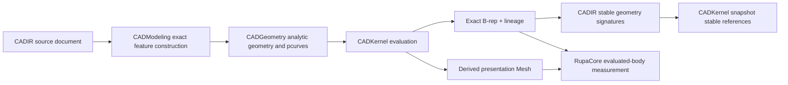
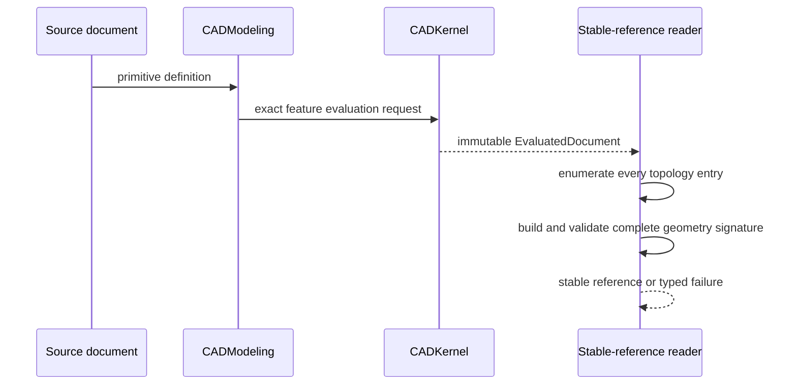

# Swift-CAD Package Design

## Purpose and Scope

Swift-CAD is the native CAD package for source documents, exact analytic
geometry, validated B-rep topology, deterministic evaluation, and derived
presentation Mesh. This package design is the parent of the affected
`CADGeometry`, `CADModeling`, `CADIR`, and `CADKernel` module designs. It has no
parent inside the Swift-CAD repository.

The package owns the exact source-to-evaluation path used by RupaCore. It does
not own Rupa project publication, application sessions, Product metadata,
Agent transport, or measurement-result presentation.

## Responsibilities and Boundaries

Swift-CAD owns:

- validated source geometry and analytic surface parameterization;
- feature evaluation into exact B-rep topology;
- topology identity and geometry signatures suitable for stable selection;
- deterministic evaluation snapshots and read-only topology lookup;
- derived Mesh generation for presentation and exchange.

Swift-CAD does not decide which Rupa Product is visible, publish a project
revision, persist a Rupa package, or replace exact B-rep measurements with Mesh
or bounds data.

## Related Designs

| Design | Relationship | Contract Used | Summary | Cautions |
|---|---|---|---|---|
| [CADGeometry](Sources/CADGeometry/DESIGN.md) | child | analytic surface and pcurve validation | Owns parameter-domain and structural geometric validity. | Structural validity is not silently relaxed for a model tolerance. |
| [CADModeling](Sources/CADModeling/DESIGN.md) | child | exact primitive construction | Owns generated primitive B-rep topology and analytic seam/pole pcurves. | Generated references must remain valid through the shared geometry contract. |
| [CADIR](Sources/CADIR/DESIGN.md) | child | stable signature value and Codable contract | Owns serialized geometry signatures and their rejection rules. | Signatures retain geometry; they do not identify a new body by themselves. |
| [CADKernel](Sources/CADKernel/DESIGN.md) | child | evaluated snapshot topology reads | Owns snapshot-scoped stable-reference creation and lookup. | Reads use the supplied immutable evaluation; no second authority is created. |
| [RupaCore](../RupaKit/Sources/RupaCore/DESIGN.md) | used by | evaluated solid and Mesh-backed presentation measurement | Consumes exact B-rep volume and derived Mesh area/bounds. | RupaCore does not construct or approximate CAD geometry. |

## Architecture

The dependency direction remains downward from source/modeling to geometry and
upward only through public value contracts. A stable reference is composed from
the exact topology in one `EvaluatedDocument`; it never re-evaluates a mutable
source document.

## Contracts and Invariants

1. Analytic primitive evaluators retain exact surfaces and exact pcurves. A
   periodic seam or pole is represented by a valid parameter curve with its
   finite domain and orientation, not by dropping a topology entry.
2. Structural geometry validation rejects nonfinite, degenerate, wrong-surface,
   and out-of-domain values. Floating-point representational error at a valid
   analytic basis is handled by the shared structural predicate contract; a
   caller's modeling tolerance is not used to admit malformed input.
3. `CADIR` geometry signatures retain the complete surface, edge, loop, coedge,
   and pcurve geometry required to compare a subshape. Validation and Codable
   round-trip preserve that complete signature.
4. `CADKernel.stableSubshapeReference(for:)` reads the current evaluated
   topology, creates one complete signature, validates it, and returns a
   snapshot-bound value. It does not skip faces, edges, vertices, seams, or
   poles and does not create a second evaluated document.
5. Exact volume comes from the evaluated B-rep. Mesh surface area and bounds
   are presentation measurements only. No tessellated volume or bounds-only
   substitute is a successful solid measurement.
6. Invalid inputs remain rejected after any representational-tolerance fix,
   and planar/cylindrical topology keeps its existing stable-reference
   behavior.

## Runtime Flows

## State, Ownership, and Lifecycle

- The source document owns parameters and feature history.
- `CADKernel` owns the immutable evaluation snapshot for the duration of a
  read.
- `CADIR` signatures own their encoded geometry values after construction;
  they do not retain live model storage.
- Derived Mesh is disposable presentation data and never becomes source
  authority.

## Failure, Concurrency, and Constraints

Stable topology reads are read-only and operate on one immutable evaluation.
Missing topology, missing pcurves, malformed signatures, and invalid analytic
parameters return typed failures. A stable-reference failure does not return a
partial signature or an empty-success placeholder. No external callback or
mutable project operation occurs while a signature is being built.

## Verification and Change Impact

The affected module tests must prove every generated sphere body, face, edge,
and vertex can produce a stable reference and that JSON round-trip preserves
the complete signature. They must also retain rejection tests for nonfinite,
degenerate, wrong-surface, and out-of-domain pcurves and representative planar
and cylindrical topology. Changes to the shared structural predicate require
rechecking primitive construction, topology signature decoding, stable lookup,
and RupaCore's evaluated-body measurement path.
