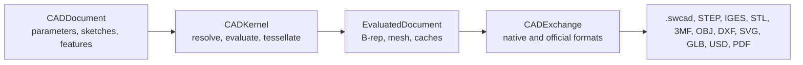
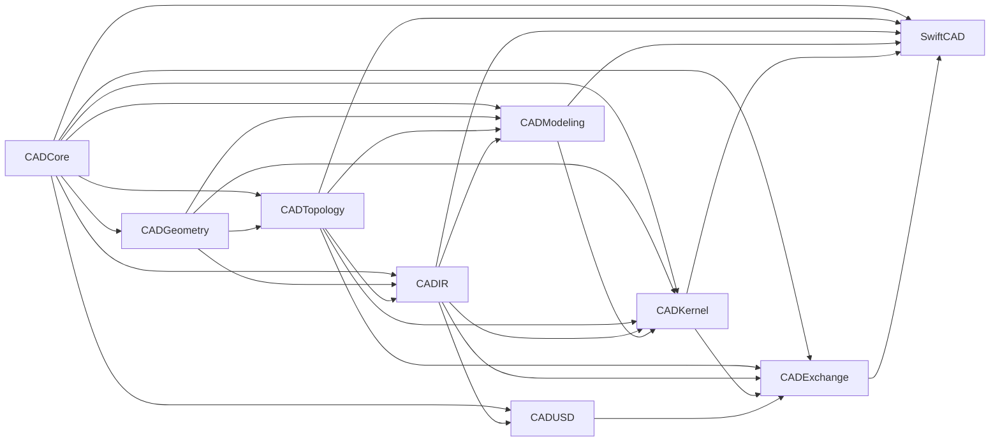
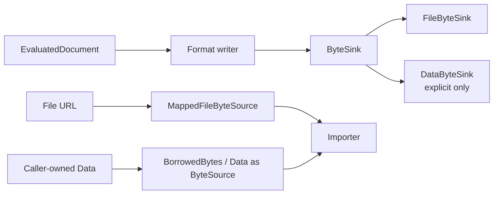

# Swift-CAD

[](https://github.com/1amageek/swift-CAD/actions/workflows/ci.yml)

Swift-CAD is a native Swift foundation for parametric CAD documents, deterministic evaluation, exact B-rep topology, mesh tessellation, WebAssembly deployment, and exchange with common CAD, mesh, visualization, and document formats.

The project treats triangles as derived data. The editable source of truth is the document source: parameters, sketches, constraints, feature history, units, and design graph.



## Status

Swift-CAD is a pre-v1 development kernel. The current implementation is being
reconstructed around exact geometry, validated B-rep topology, stable topology
lineage, and shared command and query paths for the UI, Builder, and Agent. There is
no compatibility promise for the current API or `.swcad` data. The normative
capability table is [CAPABILITY_LEDGER.md](CAPABILITY_LEDGER.md); the staged
replacement plan and uncompromising completion gates are
[ROADMAP.md](ROADMAP.md).

| Area | Current support |
|---|---|
| Public facade | Development `SwiftCAD` facade with shared `CADCommand` and `KernelQuery` contracts |
| Native document | `.swcad` source-only ZIP package with document-level selection dimensions |
| Modeling | Capability-ledger features only; extrude, revolve, registered straight or curved-parallel translational Sweep, certified straight-path linear-scale Sweep, one verified straight point-guide similarity Sweep, and circular path-normal Sweep reducible to exact revolution preserve line, circular-arc, and rational spline boundaries as analytic, surface-of-revolution, or tensor-product rational B-spline exact B-rep faces with mandatory pcurves and deterministic lineage |
| Exact shape | Validated coedge B-rep with analytic and rational B-spline geometry, caller-selected invariant reports, and explicit audited repair requests |
| Geometry intersection | Closed-form analytic sections plus bounded rational B-spline curve/surface intersections; regular transverse cylinder, cone, sphere, and torus intersections against bounded rational B-spline surfaces use exact analytic NURBS reduction, deterministic periodic patch-boundary avoidance, Newton-refined pseudo-arclength marching, component consolidation, dual pcurves, and verified residuals |
| Derived shape | Deterministic triangle meshes |
| Exchange | Mesh exchange is separate; STEP and IGES provide exact deterministic round-trip for the ledger's analytic line/circle/arc/ellipse and plane/cylinder/cone/sphere/torus subset, SI and conversion-based inch/foot STEP length units with physical uncertainty scaling, exact piecewise-linear pcurves, finite sub-period conic trims across periodic seams in either direction, finite partial or complete rational B-spline edge trims in either direction, harmonic elliptic pcurves in either orientation, and manifold topology including IGES multi-open-shell sheet body groups and oriented void shells |
| Byte boundary | Sink-based export and borrowed/mapped import |
| WebAssembly | Important supported build target for portable CAD kernels and browser-hosted workflows |

## Package Layout



| Target | Responsibility | Product |
|---|---|---:|
| `CADCore` | IDs, units, quantities, math primitives, schema, errors, tolerance | No |
| `CADGeometry` | Exact analytic primitives, intervals, robust predicates, differential geometry | Yes |
| `CADTopology` | Coedge B-rep, exact geometry ownership, invariant validation, analytic volume | Yes |
| `CADIR` | Document, parameters, constraints, feature graph, derived mesh IR | Yes |
| `CADModeling` | Feature-evaluation contracts and exact editing algorithms | Yes |
| `CADKernel` | Evaluation orchestration, cache, capability discovery, classification, sewing, tessellation | Yes |
| `CADUSD` | Typed swift-OpenUSD scene ingestion and deterministic derived-mesh materialization | Yes |
| `CADExchange` | Native package, byte IO, official import/export formats | Yes |
| `SwiftCAD` | Public facade over the lower-level modules | Yes |

## Requirements

| Requirement | Value |
|---|---|
| Swift tools version | Swift 6.3 or later |
| Supported platforms | macOS 14+, iOS 17+, visionOS 1+ |
| Package manager | Swift Package Manager |
| WASM build | Swift 6.3.1 toolchain with `swift-6.3.1-RELEASE_wasm` SDK |
| USD implementation | Pinned remote swift-OpenUSD revision with Pure Swift USDA, USDC, and USDZ codecs |

## WebAssembly Support

WebAssembly support is an important project goal. Swift-CAD keeps the CAD kernel, IR, validation, and exchange byte boundaries suitable for portable execution where possible.


| WASM concern | Project decision |
|---|---|
| Core modeling | Keep `CADCore`, `CADGeometry`, `CADTopology`, `CADIR`, `CADModeling`, and `CADKernel` portable Swift code. |
| Byte output | Use `ByteSink` so browser hosts can stream or collect output explicitly. |
| Byte input | Use `ByteSource`; file mapping is platform-specific and fails explicitly where unavailable. |
| System tools | Supported USD family import/export uses swift-OpenUSD and does not require host USD tools. |
| Verification | Build with `swift build --swift-sdk swift-6.3.1-RELEASE_wasm`. |
| Design constraint | Avoid APIs that require whole-file transport buffers as the default path. |

## Installation

Add Swift-CAD as a Swift Package dependency:

```swift
dependencies: [
    .package(url: "https://github.com/1amageek/swift-CAD.git", branch: "main")
]
```

Then depend on the facade product:

```swift
.target(
    name: "YourTarget",
    dependencies: [
        .product(name: "SwiftCAD", package: "swift-CAD")
    ]
)
```

## Quick Start

Create a parameterized box, evaluate it, save the native document, and write a binary STL.

```swift
import Foundation
import SwiftCAD

let document = try CADDocument.millimeters(named: "Box") { cad in
    let width = cad.lengthParameter(named: "width", 40.0)
    let height = cad.lengthParameter(named: "height", 20.0)
    let depth = cad.lengthParameter(named: "depth", 10.0)

    let profile = try cad.sketch(on: .xy, named: "Base sketch") { sketch in
        sketch.rectangle(width: .parameter(width), height: .parameter(height))
    }

    try cad.extrude(profile, distance: depth, named: "Extrude")
}

let pipeline = CADPipeline()
let evaluated = try pipeline.evaluate(document)

try pipeline.save(document, to: URL(fileURLWithPath: "box.swcad"))

let stlSink = try FileByteSink(url: URL(fileURLWithPath: "box.stl"))
try pipeline.write(evaluated, as: .stl, to: stlSink)
try stlSink.close()
```

Import a supported exchange file through a borrowed or mapped byte source:

```swift
import Foundation
import SwiftCAD

let source = try MappedFileByteSource(url: URL(fileURLWithPath: "box.stl"))
let imported = try CADPipeline().importExchange(source, as: .stl)

for mesh in imported.meshes.values {
    try mesh.validate()
}
```

## Official Formats

| Category | Format | Extensions | Import | Export |
|---|---|---|---:|---:|
| Native | Swift-CAD Native | `.swcad` | Yes | Yes |
| CAD exchange | STEP | `.step`, `.stp` | Capability-gated | Capability-gated |
| CAD exchange | IGES | `.iges`, `.igs` | Capability-gated | Capability-gated |
| Mesh / print | STL | `.stl` | Yes | Yes |
| Mesh / print | 3MF | `.3mf` | Yes | Yes |
| Mesh / DCC | OBJ | `.obj` | Yes | Yes |
| Drawing | DXF | `.dxf` | Yes | Yes |
| Drawing | SVG | `.svg` | Yes | Yes |
| Visualization | GLB | `.glb` | No | Yes |
| Visualization / AR | USD | `.usd`, `.usda`, `.usdc` | Yes, Pure Swift | Yes, Pure Swift |
| Visualization / AR | USDZ | `.usdz` | Yes, Pure Swift | Yes, Pure Swift |
| Document | PDF | `.pdf` | No | Yes |

Unsupported import directions throw `ImportError.unsupportedFormat`. `USDExchange` uses swift-OpenUSD's typed `USDSceneReader` implementations on every supported platform. USDA, USDC, and USDZ do not require system USD tools or opt-in package traits.

USDA, USDC, and USDZ preserve polygon topology, standard constant/uniform/vertex/varying/face-varying normals, texture coordinates, display colors, and display opacity through swift-OpenUSD's typed scene model. Face-corner attributes expand only the derived mesh representation. `USDReadingOptions` selects and interpolates time-sampled geometry before Swift-CAD converts the resulting snapshot. USDZ package-local sublayers, references, and payloads are composed by swift-OpenUSD before scene conversion. Standalone USDA and USDC layers are limited to directly authored mesh scenes: composition arcs, variant opinions, inactive or instanceable prims, and value clips return typed diagnostics before scene materialization. Unresolved package-external arcs, subdivision surfaces, and undeclared interpolation also fail without mesh approximation.

Swift-CAD does not maintain format-specific USDC/USDZ adapter modules or a parallel USD semantic model. All formats converge on `USDScene`, then `SceneImporter` performs unit conversion, up-axis normalization, validation, and deterministic triangulation.

## Zero-Copy Byte Boundary

Swift-CAD's official byte APIs are streaming or borrowed APIs. Export writes to `ByteSink`; import reads from `ByteSource`.



| Boundary | Contract |
|---|---|
| Export | Public writers target `ByteSink`; text and simple binary formats stream incrementally, while typed USDC/USDZ codecs materialize their format-owned output buffer before the sink boundary. |
| File output | URL export/save uses atomic temporary file writes and replaces the destination after success. |
| Import | Importers borrow bytes through `ByteSource`. |
| File input | File import/load uses `MappedFileByteSource` on supported platforms. |
| In-memory bytes | `DataByteSink` and `BorrowedBytes` are explicit adapters for tests, diagnostics, or caller-owned data. |
| ZIP packages | Stored package entries are lifetime-scoped views over source bytes. |

## Validation and Error Handling

All fallible public operations throw typed errors. The implementation rejects unsupported or ambiguous data instead of silently accepting partial state.

| Error type | Typical cause |
|---|---|
| `KernelError` | Public command, query, evaluation, topology, or exchange diagnostic with phase, code, IDs, residual, and tolerance |
| `SchemaError` | Unsupported schema, invalid native package, invalid metadata |
| `UnitError` | Incompatible quantities, invalid unit values |
| `ParameterError` | Duplicate names, unknown references, invalid parameter table |
| `SketchError` | Invalid sketch references, unsupported or open profiles |
| `FeatureEvaluationError` | Invalid feature graph, unsupported operation, empty result |
| `CacheValidationError` | Stale B-rep or mesh caches |
| `TopologyError` | Invalid B-rep references, loops, trims, shells, or ownership |
| `TessellationError` | Invalid tessellation input |
| `ExportError` | Invalid mesh, unsupported output, file write failure |
| `ImportError` | Unsupported format, malformed imported data, file read failure |

Production code should preserve error meaning with `throws` or `do`/`catch`.

## Testing

Build the package test products once, then run only the affected suites with a command-level timeout:

```bash
xcodebuild build-for-testing -scheme SwiftCAD-Package -destination 'platform=macOS'
perl -e 'alarm 30; exec @ARGV' xcodebuild test-without-building \
  -scheme SwiftCAD-Package \
  -destination 'platform=macOS' \
  -only-testing:CADExchangeTests/ExactSTEPExchangeTests
```

Run the WebAssembly build when the configured SDK is installed:

```bash
swiftly run swift build --swift-sdk swift-6.3.1-RELEASE_wasm +6.3.1
```

Run the Xcode test runner:

```bash
perl -e 'alarm 30; exec @ARGV' xcodebuild test \
  -scheme SwiftCAD-Package \
  -destination 'platform=macOS' \
  -only-testing:CADKernelTests/KernelCapabilityContractTests
```

The current test suite covers:

| Suite | Scope |
|---|---|
| `CADCoreTests` | IDs, units, expressions, matrices, quantities, tolerance |
| `CADIRTests` | Document, graph, sketch, selection dimension, geometry, topology, mesh validation |
| `CADKernelTests` | Parameter resolution, profile extraction, B-rep evaluation, selection queries, tessellation, cache freshness |
| `CADExchangeTests` | Native package, native selection dimensions, official format matrix, malformed imports, zero-copy IO, atomic writes |
| `SwiftCADTests` | Public facade workflows, Agent command/query parity, and facade-level edge cases |

## Documentation

| Document | Purpose |
|---|---|
| [SPEC.md](SPEC.md) | Current official support scope, contracts, formats, and validation rules |
| [CAPABILITY_LEDGER.md](CAPABILITY_LEDGER.md) | Exact input envelopes, outputs, public paths, failures, and fixture evidence currently implemented |
| [ROADMAP.md](ROADMAP.md) | Unfinished work, binary eight-gate completion status, and required final evidence |

## Project Principles

| Principle | Meaning |
|---|---|
| Design intent first | Parameters, sketches, constraints, and feature history define editable CAD truth. |
| Exact geometry before mesh | B-rep and analytic geometry are evaluated before tessellation. |
| Units are typed | Length, angle, and scalar quantities are not interchangeable raw doubles. |
| Caches are derived | Runtime B-rep and mesh caches must prove freshness before export. |
| Byte transport is explicit | File IO uses `ByteSource` and `ByteSink`; whole-file buffers are opt-in adapters. |
| Fail closed | Unsupported records, malformed payloads, and ambiguous metadata throw typed errors. |

## License

Swift-CAD is released under the MIT License. See [LICENSE](LICENSE).
