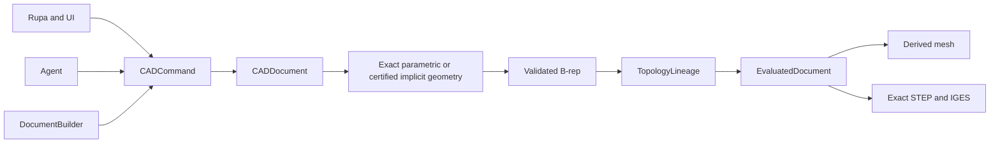
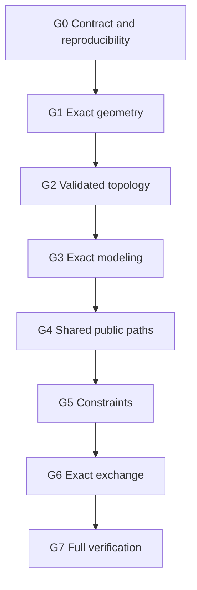

# Swift-CAD Completion Roadmap

This document defines the uncompromising completion goal for the pre-v1
development kernel. It describes unfinished work only. Current supported
behavior is normative only when it appears in both [SPEC.md](SPEC.md) and
[CAPABILITY_LEDGER.md](CAPABILITY_LEDGER.md).

## Product goal

Swift-CAD is complete only when Rupa, UI clients, builders, and automation
agents use one Pure Swift CAD kernel whose source of geometric truth is exact
parametric geometry or a certified implicit intersection definition plus
validated B-rep topology. A fitted parametric curve may be cached for
evaluation or exchange, but it is derived from that exact definition and must
carry a proved error enclosure. Meshes are derived artifacts and never
substitute for an exact modeling result.



## Completion rule

Completion is binary. All eight gates must pass on the same Git revision.
Passing a capability fixture, a restricted input envelope, a local build, or a
subset of tests does not complete a gate. A gate can move to `PASS` only when
its required evidence records the revision, exact command, result artifact,
and successful outcome. Any regression reopens the affected gate.

### Non-negotiable final coverage

The final product domain is every finite, structurally valid input expressible
by the public pre-v1 IR for each named operation. Development envelopes are
temporary implementation slices; they cannot be used to narrow a named
operation at completion.

- The public-contract inventory must mechanically enumerate every public
  mutation, query, persistence operation, exact exchange operation, and mesh
  exchange operation. Every inventory entry must map to exactly one primary
  Capability ID. An unregistered public behavior fails completion.
- Every capability found by that inventory must have status `supported`. No
  `partial`, `planned`, or required-but-unregistered capability may remain.
  The 55 currently registered capabilities are a provisional baseline, not a
  frozen final denominator; discovering an omitted contract increases the
  denominator instead of narrowing the goal.
- A finite valid public input may fail only because the requested result is
  mathematically non-discrete, singular within the requested tolerance,
  ambiguous, or exceeds an explicit resource budget. It may not fail merely
  because its geometry lies outside an implemented shape envelope.
- Every modeling operation must return a fully validated B-rep whose geometric
  truth is either a closed-form analytic/rational parametric entity or a
  certified implicit/procedural entity. General rational-surface intersection
  curves are not assumed to be rationally parameterizable. A triangle mesh,
  sampled polyline, or uncertified fitted spline is never an exact result.
- Every exact result must carry deterministic topology lineage and must be
  reproducible from the same document, command sequence, tolerance, and kernel
  revision.
- Every public mutation must pass through `CADCommand` and every public query
  must read the corresponding `EvaluatedDocument`.
- STEP and IGES must preserve representable exact geometry directly. When an
  exchange schema cannot encode an internal implicit entity, the exported
  parametric representation must carry a certified two-sided geometric,
  parameter-space, and orientation error bound within the requested tolerance;
  a triangle mesh is never an exchange substitute. Mesh exchange formats
  remain derived output.
- A typed rejection is evidence of correct failure behavior, not evidence that
  the named operation is complete. Completion also requires success over the
  full valid public domain above.

The completion proof is therefore:

```text
100% of public contracts registered under Capability IDs
AND N/N registered capabilities supported (N is inventory-derived, not frozen)
AND G0..G7 PASS on one tested source revision
AND no exact evaluator has a mesh fallback
AND no valid public input is rejected as an unsupported shape envelope
```

## Progress reporting contract

Progress reports must keep completion, capability coverage, and implementation
activity separate. They must not combine these measures into a weighted or
subjective percentage.

| Measure | Meaning | Completion credit |
|---|---|---:|
| Gate status | Final same-revision acceptance evidence | Only `8/8` is complete |
| General capability status | Full valid public-domain support for a catalog operation | Only `supported` counts |
| Development envelope | A bounded implementation slice of a partial capability | None |
| Fixture binding | A traceable test obligation, whether or not its full suite has passed | None |
| Local build or focused test | Temporary development feedback outside a final evidence manifest | None |

Every status report must state the gate count, general supported/partial/planned
counts, development-envelope count, final evidence-manifest count, tested Git
revision if one exists, and whether the worktree is clean. A dirty or untested
revision can contain useful implementation progress, but it cannot advance a
completion gate.

### Current quantitative truth

The current catalog is not close to this completion condition. The counts
below describe capability declarations, not product completion.

| Measure | Current | Required |
|---|---:|---:|
| Catalog capabilities | 55 registered; inventory not closed | Inventory-derived and complete |
| General `supported` capabilities | 23 of the provisional 55 | All inventory-derived capabilities |
| `partial` capabilities | 32 | 0 |
| Required-but-unregistered contracts | More than 0; exact inventory pending | 0 |
| Development-only input envelopes | 52 | 0 completion exemptions |
| Capability-to-fixture bindings | 422 | Complete adversarial and oracle coverage |
| Final gate evidence manifests | 0 | 8 on one source revision |
| Completion gates | 0/8 | 8/8 |

The 23 currently `supported` catalog entries cover five geometry foundations,
all four registered topology foundations, four modeling foundations, the five
completed curve-operation slices for bridge, edit, offset, trim, and extend,
the general finite exact Curve Match contract with opposite-end G2 preservation,
the exact regular rectangular B-spline surface source slice, and the exact
rational ruled Bridge Surface slice with arbitrary finite B-spline boundary
bases, the exact rational Coons Patch Surface slice with arbitrary finite
B-spline boundary bases, and the shared strict Codable command/query/result
transport with evaluated-document and derived-result invariant validation. This does not
pass `G1`, `G2`, or `G3`: registered topology coverage is not yet the full
topology inventory, the complete intersection matrix remains open, and 27
registered modeling and constraint operations are still partial.

The current provisional catalog breaks down as follows. A `partial` entry earns
no completion credit even when it contains substantial working envelopes.

| Domain | Registered | `supported` | `partial` | Final status |
|---|---:|---:|---:|---|
| Geometry | 7 | 5 | 2 | OPEN |
| Topology | 4 | 4 | 0 | OPEN |
| Modeling and constraints | 40 | 13 | 27 | OPEN |
| Shared command/query API | 1 | 1 | 0 | OPEN |
| Exact and USD exchange | 3 | 0 | 3 | OPEN |

The inventory itself is also incomplete. At minimum, the exact intersection
output contract must be expanded to retain certified implicit curves, and the
public native-persistence and non-USD mesh-exchange surfaces must either receive
primary Capability IDs or be removed from the public pre-v1 contract. This is a
completion blocker, not future polish.

**Overall status: NOT ACHIEVED — 0/8 gates passed.**

| Gate | Completion requirement | Status | Current blocking condition | Required final evidence | Recorded evidence |
|---|---|---|---|---|---|
| `G0` | Reproducible development contract | OPEN | The current revision has not passed one isolated-checkout audit covering remote-only dependency resolution, macOS, iOS, visionOS, WASM, strict current-schema decoding, AST policy checks, and documentation/capability consistency. | Fresh-checkout build logs for every platform plus policy, schema, and contract reports on one revision. | — |
| `G1` | Complete exact geometry | OPEN | Analytic and rational NURBS evaluation exists, but intersection, projection, adaptive-precision classification, singular handling, residual certification, and an exact certified-implicit intersection representation remain incomplete or restricted to registered envelopes. | Property suites and oracle comparisons covering all declared curve/surface pairs, derivatives, curvature, UVN frames, intersections, implicit branch identity, singularities, and tolerance scaling. | — |
| `G2` | Complete validated topology | OPEN | Coedge B-rep, pcurves, validation, sewing, repair requests, and lineage exist, but general curved-shell manifold, watertight, orientation, volume, split/merge, and healing behavior is not closed. | Invariant, sewing, repair, classification, exact-volume, and lineage suites over general analytic/NURBS shells. | — |
| `G3` | Complete exact modeling | OPEN | Named operations are implemented only for capability-ledger subsets; general Boolean, Sweep, Loft, blends, shell/direct edits, patterns, and curve/surface editing are not complete. | Every named operation passes IR, evaluator, exact-output, topology, lineage, persistence, Builder/Agent parity, and typed-rejection fixtures without mesh fallback. | — |
| `G4` | One public operation and query path | OPEN | Shared commands, queries, strict Codable result transport, capability preflight, and result invariant validation exist, but all legacy or bypass paths, deterministic cache invalidation, and stable selection across arbitrary editing chains have not passed a repository-wide proof. | API inventory plus parity tests showing UI/Builder/Agent command identity and deterministic source, topology, lineage, diagnostics, and queries after edits. | — |
| `G5` | Complete constraints | OPEN | The declared relation set, forward differentiation, DOF classification, typed conflict/singularity results, explicit circular and spline tangency branches, and document-edit integration exist. The same-revision residual/Jacobian oracle, adversarial singular-system coverage, and document-level all-relation proof are not complete. | Residual/Jacobian oracle tests and document-level solve fixtures for under-, well-, over-constrained, conflicting, and singular systems. | — |
| `G6` | Complete exact exchange | OPEN | STEP/IGES exact subsets round-trip, but complete declared entity/topology coverage and independent external CAD validation are not closed. | External STEP/IGES corpus, deterministic round-trip, units/placement/orientation checks, resource-limit/fuzz reports, and third-party CAD oracle comparison. | — |
| `G7` | Release-quality verification | OPEN | The public-contract inventory is not closed and the full same-revision quality gate has not run. | Public-contract inventory, focused and integration suites, property tests, parser fuzzing, external oracles, large-model benchmarks, allocation/incremental-evaluation benchmarks, and macOS/iOS/visionOS/WASM build/runtime reports. | — |

## Dependency-ordered implementation sequence



## Final evidence contract

A gate evidence manifest is `Evidence/G0.json` through `Evidence/G7.json`.
Every command record must contain a unique evidence `kind`, the exact command,
`passed` outcome, a repository-relative artifact under
`Evidence/artifacts/<gate>/`, and the artifact SHA-256. All manifests name the
same tested source revision. The final attestation commit may differ from that
source revision only by `ROADMAP.md` and `Evidence/`; this avoids a
self-referential Git hash while proving that the tested implementation did not
change. The final worktree must be clean.

| Gate | Mandatory evidence kinds |
|---|---|
| `G0` | isolated macOS, iOS, visionOS, and WASM builds; WASM runtime smoke; schema, policy, and capability contracts |
| `G1` | geometry property suite; external geometry oracle; complete intersection matrix; certified implicit-intersection representation suite; adversarial predicate suite |
| `G2` | topology invariants; external topology oracle; lineage edit suite; explicit repair suite |
| `G3` | all modeling capabilities; general Boolean; command parity; no-mesh-fallback audit |
| `G4` | public API inventory; command/query parity; stable-selection edit suite; cache determinism |
| `G5` | all constraint relations; Jacobian oracle; typed diagnostics; document integration |
| `G6` | external STEP and IGES corpora; round-trip suite; certified implicit-curve transfer bounds; resource-limit fuzzing; third-party CAD oracle |
| `G7` | public-contract inventory; catalog completion; full integration/property/fuzz suites; large-model, allocation, and incremental benchmarks; all-platform build/runtime report |

### G0 — Development contract and reproducibility

- Keep all runtime dependencies remote and revision-pinned.
- Accept only the current pre-v1 schema. Do not add migration, deprecated API,
  or compatibility defaults for fields emitted by the current encoder.
- Keep `SPEC.md`, the capability ledger, compiled catalog, public APIs, and
  fixture source paths mechanically consistent.
- Split source and test responsibilities so module builds and focused suites
  do not require the complete test graph.
- Prove macOS, iOS, visionOS, and WASM builds from an isolated checkout.

### G1 — Exact geometry

- Complete line, circle, arc, ellipse, Bezier, and rational NURBS curves.
- Complete plane, cylinder, cone, sphere, torus, and rational NURBS surfaces.
- Provide position, first/second derivatives, normals, curvature, principal
  directions, and orientation-stable UVN frames.
- Use closed forms for analytic cases and interval-bounded adaptive subdivision,
  Newton refinement, and residual verification for NURBS cases.
- Retain a certified implicit/procedural intersection entity whenever the exact
  locus is not rationally parameterizable. Any fitted 3D curve and dual pcurves
  are derived caches with interval-proved two-sided coverage, branch identity,
  orientation, and residual bounds.
- Use adaptive-precision predicates for orientation, coincidence, and
  inside/outside decisions. Every calculation receives explicit tolerance.

### G2 — Validated topology

- Complete vertex–edge–coedge–loop–face–shell–body ownership and references.
- Require a 3D curve and face-local pcurve for every coedge.
- Independently validate reference integrity, loop closure, pcurve agreement,
  orientation, manifoldness, watertightness, and volume.
- Keep repair explicit through typed requests and diagnostics.
- Preserve deterministic generated, preserved, split, and merged lineage.

### G3 — Exact modeling slices

Implement each vertical slice through IR, exact algorithm, validation, lineage,
shared command, persistence, and focused evidence before claiming support:

1. Primitive, extrude, revolve, and general Boolean.
2. Sweep, Loft, bridge surface, patch, and PolySpline.
3. Fillet, chamfer, G1/G2 blend, setback corner, shell, thicken, draft, and
   face/edge/vertex direct edits.
4. Linear, radial, grid, and curve-driven patterns.
5. Curve/surface offset, trim, extend, and match.

The general Boolean pipeline is fixed: operand validation, face-pair broad
phase, curve/surface intersection, UV face splitting, point-in-solid
classification, region selection, sewing, topology validation, and lineage.

### G4 — Shared operation, selection, and query paths

- `CADCommand`, `FeatureRequest`, `KernelQuery`, `KernelCapabilityCatalog`,
  `KernelError`, `SubshapeID`, `TopologyLineage`, and `EvaluatedDocument` are the
  public contracts.
- Builder, UI, and Agent operations produce the same Codable command.
- Selection, measurement, projection, and diagnostics read the same evaluated
  document.
- Capability, reference, parameter, and tolerance validation runs before
  mutation.
- Stable selection is provenance-first, geometry-signature-second, and returns
  typed ambiguity rather than choosing silently.
- Incremental evaluation and caches are deterministic under parameter changes,
  feature insertion, suppression, split, and merge.

### G5 — Constraint completion

- Use DOF, residual, and Jacobian contracts with forward-mode differentiation
  and Levenberg–Marquardt iteration.
- Support coincident, horizontal/vertical, parallel, perpendicular, tangent,
  equal, concentric, fixed, distance, angle, radius, and diameter relations.
- Return typed under-constrained, over-constrained, conflicting, and singular
  diagnostics and integrate solved values into document editing.

### G6 — Exact exchange completion

- STEP maps units, placements, analytic/NURBS curves and surfaces, pcurves,
  loops, faces, shells, and manifold solids.
- IGES maps analytic/NURBS curves, NURBS surfaces, curve-on-surface, trimmed
  surfaces, and manifold topology.
- STEP/IGES never encode triangle meshes as CAD geometry.
- Internal implicit intersection entities export through schema-supported
  surface-curve/pcurve constructs or certified rational approximations with
  two-sided geometric and parameter-space error bounds within the requested
  tolerance.
- USD, STL, OBJ, GLB, and 3MF remain explicit mesh exchange.
- Import budgets bound bytes, entities, nesting, iterations, and processing
  time.

### G7 — Final verification

- Run focused suites during slices and direct-consumer integration suites at
  milestones.
- Run property geometry tests, parser fuzzing, external STEP/IGES fixtures,
  third-party CAD oracle comparisons, large-model benchmarks, allocation and
  incremental-evaluation benchmarks, and all platform builds/runtime smoke.
- Generate the public-contract inventory from source declarations and prove a
  one-to-one mapping to the capability ledger before catalog completion can
  pass.
- Record all evidence against one revision. Technical drawing remains a later
  M7 product milestone and is not allowed to mask any kernel gate failure.
