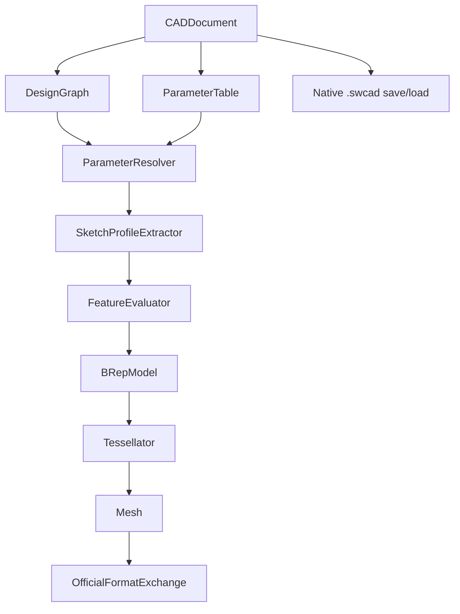
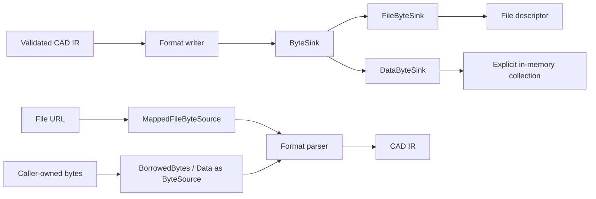
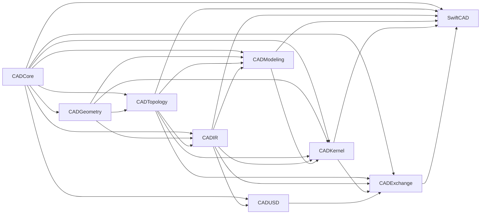
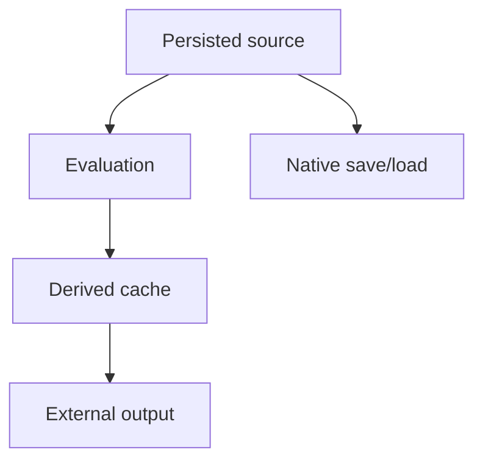
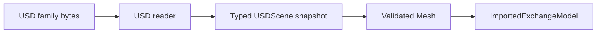
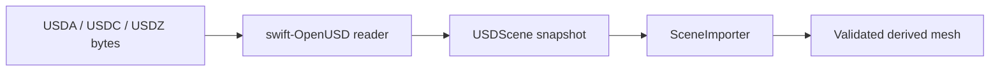
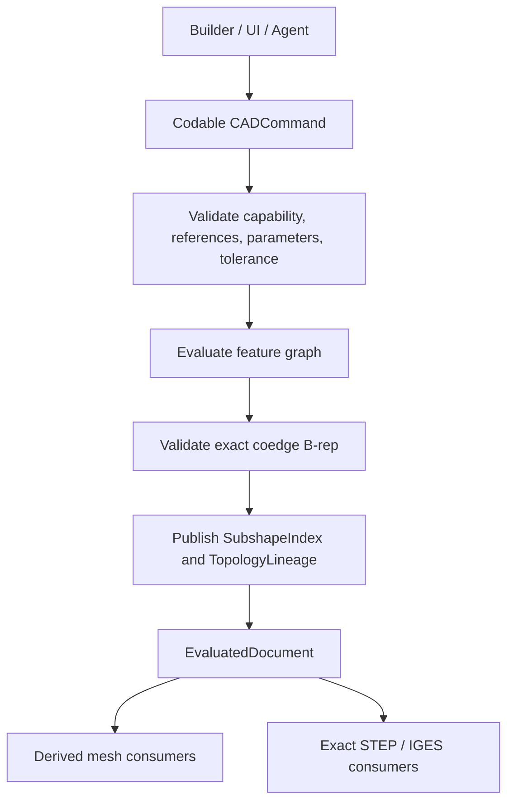

# Swift-CAD Specification

## Status

This document defines the normative development contract for Swift-CAD.

This document is not a compatibility promise. The repository is pre-v1 and
may replace APIs, source formats, and evaluator implementations without
migration. Current support is determined by [CAPABILITY_LEDGER.md](CAPABILITY_LEDGER.md);
unfinished work and the binary completion gates are tracked in [ROADMAP.md](ROADMAP.md).

| Field | Value |
|---|---|
| Project | Swift-CAD |
| Package name | `SwiftCAD` |
| Native extension | `.swcad` |
| Initial platform target | Swift Package, Swift 6.3 or later |
| Development status | Pre-v1 exact-geometry and validated-topology reconstruction. |
| Official support goal | Only capability-ledger entries with exact-output and typed-failure evidence. |

## System Overview



Swift-CAD implements one complete modeling and exchange pipeline:

| Stage | Input | Output |
|---|---|---|
| Parameter resolution | `ParameterTable` | `ResolvedParameterTable` |
| Sketch profile extraction | `Sketch` | closed planar profiles |
| Feature evaluation | `FeatureNode` + context | `BRepModel` |
| Tessellation | `BRepModel` + options | `Mesh` |
| Export | `EvaluatedDocument` | official format bytes |
| Native persistence | source-only `CADDocument` | `.swcad` package |

## Byte Flow and Zero-Copy Contract

Swift-CAD official byte APIs are streaming or borrowed APIs. Export writes bytes to a caller-provided `ByteSink`; import reads bytes through a `ByteSource`. Official production paths must not construct an owned whole-file `Data` buffer as the transport representation.



| Boundary | Official API shape | Allocation rule |
|---|---|---|
| Export | `write(..., to sink: any ByteSink)` | Writers stream directly to the sink and must not require a full output `Data` buffer. |
| File export | `export(..., to url: URL)` | File output uses an atomic temporary `FileByteSink` and replaces the destination only after validation and writing succeed. |
| Native package save | `writePackage(for:to:)` | The ZIP archive payload is written to the sink as local entries are emitted; central-directory metadata may be retained. |
| Binary STL | `writeBinary(meshes:options:to:)` | Triangle records are written directly to the sink. |
| GLB | `write(meshes:to:)` | Mesh payload is written directly to the binary chunk; the exporter must not merge all meshes into an intermediate mesh buffer. |
| Import/load | `import(_:as:)`, `loadDocument(from:)` with `any ByteSource` | Import APIs borrow bytes through a source; parsing may create IR values but must not claim ownership of the source buffer. |
| File import/load | `import(from:)`, `load(from:)` | File input uses `MappedFileByteSource` on supported platforms. If mapping is unavailable, the implementation fails explicitly rather than silently copying the whole file. |
| ZIP packages | `StoredZipArchive.withEntries(from:_:)` | Stored entry payloads are no-copy views over the archive bytes and must be consumed inside the source lifetime. |
| Tests and diagnostics | `DataByteSink` | In-memory collection is explicit and opt-in, not the production export path. |

`Data` remains an allowed implementation detail for small metadata fragments, JSON encoder output, test observation, and system API interop. It is not the official file export return type or file import transport. Any new export format must expose a sink writer first. Any new import format must expose a `ByteSource` reader first.

## Package Layout

### Target Graph



### Targets

| Target | Responsibility | Public product |
|---|---|---:|
| `CADCore` | IDs, schema, units, quantities, math primitives, tolerance, shared errors. | No |
| `CADGeometry` | Analytic and rational B-spline geometry, intervals, robust predicates, and differential geometry. | Yes |
| `CADTopology` | Vertex–edge–coedge–loop–face–shell–body B-rep, exact geometry ownership, independent invariant validation, and analytic volume. | Yes |
| `CADIR` | Document, parameters, constraints, feature graph, and derived mesh IR. | Yes |
| `CADModeling` | Feature-evaluation contracts and exact editing algorithms. | Yes |
| `CADKernel` | Evaluation orchestration, cache, capability discovery, classification, sewing, and tessellation. | Yes |
| `CADUSD` | Typed swift-OpenUSD scene ingestion and deterministic derived-mesh materialization. | Yes |
| `CADExchange` | Native save/load and all official import/export formats. | Yes |
| `SwiftCAD` | Public facade that composes lower-level modules. | Yes |

### Naming

The package, public product, and facade module are named `SwiftCAD`.

## Official Support Scope

### Modeling and IR

| Area | Included |
|---|---|
| Native document | `CADDocument`, `schemaVersion`, `units`, `parameters`, `designGraph` |
| Parameters | Named parameters, unit-aware constants, references, arithmetic expressions |
| Geometry | Analytic line/circle/arc/ellipse curves, analytic plane/cylinder/cone/sphere/torus surfaces, and rational B-spline curves/surfaces with explicit domains, caller-supplied tolerance, first/second derivatives, curvature, principal directions, and UVN frames |
| Sketch | Point, line, circle, arc, and cubic spline entities; exact line/circular-arc/cubic-B-spline closed profile boundaries |
| Feature | Capability-ledger feature operations through the shared `CADCommand`; revolve includes partial/full exact line, circular-arc, and cubic-spline profiles |
| Revolve | Analytic plane/cylinder/cone faces for line generators and tensor-product rational B-spline surfaces for circular-arc or cubic-spline generators, with exact boundary curves and mandatory face-local pcurves |
| Topology | `CADTopology.BRepModel` with body, shell, face, loop, coedge, edge, vertex, and exact geometry store |
| Mesh | Triangle mesh with positions, normals, indices |
| Kernel | Parameter resolution, capability-gated exact feature evaluation, coedge B-rep validation, lineage, queries, and derived tessellation |
| Exchange | Capability-gated exact CAD exchange plus explicit mesh exchange |
| Tests | Unit and pipeline tests with timeout |

### Officially Supported File Formats

| Category | Format | Extensions | Import | Export | Role |
|---|---|---|---:|---:|---|
| Native | Swift-CAD Native | `.swcad` | Yes | Yes | Editing master with document source. |
| CAD Exchange | STEP | `.step`, `.stp` | Capability-gated | Capability-gated | Exact AP242 curves, surfaces, pcurves, and topology; tessellated mesh fallback is forbidden. |
| CAD Exchange | IGES | `.iges`, `.igs` | Capability-gated | Capability-gated | Exact analytic/NURBS and trimmed topology; triangle wire fallback is forbidden. |
| Mesh / 3D Print | STL | `.stl` | Yes | Yes | Triangle mesh and 3D print exchange. |
| Mesh / 3D Print | 3MF | `.3mf` | Yes | Yes | 3D print package with units and mesh data. |
| Mesh / DCC | OBJ | `.obj` | Yes | Yes | General mesh exchange. |
| 2D / Drawing | DXF | `.dxf` | Yes | Yes | Drawing and projected geometry exchange. |
| 2D / Drawing | SVG | `.svg` | Yes | Yes | 2D contour and projected geometry exchange. |
| Visualization | GLB | `.glb` | No | Yes | Binary glTF preview exchange. |
| Visualization / AR | USD | `.usd`, `.usda`, `.usdc` | Yes, Pure Swift | Yes, Pure Swift | Static mesh exchange through typed swift-OpenUSD codecs. |
| Visualization / AR | USDZ | `.usdz` | Yes, Pure Swift | Yes, Pure Swift | Static mesh package exchange through typed swift-OpenUSD codecs. |
| Document | PDF | `.pdf` | No | Yes | Review document output. |

Formats outside this list are not part of the official support target.

## Source of Truth



| Data | Source or derived | Persistence |
|---|---|---|
| `CADDocument` | Source | Required |
| `ParameterTable` | Source | Required |
| `DesignGraph` | Source | Required |
| `BRepModel` | Derived exact model | Runtime cache in current official support |
| `Mesh` | Derived approximation | Runtime cache in current official support |
| STL | External derived output | Not part of native truth |

`CADDocument` is source-only. `EvaluatedDocument` may carry `BRepModel`, `Mesh`, and `DocumentCaches` as runtime-derived data. The current native package persists source data only; persisted cache files are reserved for a future cache mode that validates freshness before use.

## Core Types

### IDs

All persisted object identity uses typed IDs.

```swift
public struct TaggedID<Tag>: Hashable, Codable, Sendable {
    public let rawValue: UUID

    public init(_ rawValue: UUID = UUID()) {
        self.rawValue = rawValue
    }
}
```

Required aliases:

| Alias | Tag |
|---|---|
| `DocumentID` | `DocumentTag` |
| `BodyID` | `BodyTag` |
| `ShellID` | `ShellTag` |
| `FaceID` | `FaceTag` |
| `LoopID` | `LoopTag` |
| `EdgeID` | `EdgeTag` |
| `VertexID` | `VertexTag` |
| `CurveID` | `CurveTag` |
| `SurfaceID` | `SurfaceTag` |
| `FeatureID` | `FeatureTag` |
| `SketchID` | `SketchTag` |
| `SketchEntityID` | `SketchEntityTag` |
| `ParameterID` | `ParameterTag` |
| `MaterialID` | `MaterialTag` |

### Schema Version

```swift
public struct SchemaVersion: Codable, Hashable, Sendable {
    public var major: Int
    public var minor: Int
    public var patch: Int
}
```

Rules:

| Change | Pre-v1 rule |
|---|---|
| Any persisted contract change | Replace the current exact schema and reject older versions |
| Implementation-only fix | Keep the current schema only when decoded source semantics are unchanged |

### Document

```swift
public struct CADDocument: Codable, Sendable {
    public var id: DocumentID
    public var schemaVersion: SchemaVersion
    public var units: UnitSystem
    public var parameters: ParameterTable
    public var designGraph: DesignGraph
    public var metadata: DocumentMetadata
}
```

`CADDocument` stores source state only. It must not expose cached B-rep or mesh data as authoritative source.

### Document Caches

`DocumentCaches` belong to evaluated runtime results, not to `CADDocument`.

```swift
public struct DocumentCaches: Codable, Sendable {
    public var brep: BRepCache?
    public var meshes: [BodyID: MeshCache]
    public func validateMetadataFreshness(for document: CADDocument, ...) throws
}
```

| Cache | Required metadata |
|---|---|
| `BRepCache` | design graph revision, parameter revision, source fingerprint, kernel version, tolerance |
| `MeshCache` | body ID, design graph revision, parameter revision, source fingerprint, kernel version, tolerance, tessellation options |

These cache types are runtime data in the current implementation. CADIR validates cache metadata freshness against a valid source document, its canonical source fingerprint, valid kernel version, expected tolerance, and tessellation options. The fingerprint covers document identity, schema version, units, parameters, and design graph, so source mutations that do not advance revisions still invalidate caches. Fingerprint construction must canonicalize dictionary- and set-like source collections by stable IDs rather than insertion or hash-table order. CADKernel validates full cache freshness by comparing cached B-rep content with source re-evaluation through an ID-independent B-rep content signature, comparing cached meshes with tessellation regenerated from the cached B-rep, and comparing cached mesh content with mesh content from re-evaluating the source document while ignoring regenerated body IDs. `NativePackageStore` writes `document.json` from the source-only `CADDocument`, and native package bytes must be stable for semantically identical source dictionaries regardless of insertion order.

Full cache freshness for a body-producing source document requires a B-rep cache and mesh caches for every body generated from that B-rep. Empty caches are not fresh caches for evaluated geometry. `EvaluatedDocument` is also a derived runtime value. Before official exchange export, it must validate that resolved parameters match the source parameter table, top-level B-rep and meshes are valid, top-level B-rep is value-equal to the B-rep cache model, generated topology names are valid and reference existing topology, top-level meshes match tessellation of the top-level B-rep, mesh caches match top-level meshes, and cache metadata/content remain fresh for the source document.

## Units and Quantities

### Unit System

```swift
public struct UnitSystem: Codable, Hashable, Sendable {
    public var length: LengthUnit
    public var angle: AngleUnit
}
```

| Internal quantity | Internal unit |
|---|---|
| Length | Meter |
| Angle | Radian |
| Scalar | Unitless |

### Quantity

```swift
public enum QuantityKind: String, Codable, Sendable {
    case length
    case angle
    case scalar
}

public struct Quantity: Codable, Hashable, Sendable {
    public var value: Double
    public var kind: QuantityKind
}
```

`value` is stored in internal units.

### CADExpression

```swift
public indirect enum CADExpression: Codable, Sendable {
    case constant(Quantity)
    case reference(ParameterID)
    case variable(String, QuantityKind)
    case add(CADExpression, CADExpression)
    case subtract(CADExpression, CADExpression)
    case multiply(CADExpression, CADExpression)
    case divide(CADExpression, CADExpression)
    case sin(CADExpression)
    case cos(CADExpression)
    case tan(CADExpression)
}
```

CADExpression rules:

| Operation | Rule |
|---|---|
| All quantities | Values must be finite after unit conversion and expression evaluation. |
| `add` / `subtract` | Both sides must have the same `QuantityKind`. |
| `multiply` | Scalar multiplication is allowed. Length by length is not part of official support. |
| `divide` | Division by scalar is allowed. Same-kind division may produce scalar. The divisor must resolve to a non-zero finite value. |
| `sin` / `cos` / `tan` | Input must be angle. Output is scalar. |
| `reference` | Referenced parameter must exist and resolve. |
| `variable` | Name must be a valid CAD identifier and must be bound by an explicit resolver context. Source document validation rejects unbound variables. |

### Parameters

```swift
public struct ParameterTable: Codable, Sendable {
    public var parameters: [ParameterID: Parameter]
}

public struct Parameter: Codable, Sendable {
    public var id: ParameterID
    public var name: String
    public var expression: CADExpression
    public var kind: QuantityKind
}
```

Validation:

| Check | Failure |
|---|---|
| Parameter table key must match `Parameter.id` | `ParameterError.tableKeyMismatch` |
| Parameter names must be valid CAD identifiers | `ParameterError.invalidName` |
| Duplicate parameter names | `ParameterError.duplicateName` |
| Unknown reference | `ParameterError.unknownReference` |
| Unbound variable in source expressions | `ParameterError.unknownVariable` |
| Reference cycle | `ParameterError.cycleDetected` |
| Kind mismatch | `UnitError.incompatibleQuantity` |
| Non-resolvable source value | `UnitError.divisionByZero` or `UnitError.invalidQuantityValue` |

Parameter names and expression variable names are lookup identifiers, not display labels. Official support accepts ASCII identifiers whose first character is a letter or `_`, followed by letters, digits, or `_`.

| Mutation | Contract |
|---|---|
| Upsert | Creates a named parameter or updates the existing name while preserving the existing `ParameterID`. |
| Rename | Changes the parameter name for an existing `ParameterID`, rejects duplicate or invalid names, and preserves all `CADExpression.reference` links. |
| Delete | Removes the parameter only after validating that the resulting `CADDocument` has no unresolved references. |

## Math Primitives

```swift
public struct Point3D: Codable, Hashable, Sendable {
    public var x: Double
    public var y: Double
    public var z: Double
}

public struct Vector3D: Codable, Hashable, Sendable {
    public var x: Double
    public var y: Double
    public var z: Double
}
```

Rules:

| Type | Meaning |
|---|---|
| `Point3D` | Position in model space, internal length units. |
| `Vector3D` | Direction or displacement. Direction vectors used by geometry must be normalized during validation. |
| `Matrix4x4` | Sixteen finite `Double` values. |
| `Transform3D` | Rigid or affine transform represented by a validated `Matrix4x4`. |

Every geometry, topology, modeling, query, and exchange computation that depends on numerical comparison must require an explicit caller-supplied tolerance. A `tolerance` parameter must not have a default value. Scalar tolerances accepted by math helpers such as `Vector3D.normalized(tolerance:)` must be finite and positive. Invalid tolerances must throw `GeometryError.invalidTolerance` before any division can produce non-finite coordinates. CI enforces this contract from the Swift parser AST for all source modules and rejects direct use of the standard preset outside the named persistence and capability-metadata boundaries.

## Geometry IR

### Curves

```swift
public enum Curve3D: Codable, Sendable {
    case line(Line3D)
    case circle(Circle3D)
    case analytic(AnalyticCurve3D)
    case bSpline(BSplineCurve3D)
}

public enum AnalyticCurve3D: Codable, Sendable {
    case line(origin: Point3D, direction: Vector3D)
    case circle(center: Point3D, normal: Vector3D, radius: Double)
    case arc(center: Point3D, normal: Vector3D, radius: Double, startAngle: Double, endAngle: Double)
    case ellipse(center: Point3D, normal: Vector3D, majorAxis: Vector3D, majorRadius: Double, minorRadius: Double)
}
```

`Curve3D` and the rational B-spline curve types expose explicit-tolerance validation, point evaluation, first/second differential geometry, curvature, reversal, trimming, knot operations, and verified inverse parameter projection. Polynomial Bezier curves use the rational B-spline representation with unit weights.

`ValidatedCurve3D` is the immutable validation boundary for repeated numerical
evaluation. Its initializer validates the complete recursive curve
representation once at the supplied `ModelingTolerance`; subsequent point and
differential queries retain that tolerance and may use package-internal
assuming-valid dispatch. Adaptive tessellation and other repeated consumers
must retain this validated owner for the duration of sampling instead of
revalidating nested B-spline surfaces or procedural curve definitions at every
parameter.

### Surfaces

```swift
public enum Surface3D: Codable, Sendable {
    case plane(Plane3D)
    case cylinder(Cylinder3D)
    case analytic(AnalyticSurface3D)
    case bSpline(BSplineSurface3D)
}

public enum AnalyticSurface3D: Codable, Sendable {
    case plane(origin: Point3D, normal: Vector3D)
    case cylinder(origin: Point3D, axis: Vector3D, radius: Double)
    case cone(apex: Point3D, axis: Vector3D, halfAngle: Double)
    case sphere(center: Point3D, radius: Double)
    case torus(center: Point3D, axis: Vector3D, majorRadius: Double, minorRadius: Double)
}

public struct BSplineSurface3D: Codable, Sendable {
    public var uDegree: Int
    public var vDegree: Int
    public var uKnots: [Double]
    public var vKnots: [Double]
    public var controlPoints: [[Point3D]]
    public var weights: [[Double]]
}
```

`Surface3D` and `BSplineSurface3D` expose explicit-tolerance validation, position, first/second partial derivatives, normal, mean/Gaussian/principal curvature, principal directions, UVN frame, and verified inverse parameter projection. Bounded rational B-spline inverse projection decomposes the complete domain into rational Bezier patches, propagates outward-rounded homogeneous control intervals through adaptive subdivision, excludes candidates with convex-hull distance bounds, refines all surviving candidates with the full squared-distance Hessian, enforces explicit cell and candidate budgets, and returns typed ambiguity instead of silently selecting one of multiple parameter roots. Polynomial Bezier patches use the rational B-spline representation with unit weights.

### Predicates

`PlanarPredicateEvaluating` is the shared contract for 2D point and polygon
orientation, certified signed polygon area, collinearity, segment intersection
or touch, and point-in-polygon classification. `AdaptivePlanarPredicateEvaluator` first applies explicit
modeling tolerance to coincidence decisions and uses floating-point expansion
orientation for the topological sign. It returns an explicit indeterminate
classification when a finite exact sign cannot be resolved; consumers must
return a typed diagnostic instead of selecting an inside/outside result.

Sketch profile validation, convex planar editing, and face-local pcurve
containment consume this predicate contract. Periodic Boolean UV algorithms may use the lower-level
`RobustPredicates` expansion sign directly when they must first unwrap a
surface domain; they must not implement independent ray-division or
raw-determinant tests.

### Intersections

| Pair | Exact development contract |
|---|---|
| Analytic–analytic | Declared closed-form or algebraic section algorithms with direct certified 3D truth, exact analytic-pair dual pcurves, strict decode reconstruction, and residual verification. Cone-apex contacts are decomposed into complete node intervals rather than projected through the singular cone parameterization. Ruling-parallel cone-cylinder input uses its exact linear reduction. Cone-torus apex contact factors the common apex root from the generator quartic and certifies the remaining cubic through simple constant-term and discriminant boundaries, producing the two apex-node loops and every generator-fold loop without entering whole-surface rational subdivision. Parallel torus pairs use an analytic near-nodal certificate on the two-loop side of the minor-radius contact transition and retain the regular four-branch classification on the other side. Undeclared higher multiplicities return typed failures instead of empty, sampled, or mesh output. |
| Curve–surface with rational B-splines | Finite-domain adaptive subdivision with separate cell and candidate budgets. A rational B-spline pair is decomposed over every nonzero knot span, and `C(t) = S(u,v)` is transformed into an outward-rounded trivariate homogeneous Bernstein difference net whose component hulls provide denominator-free exclusion. Derivative Bernstein hulls define an interval Jacobian on the normalized parameter cube; an interval Krawczyk operator certifies existence and uniqueness for regular transverse roots before numerical refinement. Rank-deficient contacts use explicit contact refinement and remain distinct from a transverse uniqueness certificate. Results carry contact classification and verified point residuals. A leaf whose difference net cannot be excluded or refined must return a residual-bearing typed resource diagnostic; it must not be omitted from an otherwise empty or partial result. |
| Surface–surface with rational B-splines | Every nonzero knot-span patch pair is transformed into an outward-rounded four-parameter homogeneous Bernstein difference net. Component intervals and the convex hull of all interval-coefficient box corners provide denominator-free zero exclusion while de Casteljau subdivision propagates the original interval enclosure in both operands. Physical distance tolerance is conservatively scaled by an upper bound on the positive weight-product denominator, and convex-hull separation is accepted only when expansion arithmetic proves every interval corner lies beyond the separating plane. Derivative control hulls form a four-column interval Jacobian; a cell is certified regular only when one three-column minor excludes zero over the entire cell. The omitted parameter is retained as an interval while the dependent variables are fixed at their center, producing a parameterized Krawczyk operator. Strict containment proves one unique dependent root for every free-parameter value and therefore one complete regular graph; disjointness proves the entire cell empty. A complete graph terminates subdivision immediately, charges the numerical-root budget for lower, midpoint, and upper free-parameter probes, and is accepted only when one traced component covers all three probes in both normalized four-parameter space and model space. Otherwise the omitted parameter is fixed at the cell midpoint, where a second Krawczyk operator may prove one unique gauge root before bounded Newton refinement. At any rank-three cell, each of the eight fixed-parameter boundary faces is independently reduced to a three-variable Bernstein system. Component/convex-hull exclusion and a face-local interval Krawczyk operator classify a face as empty or as containing exactly one root strictly inside that face. An unresolved face is adaptively subdivided along the dependent parameter whose interval derivative has the greatest component width; the matching rational surface patch and homogeneous difference net use the same single-parameter de Casteljau split. Boundary-subdivision depth and cell count have separate explicit budgets. Every child face must resolve. A root on an original or subdivision-face edge returns to main four-dimensional subdivision while depth remains; at a final regular leaf it produces a typed resource diagnostic rather than duplicate ownership or a partial component set. A globally rank-three cell with zero certified boundary roots is empty because the rank minor makes the zero set monotone in its free parameter and excludes a closed interior component; otherwise the certified boundary-root count must be even. Every certified root consumes the numerical-root budget, is refined with its fixed boundary parameter, and must be covered by a traced component in both model space and normalized four-parameter space. A proof that only the midpoint gauge slice is empty does not exclude the four-dimensional cell. A cell without a rank certificate remains on the general or tangency path, while a final rank-three cell without a complete graph or complete boundary-root proof never uses heuristic seeds to return an uncertified subset. Main subdivision cells, boundary subdivision cells, distinct seeds, and actual numerical root invocations consume separate explicit budgets. A surviving rank-deficient leaf may be associated with a classified tangency component only when that component has a sample inside the same normalized four-parameter cell; geometric bounding-box overlap is not coverage evidence. A leaf without that parameter-space coverage returns a typed resource diagnostic. Surviving candidates enter isolated-contact, rank-one contact-curve, or branching refinement. Regular output splines use null-space tangents and both surfaces' differential geometry for mutually consistent 3D and dual-pcurve Hermite derivatives; a common derivative scale keeps all Hermite controls inside both parameter domains without changing tangent direction. Anchors are built from the already verified intersection sample instead of running a second inverse projection. Output curves use operand-order-independent canonical orientation, and closedness requires coincident endpoints in model space and both pcurve parameter spaces. |
| Plane–rational B-spline surface | Exact boundary isocurves or exact bounded plane NURBS reduction through the four-parameter certified-implicit intersection path. Interior regular intersection truth retains the complete certified implicit component; fitted 3D curves and dual pcurves are derived caches. A single-span degree-at-most-two constant-weight surface with a nondegenerate affine in-plane map and an exact second-order line zero set retains a quadratic tangency certificate through the analytic remap. Its exact 3D line, NURBS pcurve, deterministically reconstructed plane pcurve, analytic-to-NURBS identity, contact kind, residual bound, and decode-time reconstruction remain public truth rather than a sampled parametric fallback. |
| Cylinder, cone, sphere, or ring torus–rational B-spline surface | Exact bounded rational NURBS reduction of the analytic operand, reference-hull-aware periodic patch-boundary selection with an explicit retry limit, control-hull subdivision, damped Newton seeds, pseudo-arclength marching, tangent-continuous component consolidation, seam-unwrapped analytic pcurves, and adaptive quarter/midpoint residual certification for regular transverse components. |
| Rational B-spline surface pair | Control-hull subdivision, interval-minor-certified rank-three seed gauges, parameterized interval-Krawczyk certification of complete regular graphs or empty cells, interval-Krawczyk-certified midpoint-gauge existence and uniqueness for remaining regular cells, converged damped fallback seeds, four-parameter pseudo-arclength marching for regular transverse components, normal-derivative damped least-squares refinement for isolated tangencies, relative-curvature Hessian contact classification, gauge-corrected continuation for regular second-order rank-one contact curves, Hessian zero-cone branch continuation for regular second-order indefinite contacts, chord-parameterized C1 composite cubic B-spline construction for 3D curves and both pcurves, explicit point and normal verification, outward-rounded Bernstein composition and convex-hull certification for single-span polynomial operands, and outward-rounded adaptive Taylor upper-bound certification over every remaining cubic segment using homogeneous rational derivative control bounds and de Casteljau subdivision. The exact single-span constant-weight quartic plane-height power-sum envelope retains its certified isolated point. Other higher-order-degenerate contacts remain typed diagnostics instead of being collapsed into a regular curve or point. |

Intersection routines return typed geometry, singularity, non-discrete, or resource diagnostics. They never substitute a mesh approximation for an exact intersection result.

### Geometry Store

```swift
public struct GeometryStore: Codable, Sendable {
    public var curves: [CurveID: Curve3D]
    public var surfaces: [SurfaceID: Surface3D]
}
```

Geometry validation:

| Geometry | Validation |
|---|---|
| `Line3D` | Direction length must be finite, greater than tolerance, and normalized before use. |
| `Circle3D` | Radius must be positive and normal must be valid. |
| `Plane3D` | Normal length must be finite, greater than tolerance, and normalized before use. |
| `Cylinder3D` | Radius must be positive and axis must be valid. |
| `BSplineSurface3D` | Degrees must be positive, control-point rows must be rectangular, knot vector sizes must match control-point counts plus degree plus one, knot values must be finite and non-decreasing, and evaluated normals must be derived from parameter-normalized tangents so small model-space patches remain valid. |
| Coordinates | Point and vector coordinates must be finite. |

## Topology IR

### B-rep Model

```swift
public struct BRepModel: Codable, Sendable {
    public var geometry: GeometryStore
    public var bodies: [BodyID: Body]
    public var shells: [ShellID: Shell]
    public var faces: [FaceID: Face]
    public var edges: [EdgeID: Edge]
    public var vertices: [VertexID: Vertex]
}
```

### Topology Types

```swift
public struct Body: Codable, Sendable {
    public var id: BodyID
    public var shellIDs: [ShellID]
    public var name: String?
    public var material: MaterialID?
}

public struct Shell: Codable, Sendable {
    public var id: ShellID
    public var faceIDs: [FaceID]
    public var orientation: Orientation
}

public struct Face: Codable, Sendable {
    public var id: FaceID
    public var surfaceID: SurfaceID
    public var loops: [LoopID]
    public var orientation: Orientation
}

public struct Loop: Codable, Sendable {
    public var id: LoopID
    public var role: LoopRole
    public var coedges: [Coedge]
}

public enum LoopRole: String, Codable, Sendable {
    case outer
    case inner
}

public struct Coedge: Codable, Sendable {
    public var edgeID: EdgeID
    public var orientation: Orientation
}

public struct Edge: Codable, Sendable {
    public var id: EdgeID
    public var curveID: CurveID
    public var startVertexID: VertexID
    public var endVertexID: VertexID
    public var trim: CurveTrim?
}

public struct CurveTrim: Codable, Hashable, Sendable {
    public var startParameter: Double
    public var endParameter: Double
}

public enum ParameterDomain: Codable, Equatable, Sendable, Hashable {
    case unbounded
    case closed(Double, Double)
    case periodic(period: Double)
}

public struct Vertex: Codable, Sendable {
    public var id: VertexID
    public var point: Point3D
}
```

```swift
public enum Orientation: String, Codable, Sendable {
    case forward
    case reversed
}
```

### official support Topology Limits

| Limit | Description |
|---|---|
| Surface trimming | Every validated face loop uses exact 3D trims with a face-local pcurve. Plane, cylinder, cone, sphere, torus, and bounded rational B-spline surfaces are supported within their registered capability envelopes. |
| Edge curves | Exact line, circle, arc, ellipse, analytic, and rational B-spline edge geometry is retained; modeling evaluators do not replace a declared exact boundary with tessellated line segments. |
| Parameter domains | Curves and surfaces declare bounded, unbounded, or periodic parameter domains. Periodic pcurves are explicitly unwrapped across seams. |
| Manifoldness | Solid feature results are closed, consistently oriented manifold shells. Sheet results declare their open boundary explicitly. |
| Non-planar faces | Analytic cylinder, cone, sphere, and torus faces plus bounded rational B-spline faces are supported by registered capabilities. |
| Parametric surface curves | Coedges carry exact affine, constant-parameter, harmonic, spherical-great-circle, polyline, or rational B-spline pcurves as required by their face geometry. |

### Topology Validation

`BRepValidationRequest` executes reference, loop, pcurve, orientation,
manifold, watertight, and volume scopes independently and returns every
diagnostic in the caller-selected scopes. Validation never mutates topology.

Topology repair is a separate explicit operation. `BRepRepairRequest` names
the permitted actions, and `BRepRepairResult` returns the unchanged input's
report, the repaired value, the repaired value's report, an applied-change
ledger, and typed diagnostics for ambiguous repairs. No validator, evaluator,
sewer, importer, or decoder invokes repair implicitly.

Each repair action requires the validation scopes whose invariants it can
change. Loop reordering evaluates both cycle directions and applies a candidate
only when its orientation-change count is uniquely minimal. A tie remains
unchanged and produces typed diagnostics. Repair request, change, diagnostic,
validation-report, and result wrappers decode only the current strict schema.

| Check | Rule |
|---|---|
| Body references | Every `ShellID` in a body must exist. |
| Shell references | Every `FaceID` in a shell must exist. |
| Face references | Surface and loop IDs must exist. |
| Loop references | Every coedge must exist and carry an orientation plus an optional face-local pcurve. |
| Ownership references | Body shell IDs, shell face IDs, face loop IDs, and loop coedge IDs must not contain duplicates; shells, faces, loops, shell-local edges, and shell-local vertices must have one owner. |
| Edge references | Curve and vertex IDs must exist. |
| Edge trim | Trim parameters must be finite, inside the referenced curve parameter domain, and non-degenerate when present. Line trim spans use distance tolerance; circular trim spans use angle tolerance and must be less than a full circle. |
| Edge geometry | Edge start/end vertices must lie on the referenced curve, and trimmed edges must match trim endpoint parameters. |
| Face surface geometry | Loop vertices and loop edge curves must lie on the referenced face surface. |
| Pcurve correspondence | A face-local pcurve may be parameterized independently from its 3D edge. Its lifted surface points must project onto the bounded edge locus in monotone coedge order, its endpoints must match the oriented edge endpoints, and periodic projection parameters must unwrap into the explicit trim interval. |
| Closed loops | Each loop must form a closed chain by oriented vertex identity; the final oriented edge must return to the first vertex ID, and the coincident endpoint coordinates must still satisfy distance tolerance. Line-only loops must enclose finite area greater than distance tolerance squared on the referenced face plane. |
| Loop role | Each face must have exactly one outer loop. |
| Solid closure | official support extruded bodies must have no open boundary edges, and line-only shell validation must reject zero-volume coincident-face shells. |
| Half-edge orientation | Each internal edge must be used exactly twice, once forward and once reversed. |
| Table closure | Topology and geometry tables must not contain unreferenced entries. |

Closed trimmed parametric shells compute volume without a mesh fallback. The
divergence-theorem surface integrand is reduced by Green's theorem to the exact
face-local pcurve boundaries. Rational B-spline surface primitives are evaluated
with knot-span subdivision, nested adaptive Gaussian integration, accumulated
error estimates, and explicit recursion/evaluation budgets. An unresolved
error bound or singular differential is a typed failure, never a successful
approximation.

Periodic parameter charts have one ownership path. `CADGeometry` lifts each
individual pcurve continuously into the support surface's universal cover using
surface periodicity, singularity information, and certified derivative bounds.
Certified analytic-pair pcurves on nonsingular periodic elementary charts must
carry that continuous lift regardless of the other surface in the pair.
`CADTopology` may then translate complete coedges only by integer chart periods
to connect one loop; it must not normalize, recenter, or reconstruct the
within-curve lift. Green and divergence integrators consume that aligned chain
without another chart transform. Certified cell enclosures are combined with a
balanced outward-rounded reduction so the proof width grows with reduction depth
rather than source iteration order.

## Sketch IR

### Sketch

```swift
public struct Sketch: Codable, Sendable {
    public var id: SketchID
    public var plane: SketchPlane
    public var entities: [SketchEntityID: SketchEntity]
    public var constraints: [SketchConstraint]
    public var dimensions: [SketchDimension]
}
```

Sketch constraints and dimensions must be projectable into a solver-ready graph:

| Type | Role |
|---|---|
| `SketchConstraintGraph` | Set of constrained degrees of freedom and equations derived from source constraints and dimensions. |
| `SketchConstraintNode` | A `SketchReference` plus a degree of freedom such as `x`, `y`, `radius`, or `angle`. |
| `SketchConstraintEquation` | A normalized constraint equation with explicit participating nodes. |

The graph is an IR contract, not a numerical solve result. It exists so future solvers can consume stable equations without reinterpreting raw source constraint enums.

### Sketch Plane

```swift
public enum SketchPlane: Codable, Sendable {
    case xy
    case yz
    case zx
    case plane(Plane3D)
}
```

### Entities

```swift
public enum SketchEntity: Codable, Sendable {
    case point(SketchPoint)
    case line(SketchLine)
    case circle(SketchCircle)
    case arc(SketchArc)
    case spline(SketchSpline)
}
```

```swift
public struct SketchPoint: Codable, Sendable {
    public var x: CADExpression
    public var y: CADExpression
}

public struct SketchLine: Codable, Sendable {
    public var start: SketchPoint
    public var end: SketchPoint
}

public struct SketchCircle: Codable, Sendable {
    public var center: SketchPoint
    public var radius: CADExpression
}
```

### Sketch References

Constraints and dimensions should target a specific part of an entity, not only the whole entity.

```swift
public enum SketchReference: Codable, Hashable, Sendable {
    case entity(SketchEntityID)
    case lineStart(SketchEntityID)
    case lineEnd(SketchEntityID)
    case circleCenter(SketchEntityID)
    case circleRadius(SketchEntityID)
    case arcCenter(SketchEntityID)
    case arcStart(SketchEntityID)
    case arcEnd(SketchEntityID)
    case arcRadius(SketchEntityID)
    case splineControlPoint(entity: SketchEntityID, index: Int)
}
```

### Constraints

```swift
public enum SketchConstraint: Codable, Sendable {
    case coincident(SketchReference, SketchReference)
    case horizontal(SketchEntityID)
    case vertical(SketchEntityID)
    case parallel(SketchEntityID, SketchEntityID)
    case perpendicular(SketchEntityID, SketchEntityID)
    case equalLength(SketchEntityID, SketchEntityID)
    case tangent(SketchTangencyConstraint)
    case concentric(SketchEntityID, SketchEntityID)
    case equalRadius(SketchEntityID, SketchEntityID)
    case smoothSplineControlPoint(entity: SketchEntityID, index: Int)
    case splineEndpointTangent(SketchSplineLineTangencyConstraint)
    case tangentSplineEndpoints(SketchSplineEndpointTangencyConstraint)
    case smoothSplineEndpoints(SketchSplineEndpointTangencyConstraint)
    case fixed(SketchReference)
}
```

`SketchTangencyConstraint` records the selected solution branch. Line-circular
tangency stores the left or right side of the directed line. Circular-circular
tangency stores external contact or which supporting circle contains the other.
For an arc, tangency applies to its exact supporting circle; endpoint tangency
with bounded spline or arc topology remains explicitly represented by the
endpoint-reference constraints.

Spline tangent constraints also persist their directional solution branch.
`SketchTangentOrientation.aligned` requires a signed tangent-angle residual of
zero, while `.opposed` requires pi. An unsigned cross-product residual is not
valid because it would accept a 180-degree cusp as aligned continuity. Smooth
internal spline control points always use the aligned branch; smooth endpoint
constraints additionally match derivative magnitude.

### Dimensions

```swift
public enum SketchDimension: Codable, Sendable {
    case distance(from: SketchReference, to: SketchReference, value: CADExpression)
    case angle(from: SketchReference, to: SketchReference, value: CADExpression)
    case radius(entity: SketchEntityID, value: CADExpression)
    case diameter(entity: SketchEntityID, value: CADExpression)
}
```

### official support Sketch Rules

| Requirement | Rule |
|---|---|
| Validation boundary | `Sketch.validate()` validates sketch-plane geometry, entity references, constraint references, dimension targets, and literal quantity finiteness. Complete semantic validation of expression kind, expression resolution, positive circle radius, and positive radial or diameter dimensions requires `Sketch.validateExpressions(using:)` with the document `ParameterTable`; `CADDocument.validate()` must run both structural and expression validation. |
| Rectangle helper | Produces four line entities and coincident endpoint constraints. |
| Profile extraction | Identifies one circle or independent non-nested closed line, circular-arc, and rational B-spline loops on the sketch plane; normalizes loop orientation; and rejects degenerate, intersecting, nested, or ambiguous regions instead of silently omitting them. |
| Constraint solving | Before iteration, the solver rejects non-finite variables, lines and circular radii not exceeding distance tolerance, arc sweeps not exceeding angle tolerance, and dimension targets outside their tolerance-aware domains with a typed invalid-input error. Every LM candidate must preserve the same entity invariants. Full-turn arc-span dimensions use a non-periodic residual so `2π` cannot collapse to zero. Circular and spline tangencies retain their explicit solution branch, and spline tangent residuals distinguish aligned from opposed directions. The registered constraint set is solved from explicit DOF, residual, and forward-mode Jacobian data with bounded Levenberg–Marquardt iteration; under-constrained, over-constrained, conflicting, and singular systems return typed diagnostics. |
| CADExpression resolution | All coordinates and dimensions must resolve to finite length values before profile extraction. |
| Positive radial values | Circle radius and radius dimensions must resolve to positive length values. Diameter dimensions must resolve to positive distance values. |

## Design Graph and Feature IR

### Design Graph

```swift
public struct DesignGraph: Codable, Sendable {
    public var nodes: [FeatureID: FeatureNode]
    public var order: [FeatureID]
    public var dependencies: [DependencyEdge]
    public var revision: DocumentRevision
}
```

Rules:

| Rule | Description |
|---|---|
| Order | `order` defines deterministic evaluation order. |
| Dependencies | `dependencies` define references between features. |
| Inputs | `FeatureInput` references must point to existing earlier features and have matching `DependencyEdge` entries. Each `DependencyEdge` must also be represented by a target `FeatureInput`. |
| Revision | Non-negative value; increment when source feature data changes. |
| Validation | `order` must contain every node exactly once, dependency edges must be unique, dependencies must reference existing nodes, dependency cycles are rejected, dependency sources must appear before targets, feature inputs and dependency edges must represent the same dataflow, and active features must not depend on suppressed source features. |

### Feature Node

```swift
public struct FeatureNode: Codable, Sendable {
    public var id: FeatureID
    public var name: String?
    public var operation: FeatureOperation
    public var inputs: [FeatureInput]
    public var outputs: [FeatureOutput]
    public var isSuppressed: Bool
}

public enum FeaturePort: String, Codable, Sendable {
    case profile
    case curve
    case path
    case guide
    case target
    case body
    case sheet
}

public struct FeatureInput: Codable, Sendable {
    public var featureID: FeatureID
    public var role: FeaturePort
}

public struct FeatureOutput: Codable, Sendable {
    public var role: FeaturePort
}
```

Operation contracts:

| Operation | Inputs | Outputs |
|---|---|---|
| `sketch` | none | one `.profile` |
| `extrude(newBody)` | one `.profile` matching `ExtrudeFeature.profile.featureID` | one `.body` |
| `sweep(newBody solid)` | exactly one `.profile` and one `.path`; the current exact envelope permits an identity section transform, positive linear scale on a certified straight path, or exactly one straight `.point` guide on a certified straight path with verified section-boundary contact and no explicit twist/scale | one `.body` |
| `sweep(sheet)` | exactly one `.profile` or `.curve` section and one `.path`; the current exact envelope permits an identity section transform, positive linear scale on a certified straight path, or exactly one straight `.point` guide on a certified straight path with verified section-boundary contact and no explicit twist/scale | one `.sheet` |
| `loft(solid)` | two or more `.profile` sections | one `.body` |
| `loft(sheet)` | two or more `.profile` sections | one `.sheet` |
| `polySpline` | none for the inline source-mesh subset | one `.sheet` |

The current exact Sweep envelope is `MODEL-SWEEP-001`. Straight paths evaluate
as exact extrusion when their alignment is geometrically valid. Curved
`.parallel` paths evaluate as tensor-product rational B-spline translational
surfaces when every bounded exact path span has a certified monotone component
along the section-plane normal. A single circular `.normal` path for solid
output evaluates as an exact surface of revolution when the path start lies on
the section plane, the initial path tangent matches the section normal, and the
circular axis lies in the section plane. Every coedge carries a face-local
pcurve and every result is sewn and validated before publication. A positive
linear end scale on a certified straight path evaluates as an exact
tensor-product rational B-spline using the path and section homogeneous basis;
its cap and rail curves use the same scale law and its topology is validated
before publication. Exactly one straight `.point` guide on a certified straight
path may define an orientation-preserving affine similarity section law. Its
start must project onto the exact section boundary, and its terminal offset
must produce a positive non-collapsing transform. The resulting cap, rails,
and tensor-product side surfaces use the same exact law. Collapsing scale,
scale on a curved path, explicit twist, path-normal moving frames outside the
exact circular-revolve envelope, missing point-guide contact, collapsing or
orientation-reversing guide transforms, curved or multiple guides,
`.chord`/`.curve` guide methods, uncertified advance, and round multi-curve
transitions return distinct `KernelErrorCode` values. They never produce
sampled rings, chordal side faces, or another mesh-like fallback.

### Feature Operation

```swift
public enum FeatureOperation: Codable, Sendable {
    case sketch(Sketch)
    case primitive(PrimitiveFeature)
    case extrude(ExtrudeFeature)
    case revolve(RevolveFeature)
    case sweep(SweepFeature)
    case loft(LoftFeature)
    case boolean(BooleanFeature)
    case polySpline(PolySplineFeature)
    case bSplineSurface(BSplineSurfaceFeature)
    case faceLoopOffset(FaceLoopOffsetFeature)
    case edgeOffset(EdgeOffsetFeature)
    case faceKnife(FaceKnifeFeature)
    case faceDelete(FaceDeleteFeature)
    case faceDraft(FaceDraftFeature)
    case faceOffset(FaceOffsetFeature)
    case faceMove(FaceMoveFeature)
    case edgeMove(EdgeMoveFeature)
    case vertexMove(VertexMoveFeature)
    case linearPattern(LinearPatternFeature)
    case radialPattern(RadialPatternFeature)
    case gridPattern(GridPatternFeature)
    case curveDrivenPattern(CurveDrivenPatternFeature)
    case chamfer(ChamferFeature)
    case fillet(FilletFeature)
    case g2Blend(G2BlendFeature)
    case setbackCorner(SetbackCornerFeature)
    case shell(ShellFeature)
    case thicken(ThickenFeature)
    case bridgeCurve(BridgeCurveFeature)
    case curveEdit(CurveEditFeature)
    case curveOffset(CurveOffsetFeature)
    case curveTrim(CurveTrimFeature)
    case curveExtend(CurveExtendFeature)
    case curveMatch(CurveMatchFeature)
    case surfaceOffset(SurfaceOffsetFeature)
    case surfaceTrim(SurfaceTrimFeature)
    case surfaceExtend(SurfaceExtendFeature)
    case surfaceMatch(SurfaceMatchFeature)
}
```

The exact accepted input envelope, outputs, typed failures, public entry points,
and fixtures for every operation are registered by Capability ID in
`CAPABILITY_LEDGER.md`; inputs outside those envelopes fail explicitly.

`MODEL-CURVEMATCH-001` accepts every finite regular endpoint exposed by any
exact `Curve3D` representation. Evaluation reconstructs an exact normalized
quintic Hermite B-spline, preserves the opposite source endpoint G2 jet, and
imposes the requested G0/G1/G2 target jet with explicit target orientation.
Both endpoint contracts are verified from exact differential geometry before
the result is published; display samples are derived and never enter the
persistent request.

`SurfaceExtendFeature` stores explicit finite target U and V parameter domains.
The removed four-length schema is not decoded. A target domain must be a true
superset of the current rectangular trim and must remain inside the canonical
exact surface domain. This keeps plane length parameters, analytic angular
parameters, and rational B-spline parameters distinct instead of adding an
untyped physical length to every axis. Evaluation retains the canonical exact
surface and rebuilds every boundary as an oriented pcurve paired with an exact
`SurfaceLiftCurve3D`; shrink and no-op requests fail with typed diagnostics.

### Loft Feature

`LoftFeature` stores ordered profile sections, optional guide curves, and output
options. Each `LoftSectionReference` may include an optional zero-based
`startSampleIndex` to lock the section seam before matching and an optional
`smoothTangentScale` that overrides the global smooth tangent scale for that
authored section. `smoothTangentMode` defaults to `.automatic`; `.zero` clamps
that authored section's smooth cubic section-direction handle to zero length.
Unspecified sections use automatic cyclic matching. Explicit sections keep the
requested start sample fixed and may only reverse direction to minimize
correspondence error. Each `LoftGuideReference` points at an open curve-producing
feature.

Current evaluation support accepts closed exact profile sections with one outer
boundary and any finite number of nonintersecting hole boundaries preserved
across sections. It splits every line, circular-arc, and rational B-spline
boundary without replacing it by display samples, establishes one common exact
partition per boundary loop, and produces minimal-degree ruled, polynomial
transfinite, or rational Coons B-spline side faces with explicit
surface-parameter trim curves. Solid output owns all outer and hole walls in one
watertight material shell and uses multi-loop planar start/end caps. Sheet output
omits caps and owns one open shell per boundary loop.
`LoftOptions.surfaceMode` defaults to `.ruled`; `.smooth` creates cubic
connector edges and exact transfinite side faces while preserving the same
matched section partition. `LoftOptions.smoothTangentScale` defaults to `1.0` and
must be finite and greater than zero; smooth mode applies it to the automatic
section-direction tangents used by cubic connector edges and smooth side faces.
A section-level `smoothTangentScale` must also be finite and greater than zero,
overrides the global value for that authored section, and is linearly
interpolated for guide-inserted intermediate section rings. Section-level
`smoothTangentMode` applies only to authored section rings; generated
guide-inserted rings keep automatic smooth tangents.
Open rational guide curves are oriented from the first to the last section. The
kernel first identifies the outer or hole boundary touched by both guide
endpoints, then intersects the guide with that same boundary on every
intermediate section plane. It verifies one exact boundary contact in strictly
increasing guide order, splits source profile curves at those contacts, and
assigns every guide to one common partition vertex across all sections. Guide
contacts may lie inside a source line, arc, or spline segment and multiple
guides on one boundary must preserve their cyclic boundary order. Sheet output
may set `closesSectionLoop` to connect the last profile section back to the
first profile section in either ruled or smooth surface mode; closed section
loops require at least three sections and are invalid for solid output because
solid caps and loop closure are mutually exclusive output topologies. Exact
smooth rail-surface solving beyond the current section-ring deformation subset,
G-continuity controls, and boolean target operations remain outside the current
supported subset and must fail explicitly when represented.

### PolySpline Feature

```swift
public struct PolySplineFeature: Codable, Sendable {
    public var sourceMesh: Mesh
    public var options: PolySplineOptions
}

public struct PolySplineOptions: Codable, Sendable {
    public var roundedCorners: Bool
    public var mergePatches: Bool
    public var interpolateBoundaryExactly: Bool
}

public struct PolySplineMeshAnalysisResult: Codable, Sendable, Hashable {
    public enum PatchCandidateKind: String, Codable, Sendable, Hashable {
        case singleQuad
        case quadPatchGraph
    }

    public struct Diagnostic: Codable, Sendable, Hashable {
        public enum Severity: String, Codable, Sendable, Hashable {
            case info
            case warning
            case error
        }

        public enum Code: String, Codable, Sendable, Hashable {
            case invalidMesh
            case unsupportedRoundedCorners
            case unsupportedPatchNetwork
            case nonManifoldEdges
            case inconsistentBoundaryWinding
            case degenerateBoundary
            case singleQuadPatchSupported
            case patchGraphIdentified
            case patchGraphPartitioned
            case patchAdjacencyIdentified
            case patchTangentPlaneDiscontinuity
            case patchCurvatureContinuityUnresolved
            case planarPatchNetworkSupported
            case incompletePatchPartition
            case oversizedPatchPartitionSearch
            case mergePatchesHasNoEffect
        }

        public var severity: Severity
        public var code: Code
        public var message: String
        public var vertexIndices: [Int]
        public var triangleIndices: [Int]
    }

    public var vertexCount: Int
    public var usedVertexCount: Int
    public var triangleCount: Int
    public var indexedElementCount: Int
    public var boundaryEdgeCount: Int
    public var internalEdgeCount: Int
    public var nonManifoldEdgeCount: Int
    public var connectedComponentCount: Int
    public var supportedPatchCount: Int
    public var candidatePatchCount: Int
    public var candidateKind: PatchCandidateKind?
    public var patchGraph: PolySplinePatchGraph?
    public var isSupported: Bool
    public var diagnostics: [Diagnostic]
}

public struct PolySplinePatchGraph: Codable, Sendable, Hashable {
    public struct VertexPair: Codable, Sendable, Hashable {
        public var firstVertexIndex: Int
        public var secondVertexIndex: Int
    }

    public struct QuadCandidate: Codable, Sendable, Hashable {
        public var id: Int
        public var triangleIndices: [Int]
        public var boundaryVertexIndices: [Int]
        public var boundaryEdges: [VertexPair]
        public var splitEdge: VertexPair
    }

    public struct Relationship: Codable, Sendable, Hashable {
        public enum Kind: String, Codable, Sendable, Hashable {
            case sharesBoundaryEdge
            case competesForTriangle
        }

        public var firstCandidateID: Int
        public var secondCandidateID: Int
        public var kind: Kind
        public var vertexIndices: [Int]
        public var triangleIndices: [Int]
    }

    public struct SelectedAdjacency: Codable, Sendable, Hashable {
        public enum ContinuityLevel: String, Codable, Sendable, Hashable {
            case positional
            case tangentPlane
        }

        public var firstCandidateID: Int
        public var secondCandidateID: Int
        public var sharedEdge: VertexPair
        public var sharedVertexIndices: [Int]
        public var continuityLevel: ContinuityLevel
        public var normalAngleRadians: Double
        public var requiresCurvatureContinuitySolve: Bool
    }

    public struct Partition: Codable, Sendable, Hashable {
        public var selectedCandidateIDs: [Int]
        public var rejectedCandidateIDs: [Int]
        public var coveredTriangleIndices: [Int]
        public var uncoveredTriangleIndices: [Int]
        public var isComplete: Bool { get }
    }

    public var triangleCount: Int
    public var candidates: [QuadCandidate]
    public var relationships: [Relationship]
    public var selectedAdjacencies: [SelectedAdjacency]
    public var unpairedTriangleIndices: [Int]
    public var ambiguousTriangleIndices: [Int]
    public var partition: Partition?
}
```

Current official evaluation support accepts one quad mesh represented by two triangles and planar unmerged multi-patch networks whose exact partition selects tangent-plane adjacent planar quad patches. `PolySplineMeshAnalyzer` is the shared preflight contract for this subset and the next reconstruction stage. It reports counts, support state, currently evaluatable patch count, candidate patch count, candidate kind, structured diagnostics, a quad patch graph, selected patch adjacencies, observed tangent-plane continuity, unresolved curvature-continuity requirements, planar supported-network status, and an exact non-overlapping patch partition for invalid meshes, unsupported rounded-corner requests, non-manifold adjacency, inconsistent boundary winding, unsupported non-planar multi-patch reconstruction, supported planar unmerged multi-patch networks, and supported single-quad candidates without copying the source mesh payload. The evaluator uses the same analyzer before emitting geometry.

The evaluator emits one sheet body containing one or more cubic B-spline patches with exact boundary interpolation and deterministic `SubshapeID` plus `TopologyLineage` entries for the generated body, patch faces, patch boundary edges, and patch vertices. Planar unmerged multi-patch output reuses shared B-rep vertices and edges across adjacent patch loops, so generated topology can address each patch while shared edges remain topologically identical. Quad patch graph extraction, exact non-overlapping partitioning, selected adjacency reporting, planar multi-patch output, and G0/G1 continuity diagnostics are implemented, but rounded-corner patch generation, triangle/n-gon reconstruction, patch merging, and non-planar G2 multi-patch continuity solving remain outside the current supported evaluation subset and must fail explicitly before invalid geometry is committed.

### Extrude Feature

```swift
public struct ExtrudeFeature: Codable, Sendable {
    public var profile: ProfileReference
    public var distance: CADExpression
    public var direction: ExtrudeDirection
    public var operation: SolidOperation
}
```

```swift
public enum SolidOperation: String, Codable, Sendable {
    case newBody
}

public enum ExtrudeDirection: Codable, Sendable {
    case normal
    case vector(Vector3D)
    case symmetric
}
```

Extrude creates a new body. Union, difference, intersection, and slice are authored as separate `BooleanFeature` commands so every operation follows the same validated Boolean pipeline.
Extrude distance must resolve to a positive finite length value before evaluation.
Custom vector extrude directions must resolve to a finite non-zero vector with a non-zero component along the source sketch plane normal. Tangential directions are invalid because they do not create a solid volume. Start and end cap faces remain parallel to the source sketch plane for normal, symmetric, and custom vector extrudes.

The exact profile envelope contains closed line, circular-arc, and rational
B-spline boundaries. Line boundaries generate analytic planar side faces.
Circular boundaries generate analytic cylindrical faces when the extrusion
axis is parallel to the circle normal; oblique circular boundaries and spline
boundaries generate tensor-product rational B-spline ruled surfaces. Closed
single-curve boundaries are divided only at exact knot or conic-span
boundaries so no tessellated geometry enters the B-rep. The evaluator sews all
faces through the common exact sewing path, requires a pcurve on every coedge,
validates the result at `.exact`, and emits deterministic semantic
`SubshapeID` and `TopologyLineage` entries. Meshes remain derived artifacts.

## Stable Subshape Identity and Lineage

Stable references use typed subshape identity, provenance lineage, and a geometry signature. String-based persistent naming is not part of the development schema.

```swift
public struct SubshapeID: Hashable, Codable, Sendable {
    public let featureID: FeatureID
    public let role: String
    public let ordinal: Int
}

public struct TopologyLineage: Codable, Equatable, Sendable {
    public let output: SubshapeID
    public let parents: [SubshapeID]
    public let relation: TopologyLineageRelation
}

public struct StableSubshapeReference: Codable, Hashable, Sendable {
    public let subshapeID: SubshapeID
    public let geometrySignature: SubshapeGeometrySignature
}
```

`SubshapeID.role` must be non-empty and `ordinal` must be non-negative. Lineage parents are unique and deterministically sorted. A lineage output cannot be its own parent. Every topology-producing evaluator owns its complete lineage result; the document evaluation engine validates and publishes that result but never infers missing provenance.

| Relation | Parent cardinality | Additional invariant |
|---|---:|---|
| `generated` | 0 | The output has no source topology parent. |
| `preserved` | 1 | The parent contributes to one output in the feature result. |
| `split` | 1 | The parent contributes to at least two outputs in the feature result; another output may itself be `merged`. |
| `merged` | 2 or more | The entry retains the complete deterministically sorted parent set. |

Generated topology must be covered by a live subshape index and lineage:

| Contract | Rule |
|---|---|
| Live index | `SubshapeIndex` maps each live `SubshapeID` to exactly one `TopologyReference`. |
| Cache storage | `BRepCache` stores the live subshape index beside the validated B-rep model. |
| Coverage | Every body, face, edge, and vertex in an evaluated B-rep has exactly one live index entry. |
| Provenance | Each feature topology output is owned by the evaluating `FeatureID` and has exactly one matching structurally valid `TopologyLineage` entry with `generated`, `preserved`, `split`, or `merged` relation. |
| Exact witness | Vertex signatures retain the exact point; edge signatures retain the complete 3D curve, finite trim, and endpoints; face and body signatures recursively retain surfaces, orientations, loops, coedges, pcurves, shells, and body kind. Sample-only signatures are invalid. |
| Resolution | Stable selection first follows unique live lineage descendants, then uses an exact geometry witness only among candidates owned by the same source `FeatureID`. An equal shape from another feature is never a replacement. |
| Ambiguity | Multiple valid descendants or equal-signature candidates return `ambiguousSelection`; resolution never chooses one implicitly. |
| Freshness | Cached subshape identities must match the source fingerprint, document revisions, kernel schema, and explicit modeling tolerance. |

## Feature Failure and Invalidation

Evaluation failure is part of the IR contract. A thrown error is still used by the strict `evaluate` API, but diagnostic callers must be able to inspect per-feature state.

| Type | Role |
|---|---|
| `FeatureEvaluationState` | `unevaluated`, `evaluated`, `suppressed`, `blocked`, or `failed`. |
| `FeatureFailure` | Failing feature ID, diagnostic message, and deterministically invalidated downstream features. |
| `EvaluationFailure` | Document-level diagnostic message for validation, B-rep finalization, tessellation, cache, or other non-feature terminal failures. |
| `EvaluationReport` | Partial diagnostic report containing feature states, document-level failure, and an evaluated document only when evaluation completed. |

`DesignGraph.invalidatedFeatureIDs(after:)` must return downstream dependent features in feature order. Blocked features reference the upstream failed feature.
`EvaluationReport.failure` must be present whenever evaluation does not complete, including failures that happen after all features have been evaluated.

## Evaluation Pipeline

### Context and Result

```swift
public struct EvaluationContext: Sendable {
    public var parameters: ResolvedParameterTable
    public var brep: BRepModel
    public var profiles: [FeatureID: [Profile]]
    public var curves: [FeatureID: [EvaluatedCurve]]
    public var subshapes: SubshapeIndex
    public var lineage: [SubshapeID: TopologyLineage]
    public var tolerance: ModelingTolerance
}

public struct EvaluationResult: Sendable {
    public var brep: BRepModel
    public var subshapes: [SubshapeID: TopologyReference]
    public var removedSubshapeIDs: Set<SubshapeID>
    public var generatedCurves: [EvaluatedCurve]
    public var lineage: [SubshapeID: TopologyLineage]
}
```

### Protocols

```swift
public protocol ParameterResolving: Sendable {
    func resolve(_ table: ParameterTable) throws -> ResolvedParameterTable
}

public protocol SketchProfileExtracting: Sendable {
    func extractProfiles(from sketch: Sketch, parameters: ResolvedParameterTable) throws -> [Profile]
}

public protocol FeatureEvaluating: Sendable {
    func evaluate(feature: FeatureNode, context: EvaluationContext) throws -> EvaluationResult
}

public protocol Tessellating: Sendable {
    func tessellate(model: BRepModel, options: TessellationOptions) throws -> [BodyID: Mesh]
}
```

### Pipeline Errors

| Stage | Error type |
|---|---|
| Public kernel boundary | `KernelError` |
| Parameter resolution | `ParameterError`, `UnitError` |
| Sketch profile extraction | `SketchError` |
| Feature evaluation | `FeatureEvaluationError` |
| Topology validation | `TopologyError` |
| Tessellation | `TessellationError` |
| Export | `ExportError` |

`DocumentEvaluator` must not return an `EvaluatedDocument` with no body meshes. Source-only empty documents may be saved and loaded, but evaluation requires at least one active body-producing result.

## Tolerance

```swift
public struct ModelingTolerance: Codable, Hashable, Sendable {
    public var distance: Double
    public var angle: Double
    public var relative: Double
}
```

Standard preset:

| Field | Value | Meaning |
|---|---:|---|
| `distance` | `1.0e-6` | One micron in internal meter units. |
| `angle` | `1.0e-9` | Radian tolerance for direction comparison. |
| `relative` | `1.0e-9` | Dimensionless tolerance for ratios, weights, and scale laws. |

The standard preset is not an implicit execution default. Public operations receive a tolerance from their caller and propagate that same value through validation, exact evaluation, topology, diagnostics, tessellation, and exchange. Codable source types use the named `CADIRPersistenceValidation` boundary because `Encoder` and `Decoder` cannot receive an operation tolerance; evaluated source is always revalidated with the caller-supplied tolerance. Capability entries use the preset only to declare their supported envelope.

Focused tests may supply a different explicit tolerance when comparing generated tessellation output.

`DocumentEvaluator` must propagate its `ModelingTolerance` to default kernel stages that perform geometric validation,
including source document validation, source fingerprint validation, profile extraction, feature evaluation, B-rep validation,
tessellation, mesh validation, evaluated-document validation, and cache freshness checks.
Area-based degeneracy checks must compare area-vector length against `distance * distance`, not against linear distance.

## Mesh IR

```swift
public struct Mesh: Codable, Sendable {
    public var positions: [Point3D]
    public var normals: [Vector3D]
    public var indices: [UInt32]
    public var material: MaterialID?
}
```

```swift
public struct TessellationOptions: Codable, Hashable, Sendable {
    public var linearTolerance: Double
    public var angularTolerance: Double
    public var maxEdgeLength: Double?
}
```

Mesh validation:

| Check | Rule |
|---|---|
| Indices | Count must be divisible by 3. |
| Index range | Every index must reference a valid position. |
| Position coverage | Every position must be referenced by at least one triangle; unreferenced mesh positions are unsupported hidden payload. |
| Normals | Normals are either empty or match `positions.count`; supplied normals must be finite unit vectors and must agree with the winding direction of every triangle that references them. |
| Triangle area | Degenerate triangles must be rejected. |
| Orientation | Tessellation must apply shell and face orientation when emitting normals and triangle winding. |
| Determinism | Same B-rep and options should produce stable index order. |

## Materials

official support only needs optional material identity, but the material shape should be PBR-compatible.

```swift
public struct Material: Codable, Sendable {
    public var id: MaterialID
    public var name: String
    public var baseColor: ColorRGBA
    public var metallic: Double
    public var roughness: Double
    public var opacity: Double
}
```

```swift
public struct ColorRGBA: Codable, Hashable, Sendable {
    public var r: Double
    public var g: Double
    public var b: Double
    public var a: Double
}
```

Validation:

| Field | Range |
|---|---|
| `baseColor` channels | `0.0...1.0` |
| `metallic` | `0.0...1.0` |
| `roughness` | `0.0...1.0` |
| `opacity` | `0.0...1.0` |

## Native File Format

Native files use a ZIP package with `.swcad` extension.

The native extension is intentionally `.swcad`. It is short, product-specific, avoids the OpenSCAD `.scad` collision, and reads as a Swift-CAD native document without spelling out the implementation language in the filename.

```text
part.swcad
├─ manifest.json
├─ document.json
├─ thumbnails/
│  └─ preview.png
└─ attachments/
```

The implemented official package writes and accepts only `manifest.json` and `document.json`. `thumbnails/`, `attachments/`, and cache paths are reserved package locations for future modes, and must fail on current native load instead of being ignored.
Current native loading accepts only the implemented top-level `manifest.json` and `document.json` schema fields. Unsupported cache fields such as `cacheManifest` and `caches` must fail instead of being ignored. Duplicate JSON object keys in native package JSON are ambiguous and must fail before decoding.

### manifest.json

| Field | Required | Meaning |
|---|---:|---|
| `format` | Yes | Must be `swiftcad.package`. |
| `schemaVersion` | Yes | Native schema version. |
| `documentPath` | Yes | Path to source document JSON. |
| `cacheManifest` | No | Reserved for a future persisted-cache mode. |
| `createdAt` | Yes | Creation timestamp. |
| `updatedAt` | Yes | Last update timestamp. |

Manifest timestamps must be finite, `updatedAt` must not be earlier than `createdAt`, and both timestamps must match `document.json` metadata.

### document.json

`document.json` stores source data only:

| Field | Required |
|---|---:|
| `id` | Yes |
| `schemaVersion` | Yes |
| `units` | Yes |
| `parameters` | Yes |
| `designGraph` | Yes |
| `selectionDimensions` | Yes |
| `metadata` | Yes |

`document.json` must not contain runtime caches in the current official package.
Fields outside this table and outside the implemented nested source schema are unsupported for the current schema and must be rejected on native load before `Codable` decoding can ignore them.
ID-keyed source dictionaries may be encoded either as JSON objects or as Swift `Codable` key/value arrays; native loading must validate nested source fields in both representations before decoding. Key/value-array dictionaries must contain string keys, an even number of entries, and no duplicate logical keys. Logical key comparison must canonicalize UUID spelling so case-only variants of the same ID fail as duplicates in both object-map and key/value-array encodings.
Native saving must canonicalize ID-keyed source dictionaries by stable UUID order before writing `document.json`, so the same source document state produces identical `.swcad` package bytes independent of Swift dictionary insertion or hash-table order.
Document metadata timestamps must be finite, and `updatedAt` must not be earlier than `createdAt`.

### Serialization Rules

Swift `Codable` may be used internally, but persisted enum encoding must use explicit stable discriminators.
For a persisted union object, the selected `kind` owns exactly one payload shape. Payload keys for inactive cases and unknown keys in union objects must fail decoding or native loading instead of being ignored.
Unknown fields and duplicate logical keys inside ID-keyed dictionaries must fail in both object-map and key/value-array encodings.
Every field emitted unconditionally by the current encoder is required during decoding. In particular, Sweep requires `sections`, `path`, `guides`, `targets`, and `options`; Loft requires `sections`, `guides`, and `options`; profile Sweep sections require `profileIndex`; and the current Sweep and Loft option fields are all required. Only fields that the current encoder conditionally omits because their source property is optional or canonically empty may be absent. Missing required fields from earlier development schemas are rejected rather than defaulted.
Native package timestamps are numeric seconds since the Swift reference date to preserve `Date` precision. String timestamps, including ISO 8601 representations from earlier development schemas, are rejected. Loaded documents must satisfy the manifest/document timestamp consistency rules.

| Persisted union | Required discriminator |
|---|---|
| `CADExpression` | `kind` |
| `Curve3D` | `kind` |
| `Surface3D` | `kind` |
| `SketchEntity` | `kind` |
| `SketchPlane` | `kind` |
| `SketchReference` | `kind` |
| `SketchConstraint` | `kind` |
| `SketchDimension` | `kind` |
| `ExtrudeDirection` | `kind` |
| `FeatureOperation` | `kind` |
| `NameComponent` | `kind` |

Unknown required discriminators must fail with a schema error.

### Package Entry Safety

Native and 3MF writers emit deterministic stored entries. Their readers accept
stored entries and bounded raw-DEFLATE entries so interoperable ZIP producers
do not require a Swift-CAD-specific packaging mode.

| Rule | Requirement |
|---|---|
| Paths | Entry paths must be non-empty relative paths using `/` separators. |
| Traversal | Absolute paths, empty path segments, `.`, `..`, trailing `/`, and backslashes are invalid. |
| Duplicates | Duplicate entry paths are invalid on write and read. |
| Flags | Only the UTF-8 name and data-descriptor flags are accepted. Encryption and every other general-purpose flag are unsupported. |
| Optional metadata | Structurally valid central/local extra fields are accepted except ZIP64; archive comments and central-directory file comments are unsupported. |
| Central directory | The central directory and end-of-central-directory record must exactly match the file bounds and declared comment length. |
| Local entry coverage | Central-directory records must cover the complete local-entry byte range exactly once; unreferenced local entries, gaps, overlaps, and trailing local data before the central directory are invalid. |
| Sizes and compression | Method 0 entries have equal compressed/uncompressed sizes. Method 8 entries must be a complete raw-DEFLATE stream whose bounded decoded size equals the central-directory declaration. ZIP64 size sentinels and ZIP64 extra fields are rejected. |
| Entry integrity | Central directory path, local header path, flags, method, size fields, optional data descriptor, and CRC-32 must all agree before entry data is accepted. |

## STL Export

official support supports binary STL export from `Mesh`.

| Requirement | Rule |
|---|---|
| Input | One or more meshes. |
| Units | Coordinates are exported in selected target length unit. |
| Normals | Use mesh normals when valid; otherwise compute triangle normals. |
| Triangle count | Must fit in `UInt32`. |
| Binary payload size | Import requires the file size to exactly match `84 + 50 * triangleCount`. |
| Attributes | Facet attribute byte count must be zero on import and export; non-zero attributes are unsupported and must fail instead of being discarded. |
| Unit metadata | The `Swift-CAD binary STL unit=` marker must contain exactly one supported unit token followed only by header padding. Unsupported, empty, whitespace-prefixed, or trailing-data markers must fail import instead of falling back to meters or partially parsing the marker. |
| Float encoding | Coordinates and normals must be representable as finite `Float32` values. |

STL export does not preserve parameters, topology, materials, or design history.

## GLB Export

GLB export writes binary glTF 2.0 mesh data.

| Requirement | Rule |
|---|---|
| Positions | Coordinates must be finite and representable as `Float32`. |
| Accessor bounds | `min` and `max` must be computed from the same `Float32` values stored in the binary chunk. |
| Indices | Merged indices and chunk lengths must fit `UInt32`. |
| Normals | Normals are written only when every merged mesh supplies a complete normal array. |
| Mixed normals | Mixed normal availability omits normals rather than emitting a partial normal accessor. |

## USD Export

USD export authors a typed swift-OpenUSD `USDStage` and encodes USDA, USDC, or USDZ without a system USD toolchain.

| Requirement | Rule |
|---|---|
| Positions | Coordinates are emitted as `point3f` values and must be representable as finite `Float32`. |
| Units | `metersPerUnit` records the selected target length unit. |
| Encodings | `.usd` and `.usda` return USDA text; `.usdc` and `.usdz` use the Pure Swift crate and package codecs. Every encoding preserves supported vertex primvars. |

## USD Import

USD import is a mesh exchange boundary. It imports supported USD family scene description into `ImportedExchangeModel.meshes` and does not reconstruct `CADDocument` source intent, parameters, sketches, constraints, or feature history.



| Runtime | Rule |
|---|---|
| All supported platforms | `.usd`, `.usda`, `.usdc`, and `.usdz` use Pure Swift swift-OpenUSD readers. |
| Text USD | USDA is decoded by swift-OpenUSD's `USDAReader` into a typed `USDScene`. |
| Binary USD | USDC is decoded by swift-OpenUSD's `USDCReader` without an external process. |
| Package USD | USDZ is decoded by swift-OpenUSD's `USDZReader` without extracting a filesystem-backed semantic model; package-local sublayers, references, and payloads are composed before typed scene materialization. |

Pure Swift USD import must follow OpenUSD file semantics. The long-term conformance target is that OpenUSD's relevant file format tests pass without relaxing Swift-CAD validation. Partial implementation stages must keep unsupported constructs explicit and typed.

| Area | Initial supported contract |
|---|---|
| USD layer text | USDA-compatible ASCII layer syntax required for text import. |
| USDC | Pure Swift `OpenUSDC.USDCReader`; it must not shell out to `usdcat`. |
| USDZ | Pure Swift `OpenUSDZ.USDZReader`; it composes package-local sublayers, references, and payloads and must not unpack to a filesystem as its semantic model. |
| Geometry | `UsdGeomMesh`-style mesh prim data with finite points and valid face indices. |
| Topology | Valid polygon faces are deterministically triangulated; orientation, constant/uniform/vertex/varying/face-varying normals, and vertex/face-varying primvars are preserved through deterministic derived-mesh expansion. |
| Units | `metersPerUnit` must map to a supported `LengthUnit` or fail explicitly. |
| Time samples | An explicit `USDReadingOptions.timeCode` selects a deterministic held or linearly interpolated scene snapshot before mesh conversion. |
| Composition | USDZ package-local sublayers, references, and payloads are composed before scene conversion. Standalone USDA and USDC composition arcs, variants, inherits, specializes, relocates, inactive or instanceable prims, and value clips fail typed before direct scene materialization. Package-external arcs fail through swift-OpenUSD composition diagnostics. |

swift-OpenUSD owns file-format decoding and returns the canonical typed scene snapshot consumed by Swift-CAD:



| Boundary | Contract |
|---|---|
| Format ownership | USDA, USDC, and USDZ syntax, crate tables, compression, and package layout belong to swift-OpenUSD. |
| Semantic ownership | `USDScene`, scene readers, composition, time-sample evaluation, and typed USD diagnostics come directly from swift-OpenUSD. |
| Swift-CAD ownership | Resource validation, supported `UsdGeomMesh` interpretation, unit mapping, deterministic triangulation, and CAD exchange diagnostics. |
| Unsupported data | Standalone USDA and USDC inputs first pass the matching swift-OpenUSD codec's canonical `SdfLayer` semantic preflight, then the same format reader materializes `USDScene`; USDZ uses swift-OpenUSD's composed scene directly. Swift-CAD does not maintain a parallel USD parser or semantic model. |

## PDF Export

PDF export writes a compact single-page vector review drawing from validated mesh data.

| Requirement | Rule |
|---|---|
| Projection | The exporter deterministically selects XY, XZ, or YZ by the greatest nonzero triangle projection score, maps the full projected model bounds into the page drawing area, and emits every source triangle as a PDF vector path. |
| Title | ASCII document title text uses a PDF literal string with backslash, parentheses, and control characters escaped; non-ASCII text uses a UTF-16BE hexadecimal PDF text string. Encoding occurs before content stream lengths and xref offsets are computed. |
| Content | The page contains fitted vector triangle paths plus body, vertex, and triangle counts from validated meshes. |
| Determinism | Bodies are traversed by stable identifier order; projection selection, path order, object numbering, stream length, and cross-reference offsets are deterministic. |
| Resources | Byte, entity, iteration, and processing-duration limits reject with a typed `resourceLimitExceeded` diagnostic. |

## SVG Export

SVG is a 2D XY projection of mesh triangles, not a native sketch format.

| Requirement | Rule |
|---|---|
| Projection | Export uses model-space X and Y, with Y inverted for SVG screen coordinates. |
| Collapsed triangles | Triangles with zero area after XY projection are omitted. |
| Bounds | Export writes a `viewBox` covering the emitted projected polygons. |
| Units | `data-unit` records the selected length unit. Unsupported explicit unit metadata must fail import. |

## Mesh Import Shape Safety

Importers triangulate only geometrically validated polygon records and must not silently approximate unsupported or malformed geometry.
Known mesh records that are syntactically present but incomplete or malformed must fail instead of being skipped while importing later geometry.

| Format | Rule |
|---|---|
| STL | Binary STL length units resolve only from the `Swift-CAD binary STL unit=` header prefix when that prefix is followed by exactly one supported unit token and padding. Other header text is not unit metadata. Binary STL triangle counts must fit the internal `UInt32` mesh index range before payload allocation or index generation. Imported facet normals must be finite, normalizable, and agree with triangle winding when provided; zero normals are recomputed from triangle geometry. |
| OBJ | Length units resolve only from a single leading comment preamble declaration before the first non-comment record; duplicate unit declarations fail as ambiguous. Import accepts finite homogeneous or Cartesian `v`, two-dimensional/default-depth `vt`, nonzero finite `vn`, and simple planar polygon `f` records with positive or negative file-global indices. Robust predicate-backed ear clipping triangulates convex or concave faces after rejecting non-planarity, self-intersection, and unresolved degeneracy. Texture and normal references must be consistently present or absent within each face; changes between faces create separate valid meshes so provided face-varying attributes are preserved without inventing missing values. Normals are normalized, texture depth other than the OBJ default is rejected because it is not representable by the mesh contract, and all referenced indices must resolve. `o` object records and `g` group records delimit imported meshes while source indices remain file-global. Unsupported OBJ geometry, free-form records, material records, smoothing records, display records, merging records, and any record outside the explicit supported set fail instead of being partially imported. Byte, entity, iteration, and processing-duration limits apply to import and export. |
| 3MF | The ZIP package must contain exactly `[Content_Types].xml`, `_rels/.rels`, and `3D/3dmodel.model`; missing required entries and unsupported package entries fail instead of being ignored. `[Content_Types].xml` must use the OPC content-types namespace and declare exactly the supported `rels` and `model` defaults with the official relationship and 3D model content types. `_rels/.rels` must use the OPC relationships namespace and declare exactly one relationship whose type is the 3MF model relationship and whose target is `/3D/3dmodel.model`. Model XML must use the `model` root element in the 3MF core namespace, and length units are read only from that root element. Supported structural elements must appear only in their official container paths; `model`, `metadata`, `resources`, `object`, `mesh`, `vertices`, `vertex`, `triangles`, `triangle`, `build`, and `item` lookalikes inside metadata or outside official paths fail instead of being ignored. Supported core attributes are limited to `unit` and `xml:lang` on `model`, `name` on `metadata`, `id` and `type` on `object`, `x`, `y`, and `z` on `vertex`, `v1`, `v2`, and `v3` on `triangle`, and `objectid` on `item`; structural containers accept no attributes. Other core attributes fail instead of being ignored. Build items must reference existing mesh objects, every resource object must be referenced by the build, triangle indices are object-local, and each built mesh object imports as a separate mesh; export writes one mesh object and build item per input mesh. Unsupported package metadata, build transforms, component object references, material/property resources, object or triangle property references, wrong namespaces, and unsupported structure elements outside metadata must fail instead of being ignored. |
| SVG | Import requires an `svg` root element in the SVG namespace, and length units are read only from that root element. Import accepts simple planar convex or concave `polygon` elements only under the root `svg` element or nested `g` groups in the SVG namespace; robust predicate-backed ear clipping rejects self-intersection, non-planarity, and unresolved degeneracy. Supported attributes are limited to `data-generator`, `data-unit`, and a finite positive-size `viewBox` on root `svg`, a valid non-operative `data-unit` on `g`, and `points`, `fill`, and `stroke` without external paint references on `polygon`; other attributes fail instead of being ignored. Nested `svg` containers, transforms, entity declarations, external entities, processing instructions, non-whitespace CDATA or character data, unsupported geometry/content elements, and polygons inside unsupported containers fail instead of being ignored or partially imported. Byte, element/point/triangle entity, nesting, iteration, and processing-duration limits apply to import; export uses a bounded byte sink and the same entity, iteration, and duration contract. |
| DXF | Input is strict ASCII and the token stream must consist of complete integer group code/value pairs. Supported sections must terminate with `ENDSEC`, unsupported or duplicate sections fail, unsupported records outside sections fail, and the final record must be `0`/`EOF` with no trailing payload. A declared HEADER `$ACADVER` must be uniquely `AC1027`; a headerless file is accepted for the supported minimal subset. Length units resolve only from a unique HEADER `$INSUNITS` group or the explicit fallback. Import accepts triangular and ordered quadrilateral `3DFACE` records only from `ENTITIES`; a repeated third/fourth point denotes a triangle, while a distinct fourth point is deterministically split along the diagonal maximizing the minimum triangle area. Coordinate group codes must be unique finite numbers, incomplete fourth points and degenerate splits fail, and non-`3DFACE` entities never produce a partial import. Export always declares AC1027 and emits deterministic triangular 3DFACE records. Byte, entity, iteration, and processing-duration limits apply to import and export. |
| STEP / IGES | Exact geometry/topology exchange is capability-gated. STEP length units use SI units directly and standard conversion-based units for inch and foot; each conversion factor must reference metre, match the declared unit exactly, and scale the physical modeling uncertainty consistently. Multi-segment face-local polyline pcurves are converted exactly to clamped degree-one B-splines, retaining every vertex and segment rather than being tessellated or simplified. Finite sub-period circle/arc/ellipse edges are canonically unwrapped across periodic seams while preserving direction; IGES arbitrary-axis analytic arcs use Type 100 plus a transformation and retain analytic identity. Finite partial or complete rational B-spline edge trim parameters and direction are preserved explicitly, and one forward outer shell plus reversed void shells round-trips through STEP `BREP_WITH_VOIDS` or IGES Type 186 shell uses. An IGES sheet body with multiple open shells is represented by a shell-only Type 402 Form 7 group without back pointers; grouped shells are emitted as logically dependent entities and shared ownership is rejected. IGES harmonic elliptic pcurves preserve either orientation: counterclockwise arcs use Type 104 and clockwise arcs use an exact equal-angle piecewise rational-quadratic Type 126 representation. Tessellated STEP and Type 110 triangle-wire IGES are explicitly rejected as mesh fallbacks. Exact parsers and writers must validate bounded entity tables, units, curves, surfaces, trims, pcurves, shell ownership, associativity groups, and resource limits before returning a model. |

The supported 3MF ZIP boundary accepts method 0 and complete raw-DEFLATE method
8 streams, optional UTF-8/data-descriptor flags, and structurally valid
non-ZIP64 extra fields. It verifies declared compressed and expanded sizes,
CRC-32, optional descriptor values, local/central header agreement, path safety,
entry coverage, entry count, and total expanded bytes before XML semantics are
accepted. DTD/entity declarations, external entities, CDATA, and processing
instructions are rejected. Import enforces byte, expanded-byte, XML/mesh
entity, nesting, iteration, and processing-duration limits; export enforces the
same entity, iteration, duration, and bounded-output contract.

## Public Facade

The public `SwiftCAD` target should expose ergonomic construction while storing normalized IR internally.


Initial facade responsibilities:

| API area | Responsibility |
|---|---|
| Document builder | Create and validate a document with units and parameters before returning it. |
| Parameter creation | Create named typed parameters. |
| Sketch builder | Create rectangle, line, and circle sketch entities. |
| Feature builder | Emit capability-gated `CADCommand` values and apply them through `DocumentEditing`. |
| Evaluation | Evaluate the document into validated exact B-rep and derived mesh caches. |
| Query | Execute strict Codable `KernelQuery` requests and return strict Codable `KernelQueryResult` values for evaluated documents, lineage, diagnostics, snap, measurement, selection dimensions, and closest/directional curve, edge, or surface projection. Decoded evaluated documents and redundant result geometry must pass their full invariant validation before use. |
| Export | Save `.swcad`, exchange exact STEP/IGES B-rep, and export derived mesh formats. |

## Error Model

All fallible operations throw typed errors.

| Error type | Examples |
|---|---|
| `SchemaError` | Unsupported version, invalid metadata, missing required field, unknown discriminator |
| `UnitError` | Incompatible operation, invalid display conversion |
| `ParameterError` | Invalid name, table key mismatch, unknown reference, unknown variable, cycle, duplicate name |
| `SketchError` | Open profile, unsupported entity, invalid reference |
| `FeatureEvaluationError` | Missing input, unsupported operation, invalid distance, invalid direction |
| `CacheValidationError` | Stale B-rep cache, stale mesh cache, missing B-rep cache |
| `TopologyError` | Missing reference, duplicate topology reference, open loop, degenerate loop, invalid trim, invalid loop role, non-manifold result |
| `TessellationError` | Degenerate face, invalid tolerance |
| `MaterialError` | Material or color component outside `0.0...1.0` |
| `ExportError` | Unsupported mesh, file write failure |

`try?` must not be used in production code because it erases error meaning.

Public import APIs must normalize package container failures into the format-level error type. Native `.swcad` package structure and JSON failures throw `SchemaError.invalidPackage`; mesh package failures such as invalid 3MF ZIP or non-UTF-8 model XML throw `ImportError.invalidData`.

## Validation Rules

### Document Validation

| Rule | Error |
|---|---|
| Schema version must be supported | `SchemaError.unsupportedVersion` |
| Document metadata timestamps must be finite and `updatedAt >= createdAt` | `SchemaError.invalidMetadata` |
| Source revisions must be non-negative and advanceable | `SchemaError.invalidRevision` |
| Unit system must be valid | `UnitError.invalidUnitSystem` |
| Quantity values must be finite | `UnitError.invalidQuantityValue` |
| Design graph order must contain every node exactly once and respect dependency direction | `FeatureEvaluationError.invalidGraph` |
| Feature inputs and dependency edges must match in both directions | `FeatureEvaluationError.invalidGraph` |
| Active features must not consume suppressed feature outputs | `FeatureEvaluationError.invalidGraph` |
| Feature inputs and outputs must match the operation contract | `FeatureEvaluationError.invalidGraph` |
| Persistent output names must have non-empty components and non-negative indices | `FeatureEvaluationError.invalidGraph` |
| Sketch constraints and dimensions must reference compatible entities | `SketchError.invalidReference` |
| Sketch coordinates and dimensions must resolve to finite length quantities | `UnitError.expectedQuantity`, `UnitError.divisionByZero`, or `UnitError.invalidQuantityValue` |
| Sketch circle radius and radius dimension values must be positive | `GeometryError.invalidRadius` |
| Evaluated documents must have source-fingerprint-matching parameters, B-rep, meshes, and caches before export | `CacheValidationError` or `FeatureEvaluationError.emptyResult` |
| Evaluated generated topology names must be valid and reference existing topology | `FeatureEvaluationError.invalidGraph` |
| Sketch diameter dimension values must be positive | `GeometryError.invalidDistance` |
| Extrude distance must resolve to a positive finite length quantity | `UnitError.expectedQuantity`, `UnitError.divisionByZero`, `UnitError.invalidQuantityValue`, or `FeatureEvaluationError.invalidDistance` |
| Custom vector extrude direction must have a non-zero component along the source sketch plane normal | `FeatureEvaluationError.invalidDirection` |
| Evaluation must produce at least one body mesh | `FeatureEvaluationError.emptyResult` |
| Cache freshness validation must reject invalid source documents, source fingerprint mismatches, or kernel versions | `SchemaError.unsupportedVersion` or `CacheValidationError` |
| Parameter table keys must match contained `Parameter.id` values | `ParameterError.tableKeyMismatch` |
| Parameter and variable names must be valid CAD identifiers | `ParameterError.invalidName` |
| Parameter names must be unique | `ParameterError.duplicateName` |
| Source document expressions must not contain unbound variables | `ParameterError.unknownVariable` |
| Source parameter expressions must resolve to finite values without division by zero | `UnitError.divisionByZero` or `UnitError.invalidQuantityValue` |

### B-rep Validation

| Rule | Error |
|---|---|
| All references resolve | `TopologyError.missingReference` |
| Loops are closed by oriented vertex identity and endpoint coordinate tolerance | `TopologyError.openLoop` |
| Line-only loops enclose non-zero face-plane area | `TopologyError.degenerateLoop` |
| Edges have distinct valid vertices | `TopologyError.invalidEdge` |
| Edge trims are finite and non-degenerate in the referenced curve parameter space | `TopologyError.invalidTrim` |
| Circular edges require explicit trim parameters because endpoints alone do not define an arc | `TopologyError.invalidTrim` |
| Edge vertices match referenced curve geometry and trim endpoints | `TopologyError.invalidEdge` / `TopologyError.invalidTrim` |
| Ownership references are unique, including shell-local edge and vertex ownership | `TopologyError.duplicateTopologyReference` |
| Each face declares exactly one outer loop | `TopologyError.invalidLoopRole` |
| Face surfaces exist | `TopologyError.missingSurface` |
| official support extrude output is closed | `TopologyError.openShell` |
| Line-only shell output has non-zero enclosed volume | `TopologyError.openShell` |
| Internal edges are used once forward and once reversed | `TopologyError.inconsistentEdgeOrientation` |
| No orphaned topology or geometry entries exist | `TopologyError.unreferencedTopology` |

## Official Support Acceptance Criteria



The implementation is acceptable when these checks pass:

| Area | Acceptance check |
|---|---|
| Package | `swift build` succeeds with Swift 6.3 or later. |
| Parameters | Unit-aware expressions resolve and invalid units throw errors. |
| Sketch | Rectangle helper produces a closed profile. |
| Feature | Every registered operation produces its declared exact output or a typed diagnostic; no exact evaluator returns a mesh fallback. |
| Topology | Every solid result is manifold, watertight, correctly oriented, pcurve-complete, and volume-valid at the requested tolerance. |
| Stable selection | Parameter edits, insertion, suppression, split, and merge preserve unique lineage resolution or return typed ambiguity. |
| Command parity | Builder, UI, and Agent command sequences produce deterministic source, topology, lineage, and diagnostics. |
| Query parity | UI and Agent query requests use the same `KernelQuery`, `EvaluatedDocument`, selection references, measurement evaluators, and projection evaluators. |
| Tessellation | Meshes are deterministic derived artifacts and never replace exact source geometry. |
| Native format | `.swcad` save/load round-trips source document data. |
| Official export formats | `.swcad`, STL, 3MF, OBJ, DXF, SVG, GLB, USD, USDA, USDC, USDZ, and PDF export non-empty parseable data with expected signatures; STEP/IGES export only when their capability ledger entries are supported, otherwise return typed `unsupportedCapability`; coordinate values must remain finite after target-unit conversion before being written. |
| Official import formats | `.swcad`, STL, 3MF, OBJ, DXF, SVG, and Pure Swift USD/USDA/USDC/USDZ import into a document or validated mesh model; STEP/IGES import is capability-gated and never falls back to mesh. |
| Unsupported import directions | GLB and PDF import throw typed `ImportError.unsupportedFormat`; standalone USD composition/variant/instancing/value-clip semantics, unresolved package composition, and unsupported subdivision semantics return a typed import diagnostic. |
| Tests | Focused Swift Testing suites pass with command-level timeout. |

## Test Plan

| Test suite | Scope |
|---|---|
| `CADCoreTests` | IDs, units, quantities, expression resolution, tolerance. |
| `CADIRTests` | Document validation, graph validation, geometry/topology invariants. |
| `CADKernelTests` | Parameter resolution, profile extraction, extrude and sweep evaluation, B-rep boolean subsets, and tessellation. |
| `CADExchangeTests` | Native save/load, support registry, all official exports, all official imports, unsupported import failures, USD toolchain validation, and trait-gated USD family reader behavior. |
| `SwiftCADTests` | Facade pipeline from builder to exchange export. |

Test commands must use a timeout. Tests that touch shared files must use one shared isolation mechanism.
The package must also build with the configured Swift WebAssembly SDK when that SDK is available.

## Development Sequence

The dependency-ordered implementation sequence is maintained in
`ROADMAP.md`. Work enters the current support contract only after
its IR, evaluator, validated exact output, lineage, shared command path, typed
diagnostics, and focused fixture are registered under one Capability ID.

## Current Contract Summary

| Source | Exact evaluation | Derived consumers |
|---|---|---|
| `CADCommand`, parameters, constraints, feature graph, and stable subshape references | Explicit-tolerance geometry, fixed-order Boolean phases, validated coedge B-rep, `SubshapeIndex`, and `TopologyLineage` | UI/Agent queries, measurements, projection, derived mesh exchange, and exact STEP/IGES exchange |

The exact supported envelopes are the entries in `CAPABILITY_LEDGER.md`.
Partial capabilities reject every input outside their registered envelope with
a typed diagnostic and never substitute a mesh for exact geometry.
