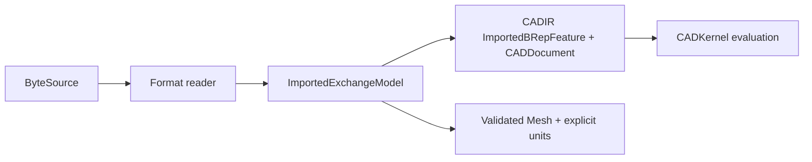
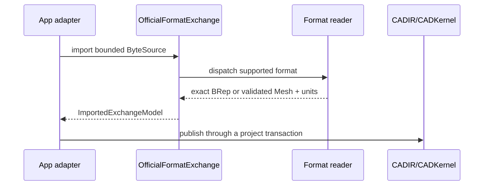

# CADExchange

## Purpose and Scope

`CADExchange` owns bounded parsing and writing of supported external file
formats. It is a child of the [Swift-CAD package design](../../DESIGN.md) and
depends on `CADIR`, `CADTopology`, and `CADKernel` through the package graph.
It publishes exchange results; application and Rupa project publication remain
outside this module.

## Responsibilities and Boundaries

This module owns format detection, resource limits, exact STEP parsing and
writing, mesh exchange parsing and writing, embedded unit extraction, and typed
unsupported-input failures. A STEP import publishes an immutable
`CADDocument` whose source graph contains one ownership-closed
`ImportedBRepFeature` per source body; the exact full model remains available
on the exchange result while each feature retains its exact body submodel.
STL and OBJ imports publish Mesh values and their declared or explicit units.
Unitless mesh input requires a caller-provided unit; embedded format markers
remain authoritative when present and are not silently relabeled. This module
does not create a Rupa scene object, choose a presentation representation, or
mutate a project.

Native section-reference admission follows the [CADIR section contract](../CADIR/SectionReference/DESIGN.md):
curve intervals and explicit traversal direction survive save/load, profile inputs
reject curve-only controls, and missing direction fields are not silently migrated.

## Related Designs

| Design | Relationship | Contract Used | Summary | Cautions |
|---|---|---|---|---|
| [Swift-CAD package](../../DESIGN.md) | child of | exact source and typed failure contract | Defines the source-to-evaluation boundary. | Exchange output is not a project publication. |
| [CADIR](../CADIR/DESIGN.md) | depends on | `ImportedBRepFeature`, `CADDocument` Codable | Retains exact STEP source values. | Do not replace exact B-rep with Mesh. |
| [CADKernel](../CADKernel/DESIGN.md) | used by | exact B-rep validation/evaluation | Evaluates a retained imported feature. | The exchange reader never manufactures topology identities. |

## Architecture

## Contracts and Invariants

Native rolling-ball surfaces retain normalized dimensionless parameters, but
the exact STEP/IGES writers currently have no chart-preserving representation
for a general blend. They must reject export with `unsupportedCapability`,
never substitute a display mesh or an uncertified spline. Native project
serialization is independent of this exchange limitation. Manufacturing
exchange remains incomplete until an explicit bounded representation contract
and its round-trip verification are implemented.

Native Sweep package shape validation accepts the optional approximation
allowance and normalized angle law defined by [CADIR](../CADIR/DESIGN.md).
Unknown nested knot or expression keys remain rejected.

1. `supportsImport` and `supportsExport` are the authoritative format gates;
   an unsupported format returns `ImportError.unsupportedFormat` or the typed
   export failure before parsing or writing.
2. STEP accepts only the implemented exact entity subset. A tessellated or
   otherwise unsupported STEP entity is a typed refusal; no partial B-rep is
   published.
3. A successful STEP import retains the reader's exact full `BRepModel`,
   embedded length unit, and a validated `CADDocument` with one validated
   imported feature for each body. Each feature's source model is extracted by
   the ownership-closed topology extractor and carries the same embedded unit
   system; its output role is `.body` for a solid and `.sheet` for a sheet; no
   face, edge, vertex, curve, or surface is dropped. The document source is
   immutable value data and participates in the normal CADIR source
   fingerprint.
4. STL and OBJ imports validate the complete Mesh and require a declared
   format unit or an explicit caller-provided unit. The parser distinguishes a
   format marker from a caller fallback, preserves the resolved unit in
   `ImportedExchangeModel.units`, and refuses missing unit metadata without an
   explicit fallback. Existing `import(..., unit:)` and
   `importBinary(...)` calls retain their historical meter defaults; callers
   that need strict admission use `OfficialFormatExchange.import(...,
   explicitUnit:)`, which propagates cancellation and the caller fallback
   without overriding a format marker. Mesh exchange output is not promoted to
   exact CAD source.
5. Resource limits and cancellation are checked during parse and write. STL
   import admits the source byte count, facet and derived-vertex entity counts,
   parse/vertex iteration cost, and peak derived mesh storage through the
   `ExchangeResourceAccountant` before reserving any output array capacity.
   A failure does not publish a partial result or overwrite an existing output.

## Runtime Flows

## State, Ownership, and Lifecycle

Readers operate on borrowed input where the source permits it and return owned
value results. Exchange caches are not source authority and are not persisted
as part of a CADDocument. Atomic URL output is owned by the public exchange
facade; temporary output is removed on failure.

## Failure, Concurrency, and Constraints

Malformed syntax, unsupported entities, invalid units, resource exhaustion,
and cancellation propagate as typed failures. The parser checks its budget at
bounded checkpoints and never converts an error into an empty-success result.
The ownership-closed topology extractor used by exact STEP import checks
cancellation at every body, shell, face, loop, and edge traversal boundary;
cancelled extraction never returns a partial submodel.
No project state or UI callback is touched while a reader or writer runs.

The package's [normal-WASI Foundation environment](../../DESIGN.md#normal-wasi-foundation-environment)
owns the fixed SDK and target-local compiler/linker settings used by this
module and the SwiftCAD facade. Its bounded proof exercises the existing
in-memory Native package path and typed malformed-input refusal. It does not
certify URL persistence, all exchange formats, or Embedded Swift; the exact
source graph and backend remain receipt-owned.

Native ZIP reads use the default aggregate cap
`min(UInt32.max, Int.max)`, expressed as `Int(clamping: UInt32.max)`.
The classic ZIP ceiling is unchanged on Native64; on wasm32 the host-addressable
ceiling is explicit. Record size conversions, central-directory end checks and
cumulative byte admission retain their typed failures. A tiny default public
read, malformed metadata and a record beyond the host-addressable or classic
ZIP boundary must be refused or decoded without a conversion trap; these
oracles allocate no large archive. The reader and the borrowed Native package
path consume the same cap definition.

## Verification and Change Impact

`ExactSTEPExchangeTests` must prove exact source retention, embedded-unit
retention, and evaluation through `DocumentEvaluator`. Format matrix tests must
cover the explicit import/export support gates and typed refusal of unsupported
formats. Changes to the source operation or Mesh import boundary require
rechecking CADIR Codable validation, CADKernel evaluation, and the Rupa adapter
that performs atomic project publication.
