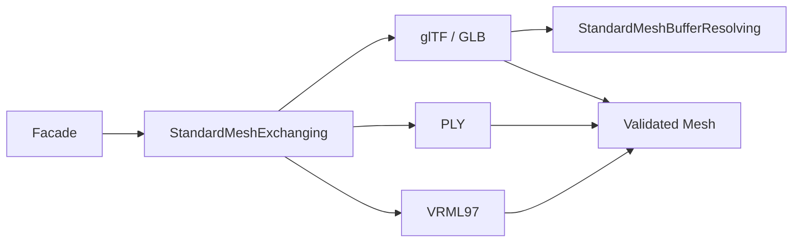

# Standard Mesh Exchange

## Purpose and Scope

This CADExchange component owns glTF 2.0 JSON/GLB, PLY, and VRML97 static
triangle-mesh exchange. Parent: [CADExchange](../DESIGN.md). No child components.

## Responsibilities and Boundaries

`StandardMeshExchanging` consumes bounded bytes and publishes complete validated
meshes, or writes a complete admitted mesh representation. The URL facade owns
atomic file replacement. `StandardMeshBufferResolving` owns external buffer
resolution; the default URL adapter confines resources to the input directory.
No network requests or project mutation occur.

## Related Designs

| Design | Relationship | Contract Used | Summary | Cautions |
|---|---|---|---|---|
| [CADExchange](../DESIGN.md) | parent | ByteSource, ByteSink, resource accountant | Public facade and typed failures | URL writes are atomic |
| [CADIR](../../CADIR/DESIGN.md) | depends on | Mesh validation | Owned mesh values in internal meters | Triangle normals agree with winding |

## Architecture



## Contracts and Invariants

- glTF accepts indexed or unindexed TRIANGLES with POSITION, NORMAL,
  TEXCOORD_0 and COLOR_0 accessors. Sparse accessors and unsupported component
  domains are explicitly refused. glTF/GLB exports reject vertex alpha below
  one because preserving transparency requires a material alphaMode contract. Buffers may be GLB BIN, data URIs, or locally
  resolved relative files. glTF and VRML distances are meters regardless of a
  caller fallback. PLY uses a `comment unit <LengthUnit>` marker or an explicit
  caller unit; coordinates convert to internal meters.
- The public static-scene policy bakes hierarchy and instancing into separate
  owned meshes. Matrix/TRS transforms compose in source order; normals use the
  inverse transpose; reflected glTF transforms reverse triangle winding.
  Hierarchy, source names and topology IDs are not retained by this mesh contract.
  Multiple scenes, materials, textures, animation, skinning, morph targets,
  unsupported attributes/nodes and custom semantic metadata are typed refusals.
- PLY supports ASCII and binary little/big endian vertex/face records, optional
  vertex normals, RGB(A), and s/t texture coordinates; unknown properties and
  elements are refused. PLY writing flattens bodies only if attribute layouts
  agree. VRML supports static Group/Transform/Shape/IndexedFaceSet, polygon
  triangulation and separately indexed normal/color/texture attributes.
- Integer products derived from header counts use checked multiplication before allocation or conversion; overflow returns the existing typed resource-limit error.
- No partial result is returned. Input, decoded buffers, derived mesh storage,
  nesting, entities, iterations and duration are admitted before allocation at
  each bounded stage. Cancellation propagates. Writers stage admitted output
  before touching the supplied sink; sink I/O failure remains the sink contract.
- Export refuses material references and unsupported attributes. Native face
  provenance is deliberately projected to geometric triangles; no exact topology
  preservation is claimed by this static mesh contract.

## Runtime Flows

```text
bounded source -> syntax admission -> resource resolution -> static scene baking
 -> complete Mesh validation -> owned ImportedExchangeModel
validated meshes -> attribute admission -> bounded staged output -> sink
```

## State, Ownership, and Lifecycle

Readers and writers are stateless Sendable values. Invocation-local accounting,
buffers and parser state have one owner and do not cross concurrency boundaries.
Borrowed source storage remains inside ByteSource closures; decoded buffers and
returned mesh arrays own their storage. Output materialization occurs once at
the file/API boundary because atomic admission precedes sink publication.

## Failure, Concurrency, and Constraints

ImportError distinguishes malformed data, unsupported semantics, unsafe URI
resolution, and unavailable external resources. ExportError rejects lossy mesh
domains. KernelError.resourceLimitExceeded and CancellationError propagate.
Singular transforms, out-of-range accessors, index overflow, invalid normal
orientation, degenerate polygons and unreferenced mesh vertices fail admission.

## Verification and Change Impact

[StandardMeshExchangeTests](../../../Tests/CADExchangeTests/StandardMeshExchangeTests.swift)
owns independent standard syntax fixtures, endian/accessor/scene/unit/normal
checks, format round trips, malformed and lossy-domain refusal, resource limits,
cancellation, external URI containment, and facade URL atomicity. Changes require
rechecking the public format registry, facade tests, and capability inventory.
Specifications: [glTF 2.0](https://registry.khronos.org/glTF/specs/2.0/glTF-2.0.html),
[PLY](https://graphics.stanford.edu/data/3Dscanrep/), and
[VRML97](https://www.web3d.org/documents/specifications/14772/V2.0/part1/nodesRef.html).

The main integration retains the existing `OfficialFormatExchange(glbExporter:)` injection. An explicitly injected legacy exporter owns GLB output; otherwise the injected `StandardMeshExchanging` service owns all four formats. Imports always use the standard mesh service. The existing IGES gates and unrelated capability-domain representation remain unchanged.

UInt32 index ceilings are compared in UInt64 so the same admission remains representable on 32-bit WASI. Combined storage accounting also rejects checked addition overflow. The dedicated face-header and combined-storage regressions exercise typed resource failures without allocating the declared payload.

Polygon work products and derived parser-storage products are checked before charging the shared accountant. A 48000-corner VRML fixture exercises refusal on both Native and normal 32-bit WASI before triangulation; the public typed resource contract is identical.
