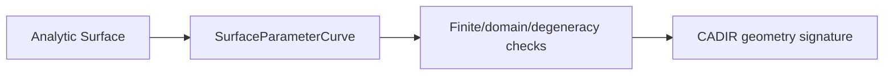

# CADGeometry

## Purpose and Scope

`CADGeometry` owns exact analytic curves, surfaces, parameter domains, and
surface-parameter curves used by all higher Swift-CAD modules. It is a child of
the [Swift-CAD package design](../../DESIGN.md). Its
[Involute](Involute/DESIGN.md) child owns certified involute flank approximation.
The [RollingBall](RollingBall/DESIGN.md) child owns local contact sections for
curved-surface fillets, not their topology or feature publication.

## Responsibilities and Boundaries

This module owns the representation and structural validation of analytic
surface parameter curves, including spherical great-circle curves. It does not
own topology identity, feature lineage, evaluation orchestration, or Rupa
measurement policy.

## Related Designs

| Design | Relationship | Contract Used | Summary | Cautions |
|---|---|---|---|---|
| [Swift-CAD package](../../DESIGN.md) | parent | package exact-geometry contract | Places geometry below modeling and above core values. | Keep the shared predicate contract authoritative. |
| [CADModeling](../CADModeling/DESIGN.md) | used by | generated primitive pcurve values | Supplies valid sphere seam/pole curves. | Construction cannot rely on a sphere-only validation bypass. |
| [CADIR](../CADIR/DESIGN.md) | used by | signature validation | Validates retained geometry through this module. | Do not loosen Codable/signature rules independently. |
| [Involute](Involute/DESIGN.md) | child | certified flank approximation | Converts analytic involute intervals to bounded B-spline spans. | Does not own gear dimensions or root geometry. |
| [RollingBall](RollingBall/DESIGN.md) | child | local contact section | Resolves source contacts from offset-intersection correspondence. | A local section is not a certified complete blend surface. |

## Architecture

## Contracts and Invariants

Parameter derivatives of unit-weight, single-span clamped cubic B-splines
use scalar de Casteljau interpolation and quadratic/linear derivative
polynomials. This path allocates no basis tables and retains domain validation,
parameter scaling, finite-result refusal and stationary endpoint behavior.
Polynomial tessellation derivative certificates require weights exactly equal
to one, not the approximate `isRational` display classification. Stationary
endpoint certificates are considered only on intervals touching a repeated
endpoint control point; interior intervals perform no knot-array construction.
Single-span clamped quadratic basis evaluation uses Bernstein polynomials
through derivative order two, avoiding recursive basis-table construction for
analytic conic spans in both 2D and 3D. Rational weight accumulation and finite
result validation stay with the existing curve evaluator. Other knot structures
and higher derivative orders retain the general basis path.
Differential tests compare against equal non-unit rational weights on
non-unit parameter domains; tessellation tolerances are not changed.

Surface-lift derivative magnitudes use certified interval derivatives of their
support surface, not tessellation's tangent-frame admission and subdivision.
The consuming ruled-surface certifier owns subdivision and its existing cell
budget. An unprovable source interval throws its typed certification failure;
it never supplies sampled or zero derivative bounds. This prevents nested
tessellation certification when thickened sheet walls lift offset boundaries.
Third-order surface-lift jets retain the existing certified coordinate-wise
position enclosure. An isotropic speed radius must not replace that support
enclosure and introduce artificial uncertainty in a constant coordinate;
derivative magnitudes remain outward bounds, independently of position bounds.
Tessellation's tangent/normal norm bounds use IntervalVector3DBounds length
bounds. A self dot-product with independent interval factors can introduce a
negative squared-norm lower bound and must not drive regularity subdivision.

Bounded rotation coefficients use outward interval arithmetic and a Taylor
remainder, rather than treating rounded libm values as exact trigonometry.
Their consumer is [CertifiedTwist](../CADModeling/CertifiedTwist/DESIGN.md).
Inverse tangent for finite nonnegative intervals up to 16 uses five applications
of atan(x)=2*atan(x/(1+sqrt(1+x²))), outward square-root endpoints, and twenty
alternating-series terms. The reduced argument is checked against 1/16;
the omitted term is below 2^-164 before rescaling by 32. Gear dimension-to-angle
construction consumes this enclosure rather than certifying a rounded libm angle.

1. Validation first checks finite values, correct surface kind, non-degenerate
   curve extent, and parameter-domain membership.
2. A spherical great-circle curve requires finite unit basis vectors and a
   non-degenerate angular span. A valid orthogonal basis is accepted despite
   unavoidable IEEE-754 representational residuals; malformed or non-orthogonal
   input remains rejected by the shared structural predicate.
3. Periodic seam and pole endpoints remain represented by their analytic
   parameterization and are never omitted to avoid validation.
4. Model tolerance controls modeling decisions; it is not a blanket substitute
   for structural validity.

## Runtime Flows

An evaluator constructs the analytic curve, validates it against its surface,
and passes it to topology/signature owners. Signature validation calls this
same contract rather than reimplementing a sphere-specific rule.

## State, Ownership, and Lifecycle

Geometry values are immutable value types after construction. Validation does
not retain external state or mutate the source/evaluation model.

## Failure, Concurrency, and Constraints

Invalid coordinates, vector lengths, angular spans, wrong surfaces, and
out-of-domain parameters throw typed geometry errors. Representational
tolerance is bounded to the operation's mathematical scale and cannot accept
nonfinite or degenerate data.

## Verification and Change Impact

Tests cover valid sphere great-circle curves at seam and pole endpoints,
slightly perturbed valid floating-point bases, non-orthogonal bases,
nonfinite/degenerate values, and wrong surfaces. Changes require rechecking
primitive B-rep generation and CADIR signature round-trips.
Surface-lift changes also require offset-boundary derivative enclosure tests
and the application's complete Thicken reevaluation/tessellation path.
