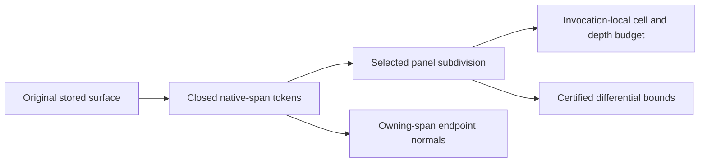

# Original Rectangle Tessellation

## Purpose and Scope

This component is a direct child of [CADGeometry](../DESIGN.md). It owns
selected closed native-span tokens, panel traversal, selected
differential evaluation and the invocation-local proof budget for nonperiodic
original B-spline rectangles. It has no children. Module composition adapters
retain original coefficient preparation, existing basis evaluation, whole-query
enclosures and the unchanged normal regularity gate.

## Responsibilities and Boundaries

The component binds tokens to the original source and tolerance and retains
their closed owners through panel traversal and selected normal evaluation.
The budget counts every visited proof cell across every native panel in one
rectangle. It owns the existing 262,144-cell and depth-32 ceilings and permits
lower internal test ceilings. Mesh allocation and face-run accounting remain
owned by [RectangularBSplineMesh](../../CADKernel/RectangularBSplineMesh/DESIGN.md).

## Related Designs

| Design | Relationship | Contract Used | Summary | Cautions |
|---|---|---|---|---|
| [CADGeometry](../DESIGN.md) | parent | original homogeneous native-span jets | Source coefficients and closed owners supply differential authority. | Whole-query behavior and source storage are unchanged. |
| [RectangularBSplineMesh](../../CADKernel/RectangularBSplineMesh/DESIGN.md) | used by | selected original panels and normals | Consumes complete panel bounds. | Native proof ceilings are independent of mesh allocation charges. |

## Architecture

## Contracts and Invariants

Tokens bind the exact surface value and preparation tolerance. Queries lie
inside the actual closed native knot span; neither tolerance padding nor
canonical endpoint replacement changes ownership. Native bounds use original
homogeneous coefficient intervals, not Cartesian extraction. Panel subdivision
never unions adjacent one-sided jets. Existing normal regularity criteria remain
unchanged. The nonperiodic surface representation and Codable fields remain
unchanged; periodic representation is outside this component.

## Runtime Flows

Preparation retains one token per positive native tensor span. A rectangular
request intersects each token and traverses its positive-width panel. Each
visited cell consumes one shared budget charge. A complete outward jet proves
tangent, second derivative and unit-normal derivative bounds, or the same
selected owner subdivides. Only complete panel aggregates are returned.

## State, Ownership, and Lifecycle

The budget is a Sendable value local to one synchronous throwing invocation.
Mutation occurs only through its inout owner; no shared mutable cache exists.
Tokens and prepared coefficient nets are immutable Sendable values retained for
the operation. Native, WASM and Embedded share these same declarations and
access paths; this component adds no conditional synchronization branches.

## Failure, Concurrency, and Constraints

Invalid source, tolerance or closed-domain ownership throws invalidInput.
Collapsed tangent frames throw singularGeometry during traversal. Finite
arithmetic, cell, depth and representable-subdivision exhaustion throw explicit
resourceLimitExceeded. Cancellation propagates before preparation, span
selection and each cell. No sampled or zero-bound fallback supplies success.

## Verification and Change Impact

[OriginalNativeRectangleGeometryTests](../../../Tests/CADGeometryTests/OriginalNativeRectangleGeometryTests.swift)
checks nonclamped success, C0 endpoint owners, whole-query compatibility,
source/tolerance/domain refusal, collapsed geometry, aggregate budget refusal
and cancellation. Upper [RectangularBSplineMesh](../../CADKernel/RectangularBSplineMesh/DESIGN.md)
tests must verify panel coverage, endpoint mesh normals and cumulative face-run
budgets. Changes to coefficient preparation or selected basis evaluation require
rechecking both token containment and upper mesh fidelity.
