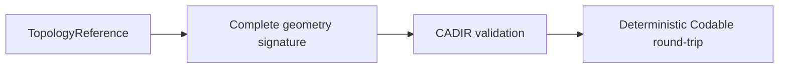

# CADIR

## Purpose and Scope

`CADIR` owns source/evaluation interchange values, topology references, and
complete geometry signatures. It is a child of the [Swift-CAD package
design](../../DESIGN.md) and has no children for this change.

## Responsibilities and Boundaries

This module owns the value contract for `StableSubshapeReference` and its
`SubshapeGeometrySignature`, including Codable validation. It does not discover
topology, evaluate a document, generate primitives, or choose Rupa measurement
methods.

## Related Designs

| Design | Relationship | Contract Used | Summary | Cautions |
|---|---|---|---|---|
| [Swift-CAD package](../../DESIGN.md) | parent | stable topology contract | Defines complete signature retention. | A signature is not a live topology authority. |
| [CADGeometry](../CADGeometry/DESIGN.md) | depends on | analytic curve/surface validation | Validates pcurves and surfaces. | Preserve structural rejection rules. |
| [CADKernel](../CADKernel/DESIGN.md) | used by | snapshot signature construction | Supplies exact signatures for current subshapes. | No partial or Mesh-derived signatures. |

## Architecture

## Contracts and Invariants

1. A stable signature retains body, shell, face, loop, coedge, edge, vertex,
   surface, curve, trim, orientation, and pcurve data required for comparison.
2. Validation rejects invalid IDs, empty required collections, malformed
   geometry, nonfinite values, degenerate trims, and wrong-surface pcurves.
3. Encoding validates before writing; decoding validates after reading. A
   successful JSON round-trip preserves the complete signature, not merely its
   topology kind or identity.

## Runtime Flows

`CADKernel` constructs the signature from one immutable model, and this module
validates and encodes it. Resolution back to a live topology is owned by
`CADKernel`/`CADModeling`.

## State, Ownership, and Lifecycle

Signature values own copied/value geometry and have no lifetime dependency on
the evaluated document after construction.

## Failure, Concurrency, and Constraints

Validation is pure and deterministic. Codable failures propagate typed
validation errors; no empty signature or dropped topology entry is returned as
success.

## Verification and Change Impact

Tests cover all generated sphere subshape signatures, JSON round-trip, invalid
and out-of-domain signatures, and representative planar/cylindrical topology.
Changes require rechecking `CADKernel` stable-reference creation and lookup.
