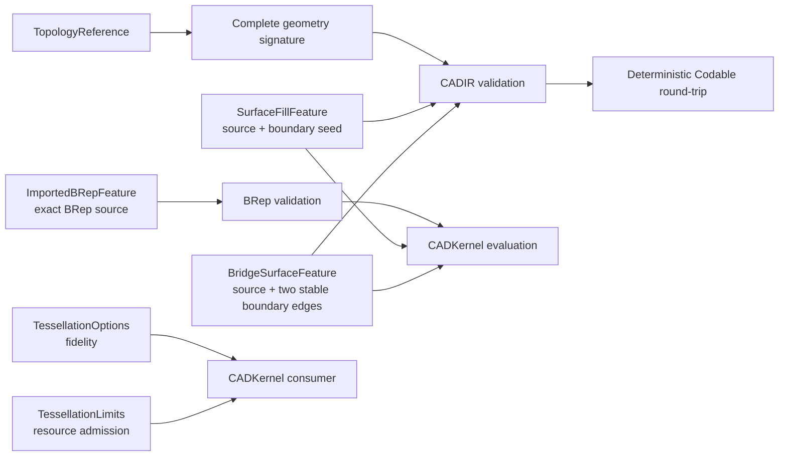

# CADIR

## Purpose and Scope

`CADIR` owns source/evaluation interchange values, topology references, and
complete geometry signatures. It also owns the serialized source value for an
exact imported B-rep feature. It is a child of the [Swift-CAD package
design](../../DESIGN.md); its children are indexed below.

## Responsibilities and Boundaries

[BoundaryContinuity](BoundaryContinuity/DESIGN.md) owns whole-boundary continuity
certification using the existing G0/G1/G2 vocabulary.

Editable gear dimensions are owned by [InvoluteGear](InvoluteGear/DESIGN.md).

Editable spatial path source is owned by the child
[SpatialPath](SpatialPath/DESIGN.md). Its explicit XYZ model does not change the
planar Sketch contract.

Operation-independent profile/curve section references belong to
[SectionReference](SectionReference/DESIGN.md). Sweep and Extrude consume this
contract. Revolve adopts the same section contract and explicit topology body
kind. Loft section controls wrap the same reference rather than a profile-only
field. Curve sections require Sheet output; the original profile-only Loft
payload is rejected rather than silently migrated.

Loft's required `profileDirection` controls correspondence, not Profile winding:
`automatic` permits alignment to choose traversal, while `forward` and `reversed`
lock traversal relative to the source loop. Curves use their shared reference's
direction and require `profileDirection == automatic`. Native persistence must
retain this distinction; a missing direction field is not silently defaulted.

This module owns the value contract for `StableSubshapeReference` and its
`SubshapeGeometrySignature`, including Codable validation. It also owns the
product-neutral value contracts for tessellation fidelity and generic
resource admission: `TessellationOptions` and `TessellationLimits`. The
`ImportedBRepFeature` value retains one exact, validated `BRepModel` as a
source feature; `CADKernel` owns its evaluation and generated topology
identities. CADIR does not parse exchange files, evaluate a document, generate
primitives, or choose Rupa measurement methods or presentation LOD.

`TessellationLimits` is implemented in `TessellationLimits.swift`. `CADKernel`
charges an invocation against the supplied limits; this module owns only the
value contract and the package-versioned constants.

## Related Designs

| Design | Relationship | Contract Used | Summary | Cautions |
|---|---|---|---|---|
| [Swift-CAD package](../../DESIGN.md) | parent | stable topology contract | Defines complete signature retention. | A signature is not a live topology authority. |
| [CADGeometry](../CADGeometry/DESIGN.md) | depends on | analytic curve/surface validation | Validates pcurves and surfaces. | Preserve structural rejection rules. |
| [CADKernel](../CADKernel/DESIGN.md) | used by | snapshot signature construction | Supplies exact signatures for current subshapes. | No partial or Mesh-derived signatures. |

## Architecture

## Contracts and Invariants

`FeatureNodeFactory` derives Extrude output roles from `resultKind`: `.solid`
produces `.body`, and `.sheet` produces `.sheet`. The native package shape
validator must preserve that field through save/load, as verified by
`ExtrudeSourceRoundTripTests` using exact document reevaluation.

Extrude owns one `section`, whose input port is derived from its reference kind.
A curve section produces only a sheet; requesting a solid is an invalid graph,
not permission to close the curve. The canonical payload requires `section` and
`resultKind`. The former profile-only payload is rejected explicitly rather than
decoded into a default section. The profile initializer remains an authoring
convenience that constructs `.profile`, not a second source representation.

Extrude retains a signed end position in `distance` and an optional signed
`startDistance` (zero when absent), measured along its resolved extrusion axis.
Its shared `resolvedAxialRange` resolves units, finite coordinates and a span
above modeling tolerance, including reverse-only and same-side intervals.
Symmetric mode retains its positive total-distance meaning and rejects an
explicit start position. Both expressions participate in dependency invalidation
and native package replay. Geometry, measurement and editing consume this same
range contract; draft and wall offsets are separate controls.

Revolve likewise persists `section` and required `resultKind` (`BodyKind`).
Curve sections require Sheet output. Graph input/output roles, native package
validation and evaluated topology must agree with those values; old profile-only
Revolve payloads are explicitly rejected. A profile authoring initializer builds
the same canonical value, with Solid as its default output.

Sweep source optionally retains a length-valued `approximationTolerance` and
`twistLaw` containing `SweepTwistKnot(position:angle:)` values. Omission preserves
the previous exact-only behavior. Positions are finite and strictly increasing
from 0 to 1; resolved angles start at 0 and end at the resolved `twistAngle`.
All expressions participate in dependency tracking and canonical source encoding.
Construction and proof belong to
[CertifiedTwist](../CADModeling/CertifiedTwist/DESIGN.md).

`TessellationOptions.featureOverrides` is display fidelity keyed by output feature,
not source geometry. Overrides contain no further overrides. Document evaluation
resolves live body subshapes to their owning feature, tessellates each requested
quality under one cumulative resource budget, and records the complete option set
in cache identity. Direct mesh tessellation requires resolved options without
feature overrides. Missing serialized overrides mean the existing global quality.

`FilletFeature.allEdges` selects the complete current target edge set without
retaining geometry signatures from an earlier dimension. It is mutually exclusive
with explicit `edges`; omitted data decodes as false for compatibility. The supported
all-edge domains are an orthogonal box, a circular cylinder, and a convex prism
extruded perpendicular to a cap profile of straight segments and tangentially
joined circular arcs; other bodies fail explicitly.
The radius remains exact CAD source. Display subdivisions are not fillet source.

`SurfaceFillFeature` retains a source feature and one stable reference to an
edge on that source. Evaluation resolves the complete open boundary loop from
current exact topology and produces one separate `.sheet` output; it never
replaces the source body. The edge is only a loop seed, not a tessellated
approximation of the boundary. Boundary order is resolved from vertex
connectivity. Unsupported, stale, ambiguous, or non-closed boundaries fail
explicitly.

`BridgeSurfaceFeature` retains two stable edge references and the orientation
choice for the second edge. Every distinct source is a declared graph input in
boundary order. References resolve to distinct current open-boundary edges of
their respective evaluated bodies in a common coordinate frame.
Evaluation derives exact trimmed curves from the current B-rep and emits a
dependent `.sheet`; inline copied curves are not source authority.

`ExtrudeFeature.resultKind` selects which body a linear extrusion of a closed
profile builds, and it is the only thing that separates the two: a `.solid`
extrusion caps both ends of the swept wall and sews a solid, a `.sheet`
extrusion leaves both ends open and sews the wall alone. The profile is the
same value in both cases, so the flag lives on the feature rather than on the
profile it consumes. Omitted data decodes as `.solid`, which is the body every
document written before the flag existed carries. The graph contract follows
the flag the way the sweep's does: a `.solid` extrusion declares exactly one
`.body` output and a `.sheet` extrusion exactly one `.sheet` output, so the
role a consumer reads from the node and the body the evaluator builds cannot
disagree. A `.sheet` extrusion of a profile with more than one boundary loop
builds one sheet body of disjoint shells, one per loop, and that is a valid
body rather than a defect: the shells bound no volume between them and none is
claimed.

1. A stable signature retains body, shell, face, loop, coedge, edge, vertex,
   surface, curve, trim, orientation, and pcurve data required for comparison.
2. Validation rejects invalid IDs, empty required collections, malformed
   geometry, nonfinite values, degenerate trims, and wrong-surface pcurves.
3. Encoding validates before writing; decoding validates after reading. A
   successful JSON round-trip preserves the complete signature, not merely its
   topology kind or identity.
4. `TessellationOptions` contains only geometric fidelity inputs and remains
   the identity of the requested sampling profile. It is not a viewport or
   Product policy.
5. `TessellationLimits` contains only generic checked ceilings for cumulative
   vertices, indices, triangles, and estimated bytes for one complete
   tessellation invocation. It validates positive, representable limits but
   does not select values or estimate CAD-specific geometry. The ceilings are
   `Int`, so a nonfinite or unrepresentable limit cannot be expressed.
6. A caller may lower `TessellationLimits.hardCeiling` but never widen it.
   `validate()` rejects any dimension that is not positive or that exceeds the
   hard ceiling, and `lowered(to:)` is the only composition offered, so no
   consumer can raise the package maximum by constructing its own limits.
7. The hard ceiling and default limit values are selected from the measured
   Swift-CAD fixtures recorded below and versioned by the package; this module
   does not choose product-specific requested values or embed guessed values to
   make a particular Rupa scene pass.
8. `TessellationUsage` is the resource account of one materialized `Mesh`. It
   is derived from the artifact by `init(mesh:)` — never declared independently
   by a producer — and `validate()` rejects a value no invocation could have
   produced. `firstResourceExceeding(_:)` names the first dimension a usage
   outgrows, so a request states its ceiling and the usage answers it.
   The in-flight budget is not a second artifact contract: `CADKernel` charges
   each actual vertex/index growth immediately before the corresponding output
   append. An evaluator may reserve this usage for retained meshes when it asks
   for incremental tessellation; the production tessellator seeds its checked
   budget with that reservation. A normal-consistency fallback that duplicates
   three corners is charged as three vertices and their bytes before those
   corners are appended.
9. A `MeshCache` entry is scoped to the artifact configuration it records.
   Reuse requires the source fingerprint, the design and parameter revisions,
   the kernel version, the modeling tolerance, the complete
   `TessellationOptions`, and the `MeshArtifactPurpose` all to match the
   request, and requires the recorded usage both to describe the stored mesh
   and to fit the requested `TessellationLimits`. A mismatched purpose is
   `meshCachePurposeMismatch`, a usage above the requested ceiling is
   `meshCacheExceedsLimits`, and every other disagreement is `staleMeshCache`
   with the reason. An artifact is therefore never shared across consumers that
   happen to agree on fidelity, and a narrow request never inherits a wider
   ceiling through the cache. The cache contract is checked by the evaluator
   only for bodies it is actually reusing; exact B-rep state can remain reusable
   while a mesh artifact is refused. `DocumentCaches.validateFreshness` remains
   a standalone artifact-table validator and reports a purpose mismatch; an
   evaluator receiving that artifact as a reuse hint may instead discard the
   mesh and regenerate it for the requested purpose.
10. `MeshArtifactPurpose` is the kernel artifact authority. CADIR does not
    define or infer a Rupa representation purpose, and no consumer may relabel a
    cached kernel artifact to satisfy a different purpose. Rupa may deliberately
    use the same kernel `.unspecified` purpose for its unspecified representation,
    but that is an adapter decision outside this module.
11. `BRepCache` records no tessellation input, so exact B-rep reuse is
    independent of tessellation fidelity: the same document evaluated at two
    fidelities yields the same cached model, fingerprint, and revisions while
    yielding different meshes.
12. `ImportedBRepFeature` is a source operation, not a cache or a Mesh
    artifact. It owns one exact, ownership-closed `BRepModel` and the
    embedded `sourceUnits` declared by the exchange file. The model's
    coordinates are already normalized to the kernel's internal frame; the
    unit value preserves source display semantics for an adapter. The feature
    accepts no feature inputs and validates the complete model and units at the
    requested modeling tolerance. Exchange readers publish one imported
    feature per source body, so each feature has one `.body` output for a
    solid or one `.sheet` output for a sheet while the exchange result may
    retain the complete source model separately.
    CADKernel creates feature-scoped body, face, edge, and vertex identities
    for evaluation; it never mutates the retained source IDs. The source model
    is never relabeled as a generated primitive and is never replaced by a
    tessellated Mesh.
13. `CADDocument` retains the existing strict schema-version contract. The
    imported operation is encoded through `FeatureOperation` and therefore
    participates in the current document source fingerprint; unknown operation
    kinds or fields remain typed decoding failures. A schema-version migration
    is not inferred from the new operation and must be introduced explicitly
    if the package later changes the document envelope.
14. Caches are in-memory evaluation state. `CADExchange` writes the source
    document, never `DocumentCaches`, so the `Codable` conformance carries no
    on-disk format and adding a recorded field needs no migration.
15. `CADDocument.translatingSources(by:tolerance:)` must either translate every
    source-owned geometry value or fail with a typed
    `KernelErrorCode.unsupportedCapability`. An imported exact B-rep has no
    complete translation utility at this layer, so it is refused rather than
    silently left in place. Translation works on a local document copy and
    publishes only after all operations validate; a mixed document therefore
    cannot expose a partially translated result.
    The imported-BRep capability is executable but `partial`: the public source
    translation path explicitly refuses it until exact translation is implemented.
16. `Mesh.faceRuns` is the mesh's record of which B-rep face generated which
    triangles. It is a value carried with the mesh, not a separately indexed
    side table, so the provenance cannot be separated from the triangles it
    describes and cannot be rebuilt per interaction. Runs are ordered by
    emission and are contiguous: the triangles a run describes are the
    `indices` triples `[start, start + triangleCount)` where `start` is the
    sum of the preceding runs' counts, so a consumer resolves triangle `t` by
    a single ordered scan and needs no dictionary. `validate(tolerance:)`
    accepts either no run at all or a complete partition, and rejects an empty
    run, a repeated face, and a covered count other than `indices.count / 3`.
    A partial partition is refused because it would let a consumer resolve a
    triangle to the wrong face. No run means the mesh carries no face
    provenance, which is the truthful state of a mesh an exchange reader built
    from a triangle soup; it is not a fallback that a CAD consumer may accept
    silently. `CADKernel` owns which face produced which run.

### Measured Source of the Limit Constants

Measured on Mac16,6 (36 GB) at `TessellationOptions.standard`
(`angularTolerance` 1.0e-3), evaluating each fixture in its own process:

| Fixture | Bodies | Faces | Vertices | Indices | Triangles | Mesh bytes | Peak RSS |
|---|---:|---:|---:|---:|---:|---:|---:|
| box 2x3x4 | 1 | 6 | 24 | 36 | 12 | 1,296 | 13.4 MB |
| cylinder r=0.001 h=3 | 1 | 6 | 25,130 | 75,360 | 25,120 | 1,507,680 | 19.5 MB |
| cylinder r=1.25 h=3 | 1 | 6 | 25,146 | 75,408 | 25,136 | 1,508,640 | 18.8 MB |
| cylinder r=100 h=3 | 1 | 6 | 25,146 | 75,408 | 25,136 | 1,508,640 | 18.8 MB |
| cone r=1.5 h=3 | 1 | 5 | 12,581 | 37,728 | 12,576 | 754,800 | 16.7 MB |
| sphere r=2 | 1 | 8 | 37,712 | 113,112 | 37,704 | 2,262,624 | 21.4 MB |
| 12 boxes | 12 | 72 | 288 | 432 | 144 | 15,552 | 16.3 MB |
| 12 cylinders r≈0.03 | 12 | 72 | 301,752 | 904,896 | 301,632 | 18,103,680 | 45.5 MB |

Torus R=4 r=1 across angular tolerances, which isolates the quadratic growth of
a rectangular parametric grid face:

| Angular tolerance | Vertices | Indices | Triangles | Mesh bytes | Peak RSS |
|---:|---:|---:|---:|---:|---:|
| 5.0e-2 | 17,424 | 98,304 | 32,768 | 1,229,568 | 18.0 MB |
| 2.5e-2 | 65,536 | 381,024 | 127,008 | 4,669,824 | 33.2 MB |
| 1.25e-2 | 258,064 | 1,524,096 | 508,032 | 18,483,456 | 82.2 MB |
| 6.25e-3 | 1,024,144 | 6,096,384 | 2,032,128 | 73,544,448 | 290.0 MB |
| 3.125e-3 | 4,064,256 | 24,288,864 | 8,096,288 | 292,239,744 | 1,063.9 MB |

Two properties follow from the measurements and set the constants. Successive
tolerance halvings multiply the emission by 3.76, 3.94, 3.97, and 3.97,
converging on 4.00, so a rectangular grid face grows quadratically and the same
torus at `TessellationOptions.standard` projects to roughly 39.5 M vertices and
2.85 GB of mesh storage, which the reference machine cannot hold. The measured
peak-resident-to-mesh-byte ratio is 3.6x to 4.5x.

`hardCeiling` admits the largest invocation that completed on the reference
machine and bounds peak growth near 1.7 GB through the measured ratio.
`standard` admits the largest realistic measured model, the twelve-cylinder
assembly at 18.10 MB, with 7.4x byte headroom; it admits the torus at 6.25e-3
and refuses it at 3.125e-3.

## Runtime Flows

`CADKernel` constructs the signature from one immutable model, and this module
validates and encodes it. Resolution back to a live topology is owned by
`CADKernel`/`CADModeling`.

## State, Ownership, and Lifecycle

Signature values own copied/value geometry and have no lifetime dependency on
the evaluated document after construction.

## Failure, Concurrency, and Constraints

Validation is pure and deterministic. Codable failures propagate typed
validation errors; no empty signature or dropped topology entry is returned as
success. Tessellation limit validation is likewise pure; exhaustion and
overflow are reported by `CADKernel`, which owns geometry-aware preflight and
all-or-nothing emission.

## Verification and Change Impact

Tests cover all generated sphere subshape signatures, JSON round-trip, invalid
and out-of-domain signatures, and representative planar/cylindrical topology.
`TessellationLimitsTests` covers non-positive limits on every dimension, limits
that widen the hard ceiling, the largest representable limit, lowering, and the
package constants, without coupling the values to viewport policy.
`CADKernelTests/MeshCacheScopeTests` owns the cache-boundary contract, covering
a matching request, a mismatched purpose, a mismatched fidelity, a usage that
does not describe its artifact, a usage above the requested limits, and B-rep
reuse across two fidelities. `CADIRTests/MeshFaceRunTests` owns the
`Mesh.faceRuns` value contract, covering the absent-provenance mesh, the
complete partition, the empty run, the repeated face, the short and long
partitions, and the JSON round-trip that omits and restores the field.
`CADKernelTests/MeshTessellatorFaceRunTests` owns the emitted runs. Changes
require rechecking `CADKernel` stable-reference creation, lookup, and
tessellation admission, and re-measuring the fixtures above whenever the
constants move.

### Boundary coordinate maps

BridgeSurfaceFeature retains optional source-to-output affine maps beside its
stable boundaries. Absence denotes the existing common source frame. Maps are
finite and nonsingular and participate in persistence, equality and source
fingerprints. The application owns live occurrence bindings and map refresh;
CADIR owns no scene-node identity. See [BridgeSurface](../CADModeling/BridgeSurface/DESIGN.md).

### Constrained Surface source

`ConstrainedSurfaceFeature` retains ordered point positions in meters,
positional/angular tolerances and Performance/Smoothness mode.
It has no input feature ports and produces a Sheet. The original values, not a
cached fitted net, are the source authority. CADModeling's
[ConstrainedSurface](../CADModeling/ConstrainedSurface/DESIGN.md) owns fitting and
independent residual checks; existing B-spline admission owns regularity and BRep.
