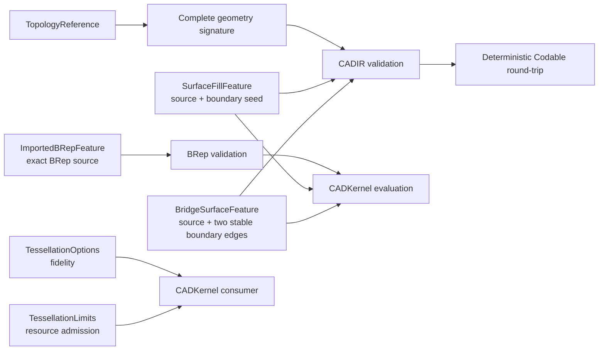

# CADIR

## Purpose and Scope

`CADIR` owns source/evaluation interchange values, topology references, and
complete geometry signatures. It also owns the serialized source value for an
exact imported B-rep feature. It is a child of the [Swift-CAD package
design](../../DESIGN.md); its children are indexed below.

## Responsibilities and Boundaries

[BoundaryContinuity](BoundaryContinuity/DESIGN.md) owns whole-boundary continuity
certification using the existing G0/G1/G2 vocabulary.

Editable gear dimensions are owned by [InvoluteGear](InvoluteGear/DESIGN.md).

Editable spatial path source is owned by the child
[SpatialPath](SpatialPath/DESIGN.md). Its explicit XYZ model does not change the
planar Sketch contract.

Operation-independent profile/curve section references belong to
[SectionReference](SectionReference/DESIGN.md). Sweep and Extrude consume this
contract. Revolve adopts the same section contract and explicit topology body
kind. Loft section controls wrap the same reference rather than a profile-only
field. Curve sections require Sheet output; the original profile-only Loft
payload is rejected rather than silently migrated.

Loft's required `profileDirection` controls correspondence, not Profile winding:
`automatic` permits alignment to choose traversal, while `forward` and `reversed`
lock traversal relative to the source loop. Curves use their shared reference's
direction and require `profileDirection == automatic`. Native persistence must
retain this distinction; a missing direction field is not silently defaulted.

This module owns the value contract for `StableSubshapeReference` and its
`SubshapeGeometrySignature`, including Codable validation. It also owns the
product-neutral value contracts for tessellation fidelity and generic
resource admission: `TessellationOptions` and `TessellationLimits`. The
`ImportedBRepFeature` value retains one exact, validated `BRepModel` as a
source feature; `CADKernel` owns its evaluation and generated topology
identities. CADIR does not parse exchange files, evaluate a document, generate
primitives, or choose Rupa measurement methods or presentation LOD.

`TessellationLimits` is implemented in `TessellationLimits.swift`. `CADKernel`
charges an invocation against the supplied limits; this module owns only the
value contract and the package-versioned constants.

## Related Designs

| Design | Relationship | Contract Used | Summary | Cautions |
|---|---|---|---|---|
| [Swift-CAD package](../../DESIGN.md) | parent | stable topology contract | Defines complete signature retention. | A signature is not a live topology authority. |
| [CADGeometry](../CADGeometry/DESIGN.md) | depends on | analytic curve/surface validation | Validates pcurves and surfaces. | Preserve structural rejection rules. |
| [CADKernel](../CADKernel/DESIGN.md) | used by | snapshot signature construction | Supplies exact signatures for current subshapes. | No partial or Mesh-derived signatures. |

## Architecture

## Contracts and Invariants

### Feature references

`FeatureOperation.mapFeatureReferences` is the single enumeration of the feature
references an operation carries: sections, curve outputs (including Bridge
Curve endpoints), Boolean/sweep/pattern/topology targets, paths, guides and
stable subshape references. `referencedFeatureIDs` and
`remappingFeatureIDs(_:)` derive from it, and `FeatureNode.remappingFeatureReferences`
adds the node inputs. The switch is exhaustive per operation; self-contained
source geometry (sketch, spatial path, PolySpline, constrained and B-spline
surfaces, imported B-rep, primitive, patch surface, involute gear) names no
feature. Every non-reference field is carried over unchanged, and a reference
without a replacement is a typed `FeatureEvaluationError`. Consumers that clone,
fingerprint or trace graphs use this contract instead of enumerating payload
fields. `FeatureOperationReferenceTests` proves enumeration, round-trip
preservation, Bridge Curve endpoints and refusal.

`FeatureNodeFactory` derives Extrude output roles from `resultKind`: `.solid`
produces `.body`, and `.sheet` produces `.sheet`. The native package shape
validator must preserve that field through save/load, as verified by
`ExtrudeSourceRoundTripTests` using exact document reevaluation.

Extrude owns one `section`, whose input port is derived from its reference kind.
A curve section produces only a sheet; requesting a solid is an invalid graph,
not permission to close the curve. The canonical payload requires `section` and
`resultKind`. The former profile-only payload is rejected explicitly rather than
decoded into a default section. The profile initializer remains an authoring
convenience that constructs `.profile`, not a second source representation.

Extrude retains a signed end position in `distance` and an optional signed
`startDistance` (zero when absent), measured along its resolved extrusion axis.
Its shared `resolvedAxialRange` resolves units, finite coordinates and a span
above modeling tolerance, including reverse-only and same-side intervals.
Symmetric mode retains its positive total-distance meaning and rejects an
explicit start position. Both expressions participate in dependency invalidation
and native package replay. Geometry, measurement and editing consume this same
range contract; draft and wall offsets are separate controls.

Revolve likewise persists `section` and required `resultKind` (`BodyKind`).
Curve sections require Sheet output. Graph input/output roles, native package
validation and evaluated topology must agree with those values; old profile-only
Revolve payloads are explicitly rejected. A profile authoring initializer builds
the same canonical value, with Solid as its default output.

Sweep source optionally retains a length-valued `approximationTolerance` and
`twistLaw` containing `SweepTwistKnot(position:angle:)` values. Omission preserves
the previous exact-only behavior. Positions are finite and strictly increasing
from 0 to 1; resolved angles start at 0 and end at the resolved `twistAngle`.
All expressions participate in dependency tracking and canonical source encoding.
Construction and proof belong to
[CertifiedTwist](../CADModeling/CertifiedTwist/DESIGN.md).

`TessellationOptions.featureOverrides` is display fidelity keyed by output feature,
not source geometry. Overrides contain no further overrides. Document evaluation
resolves live body subshapes to their owning feature, tessellates each requested
quality under one cumulative resource budget, and records the complete option set
in cache identity. Direct mesh tessellation requires resolved options without
feature overrides. Missing serialized overrides mean the existing global quality.

`FilletFeature.allEdges` selects the complete current target edge set without
retaining geometry signatures from an earlier dimension. It is mutually exclusive
with explicit `edges`; omitted data decodes as false for compatibility. The supported
all-edge domains are an orthogonal box, a circular cylinder, and a convex prism
extruded perpendicular to a cap profile of straight segments and tangentially
joined circular arcs; other bodies fail explicitly.
The radius remains exact CAD source. Display subdivisions are not fillet source.

`SurfaceFillFeature` retains a source feature and one stable reference to an
edge on that source. Evaluation resolves the complete open boundary loop from
current exact topology and produces one separate `.sheet` output; it never
replaces the source body. The edge is only a loop seed, not a tessellated
approximation of the boundary. Boundary order is resolved from vertex
connectivity. Unsupported, stale, ambiguous, or non-closed boundaries fail
explicitly.

`BridgeSurfaceFeature` retains two stable edge references and the orientation
choice for the second edge. Every distinct source is a declared graph input in
boundary order. References resolve to distinct current open-boundary edges of
their respective evaluated bodies in a common coordinate frame.
Evaluation derives exact trimmed curves from the current B-rep and emits a
dependent `.sheet`; inline copied curves are not source authority.

`ExtrudeFeature.resultKind` selects which body a linear extrusion of a closed
profile builds, and it is the only thing that separates the two: a `.solid`
extrusion caps both ends of the swept wall and sews a solid, a `.sheet`
extrusion leaves both ends open and sews the wall alone. The profile is the
same value in both cases, so the flag lives on the feature rather than on the
profile it consumes. Omitted data decodes as `.solid`, which is the body every
document written before the flag existed carries. The graph contract follows
the flag the way the sweep's does: a `.solid` extrusion declares exactly one
`.body` output and a `.sheet` extrusion exactly one `.sheet` output, so the
role a consumer reads from the node and the body the evaluator builds cannot
disagree. A `.sheet` extrusion of a profile with more than one boundary loop
builds one sheet body of disjoint shells, one per loop, and that is a valid
body rather than a defect: the shells bound no volume between them and none is
claimed.

1. A stable signature retains body, shell, face, loop, coedge, edge, vertex,
   surface, curve, trim, orientation, and pcurve data required for comparison.
2. Validation rejects invalid IDs, empty required collections, malformed
   geometry, nonfinite values, degenerate trims, and wrong-surface pcurves.
3. Encoding validates before writing; decoding validates after reading. A
   successful JSON round-trip preserves the complete signature, not merely its
   topology kind or identity.
4. `TessellationOptions` contains only geometric fidelity inputs and remains
   the identity of the requested sampling profile. It is not a viewport or
   Product policy. `linearTolerance` is the accuracy bound: the distance from
   an emitted segment or facet to the exact curve or surface it samples.
   `angularTolerance` bounds how far the exact tangent or normal turns across
   one segment or facet; it keeps features that are small against the chord
   bound round, and never stands in for the chord bound. `maxEdgeLength`
   bounds a segment's or facet side's length. A refining path satisfies all
   three together (see [CADKernel](../CADKernel/DESIGN.md#tessellation-fidelity)).
   `TessellationOptions.standard` pairs a 0.1 mm chord bound (`1.0e-4`) with
   an angular bound of one turn divided by 63.5: at most 2π/64 of turning per
   segment or facet, 64 per full turn. The turn is divided by 63.5 rather than
   64 so a span that is an exact fraction of a turn does not round up to one
   more segment. Above a radius of about 8.3 cm the chord bound governs; below
   it the angular floor keeps small round features round. Accuracy never
   depends on this floor, so any feasible value is correct; 64 per turn is the
   chosen default, and a caller that needs smaller features finer passes its
   own options or per-feature overrides. The value must be
   feasible: a facet whose normal turns by at most θ covers at most a solid
   angle of order θ², so a closed doubly curved surface needs on the order of
   4π/θ² vertices under any triangulation. The former `1.0e-3` needed about
   12.6 M vertices for one sphere, beyond `TessellationLimits.standard`, and
   appeared to fit only while trimmed spherical faces were fanned from one
   interior point without refining their interior. `.standard` must admit
   twelve complete spheres of 1 m radius under `TessellationLimits.standard`,
   the assembly size the limits were sized for; a change to either default
   re-runs `TessellationStandardFeasibilityTests`.
5. `TessellationLimits` contains only generic checked ceilings for cumulative
   vertices, indices, triangles, and estimated bytes for one complete
   tessellation invocation. It validates positive, representable limits but
   does not select values or estimate CAD-specific geometry. The ceilings are
   `Int`, so a nonfinite or unrepresentable limit cannot be expressed.
6. A caller may lower `TessellationLimits.hardCeiling` but never widen it.
   `validate()` rejects any dimension that is not positive or that exceeds the
   hard ceiling, and `lowered(to:)` is the only composition offered, so no
   consumer can raise the package maximum by constructing its own limits.
7. The hard ceiling and default limit values are selected from the measured
   Swift-CAD fixtures recorded below and versioned by the package; this module
   does not choose product-specific requested values or embed guessed values to
   make a particular Rupa scene pass.
8. `TessellationUsage` is the resource account of one materialized `Mesh`. It
   is derived from the artifact by `init(mesh:)` — never declared independently
   by a producer — and `validate()` rejects a value no invocation could have
   produced. `firstResourceExceeding(_:)` names the first dimension a usage
   outgrows, so a request states its ceiling and the usage answers it.
   The in-flight budget is not a second artifact contract: `CADKernel` charges
   each actual vertex/index growth immediately before the corresponding output
   append. An evaluator may reserve this usage for retained meshes when it asks
   for incremental tessellation; the production tessellator seeds its checked
   budget with that reservation. A normal-consistency fallback that duplicates
   three corners is charged as three vertices and their bytes before those
   corners are appended.
9. A `MeshCache` entry is scoped to the artifact configuration it records.
   Reuse requires the source fingerprint, the design and parameter revisions,
   the kernel version, the modeling tolerance, the complete
   `TessellationOptions`, and the `MeshArtifactPurpose` all to match the
   request, and requires the recorded usage both to describe the stored mesh
   and to fit the requested `TessellationLimits`. A mismatched purpose is
   `meshCachePurposeMismatch`, a usage above the requested ceiling is
   `meshCacheExceedsLimits`, and every other disagreement is `staleMeshCache`
   with the reason. An artifact is therefore never shared across consumers that
   happen to agree on fidelity, and a narrow request never inherits a wider
   ceiling through the cache. The cache contract is checked by the evaluator
   only for bodies it is actually reusing; exact B-rep state can remain reusable
   while a mesh artifact is refused. `DocumentCaches.validateFreshness` remains
   a standalone artifact-table validator and reports a purpose mismatch; an
   evaluator receiving that artifact as a reuse hint may instead discard the
   mesh and regenerate it for the requested purpose.
10. `MeshArtifactPurpose` is the kernel artifact authority. CADIR does not
    define or infer a Rupa representation purpose, and no consumer may relabel a
    cached kernel artifact to satisfy a different purpose. Rupa may deliberately
    use the same kernel `.unspecified` purpose for its unspecified representation,
    but that is an adapter decision outside this module.
11. `BRepCache` records no tessellation input, so exact B-rep reuse is
    independent of tessellation fidelity: the same document evaluated at two
    fidelities yields the same cached model, fingerprint, and revisions while
    yielding different meshes.
12. `ImportedBRepFeature` is a source operation, not a cache or a Mesh
    artifact. It owns one exact, ownership-closed `BRepModel` and the
    embedded `sourceUnits` declared by the exchange file. The model's
    coordinates are already normalized to the kernel's internal frame; the
    unit value preserves source display semantics for an adapter. The feature
    accepts no feature inputs and validates the complete model and units at the
    requested modeling tolerance. Exchange readers publish one imported
    feature per source body, so each feature has one `.body` output for a
    solid or one `.sheet` output for a sheet while the exchange result may
    retain the complete source model separately.
    CADKernel creates feature-scoped body, face, edge, and vertex identities
    for evaluation; it never mutates the retained source IDs. The source model
    is never relabeled as a generated primitive and is never replaced by a
    tessellated Mesh.
13. `CADDocument` retains the existing strict schema-version contract. The
    imported operation is encoded through `FeatureOperation` and therefore
    participates in the current document source fingerprint; unknown operation
    kinds or fields remain typed decoding failures. A schema-version migration
    is not inferred from the new operation and must be introduced explicitly
    if the package later changes the document envelope.
14. Caches are in-memory evaluation state. `CADExchange` writes the source
    document, never `DocumentCaches`, so the `Codable` conformance carries no
    on-disk format and adding a recorded field needs no migration.
15. `CADDocument.translatingSources(by:tolerance:)` must either translate every
    source-owned geometry value or fail with a typed
    `KernelErrorCode.unsupportedCapability`. An imported exact B-rep has no
    complete translation utility at this layer, so it is refused rather than
    silently left in place. Translation works on a local document copy and
    publishes only after all operations validate; a mixed document therefore
    cannot expose a partially translated result.
    The imported-BRep capability is executable but `partial`: the public source
    translation path explicitly refuses it until exact translation is implemented.
16. `Mesh.faceRuns` is the mesh's record of which B-rep face generated which
    triangles. It is a value carried with the mesh, not a separately indexed
    side table, so the provenance cannot be separated from the triangles it
    describes and cannot be rebuilt per interaction. Runs are ordered by
    emission and are contiguous: the triangles a run describes are the
    `indices` triples `[start, start + triangleCount)` where `start` is the
    sum of the preceding runs' counts, so a consumer resolves triangle `t` by
    a single ordered scan and needs no dictionary. `validate(tolerance:)`
    accepts either no run at all or a complete partition, and rejects an empty
    run, a repeated face, and a covered count other than `indices.count / 3`.
    A partial partition is refused because it would let a consumer resolve a
    triangle to the wrong face. No run means the mesh carries no face
    provenance, which is the truthful state of a mesh an exchange reader built
    from a triangle soup; it is not a fallback that a CAD consumer may accept
    silently. `CADKernel` owns which face produced which run.
17. The source fingerprint is SHA-256 over the sorted-key JSON of the
    fingerprint payload (`sha256-cad-source-dev`). A `ValidatedCADDocument`
    computes it at most once, on first use, and every copy of that validated
    document reads the same value
    (`ValidatedCADDocumentSourceFingerprintMemo`): the validated document never
    changes, so the evaluation engine, a cache seed and a freshness check
    reading one validated document hash its source once. A mutation
    (`replacingGraphStableFeatures`, `appendingFeatures`) is a new validated
    document with an empty memo. The memo stores through `Mutex`, so before
    macOS 15, iOS 18 and visionOS 2 it stores nothing and each read hashes the
    same value again. `CADDocument.sourceFingerprint(tolerance:)`
    validates a new document and therefore hashes again; a caller that already
    holds the validated document reads it there. `SHA256Digest` is written in
    Swift so the fingerprint exists on WASI, and hashes in place: one stack
    message schedule serves every block and only the padded tail is copied.
    `SHA256DigestTests` checks the published vectors and every padding
    boundary against the platform digest, and
    `ValidatedCADDocumentMutationTests.aValidatedDocumentComputesItsSourceFingerprintOnce`
    checks the memo, its sharing by copies and a mutation's fresh value.

### Curve continuity levels

`CurveContinuityLevel` runs G0 (position), G1 (tangent), G2 (curvature vector)
and G3 (`curvatureVariation`: the curvature vector's arc-length derivative).
`CurveContinuityTarget.frame` adds that derivative, d(κN)/ds along the frame's
oriented tangent, wherever the curve has an exact third derivative and leaves it
nil elsewhere; a frame without it never counts as G3. G3 compares the two
derivatives within the curvature tolerance's value
(`CurveContinuityTolerances.curvatureVariation`), so stored tolerances need no new
field, and the deviation's `curvatureDerivativeDistance` is optional for the same
reason.

### Sketch spline form

A `SketchSpline` is a clamped, non-rational B-spline in the sketch plane given by
its control points, its `degree` (1 through `SketchSpline.maximumDegree`) and its
knots. With `knots == nil` it is in Bezier-chain form: spans of `degree` joined
end to end, span k on the parameter interval [k, k + 1] using control points
degree·k through degree·(k + 1), so `degree·n + 1` points for n spans, every
interior knot of multiplicity `degree` and the curve passing through every
`degree`-th control point (the joints). The cubic chain every earlier document
holds is the form with degree 3 and no knots. With explicit knots the vector has
`controlPoints.count + degree + 1` finite, non-decreasing values, clamped (the
first and last `degree + 1` equal), a positive domain and no interior knot of
multiplicity above `degree`; it passes through its end control points and, at each
interior knot of multiplicity `degree`, the control point before that knot run
(`jointIndices`; every `degree`-th point of a chain). A closed
spline starts and ends at one point: its last control point equals its first.

`knotVector` is the resolved knot vector of either form; `isBezierChain`,
`spanCount` and `jointIndices` describe the chain form's structure. Encoding
writes `degree` and `knots` only when they differ from the cubic chain, so a
document that holds only cubic chains encodes byte for byte as before, and a
decoder that finds neither reads the cubic chain.

Constraints on a spline read its ends through the clamped end conditions, valid
for either form: the end tangent is along the first (last) control-point leg,
and the end derivatives are C′ = p/(u[p+1] − u[1])·(P1 − P0) and
C″ = p(p − 1)/(u[p+1] − u[2])·((P2 − P1)/(u[p+2] − u[2]) − (P1 − P0)/(u[p+1] − u[1]))
at the start and their mirror at the end. `tangentSplineEndpoints` and
`splineEndpointTangent` hold the end tangents parallel (G1);
`smoothSplineEndpoints` holds them parallel and the two end curvature vectors
C″⊥/|C′|² equal (G2), which does not depend on either curve's parameter
direction. `smoothSplineControlPoint` holds a chain joint's two legs collinear
and names an interior joint index, a multiple of `degree`, of a spline in chain
form. Sketch validation refuses any other form, count or index as a typed
`SketchError`.

### Materials

`Material` is a physically based appearance: base color, metallic, roughness
and opacity, plus index of refraction, clearcoat (and its roughness), sheen (color
and roughness), specular color and intensity, iridescence (and its film IOR),
thickness, transmission and an optional density in kg/m³. Every layer defaults to
no effect with the three.js physical-material defaults (IOR 1.5, sheen roughness
1, specular intensity 1, iridescence IOR 1.3, the rest 0), so a material written
before the layers existed decodes to the appearance it had. Fractions are in
[0, 1], both IORs in [1, 3], thickness is finite and non-negative, and a density
is finite and positive. `MaterialPhysicalLayersTests` prove the round trip,
legacy decoding and each range.

### Measured Source of the Limit Constants

Measured on Mac16,6 (36 GB) at the former `TessellationOptions.standard`
(`angularTolerance` 1.0e-3, before circular sampling enforced the chord
bound), evaluating each fixture in its own process. The rows record the
resource ratios the limits were derived from; they are not the current
standard's emission:

| Fixture | Bodies | Faces | Vertices | Indices | Triangles | Mesh bytes | Peak RSS |
|---|---:|---:|---:|---:|---:|---:|---:|
| box 2x3x4 | 1 | 6 | 24 | 36 | 12 | 1,296 | 13.4 MB |
| cylinder r=0.001 h=3 | 1 | 6 | 25,130 | 75,360 | 25,120 | 1,507,680 | 19.5 MB |
| cylinder r=1.25 h=3 | 1 | 6 | 25,146 | 75,408 | 25,136 | 1,508,640 | 18.8 MB |
| cylinder r=100 h=3 | 1 | 6 | 25,146 | 75,408 | 25,136 | 1,508,640 | 18.8 MB |
| cone r=1.5 h=3 | 1 | 5 | 12,581 | 37,728 | 12,576 | 754,800 | 16.7 MB |
| sphere r=2 | 1 | 8 | 37,712 | 113,112 | 37,704 | 2,262,624 | 21.4 MB |
| 12 boxes | 12 | 72 | 288 | 432 | 144 | 15,552 | 16.3 MB |
| 12 cylinders r≈0.03 | 12 | 72 | 301,752 | 904,896 | 301,632 | 18,103,680 | 45.5 MB |

Torus R=4 r=1 across angular tolerances, which isolates the quadratic growth of
a rectangular parametric grid face:

| Angular tolerance | Vertices | Indices | Triangles | Mesh bytes | Peak RSS |
|---:|---:|---:|---:|---:|---:|
| 5.0e-2 | 17,424 | 98,304 | 32,768 | 1,229,568 | 18.0 MB |
| 2.5e-2 | 65,536 | 381,024 | 127,008 | 4,669,824 | 33.2 MB |
| 1.25e-2 | 258,064 | 1,524,096 | 508,032 | 18,483,456 | 82.2 MB |
| 6.25e-3 | 1,024,144 | 6,096,384 | 2,032,128 | 73,544,448 | 290.0 MB |
| 3.125e-3 | 4,064,256 | 24,288,864 | 8,096,288 | 292,239,744 | 1,063.9 MB |

Two properties follow from the measurements and set the constants. Successive
tolerance halvings multiply the emission by 3.76, 3.94, 3.97, and 3.97,
converging on 4.00, so a rectangular grid face grows quadratically and the same
torus at angular tolerance 1.0e-3 projects to roughly 39.5 M vertices and
2.85 GB of mesh storage, which the reference machine cannot hold. The measured
peak-resident-to-mesh-byte ratio is 3.6x to 4.5x.

`hardCeiling` admits the largest invocation that completed on the reference
machine and bounds peak growth near 1.7 GB through the measured ratio.
`standard` admits the largest realistic measured model, the twelve-cylinder
assembly at 18.10 MB, with 7.4x byte headroom; it admits the torus at 6.25e-3
and refuses it at 3.125e-3.

## Runtime Flows

`CADKernel` constructs the signature from one immutable model, and this module
validates and encodes it. Resolution back to a live topology is owned by
`CADKernel`/`CADModeling`.

## State, Ownership, and Lifecycle

Signature values own copied/value geometry and have no lifetime dependency on
the evaluated document after construction.

## Failure, Concurrency, and Constraints

Validation is pure and deterministic. Codable failures propagate typed
validation errors; no empty signature or dropped topology entry is returned as
success. Tessellation limit validation is likewise pure; exhaustion and
overflow are reported by `CADKernel`, which owns geometry-aware preflight and
all-or-nothing emission.

## Verification and Change Impact

Tests cover all generated sphere subshape signatures, JSON round-trip, invalid
and out-of-domain signatures, and representative planar/cylindrical topology.
`TessellationLimitsTests` covers non-positive limits on every dimension, limits
that widen the hard ceiling, the largest representable limit, lowering, and the
package constants, without coupling the values to viewport policy.
`CADKernelTests/MeshCacheScopeTests` owns the cache-boundary contract, covering
a matching request, a mismatched purpose, a mismatched fidelity, a usage that
does not describe its artifact, a usage above the requested limits, and B-rep
reuse across two fidelities. `CADIRTests/MeshFaceRunTests` owns the
`Mesh.faceRuns` value contract, covering the absent-provenance mesh, the
complete partition, the empty run, the repeated face, the short and long
partitions, and the JSON round-trip that omits and restores the field.
`CADKernelTests/MeshTessellatorFaceRunTests` owns the emitted runs. Changes
require rechecking `CADKernel` stable-reference creation, lookup, and
tessellation admission, and re-measuring the fixtures above whenever the
constants move.

### Boundary coordinate maps

BridgeSurfaceFeature retains optional source-to-output affine maps beside its
stable boundaries. Absence denotes the existing common source frame. Maps are
finite and nonsingular and participate in persistence, equality and source
fingerprints. The application owns live occurrence bindings and map refresh;
CADIR owns no scene-node identity. See [BridgeSurface](../CADModeling/BridgeSurface/DESIGN.md).

### Constrained Surface source

`ConstrainedSurfaceFeature` retains ordered point positions in meters,
positional/angular tolerances and Performance/Smoothness mode.
It has no input feature ports and produces a Sheet. The original values, not a
cached fitted net, are the source authority. CADModeling's
[ConstrainedSurface](../CADModeling/ConstrainedSurface/DESIGN.md) owns fitting and
independent residual checks; existing B-spline admission owns regularity and BRep.

Extrude Boolean inputs retain target feature references after the section input.
The target list, operation and Keep Tools are source-owned and round-trip with
legacy defaults. Target outputs must be solid bodies; geometry admission is owned
by [CADModeling](../CADModeling/DESIGN.md#extrusion-boolean-composition).

A Boolean has one or more `tools`, which act together as one region (their
union), and every target and tool reference carries an optional `placement`: the
rigid motion placing that body in the result's frame (absent means it combines
where it was evaluated). The result replaces its targets; Keep Tools keeps
every tool where it was evaluated, placed or not. Targets and tools are solids (`body`
sources) or sheets (`sheet` sources); the targets are all one or the other.
`targetMaterial` and `toolMaterial` (`BooleanMaterial`: Default, Empty, Inside,
Outside) say how each side's material is taken and decode as Default when
absent. The Boolean's one output is `resultPort(targetPorts:)`: a sheet when the
targets' material is empty (Empty, or Default on sheet targets), otherwise a body. The form written before `tools` (one `tool` with an optional
`toolPlacement`) still decodes, as one tool carrying that placement; the native
package accepts either form but not both. Geometry is owned by
[CADModeling](../CADModeling/DESIGN.md#placed-boolean-tools).

An `ExtractFeature` copies part of its target's body as a body of its own and
leaves the target as it is: `.component(index:count:)` one component of a body
made of `count` components (solid components with their voids, or sheet shells),
or `.faces` chosen faces as a sheet. Its one output is `resultPort(sourcePort:)`:
a component keeps the source's kind, faces are a sheet. Geometry is owned by
[CADKernel](../CADKernel/DESIGN.md#extract).

A `WrapFeature` deforms its target's body from a reference face onto a target
face through `WrapOptions`; both faces are stable references, possibly on the
target itself, and are read as the model is before the feature. The result lives
in the target's frame; each face's optional `RigidTransform3D` placement says
where its body sits there, as a Boolean operand's does. Its inputs are
the target, then each face owner once (`sourceInputs`); its one output keeps the
target's kind. The options' scales and offsets must be finite and the scales
non-zero, and the N offset is a length expression (a parameter dependency);
invalid options fail to decode or encode. Geometry is owned by
[CADKernel](../CADKernel/DESIGN.md#wrap).

A mirror's `output` (combined, reflection or kept) and `cutsAtPlane` round-trip
with the legacy defaults combined and uncut; keeping only the source material
requires the cut. Feature-reference remapping and document translation carry
both. Geometry is owned by
[CADModeling](../CADModeling/DESIGN.md#mirror-output-and-cut).

## Expression Magnitude Contract

Expression consumers follow the [CADCore expression contract](../CADCore/DESIGN.md), including
unit-preserving hypot, dependency discovery, serialization and explicit failure.

Natural Bezier extension expressions use the shared numeric and unit contract in [CADCore](../CADCore/DESIGN.md). Both expression evaluators retain dependencies and propagate continuation errors.

### Symbolic spline refinement

`SketchSplineRefinement` owns affine knot insertion, Bezier degree elevation and
parameter-domain splitting of authored non-rational splines. It operates on
`SketchPoint` expressions without parameter evaluation. Outputs preserve the source
parameter domain and closure where applicable; invalid forms, non-interior splits
and unsupported degree growth throw before returning any output. Knot insertion
and degree elevation use affine combinations of expressions, so changing a source
parameter commutes with refinement. The numeric geometry implementation remains
the differential oracle, not the authoring representation. Storage is bounded by
the source spans times degree; no dense control-point transformation matrix is built.
RupaCore consumes this contract for source edits and owns reference migration and
transaction rollback. Kernel and Rupa regression tests compare reevaluated curves,
including explicit knots, changed parameters, endpoints and serialized expressions.
