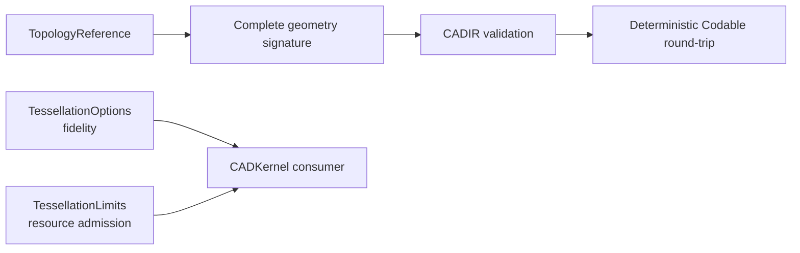

# CADIR

## Purpose and Scope

`CADIR` owns source/evaluation interchange values, topology references, and
complete geometry signatures. It is a child of the [Swift-CAD package
design](../../DESIGN.md) and has no children for this change.

## Responsibilities and Boundaries

This module owns the value contract for `StableSubshapeReference` and its
`SubshapeGeometrySignature`, including Codable validation. It also owns the
product-neutral value contracts for tessellation fidelity and generic
resource admission: `TessellationOptions` and `TessellationLimits`. It does
not discover topology, evaluate a document, generate primitives, or choose
Rupa measurement methods or presentation LOD.

`TessellationLimits` is implemented in `TessellationLimits.swift`. `CADKernel`
charges an invocation against the supplied limits; this module owns only the
value contract and the package-versioned constants.

## Related Designs

| Design | Relationship | Contract Used | Summary | Cautions |
|---|---|---|---|---|
| [Swift-CAD package](../../DESIGN.md) | parent | stable topology contract | Defines complete signature retention. | A signature is not a live topology authority. |
| [CADGeometry](../CADGeometry/DESIGN.md) | depends on | analytic curve/surface validation | Validates pcurves and surfaces. | Preserve structural rejection rules. |
| [CADKernel](../CADKernel/DESIGN.md) | used by | snapshot signature construction | Supplies exact signatures for current subshapes. | No partial or Mesh-derived signatures. |

## Architecture

## Contracts and Invariants

1. A stable signature retains body, shell, face, loop, coedge, edge, vertex,
   surface, curve, trim, orientation, and pcurve data required for comparison.
2. Validation rejects invalid IDs, empty required collections, malformed
   geometry, nonfinite values, degenerate trims, and wrong-surface pcurves.
3. Encoding validates before writing; decoding validates after reading. A
   successful JSON round-trip preserves the complete signature, not merely its
   topology kind or identity.
4. `TessellationOptions` contains only geometric fidelity inputs and remains
   the identity of the requested sampling profile. It is not a viewport or
   Product policy.
5. `TessellationLimits` contains only generic checked ceilings for cumulative
   vertices, indices, triangles, and estimated bytes for one complete
   tessellation invocation. It validates positive, representable limits but
   does not select values or estimate CAD-specific geometry. The ceilings are
   `Int`, so a nonfinite or unrepresentable limit cannot be expressed.
6. A caller may lower `TessellationLimits.hardCeiling` but never widen it.
   `validate()` rejects any dimension that is not positive or that exceeds the
   hard ceiling, and `lowered(to:)` is the only composition offered, so no
   consumer can raise the package maximum by constructing its own limits.
7. The hard ceiling and default limit values are selected from the measured
   Swift-CAD fixtures recorded below and versioned by the package; this module
   does not choose product-specific requested values or embed guessed values to
   make a particular Rupa scene pass.
8. `TessellationUsage` is the resource account of one materialized `Mesh`. It
   is derived from the artifact by `init(mesh:)` — never declared independently
   by a producer — and `validate()` rejects a value no invocation could have
   produced. `firstResourceExceeding(_:)` names the first dimension a usage
   outgrows, so a request states its ceiling and the usage answers it.
   The in-flight budget is not a second artifact contract: `CADKernel` charges
   each actual vertex/index growth immediately before the corresponding output
   append. An evaluator may reserve this usage for retained meshes when it asks
   for incremental tessellation; the production tessellator seeds its checked
   budget with that reservation. A normal-consistency fallback that duplicates
   three corners is charged as three vertices and their bytes before those
   corners are appended.
9. A `MeshCache` entry is scoped to the artifact configuration it records.
   Reuse requires the source fingerprint, the design and parameter revisions,
   the kernel version, the modeling tolerance, the complete
   `TessellationOptions`, and the `MeshArtifactPurpose` all to match the
   request, and requires the recorded usage both to describe the stored mesh
   and to fit the requested `TessellationLimits`. A mismatched purpose is
   `meshCachePurposeMismatch`, a usage above the requested ceiling is
   `meshCacheExceedsLimits`, and every other disagreement is `staleMeshCache`
   with the reason. An artifact is therefore never shared across consumers that
   happen to agree on fidelity, and a narrow request never inherits a wider
   ceiling through the cache. The cache contract is checked by the evaluator
   only for bodies it is actually reusing; exact B-rep state can remain reusable
   while a mesh artifact is refused. `DocumentCaches.validateFreshness` remains
   a standalone artifact-table validator and reports a purpose mismatch; an
   evaluator receiving that artifact as a reuse hint may instead discard the
   mesh and regenerate it for the requested purpose.
10. `MeshArtifactPurpose` is the kernel artifact authority. CADIR does not
    define or infer a Rupa representation purpose, and no consumer may relabel a
    cached kernel artifact to satisfy a different purpose. Rupa may deliberately
    use the same kernel `.unspecified` purpose for its unspecified representation,
    but that is an adapter decision outside this module.
11. `BRepCache` records no tessellation input, so exact B-rep reuse is
    independent of tessellation fidelity: the same document evaluated at two
    fidelities yields the same cached model, fingerprint, and revisions while
    yielding different meshes.
12. Caches are in-memory evaluation state. `CADExchange` writes the source
    document, never `DocumentCaches`, so the `Codable` conformance carries no
    on-disk format and adding a recorded field needs no migration.

### Measured Source of the Limit Constants

Measured on Mac16,6 (36 GB) at `TessellationOptions.standard`
(`angularTolerance` 1.0e-3), evaluating each fixture in its own process:

| Fixture | Bodies | Faces | Vertices | Indices | Triangles | Mesh bytes | Peak RSS |
|---|---:|---:|---:|---:|---:|---:|---:|
| box 2x3x4 | 1 | 6 | 24 | 36 | 12 | 1,296 | 13.4 MB |
| cylinder r=0.001 h=3 | 1 | 6 | 25,130 | 75,360 | 25,120 | 1,507,680 | 19.5 MB |
| cylinder r=1.25 h=3 | 1 | 6 | 25,146 | 75,408 | 25,136 | 1,508,640 | 18.8 MB |
| cylinder r=100 h=3 | 1 | 6 | 25,146 | 75,408 | 25,136 | 1,508,640 | 18.8 MB |
| cone r=1.5 h=3 | 1 | 5 | 12,581 | 37,728 | 12,576 | 754,800 | 16.7 MB |
| sphere r=2 | 1 | 8 | 37,712 | 113,112 | 37,704 | 2,262,624 | 21.4 MB |
| 12 boxes | 12 | 72 | 288 | 432 | 144 | 15,552 | 16.3 MB |
| 12 cylinders r≈0.03 | 12 | 72 | 301,752 | 904,896 | 301,632 | 18,103,680 | 45.5 MB |

Torus R=4 r=1 across angular tolerances, which isolates the quadratic growth of
a rectangular parametric grid face:

| Angular tolerance | Vertices | Indices | Triangles | Mesh bytes | Peak RSS |
|---:|---:|---:|---:|---:|---:|
| 5.0e-2 | 17,424 | 98,304 | 32,768 | 1,229,568 | 18.0 MB |
| 2.5e-2 | 65,536 | 381,024 | 127,008 | 4,669,824 | 33.2 MB |
| 1.25e-2 | 258,064 | 1,524,096 | 508,032 | 18,483,456 | 82.2 MB |
| 6.25e-3 | 1,024,144 | 6,096,384 | 2,032,128 | 73,544,448 | 290.0 MB |
| 3.125e-3 | 4,064,256 | 24,288,864 | 8,096,288 | 292,239,744 | 1,063.9 MB |

Two properties follow from the measurements and set the constants. Successive
tolerance halvings multiply the emission by 3.76, 3.94, 3.97, and 3.97,
converging on 4.00, so a rectangular grid face grows quadratically and the same
torus at `TessellationOptions.standard` projects to roughly 39.5 M vertices and
2.85 GB of mesh storage, which the reference machine cannot hold. The measured
peak-resident-to-mesh-byte ratio is 3.6x to 4.5x.

`hardCeiling` admits the largest invocation that completed on the reference
machine and bounds peak growth near 1.7 GB through the measured ratio.
`standard` admits the largest realistic measured model, the twelve-cylinder
assembly at 18.10 MB, with 7.4x byte headroom; it admits the torus at 6.25e-3
and refuses it at 3.125e-3.

## Runtime Flows

`CADKernel` constructs the signature from one immutable model, and this module
validates and encodes it. Resolution back to a live topology is owned by
`CADKernel`/`CADModeling`.

## State, Ownership, and Lifecycle

Signature values own copied/value geometry and have no lifetime dependency on
the evaluated document after construction.

## Failure, Concurrency, and Constraints

Validation is pure and deterministic. Codable failures propagate typed
validation errors; no empty signature or dropped topology entry is returned as
success. Tessellation limit validation is likewise pure; exhaustion and
overflow are reported by `CADKernel`, which owns geometry-aware preflight and
all-or-nothing emission.

## Verification and Change Impact

Tests cover all generated sphere subshape signatures, JSON round-trip, invalid
and out-of-domain signatures, and representative planar/cylindrical topology.
`TessellationLimitsTests` covers non-positive limits on every dimension, limits
that widen the hard ceiling, the largest representable limit, lowering, and the
package constants, without coupling the values to viewport policy.
`CADKernelTests/MeshCacheScopeTests` owns the cache-boundary contract, covering
a matching request, a mismatched purpose, a mismatched fidelity, a usage that
does not describe its artifact, a usage above the requested limits, and B-rep
reuse across two fidelities. Changes
require rechecking `CADKernel` stable-reference creation, lookup, and
tessellation admission, and re-measuring the fixtures above whenever the
constants move.
