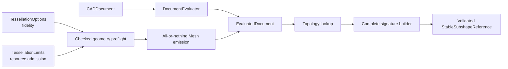

# CADKernel

## Purpose and Scope

`CADKernel` owns deterministic document evaluation, immutable evaluated
snapshots, topology lookup, and derived Mesh orchestration. It is a child of
the [Swift-CAD package design](../../DESIGN.md) and has no children for this
change.

## Responsibilities and Boundaries

The module owns deterministic document evaluation, including geometry-aware
tessellation preflight and emission, alongside the snapshot-scoped
implementation of `EvaluatedDocument.stableSubshapeReference(for:)` and
topology resolution from `StableSubshapeReference`. It does not define
analytic geometry, construct primitive topology, serialize signature values,
or publish Rupa project state. Tessellation consumes the generic
`TessellationOptions` and `TessellationLimits` values from `CADIR`; it does not
interpret viewport, camera, UI, Agent, or Product LOD policy.

## Related Designs

| Design | Relationship | Contract Used | Summary | Cautions |
|---|---|---|---|---|
| [Swift-CAD package](../../DESIGN.md) | parent | immutable exact evaluation | Defines kernel composition and Mesh separation. | Do not re-evaluate during a read. |
| [CADIR](../CADIR/DESIGN.md) | depends on | complete stable signature value | Provides validated reference values. | Every topology entry is eligible for a reference. |
| [CADModeling](../CADModeling/DESIGN.md) | depends on | exact generated B-rep | Supplies source topology and lineage. | Seam/pole topology remains present. |
| [RupaCore](../../../RupaKit/Sources/RupaCore/DESIGN.md) | used by | evaluated body and Mesh measurements | Consumes the same snapshot outputs. | Volume authority stays in exact B-rep. |

## Architecture

## Contracts and Invariants

1. Stable-reference creation uses the current immutable `EvaluatedDocument` and
   its topology map, lineage, and tolerance. It creates one complete signature
   and validates it before returning.
2. Faces, edges, vertices, bodies, periodic seams, and pole endpoints are not
   omitted or replaced with identity-only placeholders.
3. Topology resolution verifies the retained signature against the target
   model and returns typed failure for stale, missing, or mismatched topology.
4. Evaluation is reused for all reads in one operation; stable-reference
   creation never creates a second project/evaluation authority.
5. `MeshTessellator` performs a conservative checked geometry-aware estimate
   before reserving output storage. Cumulative vertex, index, triangle, and
   estimated byte limits are charged across the entire tessellation invocation,
   not only one face. Emission also charges actual usage before each output
   growth. Overflow and limit excess therefore fail before the allocation or
   growth they would exceed.
6. Preflight and emission check cooperative cancellation at document, body,
   and face boundaries. Emission is all-or-nothing: a failed or cancelled
   invocation returns no Mesh map and cannot publish a partial evaluated
   document.
7. Exact B-rep incremental reuse is independent of tessellation fidelity. The
   exact evaluator reuses only compatible source/evaluator/modeling state;
   Mesh reuse additionally requires matching source fingerprint and full Mesh
   artifact configuration, including `TessellationOptions` and the requesting
   `MeshArtifactPurpose`, with recorded usage admitted by the current
   `TessellationLimits`. `DocumentEvaluationConfiguration` carries the purpose
   and the limits into every `MeshCache` the evaluator materializes, and
   `EvaluatedDocument.validate()` reads the purpose back from the cache so a
   purpose-scoped evaluation is not rejected by its own consistency check.
   `CADIR` owns the resulting cache-boundary contract; see
   `Sources/CADIR/DESIGN.md`.

### Implemented Admission Mechanism

Limits reach the tessellator through `MeshTessellator.init(tolerance:limits:)`,
defaulting to `TessellationLimits.standard`, and through
`DocumentEvaluator.init(tessellationLimits:)`, which configures only the
tessellator the evaluator constructs; an injected `Tessellating` owns whichever
limits it was built with. `TessellationBudget` charges an invocation and
rejects a charge on the first dimension it would exceed, leaving every counter
unchanged so a refused charge cannot partially advance the budget.

The conservative per-face estimate is exact for a rectangular parametric grid
face, which emits `(u + 1)(v + 1)` vertices and `6uv` indices for the step
counts `parametricGridStepCounts` returns. A boundary-driven face — planar,
planar with holes, or trimmed parametric — with `n` sampled boundary points and
`h` holes emits at most `n + 2h + 1` vertices and `3(n + 2h)` indices, because
bridging a hole into the outer loop duplicates at most two boundary points and a
fan triangulation adds at most one interior point.

Preflight reserves no output storage, but it is not allocation-free: it samples
each boundary loop to obtain `n`, so a boundary-driven face is sampled once for
admission and once for emission. The admitted estimate bounds the *geometric*
emission, and emission revalidates against it after every face rather than
trusting it.

The estimate does not model winding repair. When a triangle's vertex normals
disagree with its face normal, `appendTriangleWithNormalFallback` gives that
triangle its own flat-shaded corners, adding three vertices — and no indices —
beyond the geometry the estimate describes. The tessellator reports those
corners per face, `TessellationBudget.charge(vertices:indices:duplicatedVertices:)`
charges them against the limits like any other vertex, and
`validateEmission(against:)` excludes them from the comparison. Storage is
therefore bounded by the limits on every path, while the preflight is still
held to the geometry it claims to estimate: an estimate wrong about the
geometry is rejected, an estimate silent about winding repair is not.

Cancellation is observed through `Task.checkCancellation()`, so a synchronous
caller outside a task is unaffected and a cancelled task fails with
`CancellationError` before the next unit of work.

Two transients are deliberately outside the charged budget. `compactedMesh`
allocates one remapping table and the compacted attribute arrays for a body that
has already been admitted and emitted, and `DocumentCacheValidation` and
`EvaluatedDocumentValidation` re-tessellate to compare against the cache.
`DocumentCacheValidation.validateFreshness(limits:)` re-tessellates under the
limits its caller passes, and `EvaluatedDocument.validate(limits:)` defaults to
`TessellationLimits.hardCeiling` because a document admitted under a wider
ceiling than the caller's own must not be rejected by its own consistency check.
Neither can exceed the package ceiling; the charged ceilings therefore bound
emitted mesh size, not peak process memory. The measured peak-to-mesh ratio of 3.6x to 4.5x
recorded in `Sources/CADIR/DESIGN.md` is the basis on which
`TessellationLimits.hardCeiling` accounts for these transients.

## Runtime Flows

An immutable snapshot is evaluated once, topology entries are enumerated, each
signature is built and validated, and callers receive either the complete
reference or the exact typed failure. For a materialized Mesh artifact, the
kernel first derives conservative checked per-face/body counts and byte usage,
reserves only after aggregate admission succeeds, then charges each actual
growth while emitting and validating all bodies.
Cancellation or any face/body failure abandons the local result before the
caller can observe it.

## State, Ownership, and Lifecycle

The evaluator owns the immutable snapshot during its read. Signature values
outlive the read only as detached value data. No mutable project or source
document is retained by the reference.

## Failure, Concurrency, and Constraints

Missing topology, missing pcurves, invalid signatures, stale resolution,
overflow, limit exhaustion, and cancellation throw typed kernel errors or the
standard cancellation error. Reads do not mutate the source or invoke external
callbacks. The supplied snapshot is the sole read authority. Preflight owns no
UI scheduling and performs no retry; a caller that needs another fidelity
profile must submit a new explicit evaluation request.

## Verification and Change Impact

Kernel tests must exercise every sphere body/face/edge/vertex stable-reference
path, deterministic JSON round-trip, invalid signature rejection, and planar or
cylindrical regression. `TessellationBudgetTests` proves the checked preflight
rejects out-of-range and cumulative charges before allocation, that limits set
to a model's exact emission are still refused because admission charges the
conservative estimate first, that a refused charge leaves the budget unchanged,
that emission beyond the admitted estimate is rejected, that cancellation is
observed both before an invocation starts and at an interior checkpoint once it
has started, and that the exact B-rep tessellates to identical meshes after a
refusal. Per-checkpoint attribution between the body and face boundaries is not
separately observable through the public API; the interior-checkpoint test uses
a fixture whose tessellation is an order of magnitude longer than the delay
before cancellation. Mesh artifact reuse is separated from exact incremental
reuse by the cache tests.
Changes require rechecking primitive evaluation, tessellation configuration
identity, and RupaCore snapshot measurement.
