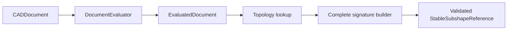

# CADKernel

## Purpose and Scope

`CADKernel` owns deterministic document evaluation, immutable evaluated
snapshots, topology lookup, and derived Mesh orchestration. It is a child of
the [Swift-CAD package design](../../DESIGN.md) and has no children for this
change.

## Responsibilities and Boundaries

The module owns the snapshot-scoped implementation of
`EvaluatedDocument.stableSubshapeReference(for:)` and topology resolution from
`StableSubshapeReference`. It does not define analytic geometry, construct
primitive topology, serialize signature values, or publish Rupa project state.

## Related Designs

| Design | Relationship | Contract Used | Summary | Cautions |
|---|---|---|---|---|
| [Swift-CAD package](../../DESIGN.md) | parent | immutable exact evaluation | Defines kernel composition and Mesh separation. | Do not re-evaluate during a read. |
| [CADIR](../CADIR/DESIGN.md) | depends on | complete stable signature value | Provides validated reference values. | Every topology entry is eligible for a reference. |
| [CADModeling](../CADModeling/DESIGN.md) | depends on | exact generated B-rep | Supplies source topology and lineage. | Seam/pole topology remains present. |
| [RupaCore](../../../RupaKit/Sources/RupaCore/DESIGN.md) | used by | evaluated body and Mesh measurements | Consumes the same snapshot outputs. | Volume authority stays in exact B-rep. |

## Architecture

## Contracts and Invariants

1. Stable-reference creation uses the current immutable `EvaluatedDocument` and
   its topology map, lineage, and tolerance. It creates one complete signature
   and validates it before returning.
2. Faces, edges, vertices, bodies, periodic seams, and pole endpoints are not
   omitted or replaced with identity-only placeholders.
3. Topology resolution verifies the retained signature against the target
   model and returns typed failure for stale, missing, or mismatched topology.
4. Evaluation is reused for all reads in one operation; stable-reference
   creation never creates a second project/evaluation authority.

## Runtime Flows

An immutable snapshot is evaluated once, topology entries are enumerated, each
signature is built and validated, and callers receive either the complete
reference or the exact typed failure.

## State, Ownership, and Lifecycle

The evaluator owns the immutable snapshot during its read. Signature values
outlive the read only as detached value data. No mutable project or source
document is retained by the reference.

## Failure, Concurrency, and Constraints

Missing topology, missing pcurves, invalid signatures, and stale resolution
throw typed kernel errors. Reads do not mutate the source or invoke external
callbacks. The supplied snapshot is the sole read authority.

## Verification and Change Impact

Kernel tests must exercise every sphere body/face/edge/vertex stable-reference
path, deterministic JSON round-trip, invalid signature rejection, and planar or
cylindrical regression. Changes require rechecking primitive evaluation and
RupaCore snapshot measurement.
