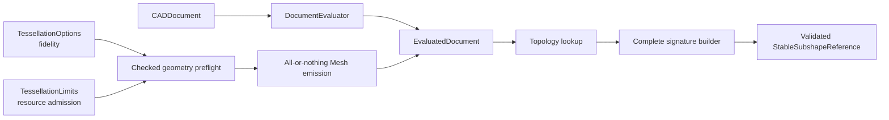

# CADKernel

## Purpose and Scope

`CADKernel` owns deterministic document evaluation, immutable evaluated
snapshots, topology lookup, and derived Mesh orchestration. It is a child of
the [Swift-CAD package design](../../DESIGN.md) and has no children for this
change.

## Responsibilities and Boundaries

The module owns deterministic document evaluation, including geometry-aware
tessellation preflight and emission, alongside the snapshot-scoped
implementation of `EvaluatedDocument.stableSubshapeReference(for:)` and
topology resolution from `StableSubshapeReference`. It does not define
analytic geometry, construct primitive topology, serialize signature values,
or publish Rupa project state. Tessellation consumes the generic
`TessellationOptions` and `TessellationLimits` values from `CADIR`; it does not
interpret viewport, camera, UI, Agent, or Product LOD policy.

`SweepEvaluationPlanService.orderedPathSegments` exposes the existing section-
anchored path ordering for read-only consumers. The supplied evaluated document
must match the supplied source document; this method performs no evaluation.
It uses the same section resolver, exact section plane and open-chain builder
as sweep planning. Missing sources, closed/disconnected paths and unsupported
section planes remain typed failures. Placement measurements consume these
oriented segments so fractional lengths follow the constructed end of a sweep.
Core's placed sweep tests own the cross-package ordering/measurement check.

`SketchCurveIntersector` is the public sketch curve intersection. It converts
each `SketchCurveGeometry2D` (line, circle, arc, cubic Bezier chain) to its exact
rational B-spline, intersects the pair with the certified two-dimensional curve
intersector and reports every root once with both curves' natural parameters:
the line fraction, the polar angle, or the chain parameter profile extraction
uses. Each root is refined by Newton steps confined to its certified enclosure,
which holds exactly one root; a step leaving it or a singular (tangent) Jacobian
keeps the certified midpoint. The second curve may reach its unbounded line or
full circle; a chain has no extension and is refused as an unsupported
capability. A root the proof budget (depth 32, 16,384 cells) cannot certify, such
as an inexact tangency or an overlap, is a typed `resourceLimitExceeded`
failure, and invalid geometry is `invalidInput`. `SketchCurveIntersectorTests`
own the parameters, reach, dedup and failure contracts; RupaCore Cut Curve tests
own the command-level cuts.

`SketchCurveProjector` is the public nearest point on a sketch curve, reported in
the intersector's natural parameters so a caller converts a projection and an
intersection alike. A line projects in closed form clamped to its ends; a circle
along the ray from its center; an arc along that ray while it crosses the arc,
otherwise at its nearer end. Each span of a cubic Bezier chain starts from its
nearest of 65 samples and converges by clamped Newton steps on
(B(t) − p) · B′(t) = 0, and the nearest of the spans' feet and ends is reported.
Non-finite input, a line no longer than the modeling distance and a radius at or
below it are `invalidInput`. `SketchCurveProjectorTests` own the line, circle,
arc-end, chain-foot and failure cases; RupaCore Trim and Split Segment consume it.

`SketchSplineCurve` is a sketch spline's exact planar geometry for any degree and
knots ([Sketch spline form](../CADIR/DESIGN.md#sketch-spline-form)): its clamped
`BSplineCurve2D` and its Bezier segments with their parameter intervals, a chain
being its own segments and explicit knots being decomposed by inserting every
interior knot up to multiplicity `degree`. Everything that reads a spline other
than a cubic chain goes through it: `SketchCurveExtractor` and
`SketchProfileExtractor` build the evaluated curve and the profile B-spline on the
spline's own knots and flatten it with `SketchSplineTessellator` (de Casteljau
halving until each segment's interior points lie within the modeling distance of
its chord), while a cubic chain keeps `CubicBezierSplineTessellator` and so its
exact earlier samples. `SketchCurveGeometry2D.sketchSpline` carries it to the
projector and the intersector with the B-spline parameter as its natural
parameter. `SketchCurveSampler.splineSamples(for:)`, `splineSample(for:parameter:)` and
`splineSegmentSample(for:segmentIndex:t:)`
sample it with the parameter normalized over the knot domain, the convention a
cubic chain already uses, and `turnBoundedSplineSamples` halves every step whose
tangents turn by more than a bound, so a curvature comb follows a tight bend.
The solver reads spline ends through the clamped end derivatives and holds
`smoothSplineEndpoints` to equal curvature vectors (true G2; it held equal handle
lengths before). `SketchSplineFormTests`, `SketchSplineCurveTests` and
`SketchSplineConstraintSolverTests` own these.

`SketchSplineCurve.degreeElevated(tolerance:)` raises a sketch spline's degree by one
exactly: every Bezier segment is elevated (Qᵢ = i/(n+1)·Pᵢ₋₁ + (1 − i/(n+1))·Pᵢ) and
the segments are joined at their parameter breaks with knots of multiplicity n + 1,
so shape and parameter are unchanged and a former smooth knot becomes a joint.
`SketchSplineDegreeElevationTests` own it.

`CubicBezierChainJoints.mergedSpan(of:atJoint:)` says whether the two spans that
meet at a chain joint are the halves of one cubic, and returns it: halves of Q
split at t meet with collinear handles in the ratio t : 1 − t, so t is read from
the joint's handles, Q's inner points follow from the outer handles, and Q split
at t must give back all seven points within the modeling distance. Any other
joint (a kink, a bend, a zero handle) is nil; a chain without that joint or with
non-finite points is `invalidInput`. `CubicBezierChainJointsTests` own these;
RupaCore's Delete Redundant Topology consumes it.

`CubicBezierChainExtension.naturalSpan(of:at:length:)` is Extend Curve's Natural
shape on a chain: the end span's own cubic continued past the end as one new
span, whose control points are the blossom values f(1,1,1), f(1,1,s), f(1,s,s),
f(s,s,s) of the end span, with s solving ∫₁ˢ |B′(u)| du = length by Newton steps on
the arc length (composite five-point Gauss–Legendre). The start end is the same
on the reversed span. A degenerate end tangent, a length not above the modeling
distance, a malformed chain or a length not reached is `invalidInput`.
`naturalSpan(ofSegment:at:length:)` does the same for an end Bezier segment of any
degree n, its n new points the blossoms f(1…1, s…s), so a sketch spline of any
degree and knots is continued on its own polynomial.
`CubicBezierChainExtensionTests` check it against the known pieces of one cubic
and one quintic.

`CubicBezierChainOffset.offset(of:distance:)` offsets a chain to its left (the
tangent turned counterclockwise; a negative distance goes right) as a cubic chain
within the modeling distance: each span's offset O = B + d·N is fitted by cubic
Hermite pieces taking O and its exact derivative O′ = B′ + d·N′ at their ends, and
a piece whose eight interior samples stray further than the modeling distance is
halved. A fold (O′ turning against B′ where d·κ reaches 1), a span without a
tangent and a corner joint (whose offsets do not meet) without a gap fill are
`invalidInput`. With a gap fill (`offset(of:distance:gapFill:)`), spans whose
offsets meet form runs, and at each corner the two runs' offsets are intersected
by `SketchCurveIntersector`: where they cross both end at the crossing (the inside
of a turn), and where they part the `.round` fill is an arc about the corner at
the distance (cubic spans checked against the circle to the modeling distance)
and the `.linear` fill their end tangents continued until they meet (refused if
parallel or meeting behind). A closed chain stays closed; a closed chain of one
run joins its seam by intersecting its last third with its first third.
`offset(of: SketchSplineCurve, distance:gapFill:)` offsets a sketch spline of any
degree and knots the same way over its own Bezier segments (B, B′ and B″ by de
Casteljau on the points and their differences), so a spline is never offset as
the cubic chain its control points would make; the result is still a cubic chain.
`CubicBezierChainOffsetTests` and `CubicBezierChainOffsetGapFillTests` own these;
RupaCore's Offset Planar Curve on splines consumes the spline form.

`SurfaceQueryEvaluator.outwardFrame` returns a face point (the nearest point to
a query, or the point at a surface parameter) with the face's outward normal:
the surface normal oriented by the face's sense in its shell. Face orientation
is owned here; applications ask instead of reading `Face.orientation`.
`SurfaceOutwardFrameTests` prove every box face points out of the body.

## Related Designs

| Design | Relationship | Contract Used | Summary | Cautions |
|---|---|---|---|---|
| [Swift-CAD package](../../DESIGN.md) | parent | immutable exact evaluation | Defines kernel composition and Mesh separation. | Do not re-evaluate during a read. |
| [CADIR](../CADIR/DESIGN.md) | depends on | complete stable signature value | Provides validated reference values. | Every topology entry is eligible for a reference. |
| [CADModeling](../CADModeling/DESIGN.md) | depends on | exact generated B-rep | Supplies source topology and lineage. | Seam/pole topology remains present. |
| [RupaCore](../../../RupaKit/Sources/RupaCore/DESIGN.md) | used by | evaluated body and Mesh measurements; edge queries; sketch curve intersections | Consumes the same snapshot outputs and certified sketch intersections. | Volume authority stays in exact B-rep; Core computes no intersection itself. |

## Architecture

## Contracts and Invariants

Certified straight twist preflight and evaluation use the same
[CertifiedTwist admission](../CADModeling/CertifiedTwist/DESIGN.md). Exact BRep
validation certifies the represented spline topology, not zero deviation from
the ideal rotation law; that deviation has a separate operation allowance.

Per-feature tessellation overrides use live body subshape ownership, never derived
topology IDs. They change only mesh generation. The complete option set participates
in cache identity; tessellation reserves prior bodies' usage before the next body.
Tests must show changed subdivision with identical exact geometry, independent
body quality, and cumulative resource refusal.

1. Stable-reference creation uses the current immutable `EvaluatedDocument` and
   its topology map, lineage, and tolerance. It creates one complete signature
   and validates it before returning.
2. Faces, edges, vertices, bodies, periodic seams, and pole endpoints are not
   omitted or replaced with identity-only placeholders.
3. Topology resolution verifies the retained signature against the target
   model and returns typed failure for stale, missing, or mismatched topology.
4. Evaluation is reused for all reads in one operation; stable-reference
   creation never creates a second project/evaluation authority.
5. `MeshTessellator` performs a conservative checked geometry-aware estimate
   before reserving output storage. Cumulative vertex, index, triangle, and
   estimated byte limits are charged across the entire tessellation invocation,
   not only one face. Emission also charges actual usage before each output
   growth. Overflow and limit excess therefore fail before the allocation or
   growth they would exceed.
6. Preflight and emission check cooperative cancellation at document, body,
   face, and bounded inner-loop checkpoints. Emission is all-or-nothing: a
   failed or cancelled invocation returns no Mesh map and cannot publish a
   partial evaluated document.
7. Exact B-rep incremental reuse is independent of tessellation fidelity and
   mesh artifact purpose. The exact evaluator reuses only compatible
   source/evaluator/modeling state. Mesh reuse is a separate admission step for
   each unchanged body: its cache metadata, complete fidelity configuration,
   purpose, recorded usage, and current limits must be accepted before the mesh
   enters the new result. A purpose or fidelity mismatch in `evaluate(reusing:)`
   is a cache miss, never an evaluation failure: the exact B-rep remains
   reusable, but that body is re-tessellated under the requested purpose and
   fidelity. The old artifact is never relabeled. Because a `MeshCache` records
   the whole `TessellationOptions` it was produced under, including its
   per-feature overrides, changing the fidelity of one feature re-tessellates
   every body while rebuilding no feature. A compatible
   artifact whose usage exceeds current limits is a typed
   `TessellationError.resourceExhausted`, matching fresh tessellation. The
   standalone `DocumentCaches.validateFreshness` contract retains typed purpose
   mismatch refusal for callers validating an artifact table directly.
   `DocumentEvaluationConfiguration` carries purpose and limits into every
   newly materialized `MeshCache`. `CADIR` owns the cache-boundary value
   contract; see `Sources/CADIR/DESIGN.md`.

8. An `ImportedBRepFeature` retains its exchange IDs as source data, but the
   evaluator re-identifies every body, shell, face, loop, edge, vertex, curve,
   and surface with the importing feature's deterministic topology namespace
   before it enters the document B-rep. The remapped model is merged with the
   evaluation context using the same duplicate-rejecting combiner as primitive
   features. This preserves existing independent bodies in both incremental
   and non-incremental evaluation, permits the same exact source to be
   imported more than once, and keeps re-evaluation IDs stable for cache and
   delta reuse.
9. `MeshTessellator` records the generating face of every triangle it emits in
   `Mesh.faceRuns`. A run is appended for each face that emitted at least one
   triangle, in the body's `shellIDs` then `faceIDs` traversal order, so the
   runs partition the emitted triangles in emission order. Index compaction
   preserves triangle count and order, so it carries the runs unchanged. A
   body extracted for incremental re-tessellation copies its shells verbatim,
   so a reused mesh and a freshly tessellated one record the same runs and stay
   equal. `CADIR` owns the run value contract; see `Sources/CADIR/DESIGN.md`.

### Implemented Admission Mechanism

Sewing connectivity compares endpoint-slot pairs before loading full edge uses.
The request-local slot table owns points; curve and pcurve values are read only
for endpoint-compatible candidates. Pair ordering, endpoint tolerance, exact
curve-span proof and union ordering remain unchanged. Storage is O(n) and the
pair scan remains O(n²); this removes repeated large-value copies, not the
quadratic search. Existing sewing success/refusal tests and the complete gear
path verify the change; phase timing separates sewing/evaluation from meshing.

Planar boundary simplification retains an invocation-local circular index list.
Removing a point invalidates only its two neighbors' chord checks; traversal
returns to the previous neighbor instead of restarting at the loop origin.
Every replacement chord still checks all covered original samples against the
same deviation allowance. Storage is O(n); this removes index-array shifts
and unconditional prefix rescans, but does not claim linear runtime for
covered-sample checks. Cancellation is checked
at candidate and bounded covered-sample checkpoints. The complete 32-tooth
involute double-helical kernel test exercises this path without loosening
geometry or tessellation tolerances.

For nonperiodic surfaces, a four-edge parameter rectangle made of constant-U/V
curves has its extrema at the eight edge endpoints. Rectangle bounds evaluate
those endpoints directly, without tessellating spatial boundary curves. Periodic
surfaces retain sampled unwrapping; this optimization must not alter seam choice
or interpret a full-period edge as a zero-length interval.

Ear clipping resumes at the removed ear's previous neighbor rather than the
first polygon vertex. Every candidate still checks all surviving points using
the original geometric predicates; a full unsuccessful cycle remains a typed
failure. Each clipping iteration checks cancellation.

Ear containment uses robust orientation signs with zero determinant tolerance:
topological membership must not expand the triangle by a modeling-distance
band, which can reject every ear of a finely sampled concave boundary.
Exact boundary points still block an ear; indeterminate arithmetic throws
instead of accepting a triangle. Geometric degeneracy gates remain separate.
The exact coordinate bounding box rejects points before robust orientation
evaluation. Its bounds use only min/max of the same stored triangle vertices,
so it cannot discard an interior or boundary point and needs no tolerance.

Before each ear is sought, the tip of a spike leaves the polygon without a
triangle: the boundary doubles back there along a sliver narrower than the
modeling resolution, its turn lies within the same gate ear adoption and
`appendTriangle` apply, and removing it changes the polygon by less than the
resolution. Exact containment can accept an ear whose edge passes a vertex by a
rounding residue (an arc-line intersection a few ulps off the line), leaving
such a spike; kept, it ended among the last three vertices as a triangle the
adoption gate refused, failing the face. A vertex the boundary passes straight
through stays, because triangles already clipped may use it and removing it
would leave a T-junction. The same residue can leave the last three vertices
without area at the resolution, in the plane or on the surface; that sliver is
not emitted, and a face whose every triangle is such a sliver still fails. The
cylindrical union tests exercise the spike, the concave extrude test the
pass-through, and Rupa's trimmed-sheet automation test the last sliver.

Limits reach the tessellator through `MeshTessellator.init(tolerance:limits:)`,
defaulting to `TessellationLimits.standard`, and through
`DocumentEvaluator.init(tessellationLimits:)`, which configures only the
tessellator the evaluator constructs; an injected `Tessellating` owns whichever
initializer limits it was built with. `Tessellating` retains its existing
requirements and adds a request overload carrying `limits` and `reserving`.
The default overload validates that request and dispatches to the existing
requirement, preserving source compatibility for legacy conformers. The
production `MeshTessellator` lowers its initializer ceiling with the request
ceiling and seeds both preflight and emission budgets with the reserved usage.
`TessellationBudget` charges an invocation and rejects a charge on the first
dimension it would exceed, leaving every counter unchanged so a refused charge
cannot partially advance the budget.

The conservative per-face estimate is exact for a rectangular parametric grid
face, which emits `(u + 1)(v + 1)` vertices and `6uv` indices for the step
counts `parametricGridStepCounts` returns. A boundary-driven face — planar,
planar with holes, or trimmed parametric — with `n` sampled boundary points and
`h` holes emits at most `n + 2h + 1` vertices and `3(n + 2h)` indices, because
bridging a hole into the outer loop duplicates at most two boundary points and a
fan triangulation adds at most one interior point.

Convex trimmed spherical patches instead interpolate radial rings from a physical
interior point to the unchanged sampled boundary. Their center is computed in
physical space, not by averaging longitude across a pole or seam. With `k` radial
steps and `n` boundary samples, admission reserves `nk + 1` vertices and
`3n(2k - 1)` indices. Step count follows angular, chord and maximum-edge options.
The exact surface, boundary samples and face-run identity remain unchanged.
Rounded-box tests check spherical triangle interior error and radial normals,
not only triangle counts; native rendering checks the mounted output.

Preflight reserves no output storage, but it is not allocation-free. Planar
boundary samples are retained only after their face passes cumulative admission
and are passed unchanged to emission. This request-local preparation is bounded
by the admitted vertex count (one Point3D per sampled boundary vertex, plus loop
and face container overhead), and is released with the invocation on success,
failure or cancellation. It is not a persistent geometry cache. Nonplanar
sampling retains its existing path. The admitted estimate bounds the *geometric*
emission, and emission revalidates against it after every face rather than
trusting it.

The estimate does not model winding repair. When a triangle's vertex normals
disagree with its face normal, `appendTriangleWithNormalFallback` gives that
triangle its own flat-shaded corners, adding three vertices — and no indices —
beyond the geometry the estimate describes. The tessellator charges each
actual vertex/index growth immediately before the corresponding append, so the
fallback's three vertices and their bytes are refused before storage can grow.
`validateEmission(against:)` still excludes those duplicates from the geometric
estimate comparison. Storage is therefore bounded by the limits on every path,
while the preflight is still held to the geometry it claims to estimate: an
estimate wrong about the geometry is rejected, and an estimate silent about
winding repair cannot bypass the checked output budget.

Cancellation is observed through `Task.checkCancellation()` at document/body/
face boundaries and inside bounded grid, triangle, and sampled-output loops, so
a synchronous caller outside a task is unaffected and a cancelled task fails
with `CancellationError` before the next bounded unit of work.

Besides the bounded planar preparation above, two transients remain outside the charged budget. `compactedMesh`
allocates one remapping table and the compacted attribute arrays for a body that
has already been admitted and emitted, and `DocumentCacheValidation` and
`EvaluatedDocumentValidation` re-tessellate to compare against the cache.
`DocumentCacheValidation.validateFreshness(limits:)` re-tessellates under the
limits its caller passes, and `EvaluatedDocument.validate(limits:)` defaults to
`TessellationLimits.hardCeiling` because a document admitted under a wider
ceiling than the caller's own must not be rejected by its own consistency check.
Neither can exceed the package ceiling; the charged ceilings therefore bound
emitted mesh size, not peak process memory. The measured peak-to-mesh ratio of 3.6x to 4.5x
recorded in `Sources/CADIR/DESIGN.md` is the basis on which
`TessellationLimits.hardCeiling` accounts for these transients.

When an evaluator reuses prior meshes, `makeMeshes` computes the checked
aggregate usage of meshes that remain retained and passes it as `reserving` to
the changed-body request. The production tessellator rejects any fresh
preflight or append that would exceed the remaining allowance. A legacy or
injected `Tessellating` may use the default compatibility overload and cannot
enforce that allowance before its own allocation, so `makeMeshes` still charges
the complete final mesh set at the publication boundary. This aggregate guard
covers reused-only, reused-plus-fresh, and injected-provider output; failure
discards the local result and publishes no evaluated document.

### Tessellation Fidelity

A refining path meets every bound of `TessellationOptions` together: the chord
bound (`linearTolerance`, the distance from a segment or facet to the exact
geometry), the turning bound (`angularTolerance`, how far the exact tangent or
normal turns across it) and `maxEdgeLength`. No path relies on a fine turning
bound to deliver the chord bound: a circle of radius `r` split into steps of
angle φ deviates by `r(1 − cos(φ/2))`, which grows with `r`, so circular
sampling takes the larger of the turning count and the chord count.

| Path | Chord | Turning | Edge length |
|---|---|---|---|
| Circle, arc and ellipse edges (`CircularCurveSamplingPolicy`; an ellipse by its major radius) | enforced | enforced | — |
| Cylinder and cone grids (curved along `u` at the largest radius; straight along `v`) | enforced | enforced | enforced |
| Sphere and torus grids (curved along both directions) | each direction takes half | each direction takes half | enforced |
| Offset, ruled and rolling-ball grids | certified combined bound | certified combined bound | enforced |
| Bounded curves (B-spline, lifts, intersections, conics) | certified | certified | enforced |
| Planar faces | boundary simplified within the bound | flat | — |
| Convex trimmed spherical patches | radial rings | radial rings | enforced |
| Other trimmed parametric faces | boundary only | boundary only | boundary only |
| Rectangular B-spline grids | not refined | not refined | step count only |

A facet spanning two curved directions accumulates both: its sagitta adds the
two directions' `a²/8ρ` terms and its normal turns by at most the sum of the two
turns, so a sphere or torus grid gives each direction half of each budget and
the facet meets the whole. Adjacent faces may sample a shared edge differently;
each stays within the chord bound of the exact edge, so a gap between them is at
most twice the bound. The last two rows do not refine the interior of the face,
and their branches carry `FIXME(INCOMPLETE_IMPLEMENTATION)`; they are not
covered by the fidelity contract until they refine against all three bounds.
`TessellationFidelityTests` prove the chord bound on large circles and on
doubly curved grids, and `TessellationStandardFeasibilityTests` prove that
`TessellationOptions.standard` admits the assembly its selection rule names.

## Runtime Flows

An immutable snapshot is evaluated once, topology entries are enumerated, each
signature is built and validated, and callers receive either the complete
reference or the exact typed failure. For a materialized Mesh artifact, the
kernel first derives conservative checked per-face/body counts and byte usage,
reserves only after aggregate admission succeeds, then charges each actual
growth while emitting and validating all bodies.
Cancellation or any face/body failure abandons the local result before the
caller can observe it.

## State, Ownership, and Lifecycle

The evaluator owns the immutable snapshot during its read. Signature values
outlive the read only as detached value data. No mutable project or source
document is retained by the reference.

## Failure, Concurrency, and Constraints

Missing topology, missing pcurves, invalid signatures, stale resolution,
overflow, limit exhaustion, and cancellation throw typed kernel errors or the
standard cancellation error. Reads do not mutate the source or invoke external
callbacks. The supplied snapshot is the sole read authority. Preflight owns no
UI scheduling and performs no retry; a caller that needs another fidelity
profile must submit a new explicit evaluation request.

## Verification and Change Impact

Kernel tests must exercise every sphere body/face/edge/vertex stable-reference
path, deterministic JSON round-trip, invalid signature rejection, and planar or
cylindrical regression. `TessellationBudgetTests` proves the checked preflight
rejects out-of-range and cumulative charges before allocation, that limits set
to a model's exact emission are still refused because admission charges the
conservative estimate first, that a refused charge leaves the budget unchanged,
that emission beyond the admitted estimate is rejected, that cancellation is
observed both before an invocation starts and at an interior checkpoint once it
has started, and that the exact B-rep tessellates to identical meshes after a
refusal. `MeshTessellatorFaceRunTests` proves the emitted runs cover every
triangle of every body in traversal order, name the faces the body owns, and
are identical whether a body is tessellated fresh or re-tessellated after an
incremental extraction. `MeshCacheScopeTests` proves that a change confined to
the mesh request rebuilds no feature: a purpose change and a fidelity change
each retain the exact B-rep, re-tessellate the affected bodies, and record the
requested configuration on the new artifact. Per-checkpoint attribution between the body and face boundaries is not
separately observable through the public API; the interior-checkpoint test uses
a fixture whose tessellation is an order of magnitude longer than the delay
before cancellation. Mesh artifact reuse is separated from exact incremental
reuse by the cache tests.
Changes require rechecking primitive evaluation, tessellation configuration
identity, and RupaCore snapshot measurement.

## Sheet half-space cutting

`BRepBodyHalfSpaceCutter` delegates sheet operands to `BRepSheetHalfSpaceCutter` after constructing its enclosing half-space box. The sheet cutter reuses the complete intersection graph, exact UV splitter, intersection edge materialization, and open-face arrangement. It classifies the two sides of each transverse intersection by the signed derivative of the plane distance, preserving the source surface and pcurves. Unsplit faces are classified only after the complete intersection graph establishes absence of transverse crossings. Connected retained patches form sheet shells; no solid caps or box faces are published. An empty retained side or ambiguous tangency fails explicitly. Cut-stage lineage names only source topology. `SheetMirrorCutTests` owns kept/reflected/combined curved-sheet results, exact topology and empty-side failure; Rupa's `SceneMirrorTests` owns the command integration.
