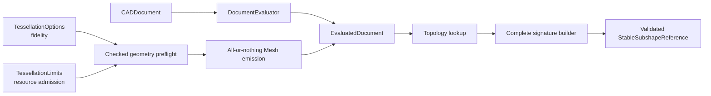

# CADKernel

## Purpose and Scope

`CADKernel` owns deterministic document evaluation, immutable evaluated
snapshots, topology lookup, and derived Mesh orchestration. It is a child of
the [Swift-CAD package design](../../DESIGN.md) and has no children for this
change.

## Responsibilities and Boundaries

The module owns deterministic document evaluation, including geometry-aware
tessellation preflight and emission, alongside the snapshot-scoped
implementation of `EvaluatedDocument.stableSubshapeReference(for:)` and
topology resolution from `StableSubshapeReference`. It does not define
analytic geometry, construct primitive topology, serialize signature values,
or publish Rupa project state. Tessellation consumes the generic
`TessellationOptions` and `TessellationLimits` values from `CADIR`; it does not
interpret viewport, camera, UI, Agent, or Product LOD policy.

## Related Designs

| Design | Relationship | Contract Used | Summary | Cautions |
|---|---|---|---|---|
| [Swift-CAD package](../../DESIGN.md) | parent | immutable exact evaluation | Defines kernel composition and Mesh separation. | Do not re-evaluate during a read. |
| [CADIR](../CADIR/DESIGN.md) | depends on | complete stable signature value | Provides validated reference values. | Every topology entry is eligible for a reference. |
| [CADModeling](../CADModeling/DESIGN.md) | depends on | exact generated B-rep | Supplies source topology and lineage. | Seam/pole topology remains present. |
| [RupaCore](../../../RupaKit/Sources/RupaCore/DESIGN.md) | used by | evaluated body and Mesh measurements | Consumes the same snapshot outputs. | Volume authority stays in exact B-rep. |

## Architecture

## Contracts and Invariants

1. Stable-reference creation uses the current immutable `EvaluatedDocument` and
   its topology map, lineage, and tolerance. It creates one complete signature
   and validates it before returning.
2. Faces, edges, vertices, bodies, periodic seams, and pole endpoints are not
   omitted or replaced with identity-only placeholders.
3. Topology resolution verifies the retained signature against the target
   model and returns typed failure for stale, missing, or mismatched topology.
4. Evaluation is reused for all reads in one operation; stable-reference
   creation never creates a second project/evaluation authority.
5. `MeshTessellator` performs a conservative checked geometry-aware estimate
   before reserving output storage. Cumulative vertex, index, triangle, and
   estimated byte limits are charged across the entire tessellation invocation,
   not only one face. Emission also charges actual usage before each output
   growth. Overflow and limit excess therefore fail before the allocation or
   growth they would exceed.
6. Preflight and emission check cooperative cancellation at document, body,
   and face boundaries. Emission is all-or-nothing: a failed or cancelled
   invocation returns no Mesh map and cannot publish a partial evaluated
   document.
7. Exact B-rep incremental reuse is independent of tessellation fidelity. The
   exact evaluator reuses only compatible source/evaluator/modeling state;
   Mesh reuse additionally requires matching source fingerprint and full Mesh
   artifact configuration, including `TessellationOptions`, with recorded
   usage admitted by the current `TessellationLimits`.

## Runtime Flows

An immutable snapshot is evaluated once, topology entries are enumerated, each
signature is built and validated, and callers receive either the complete
reference or the exact typed failure. For a materialized Mesh artifact, the
kernel first derives conservative checked per-face/body counts and byte usage,
reserves only after aggregate admission succeeds, then charges each actual
growth while emitting and validating all bodies.
Cancellation or any face/body failure abandons the local result before the
caller can observe it.

## State, Ownership, and Lifecycle

The evaluator owns the immutable snapshot during its read. Signature values
outlive the read only as detached value data. No mutable project or source
document is retained by the reference.

## Failure, Concurrency, and Constraints

Missing topology, missing pcurves, invalid signatures, stale resolution,
overflow, limit exhaustion, and cancellation throw typed kernel errors or the
standard cancellation error. Reads do not mutate the source or invoke external
callbacks. The supplied snapshot is the sole read authority. Preflight owns no
UI scheduling and performs no retry; a caller that needs another fidelity
profile must submit a new explicit evaluation request.

## Verification and Change Impact

Kernel tests must exercise every sphere body/face/edge/vertex stable-reference
path, deterministic JSON round-trip, invalid signature rejection, and planar or
cylindrical regression. Tessellation tests must prove checked preflight rejects
overflow and cumulative ceilings before allocation, observes cancellation at
the declared checkpoints, returns no partial Mesh, preserves exact B-rep state
on failure, and separates exact incremental reuse from Mesh artifact reuse.
Changes require rechecking primitive evaluation, tessellation configuration
identity, and RupaCore snapshot measurement.
