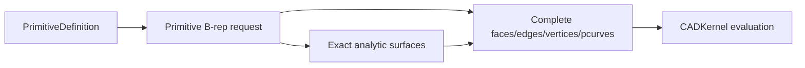

# CADModeling

## Purpose and Scope

`CADModeling` owns feature-evaluation requests and exact construction policies
for primitive and derived B-rep geometry. It is a child of the [Swift-CAD
package design](../../DESIGN.md). Children include
[InvoluteGear](InvoluteGear/DESIGN.md), [CertifiedTwist](CertifiedTwist/DESIGN.md)
and [SpatialPath](SpatialPath/DESIGN.md), with
[RollingBall](RollingBall/DESIGN.md) owning blend sewing boundaries and
[SurfaceFill](SurfaceFill/DESIGN.md) owning source-boundary surface filling,
and [BridgeSurface](BridgeSurface/DESIGN.md) owning exact source-edge bridging.

## Responsibilities and Boundaries

[SpatialPath](SpatialPath/DESIGN.md) evaluates the explicit editable spatial
source into one exact B-spline curve and its sampled presentation.

The module owns primitive B-rep topology construction, including the sphere's
analytic surface patches, periodic seams, pole vertices, edge trims, and
surface parameter curves. It does not own the shared pcurve validation rules,
stable signature serialization, evaluation caching, or Rupa project authority.

## Related Designs

| Design | Relationship | Contract Used | Summary | Cautions |
|---|---|---|---|---|
| [Swift-CAD package](../../DESIGN.md) | parent | exact source-to-B-rep flow | Places modeling above geometry and below kernel orchestration. | Keep generated topology complete. |
| [CADGeometry](../CADGeometry/DESIGN.md) | depends on | analytic pcurve validation | Supplies the common structural contract. | Do not add a sphere-specific bypass. |
| [CADKernel](../CADKernel/DESIGN.md) | used by | evaluation and stable topology reads | Consumes the generated B-rep. | Stable reads must see every generated subshape. |
| [InvoluteGear](InvoluteGear/DESIGN.md) | child | closed gear section | Composes flanks and analytic circular roots into Profile. | Resolved geometry only; no source or manufacturing certification. |
| [RollingBall](RollingBall/DESIGN.md) | child | contact-preserving blend and cap patches | Uses admitted rails as sewing boundaries. | Does not select treatment regions or close solids. |
| [SurfaceFill](SurfaceFill/DESIGN.md) | child | exact G0 surface fill from an open B-rep boundary loop | Reuses exact curve conversion, composite curves and Coons construction. | Does not claim G1/G2 optimization or guide-curve constraints. |
| [BridgeSurface](BridgeSurface/DESIGN.md) | child | exact G0 ruled sheet between two source boundary edges | Resolves current stable edge references and reuses the exact ruled-surface builder. | Sources must share a coordinate frame; this is not full XNURBS fitting. |
| [CADTopology OpenBoundaryLoop](../CADTopology/OpenBoundaryLoop/DESIGN.md) | depends on | ordered exact boundary edge cycle | Supplies the shared loop containing the selected seed. | It does not choose corners or surface quality. |

## Architecture



## Contracts and Invariants

Surface Creation expands the existing feature-evaluation path; it does not add
a second geometry authority. Extrude, Revolve, Loft, Sweep and Sweep preflight
share the source-section admission contract in
[SectionResolution](SectionResolution/DESIGN.md). This foundation does not yet
provide general boundary constraints or certify G1/G2 fitting. The approved
eleven-operation implementation remains incomplete until each actual evaluator,
source contract and application route meets its acceptance criteria.

Lifted sewing spans with distinct definitions require the existing whole-span
curve/surface correspondence proof on the restricted, oriented destination
pcurve. Matching endpoints alone cannot authorize reuse. The matcher reports
proved geometric mismatch as false and propagates inconclusive/resource errors.
CADKernel validates the resulting canonical edge against every incident face.

### Bridge curve construction

`CurveBridgeSolver` bridges two curve ends with one Bezier whose degree is
k₁ + k₂ + 1 for end continuities k (G0 = 0 through G3 = 3), so each end fixes
exactly its own control points: G0 one, G1 two, G2 three, G3 four. From an end
frame with unit tangent T, curvature vector K and its arc-length derivative K′,
the leading points follow B′ = sT, B″ = σ₂T + s²K and
B‴ = σ₃T + 3sσ₂K + s³K′ with s the end speed (the derivative magnitude, the
chord length by default), σ₂ = (n − 1)(tension₂ − 1)s and
σ₃ = (n − 1)(n − 2)(tension₃ − 1)s. The first tension is the speed, so it moves
control points one to three; the second slides point two (and three) along the
tangent and the third slides point three, each within the continuity it serves,
as the official Bridge Curve describes; tensions of 1 give the natural spacing
the earlier cubic and quintic had. The end is the start of the reversed bridge
(tangent and K′ negated). G3 needs K′, which a frame has only for a curve with an
exact third derivative (`Curve3D.thirdParameterDerivative`: lines, circles,
non-rational B-splines and their rigid and affine images); another curve is
refused as an unsupported capability. The result is verified against every
required level with `CurveContinuityEvaluator`. `CurveBridgeContinuityTests` own
G3, the mixed-level degree and the tensions.

### Extrude extents

The evaluator consumes CADIR's validated signed axial range. It translates the
exact input boundary to the lower endpoint, then uses the existing prismatic or
translated-sheet builder with the positive interval span. This retains one
sewing, stable-subshape and BRep admission path without copied source features.
`TwoSidedExtrudeTests` covers straddling, same-side and reverse-only endpoints,
parameter changes, replay and degenerate/unit failure. Core/UI consumers must
adopt the same range before exposing this control.

### Shell partitioning

`BRepSewingPatchShellPartitioner` groups sewing patches into shells by the edges
they share. An edge used by two patches joins them; where solids touch along an
edge (more than two uses), each patch is a ray from the edge into its interior,
ordered by angle about the edge (faces lying on each other ordered by which wedge
they close), and consecutive rays that bound a material wedge are joined, so
touching solids stay separate shells. Uses that do not pair so are a typed
`nonManifoldResult`. The angular ordering about an edge is `BRepSewingEdgeFan`,
which the Region cell complex also uses. `SheetBooleanTests` re-slice a slice's
touching pieces.

### Joining bodies

`JoinBodiesFeature.mode` says what a join makes, and so which port its targets and
its result use. Each target may carry a rigid `placement` into the joined body's
frame; `JoinTargetPlacement` moves every placed target there first, each move an
internal `joinOperandPlacement` stage, and the join is published as if it had acted
on its inputs directly. The closure query moves targets the same way, so it answers
for the bodies the join will see. `.solidComponents` makes solids whose material does not meet the
components of one solid body, each shell untouched. `.sewnSheet` and `.sewnSolid`
sew sheets along the boundary edges that coincide within the modeling tolerance
(`SheetBodyJoining`, implemented by `DefaultSheetBodyJoiner` in CADKernel, which
owns the face patch extractor and the sewer): each source's faces become patches
under a prefix of their own, edge uses pair through `BRepSewingEdgeFan`, and a pair
traversed the same way by both faces turns the later face over, spreading from the
first source's first face. An edge met by more than two faces (`nonManifoldResult`),
sheets that do not all meet, and faces that cannot agree on one front side are
refused (`invalidInput`). `.sewnSolid` requires a shell with no boundary edge left
and faces it outward (its certified signed volume, `BRepModel.signedVolume(ofShell:)`,
decides whether every face turns over); `.sewnSheet` requires a boundary edge left.
A result of the other kind than the mode names is refused, never produced, so an
upstream edit that opens or closes the sheets fails the join explicitly. Sewing
rebuilds every face, edge and vertex, so every subshape of the sources is removed.
An author chooses the mode with `JoinSheetClosure`, which runs the same plan.
`JoinSheetsFeatureTests` cover a cube of mixed-facing sheets, an open join both
ways, sheets that do not meet, three faces on one edge, mixed kinds, the closure
query, a mode that does not match, and a sheet evaluated elsewhere and joined at its
placement.

### Curve translation

Curve Extrude supplies start/end displacement vectors to the existing exact
Sweep patch builder. The builder constructs ruled surfaces between translated
exact spans and reuses tensor boundaries, sewing, lineage and independent BRep
admission; a straight span swept straight is a flat parallelogram and is
published on its exact plane, bounded by the same edges with their parameter
curves on the plane. Translation does not need a section plane or a synthetic path.
Only implicit normal/symmetric direction resolution requires source plane data.
No plane or display polyline is inferred for a spatial curve. Open and closed
sections preserve their boundary connectivity; neither receives solid caps.
Each translated surface must pass whole-domain interval regularity validation
before sewing; tangent-parallel translation must not publish a collapsed sheet.

### Revolve construction and closure

Rotational tensor control rows and boundary arcs share one Cartesian rotation
construction using RigidTransform3D. Rotation coefficients are computed once
per angular patch, not per generator control point. Profile-plane admission
remains separate from this geometric construction; removing that admission
requires whole-surface regularity and global overlap validation for spatial
generators, not merely successful Cartesian rotation. Spatial generators are
certified in orbit coordinates (axial position, squared radial distance), using
outward position/derivative enclosures in the rotation frame. Distinct orbit
coordinates exclude overlap at every rotation angle. A cell with a strictly
monotone linear functional of those coordinates is locally injective. Two cells
are admitted when their orbit boxes are separated, or when they are adjacent
(including a declared closed seam) and one functional is strictly monotone
through both. All other pairs subdivide until admitted or explicitly unresolved.
Only declared adjacent endpoints may coincide; nonadjacent coincident orbits
cannot be admitted by topology proximity or samples. For a sweep shorter than
half a turn, cells may instead prove angular separation: the upper enclosed
cosine between their radial vectors must be below the certified lower cosine
of the absolute sweep angle. Their entire swept angular intervals are then
disjoint, including negative rotation and crossing an angular chart seam.
The sweep cosine is computed once; no sampled or inverse-angle chart decides
admission. At half a turn or more, repeated orbits cannot use this exclusion.
Original spans must be continuous and a closed section must close within
modeling tolerance.
Each generator cell must also prove radial clearance beyond the distance
tolerance before surface construction; a cell wholly inside the axis tolerance
is rejected, and unresolved clearance subdivides under the same proof budget.
Each resulting surface patch must independently pass whole-domain regularity
validation. The orbit proof processes source-span pairs without allocating a
quadratic pair array, retaining bounded local subdivision work. Its request-wide
budget is 65,536 visited pairs and 32 levels per cell; exhaustion is a typed
resource failure, never permission to construct an unchecked result.

The existing rational surface-of-revolution builder owns both solid and sheet
construction. It consumes exact generator spans and the rotation axis;
curve sheets do not fabricate a closed Profile. One span construction path owns
surfaces, oriented pcurves, sewing and lineage. The requested body kind decides
whether partial-turn caps and solid shell ownership are built. Open generators
never receive caps. A curve whose plane does not contain the axis uses the
spatial proof path; solid profiles still require an axis in their plane.
Angular seam splitting is shared; whole-span radial half-space validation
applies to planar generators. A sampled point may choose the radial
frame but cannot certify that the generator stays on one side of the axis.

`CurvedRevolveFeatureTests` owns solid regression; `RevolveSheetConstructionTests`
owns uncapped open-generator geometry, full-turn seams and invalid generators.
Source/API adoption is separately required before this builder is an exposed
Surface Creation operation.

### Loft section topology

Guide contact resolution consumes exact boundary loops (`ExactLoftGuideSection`),
not display vertices or an artificial closed Profile. The profile entry point
extracts spans once per section and delegates to the same resolver. Guide
endpoints can contact spatial boundaries without a supporting plane. Intermediate
contacts use exact boundary curves regardless of supporting-plane metadata; a
guide may lie in that plane while meeting its boundary only once. All sections
use coordinate projection of exact rational curves,
the existing certified 2D root solver, and outward-rounded 3D enclosure distances.
Each projected root must be proved separated or within the distance tolerance;
unresolved roots and search exhaustion propagate failure. Chart choice affects
convergence only, never admission. It considers endpoint and midpoint tangent
pairs so parallel midpoint tangents cannot alone select a degenerate projection.
The largest cross-product component chooses the chart; it is not contact evidence.
Raw parameter derivatives supply these candidates without requiring nonzero
endpoint speed; chart selection does not impose a separate curvature contract.
This admits discrete transverse contacts, not
general coincident/tangent spatial loci. Missing or ambiguous contacts remain errors.
The spatial search uses the existing certified pcurve solver's 32-level,
1,048,576-cell envelope; exhaustion is an error, not a sampled fallback.
Repeated visits to the same spatial point remain distinct when guide parameters
differ beyond the resolver's parameter resolution; merging requires both position
and parameter agreement, including duplicates at shared span boundaries.

Curve/mixed Loft partitions use guide contacts as ordered correspondence anchors.
Each section maps its exact boundary progress piecewise to the first section's
anchors; the union of mapped span boundaries preserves every exact source span.
Inverse mapping selects exact subcurves, and the existing connector builder uses
the exact guide curves. Endpoint/interior classification and guide order must
agree across sections; inconsistent correspondence is rejected before topology
publication. General coincident/tangent spatial contact solving remains unfinished.

Explicit section start indexes address the original source samples, before curve
restriction or reversal. The selected point must lie on the retained exact curve;
it is not used to reconstruct geometry. Closed boundaries rotate/split exact spans
at that point, or at the first guide contact when no explicit seam is supplied.
Open boundaries admit only their current start point: changing their start means
restriction or reversal, not wrapping an open chain. Invalid indexes and points
outside the retained boundary fail before publication. CurveLoftFeatureTests owns
exact seam location, traversal and invalid-source/interval admission checks.

Explicit profile traversal is applied to exact spans before correspondence.
Automatic alignment may rotate a seam but must not undo a locked direction.
The source Profile, hole classification and plane remain unchanged. The final
matched rings drive exact boundary traversal and cap/shell orientation. Reversed
correspondence that produces singular or intersecting geometry is a failure,
not permission to silently restore automatic traversal.

Unguided profile correspondence optimizes the sum of adjacent ring distances,
including the final-to-first connection of closed Lofts. The first ring anchors
the parameter origin. Explicit seams and traversal remain fixed. For closed-loop
automatic traversal, a resolvable signed advance along each winding normal aligns traversal
with the first section's advance; tangential/ambiguous advance retains both
orientations for geometric scoring. Open stacks retain both automatic directions.
Advance uses adjacent section centers, not
the first section's normal. This chooses correspondence, not shape admission.
Winding cross products are area quantities; their normalization threshold is
the squared distance tolerance, not the distance tolerance.
Dynamic programming operates on offset/direction indexes, materializing only
the selected rings. Relative-offset edge costs are computed once per connection;
time is O(sectionCount * ringCount^2), storage O(sectionCount * ringCount).
Finite scores and deterministic ties are required; failed geometry still goes
through the same patch admission. LoftFeatureTests covers automatic rotating
closure, explicit traversal/seams, open stacks and invalid correspondence.

Conic span construction preserves the source's signed sweep before adding the
start angle. A sweep equal to one declared period reuses the first point as the
last span endpoint; near-full partial arcs do not close by tolerance. This
preserves full-turn topology without repeated trigonometric endpoint evaluation.
The conic section may cover at most one turn: zero, nonfinite and repeated-turn
sweeps fail before allocation. Quarter-turn subdivision therefore needs at most
four spans, independent of the magnitude of an invalid requested sweep.

After applying guides, Loft resolves one common connector basis per section
connection before creating edges or faces. Both incident faces consume those
same stored connector curves, rather than independently degree-elevating a
shared line against different opposite boundaries. Existing common-basis
validation and span limits apply; already aligned connector groups are unchanged.
For stacks with more than two sections, each boundary span also resolves one
section basis across the entire stack before generating any edge or side face.
All incident faces consume the same stored elevated section curve. This avoids
independent pairwise degree elevation of a shared curved section; already
aligned columns and two-section stacks retain their existing representation.
The existing curve basis resolver owns conversion and span limits. Different
rational denominators require a shared homogeneous representation before face
construction. CADGeometry's ruled builder owns the positive Bernstein denominator
products and degree budget; Loft supplies the whole incident section column.
Identical denominator factors are reused once. This conversion must preserve
each authored curve and must not relax exact shared-boundary admission.

Every Loft side patch passes the existing
B-spline regularity and embedding validators over its complete parameter domain
before entering the result BRep. This applies to profile, curve and mixed inputs.
Interior collapsed rows and single-patch self-overlap are failures, even when
the edge/face graph is structurally valid. Nonincident side patches (no shared
topological vertex) additionally require finite-domain separation before publication.
Positive-weight control hulls exclude distant pairs; remaining pairs use
CADGeometry's certified separation contract. Root comparisons share its standard
pair-count ceiling; each unresolved pair retains the geometry subdivision budget.
Side patches sharing exactly one generated edge pass that edge's parameter-side
identity into adjacent-chart admission; a topological edge alone never proves
their interiors disjoint. Shared vertices with no common edge pass their paired
parameter corners to the geometry point-contact separation proof;
topological vertex identity alone does not establish separation.
Two opposite shared edges use the geometry half-chart admission path.
Section edges are unique per loop/section/span and connectors per
loop/connection/vertex. Closed partitions have at least two spans; closed section
loops have at least three sections. Consequently two distinct generated side
faces can share no edge, one edge, or two opposite edges, never adjacent edges
or three/four edges. Unexpected incidence fails instead of bypassing admission.
Cap/side intersections still require topology-aware admission and remain
explicitly incomplete. Stationary outer parameters use CADGeometry's explicit
unit-weight factor-removal contract; unresolved cases fail rather than skipping
admission for the entire smooth construction branch.

Loft delegates all non-linear-connector transfinite construction to CADGeometry's
shared Coons builder, including its exact unit-weight low-degree path. It does not
own a second polynomial interpolation or approximate rational-weight classifier.

Guide constraints own their geometric locus, not the input curve's traversal
speed. A single clamped unit-weight Bezier guide whose control points are exactly
collinear and ordered along its nonzero chord uses that chord's affine parameter
before contact resolution. Exact planar predicates certify all three projections;
ordered Bernstein controls prove strictly monotone interior traversal. The source
feature is unchanged and no fitted tolerance is spent. General curved, rational,
multi-span or reversing guides keep their original curve and admission path.
This prevents stationary endpoints of an otherwise identical straight guide from
changing or folding the Coons interior. CurveLoftFeatureTests owns this regression.

For unguided ruled profile Loft, parallel section planes require equal traversal
orientation on each matched loop. Every intermediate ruled section is planar;
opposite endpoint winding cannot interpolate through simple closed boundaries
without a collapsed or self-intersecting section. This necessary admission check
applies equally to Sheet and Solid. It does not establish global embedding for
nonparallel, guided, smooth, or arbitrary spatial sections; their general
self-intersection proof remains a separate incomplete admission requirement.

When any Loft section is a curve, the evaluator resolves every section to exact
B-spline boundary spans before correspondence. A profile contributes its outer
loop directly, without an intermediate display polyline or composite curve.
All sections must have the same closure and one loop; a profile with holes
cannot correspond to a single curve loop. Profile-only multi-loop construction
retains its existing matched-loop path. Shared partitioning owns knot/span
alignment and uses the same topology constructor for mixed and curve sections.

Loft resolves exact curve sections without manufacturing a closed Profile.
The existing exact builder partitions section curves and owns both open-strip
and closed-loop topology. Open partitions have one more vertex than edge;
closed partitions wrap the final edge to the first vertex. Section closure is
independent of closing the sequence of sections. Only closed profiles admit
Solid output and planar caps. Common side-surface, connector, pcurve and lineage
construction is shared, including smooth connector generation.

Before Solid publication, each generated edge not belonging to a cap is
intersected with that cap's support over its actual trimmed parameter range.
Discrete events strictly inside the outer trim and outside every hole are
invalid geometry. Authored oriented pcurves and the existing certified loop
predicate own finite-region classification; support-plane crossings outside
the cap are not rejected. Shared cap edges are excluded by topological identity,
not endpoint similarity. Intersection/classification failures propagate.
This edge-event check does not establish separation of side interiors or
continuous coplanar contacts; general cap-side admission remains incomplete.
Side-support intersections are also enumerated before publication. A curve
may be excluded as shared only after whole-span coincidence with a common
topological edge. Otherwise, boundary-disjoint intersection components are
classified against finite cap loops; an interior component is invalid. Contacts
with unresolved trim crossings or coplanar regions remain explicit failures,
not successful separation. Existing intersection budgets bound support search.
For nonincident nonparallel planar faces, the support line is partitioned by
both faces' trimmed boundary/plane intersection events. Classification must use
both finite regions, including holes, rather than the cap alone. Boundary
events and every intervening interval are checked; no shared edge is inferred
from coincident positions. Intersection failures remain failures. The finite
trim regression is owned by LoftCapContactTests.

Before support intersection search, a cap boundary control hull and side
surface control hull may prove spatial disjointness. Exact midpoint
isoparametric curves may provide interior-contact witnesses; their failure to
find contact never proves separation. Remaining pairs use support intersection.
Coplanar side regions are projected into the cap's exact chart before discrete
edge intersection. Disjoint loop boundaries permit containment classification
in both directions, including cap holes. Disjoint finite regions are admitted;
nested overlap is rejected. Boundary-touching coplanar regions still require
general arrangement. A shared straight topological edge may be admitted when
exact chart predicates prove that every remaining rational Bezier boundary span
lies strictly on the opposite side for each face. Zero controls are permitted
only at shared endpoint vertices. This is a sufficient finite-region separation
proof, not endpoint sampling or an overlap waiver; other contacts retain the
unresolved arrangement failure.
For distinct planar supports, the same one-sided boundary certificate on the
cap alone confines their line of intersection to the shared straight edge.
The other face may extend beyond that segment on the support line; its infinite
support is not the finite cap. Parallel/coplanar supports still require both
region certificates, and no shared-edge identity is inferred from proximity.
LoftFeatureTests owns the tilted-end piercing regression and normal Solid/Sheet
construction checks.
ExactLoftSideSurfaceBuilder retains the tensor chart as a construction map.
For a convex unit-weight bilinear planar boundary with one collinear corner,
the geometry owner's certificate proves embedding without claiming regularity
of that chart. Side publication uses the certified plane instead and rebuilds
pcurves from the unchanged exact edges. All other sides retain spline support
and regularity admission. The authored `loftSolidRetainsACoplanarCapContinuation`
regression proves Solid publication, exact BRep validation, planar side support
and the analytic prism volume. This establishes straight planar continuation,
not general curved trace clipping or arbitrary coplanar arrangements.

Curve partitions retain each source span, subdividing at the union of normalized
boundary-progress breaks. Partitioning must preserve rational geometry, source
orientation and both open endpoints. Different closure kinds, disconnected
spans and degenerate correspondence are explicit failures. No triangulated or
sampled section substitutes for exact input. Advanced guide/continuity controls
remain separately tracked until connected to this same path.

### Bounded rotational Sweep construction

The implementation contract is owned by
[CertifiedTwist](CertifiedTwist/DESIGN.md), a child component of this module.

The precision-modeling extension retains the input profile exactly and stores
an explicit positional approximation allowance in Sweep source, separate from
modeling tolerance and presentation tessellation. A straight, profile-normal
path with unit section scale and no guides may use a piecewise-linear angle
law. The law includes both endpoints, has increasing normalized path positions,
and may reverse angular velocity at an explicit source knot; this represents a
double-helical construction without internal caps or a Boolean union.

Each constant-rate interval is subdivided into cubic Hermite rotation patches.
The rational profile basis/weights are retained in a tensor-product B-spline
surface. Numerical coefficient error and the whole-interval Hermite remainder
must together fit the explicit positional allowance. Sampled agreement alone
is not a certificate. Shared endpoint values and physical derivatives keep
artificial subdivision seams C1; a source-law velocity discontinuity is not
advertised as C1 or G2. No general C2 guarantee is made.

Admission verifies source-path straightness from exact span/control geometry,
not sampled frames, and rejects a singular rotation approximation or exhausted
patch/control-point budget before allocating the complete topology. Unsupported
scaling, guides, curved paths or unprovable numerical bounds fail explicitly.
The existing unannotated twist route does not silently acquire approximation.
Sewing, pcurves, caps, stable identity and exact validation remain the existing
kernel responsibilities. Success additionally requires source round-trip,
parameter re-evaluation, a closed double-helical solid and actual tessellation.

This subsection is an implementation acceptance contract, not a statement that
the extension has passed those tests.

All-edge fillets retain the original outer bounds and round every edge of a
validated box, circular cylinder, or convex prism. A box and a cylinder are told
apart by surface kind, not by topology counts, which are identical: six planar faces are a box,
four coincident cylindrical faces closed by two planar caps are a cylinder.
A box becomes six inset planar faces, twelve quarter cylinders, and eight
spherical octants. A cylinder becomes two inset planar caps, four cylindrical
band quarters, and eight toroidal fillet quarters, a fourteen-face shell with
twenty-eight edges and sixteen vertices. The cylinder frame is derived from the
two caps, so an extrusion that is symmetric or reversed about its sketch plane
is handled like one that starts at it. Construction owns exact curves, trims and
pcurves, not a rounded display mesh. The nondegenerate domain is tolerance <
radius, and for a box radius < half the shortest side minus tolerance. A box
rounds its corners with spherical octants, but a cylinder rounds its rims with
tori whose center circle must clear its own tube, so a cylinder admits twice the
radius < the cylinder radius minus tolerance with twice the radius < the height
minus tolerance. A cylinder is therefore bounded by half its own radius, and a
capsule is outside the domain.

Every other body reaches the general prism domain: a convex prism extruded
perpendicular to its cap, whose cap profile is one closed loop of straight
segments and circular arcs with every arc meeting its neighbours tangentially.
Its axis comes from a lateral cylinder when one exists and otherwise from a
plane normal that leaves exactly two caps and no oblique lateral face. A body
admitting two non-parallel such normals has only a, b and a x b as normals,
which is a rectangular box, and one rolling ball rounds a box to the same solid
down any of its three axes, so the candidates are signed canonically and the
smallest is taken. The frame is then read from the two caps rather than from
their order: the axis keeps that signed direction and the base is whichever cap
lies lower along it, so the same body yields the same solid however its faces
are enumerated. The profile is read from the bottom cap's outer loop, wound
counterclockwise about that axis and started at its lexicographically smallest
vertex, so one body yields the same stable identifiers on every evaluation. A profile of m segments
with C non-tangent corners becomes m inset lateral faces, two inset caps, C
vertical fillet cylinders, 2m cap fillet surfaces, and 2C corner spheres: a
regular N-gon prism is 6N + 2 faces and a straight stadium prism is twenty. A
tangent seam between an arc and its neighbour carries no corner and is left
unrounded. The domain excludes a reflex corner, a corner where either side is an
arc, an arc sweeping more than half a turn, and a lateral face that is neither a
plane containing its segment nor a cylinder coaxial with its arc. Its radius is
bounded by twice the radius < the height minus tolerance, by each segment
keeping trimmed length above tolerance once both its corners consume the radius
times the tangent of half their turn, and by each arc carrying its own torus
with twice the radius < the arc radius minus tolerance. A quadrilateral prism of
six planes is rounded as an orthogonal box before this domain is reached, so a
non-orthogonal quadrilateral is refused with the box message rather than
admitted here. Collapsed faces, unsupported topology, and a
radius the torus cannot carry fail before publication rather than during surface
construction. Existing single-edge behavior remains unchanged. Verification
checks volumetric validity, the per-shape topology, analytic volume, unchanged
bounds, exact-source round-trip, tessellation, and invalid radius/target
rejection. A box and a cylinder routed through this domain are compared vertex
for vertex against their own builders, which is what ties the three
constructions to one contract, and one document evaluated twice is compared
against itself, which is what holds the frame independent of face order.

1. A valid sphere creates one solid body with its complete analytic topology:
   eight faces, twelve edges, and six vertices, with pcurves on every coedge.
2. Seam and pole topology is a real part of the B-rep and remains available to
   stable-reference readers. It is not replaced by Mesh or omitted from a
   signature.
3. Primitive construction delegates parameter validity to `CADGeometry` and
   returns typed failure for invalid dimensions or malformed requests.

`TopologyTransformFeatureEvaluator` moves faces, edges and vertices of one body
together by one translation, rotation or positive frame scale
(`TopologyTransformFeature`, `TopologyMotion`). It gathers every vertex the
targets bound, so a vertex shared by two targets moves once, and hands the
motion's affine map to `LocalVertexDisplacementRebuilder`. A face moved whole
then keeps the outward side the map carries it to, and a curved edge moves only
under a translation. `TopologyTransformTests` prove shared corners, a tilted
face and a frustum by exact volumes, and the refusals.

`FaceSurfaceReplacementRebuilder` owns the local face operations that give faces
new surfaces: Push Face (`FaceOffsetFeatureEvaluator`, each face onto its offset
from `FaceSurfaceOffsetter`: planes shift, cylinders, spheres and tori change
radius, cones slide along their axis, any other surface takes its exact procedural
offset, and with an adjacent angle each planar neighbour of a planar pushed face
turns about their straight shared edge), Draft Face (`FaceDraftFeatureEvaluator`,
isocline: a planar face turns about its crossing with the neutral plane, optionally
offset along the neutral face's outward side, and a cylinder along the pull
direction becomes the cone through its neutral circle, each making the angle with
the pull direction) and Match Face (`FaceMatchFeatureEvaluator`, onto a reference
face's surface, of another body where its relative placement puts it, keeping the
face's outward side or taking the reference's front). The engine re-solves
everything around the changed faces from the surfaces alone and keeps topology
and identities:

```text
new surfaces ──▶ each changed edge: its two faces' intersection branch nearest
                  its old middle (DefaultSurfaceSurfaceIntersector); a straight
                  edge whose faces now share a surface, or an open sheet edge,
                  the line through its re-solved ends
             ──▶ each changed vertex: where its faces' distinct surfaces cross,
                  nearest where it was (tangent-plane Newton; along a re-solved
                  edge where two of them touch tangentially)
             ──▶ edges trimmed between their re-solved ends, keeping their sense;
                  edges between unchanged faces run on their own curves to moved
                  vertices; parameter curves cleared for ExactFacePcurveBuilder
```

`SurfaceFootResolver` gives the nearest point and normal of a whole surface to
any point, on it or off it, in closed form for analytic surfaces. An edge that
would collapse or reverse, surfaces that no longer meet near an edge or vertex,
and a face whose outward side would turn over are refused, so every Grow mode
refuses a face running into another wall
(`FIXME(INCOMPLETE_IMPLEMENTATION)` in each evaluator); a face crossing the
neutral plane is refused likewise until it is split along it. `PushFaceTests`,
`DraftFaceTests` and `MatchFaceTests` prove boxes, rounded boxes, cylinders,
holes, adjacent angles, pyramid and cone frustums and placed references by exact
volumes, and the refusals.

`FaceRemovalHealer` heals a solid over faces taken out of it (Delete Face with
`heals`, and Remove Fillets From Shell): the faces around keep their surfaces and
each removed face collapses onto them, as `FaceRemovalPlanner` chooses:

| Collapse | Removed face | Topology | Geometry re-solved |
|---|---|---|---|
| `dropsHoles` | the faces a hole runs through | each whole inner loop they leave in a kept face goes | none |
| `toEdge(first:second:)` | a strip (fillet or chamfer) | its edges with the two faces it joins merge into one; its other edges shrink to points | the merged edge on the two faces' intersection, the merged vertices where their faces cross |
| `toPoint` | a face the faces around meet at one point (a fillet corner, a pyramid's top) | all its vertices merge and its edges go | the merged vertex |

Edges between kept faces that reach a merged vertex run on their own curves to it.
`BRepSurfaceMeetingSolver` (also under `FaceSurfaceReplacementRebuilder`) solves the
meetings: the intersection branch nearest a seed, crossing points by tangent-plane
Newton or along a curve where surfaces touch tangentially, and sense-keeping trims.
A fillet is a face on a cylinder, torus or sphere no wider than the radius asked for,
tangent to two kept faces along two of its edges (a strip), or lying where fillets
meet (a corner, removed only with all the strips around it); its convexity is whether
its centre of curvature lies in the material. A deleted face that is not a fillet is
tried every way it could collapse and the healed solid that validates and changes the
volume least is kept; faces touching one another go together only as a hole
(`FIXME(INCOMPLETE_IMPLEMENTATION)` for any other cluster). `FaceRemovalHealingTests`
prove a filled hole, a sharpened rounded box, one sharpened corner, a restored
chamfered edge, radius and convexity filters and the refusal of a top no neighbours
close over.

`LocalVertexDisplacementRebuilder` owns the direct edits that move vertices: a
straight edge's two ends (`EdgeMoveFeatureEvaluator`), a planar face's boundary
(`FaceMoveFeatureEvaluator`), and a vertex of any body other than a single-shell
polyhedral solid (`VertexMoveFeatureEvaluator`, which keeps re-sewing and
triangulating that polyhedral case). Only the faces around the moved vertices are
re-solved, so solids and sheets with curved faces elsewhere can be edited. A
straight edge at a moved vertex becomes the line through its moved ends and must
keep its sense. A curved edge (circle or B-spline) moves only when both its ends
move by one displacement, and then translates rigidly. Under a rigid motion (the
edit's map when it keeps lengths, or one shared translation) a curved edge with
both ends moved takes its exact image. A face whose every vertex moves is
carried whole: its surface takes its image, and its parameter curves take the
affine map the motion induces on a plane's or cylinder's parameters
(`SurfaceParameterAffineMap`), so a boss or hole slides or turns with its faces.
Every other face bounded by a moved edge must be planar, or a cylinder whose
moved vertices all slide along its axis, which keeps its surface. A planar face
that stays in its plane keeps its surface and parameters. Its unmoved edges keep
their parameter curves, and edges carried within the plane take the mapped
ones. A planar face whose vertices all move by one
displacement keeps its plane, translated. Otherwise it becomes the plane through
its moved boundary when that stays flat, with any curved edge it keeps still on
that plane. Otherwise, when the face is one loop of four straight
edges, it becomes the degree-1 B-spline patch of its corners, which contains each
edge as a boundary isoline and takes explicit coordinate pcurves. Topology and
identities are unchanged. A face that is neither, and a face whose outward side
would turn over, are refused. The edit output keeps the target's role, solid or
sheet (`FeatureNodeFactory`, `DesignGraph`). `LocalDirectEditTests` prove a box
with a hole, a non-convex solid, an open-box sheet, bilinear warping with an
exact volume, and the refusal of a holed face that warps.

`EdgeMoveFeatureEvaluator` moves a circular edge with `CircularEdgeCapTranslator`:
the planar cap the circle bounds moves along the circle's axis with every edge
and vertex on it, the faces around the cap must contain that direction (a
coaxial cylinder or a plane parallel to the axis) and keep their surfaces, and
the straight edges joining the cap to the rest of the body are rebuilt between
their moved ends. The circle keeps its radius. A sideways move, a neighbour that
would change shape, and a move that shrinks or turns over a joining edge (the cap
passing through the body) are unsupported capabilities. Solids validate
volumetrically and sheets exactly. `CircularEdgeMoveFeatureTests` owns the
lengthened cylinder and both refusals.

## Runtime Flows

Primitive evaluation builds exact topology, validates it at the kernel
boundary, and exposes it through the immutable evaluation snapshot.

## State, Ownership, and Lifecycle

Construction values are request-local. The resulting B-rep is owned by the
evaluation snapshot; derived Mesh remains separate presentation data.

## Failure, Concurrency, and Constraints

Construction is deterministic and side-effect free outside its result. It
fails before returning incomplete topology when a required surface, edge,
vertex, or pcurve cannot be built.

## Verification and Change Impact

Primitive tests assert exact topology counts, analytic volume, pcurve presence,
and stable-reference generation for every sphere subshape. All-edge fillet tests
drive a rectangle extrusion and a circle extrusion through the evaluator and
assert the two results the contract above names. Prism fillet tests drive a
hexagonal and a slot extrusion and assert the counts, surface kinds and Steiner
volume the contract names, reproduce both of the other two solids through the
general builder vertex for vertex, and assert the typed rejection of an
oversized radius, a non-convex profile, and a body outside every domain. Changes require rechecking the shared geometry validation,
the stable signature owners, and the `CADIR` all-edge fillet domain statement.

[ConstrainedSurface](ConstrainedSurface/DESIGN.md) owns point-constrained sheet construction and its bounded fitting contract.

### Extrusion Boolean composition

Extrude owns its retained target references and operation, while the existing
`SweepBooleanApplying` contract owns Boolean topology construction. The evaluator
first constructs the exact signed-span tool, then applies the selected Boolean
with the input subshape lineage. New-body extrusion requires no targets and no
Keep Tools. Boolean extrusion requires solid output and unique solid targets;
failures propagate before publication. The exact result is admitted through the
existing validated BRep path. Legacy source omitting targets and Keep Tools
retains new-body behavior. Verification covers intersecting solid volume, source
replay, target/tool retention and invalid target or sheet requests.

### Placed Boolean tools

A Boolean is evaluated in stages (`FeatureEvaluationStages`): every placed target
or tool is rebuilt once at its rigid placement through the exact pattern
rebuilder's `relocate` (the same exact face images and sewing as patterns) under
a `booleanOperandPlacement` stage identity; several tools are then united one
after another under `booleanToolUnion` stage identities, so they act as their
union; and one pipeline pass combines the targets with the one tool, consuming
both. The published result is the one the original operands would give: no
stage identity is published, every input a stage consumed is reported removed,
and lineage is traced through stage subshapes back to input subshapes (a
Boolean without stages publishes the pass unchanged). The result replaces its
targets; Keep Tools puts every original tool back, unchanged, from the input
model beside the result (`restoringInputBodies`). An evaluator without a
relocator refuses a placed operand as an unsupported capability.
`PlacedBooleanToolTests` prove exact volumes for a placed tool, a kept placed
tool, Keep Tools keeping only the tools, targets at different placements and
several tools (intersect and kept difference), that no temporary identity
reaches the evaluated subshapes or lineage, and that the single-tool form still
decodes.

### Mirror output and cut

A mirror reflects its target across its plane onto the side the normal points to.
With `cutsAtPlane`, the target is first intersected with a box covering its
bounds on the other side, whose top face lies on the plane, through the injected
`BodyHalfSpaceCutting` (CADKernel's `BRepBodyHalfSpaceCutter`) under a
`mirrorCut` stage identity; a target already on the kept side is not cut, and one
with nothing on it is refused. `output` then publishes the kept material joined
with its reflection (`combined`), the reflection alone (`reflection`, through
`relocate`) or the kept material alone (`kept`). A cut, combined mirror does not
intersect the two halves: they meet only on the plane, so
`glueReflection` drops both halves' faces on the plane and sews the rest into
one shell, reversing the reflected loops so both halves turn the same way about
their outward normals. The cut is a `FeatureEvaluationStages` stage, consumed like a placed Boolean operand's,
and every stage that rewrites lineage parents re-derives each relation from its
parents (`withRelationsDerivedFromParents`). `MirrorFeatureIntegrationTests`
prove each output's volume and extent for boxes, the cut-and-join of a
cylinder, the refusals and the native package round trip.

A sheet mirrors to a sheet: `FeatureNodeFactory` gives the mirror its target's
output role and `DesignGraph` requires the two to match. Sheets are never
united, so a combined sheet mirror first asks the injected
`BodyPlaneSideClassifying` (CADKernel's `BRepBodyPlaneSideClassifier`) where
the sheet lies. The classifier encloses each face's signed distance by its
bounding box, narrowed by the boundary edges of a planar face or the control
hull of a B-spline patch, and never by samples. A sheet `clear` of the plane is
placed beside its reflection as a second shell (`placeSheetInstancesApart`).
A `oneSided` sheet is sewn to its reflection along its boundary edges on the
plane (`glueReflection`), and a face lying in the plane is refused. An
`undetermined` sheet may cross the plane and is refused without Cut. With Cut, the injected half-space cutter partitions sheet faces using exact intersection curves, retains the negative half-space, and returns sheet topology with source lineage.
`rebuild` refuses sheet patterns with more than one instance, since uniting
sheets is not a union of volumes. `SheetMirrorIntegrationTests` prove the
clear, sewn, crossing, reflection-only and cut cases.

## Expression Magnitude Contract

Expression consumers follow the [CADCore expression contract](../CADCore/DESIGN.md), including
unit-preserving hypot, dependency discovery, serialization and explicit failure.

Natural Bezier extension expressions use the shared numeric and unit contract in [CADCore](../CADCore/DESIGN.md). Both expression evaluators retain dependencies and propagate continuation errors.
