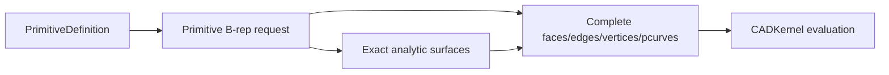

# CADModeling

## Purpose and Scope

`CADModeling` owns feature-evaluation requests and exact construction policies
for primitive and derived B-rep geometry. It is a child of the [Swift-CAD
package design](../../DESIGN.md). Children include
[InvoluteGear](InvoluteGear/DESIGN.md), [CertifiedTwist](CertifiedTwist/DESIGN.md),
[CertifiedCurvedSweep](CertifiedCurvedSweep/DESIGN.md)
and [SpatialPath](SpatialPath/DESIGN.md), with
[RollingBall](RollingBall/DESIGN.md) owning blend sewing boundaries and
[SurfaceFill](SurfaceFill/DESIGN.md) owning source-boundary surface filling,
and [BridgeSurface](BridgeSurface/DESIGN.md) owning exact source-edge bridging.

## Responsibilities and Boundaries

[SpatialPath](SpatialPath/DESIGN.md) evaluates the explicit editable spatial
source into one exact B-spline curve and its sampled presentation.

The module owns primitive B-rep topology construction, including the sphere's
analytic surface patches, periodic seams, pole vertices, edge trims, and
surface parameter curves. It does not own the shared pcurve validation rules,
stable signature serialization, evaluation caching, or Rupa project authority.

## Related Designs

| Design | Relationship | Contract Used | Summary | Cautions |
|---|---|---|---|---|
| [Swift-CAD package](../../DESIGN.md) | parent | exact source-to-B-rep flow | Places modeling above geometry and below kernel orchestration. | Keep generated topology complete. |
| [CADGeometry](../CADGeometry/DESIGN.md) | depends on | analytic pcurve validation | Supplies the common structural contract. | Do not add a sphere-specific bypass. |
| [CADKernel](../CADKernel/DESIGN.md) | used by | evaluation and stable topology reads | Consumes the generated B-rep. | Stable reads must see every generated subshape. |
| [InvoluteGear](InvoluteGear/DESIGN.md) | child | closed gear section | Composes flanks and analytic circular roots into Profile. | Resolved geometry only; no source or manufacturing certification. |
| [RollingBall](RollingBall/DESIGN.md) | child | contact-preserving blend and cap patches | Uses admitted rails as sewing boundaries. | Does not select treatment regions or close solids. |
| [SurfaceFill](SurfaceFill/DESIGN.md) | child | exact G0 surface fill from an open B-rep boundary loop | Reuses exact curve conversion, composite curves and Coons construction. | Does not claim G1/G2 optimization or guide-curve constraints. |
| [BridgeSurface](BridgeSurface/DESIGN.md) | child | exact G0 ruled sheet between two source boundary edges | Resolves current stable edge references and reuses the exact ruled-surface builder. | Sources must share a coordinate frame; this is not full XNURBS fitting. |
| [CADTopology OpenBoundaryLoop](../CADTopology/OpenBoundaryLoop/DESIGN.md) | depends on | ordered exact boundary edge cycle | Supplies the shared loop containing the selected seed. | It does not choose corners or surface quality. |

## Architecture



## Contracts and Invariants

Surface Creation expands the existing feature-evaluation path; it does not add
a second geometry authority. Extrude, Revolve, Loft, Sweep and Sweep preflight
share the source-section admission contract in
[SectionResolution](SectionResolution/DESIGN.md). This foundation does not yet
provide general boundary constraints or certify G1/G2 fitting. The approved
eleven-operation implementation remains incomplete until each actual evaluator,
source contract and application route meets its acceptance criteria.

Lifted sewing spans with distinct definitions require the existing whole-span
curve/surface correspondence proof on the restricted, oriented destination
pcurve. Matching endpoints alone cannot authorize reuse. The matcher reports
proved geometric mismatch as false and propagates inconclusive/resource errors.
CADKernel validates the resulting canonical edge against every incident face.

### Bridge curve construction

`CurveBridgeSolver` bridges two curve ends with one Bezier whose degree is
k₁ + k₂ + 1 for end continuities k (G0 = 0 through G3 = 3), so each end fixes
exactly its own control points: G0 one, G1 two, G2 three, G3 four. From an end
frame with unit tangent T, curvature vector K and its arc-length derivative K′,
the leading points follow B′ = sT, B″ = σ₂T + s²K and
B‴ = σ₃T + 3sσ₂K + s³K′ with s the end speed (the derivative magnitude, the
chord length by default), σ₂ = (n − 1)(tension₂ − 1)s and
σ₃ = (n − 1)(n − 2)(tension₃ − 1)s. The first tension is the speed, so it moves
control points one to three; the second slides point two (and three) along the
tangent and the third slides point three, each within the continuity it serves,
as the official Bridge Curve describes; tensions of 1 give the natural spacing
the earlier cubic and quintic had. The end is the start of the reversed bridge
(tangent and K′ negated). G3 needs K′, which a frame has only for a curve with an
exact third derivative (`Curve3D.thirdParameterDerivative`: lines, circles,
non-rational B-splines and their rigid and affine images); another curve is
refused as an unsupported capability. The result is verified against every
required level with `CurveContinuityEvaluator`. `CurveBridgeContinuityTests` own
G3, the mixed-level degree and the tensions.

### Extrude extents

The evaluator consumes CADIR's validated signed axial range. It translates the
exact input boundary to the lower endpoint, then uses the existing prismatic or
translated-sheet builder with the positive interval span. This retains one
sewing, stable-subshape and BRep admission path without copied source features.
`TwoSidedExtrudeTests` covers straddling, same-side and reverse-only endpoints,
parameter changes, replay and degenerate/unit failure. Core/UI consumers must
adopt the same range before exposing this control.

### Shell partitioning

`BRepSewingPatchShellPartitioner` groups sewing patches into shells by the edges
they share. An edge used by two patches joins them; where solids touch along an
edge (more than two uses), each patch is a ray from the edge into its interior,
ordered by angle about the edge (faces lying on each other ordered by which wedge
they close), and consecutive rays that bound a material wedge are joined, so
touching solids stay separate shells. Uses that do not pair so are a typed
`nonManifoldResult`. The angular ordering about an edge is `BRepSewingEdgeFan`,
which the Region cell complex also uses. `SheetBooleanTests` re-slice a slice's
touching pieces.

### Joining bodies

`JoinBodiesFeature.mode` says what a join makes, and so which port its targets and
its result use. Each target may carry a rigid `placement` into the joined body's
frame; `JoinTargetPlacement` moves every placed target there first, each move an
internal `joinOperandPlacement` stage, and the join is published as if it had acted
on its inputs directly. The closure query moves targets the same way, so it answers
for the bodies the join will see. `.solidComponents` makes solids whose material does not meet the
components of one solid body, each shell untouched. `.sewnSheet` and `.sewnSolid`
sew sheets along the boundary edges that coincide within the modeling tolerance
(`SheetBodyJoining`, implemented by `DefaultSheetBodyJoiner` in CADKernel, which
owns the face patch extractor and the sewer): each source's faces become patches
under a prefix of their own, an edge another source's edge ends inside is split there
(`BRepSewingTJunctionSplitter`, keeping its curve, provenance and trimmed pcurve) so edges
sharing part of their length pair along it, edge uses pair through `BRepSewingEdgeFan`, and a pair
traversed the same way by both faces turns the later face over, spreading from the
first source's first face. An edge met by more than two faces (`nonManifoldResult`),
sheets that do not all meet, and faces that cannot agree on one front side are
refused (`invalidInput`). `.sewnSolid` requires a shell with no boundary edge left
and faces it outward (its certified signed volume, `BRepModel.signedVolume(ofShell:)`,
decides whether every face turns over); `.sewnSheet` requires a boundary edge left.
A result of the other kind than the mode names is refused, never produced, so an
upstream edit that opens or closes the sheets fails the join explicitly. Sewing
rebuilds every face, edge and vertex, so every subshape of the sources is removed.
An author chooses the mode with `JoinSheetClosure`, which runs the same plan.
`JoinSheetsFeatureTests` cover a cube of mixed-facing sheets, an open join both
ways, sheets that do not meet, three faces on one edge, mixed kinds, the closure
query, a mode that does not match, and a sheet evaluated elsewhere and joined at its
placement.

### Curve translation

Curve Extrude supplies start/end displacement vectors to the existing exact
Sweep patch builder. The builder constructs ruled surfaces between translated
exact spans and reuses tensor boundaries, sewing, lineage and independent BRep
admission; a straight span swept straight is a flat parallelogram and is
published on its exact plane, bounded by the same edges with their parameter
curves on the plane. Translation does not need a section plane or a synthetic path.
Only implicit normal/symmetric direction resolution requires source plane data.
No plane or display polyline is inferred for a spatial curve. Open and closed
sections preserve their boundary connectivity; neither receives solid caps.
Each translated surface must pass whole-domain interval regularity validation
before sewing; tangent-parallel translation must not publish a collapsed sheet.

### Revolve construction and closure

Rotational tensor control rows and boundary arcs share one Cartesian rotation
construction using RigidTransform3D. Rotation coefficients are computed once
per angular patch, not per generator control point. Profile-plane admission
remains separate from this geometric construction; removing that admission
requires whole-surface regularity and global overlap validation for spatial
generators, not merely successful Cartesian rotation. Spatial generators are
certified in orbit coordinates (axial position, squared radial distance), using
outward position/derivative enclosures in the rotation frame. Distinct orbit
coordinates exclude overlap at every rotation angle. A cell with a strictly
monotone linear functional of those coordinates is locally injective. Two cells
are admitted when their orbit boxes are separated, or when they are adjacent
(including a declared closed seam) and one functional is strictly monotone
through both. All other pairs subdivide until admitted or explicitly unresolved.
Only declared adjacent endpoints may coincide; nonadjacent coincident orbits
cannot be admitted by topology proximity or samples. For a sweep shorter than
half a turn, cells may instead prove angular separation: the upper enclosed
cosine between their radial vectors must be below the certified lower cosine
of the absolute sweep angle. Their entire swept angular intervals are then
disjoint, including negative rotation and crossing an angular chart seam.
The sweep cosine is computed once; no sampled or inverse-angle chart decides
admission. At half a turn or more, repeated orbits cannot use this exclusion.
Original spans must be continuous and a closed section must close within
modeling tolerance.
Each generator cell must also prove radial clearance beyond the distance
tolerance before surface construction; a cell wholly inside the axis tolerance
is rejected, and unresolved clearance subdivides under the same proof budget.
Each resulting surface patch must independently pass whole-domain regularity
validation. The orbit proof processes source-span pairs without allocating a
quadratic pair array, retaining bounded local subdivision work. Its request-wide
budget is 65,536 visited pairs and 32 levels per cell; exhaustion is a typed
resource failure, never permission to construct an unchecked result.

The existing rational surface-of-revolution builder owns both solid and sheet
construction. It consumes exact generator spans and the rotation axis;
curve sheets do not fabricate a closed Profile. One span construction path owns
surfaces, oriented pcurves, sewing and lineage. The requested body kind decides
whether partial-turn caps and solid shell ownership are built. Open generators
never receive caps. A curve whose plane does not contain the axis uses the
spatial proof path; solid profiles still require an axis in their plane.
Angular seam splitting is shared; whole-span radial half-space validation
applies to planar generators. A sampled point may choose the radial
frame but cannot certify that the generator stays on one side of the axis.

`CurvedRevolveFeatureTests` owns solid regression; `RevolveSheetConstructionTests`
owns uncapped open-generator geometry, full-turn seams and invalid generators.
Source/API adoption is separately required before this builder is an exposed
Surface Creation operation.

A revolve's section may also be a planar face (`FaceSectionProfileResolver`, read before any target
moves) or, for solid output, a curve: a closed planar curve revolves as the region it bounds and an
open one is closed along the axis between its ends, which must both lie on it; a curve whose ends
miss the axis refuses solid output. A `thickness` makes the revolve thin: `wallProfiles` offsets
each of the section's loops toward the material into an exact line/arc ring, which revolves with the
general builder; a section with holes walls into several rings, revolved together into one body with
a solid component for each (`CurvedRevolveBodyBuilder.build(fromRings:)`: each ring's own caps on a
partial turn, its own outer and void shells on a full one). A Boolean revolve stages its placed
targets with `PlacedBooleanTargetStager`, shared with Extrude, fills the analytic fast path's
missing pcurves (the Boolean's face arrangement reads them) and combines through the sweep Boolean
applicator; Keep Tools keeps every operand, as a Boolean feature does. The general builder's
rational surfaces of revolution are Boolean operands only as far as the plane/B-spline
intersector certifies them. `RevolveOptionsTests` own the Boolean volumes, thin volumes, the curve
solid and the face section.

### Mitred polyline sweeps

`MitredPolylineSweepBuilder` owns a path-normal Sweep along straight arms with corners, open or
closed: the section slides along each arm and turns at a corner by the least rotation between the
arms' directions; each arm is the exact prism between its two ends, each end the section pushed
along the arm onto the mitre plane through the corner (normal the sum of the two directions), on
which neighbouring arms provably meet in the same curve. Open paths are capped at their ends; a
closed path must bring its frame back unturned (a planar loop). Twist, scale and guides are refused
with `FIXME(INCOMPLETE_IMPLEMENTATION)`. `MitredSweepTests` own an L-shaped path and a closed frame
(exact volumes, the mitre plane's vertices, the frame's sixteen faces).

Round corners keep the mitre inside each turn and round the outside: the section is split where it
crosses the plane through the path holding the arm and the corner's axis (the line through the
corner across both arms, carried back to the section's frame); pieces on the outer side end on the
plane across each arm through the corner and turn between those ends about the axis by the corner's
angle (rational quadratic in the turn, two pieces past a right angle). A piece reaching the axis
closes its face there; its tensor surface would have a pole, so the face takes the exact surface the
piece sweeps: a line across the axis its plane, a slanted line from the axis its cone (the rulings
and the traced circle as the cone's iso lines), and a circle's arc about a point of the axis its
sphere (each side a great circle as an exact circle edge on its own angle, which the arms' rational
rows trace; an end off the axis must lie level with the centre). A spline, and an arc whose end off
the axis traces a small circle, are refused with `FIXME(INCOMPLETE_IMPLEMENTATION)`. The corner faces
map to side face subshapes after the arms'. `RoundSweepCornerTests` own the L-shaped and
closed-frame square sweeps' exact volumes (the arms less the inner overlap plus the outer sectors),
a circle's (a quarter ball at the corner) and a diamond's (cones).

### Bridge Surface

`SheetBridgeFeatureEvaluator` is Bridge Surface between two planar sheets, each of one face or of
several in one plane (Rupa's
reading of the official page, which names Width, Tension, Shape, Trim walls and Sense but not where
the bridge stands): the planes' meeting line L, each sheet's direction away from L in its plane
(toward the sheet, or by Sense for a sheet crossing L), the contact lines the width along them, and
the bridge swept along L over the stretch both sheets cover — a quintic whose first and last three
control points lie on the sheets' planes (tangent and curvature continuous with both, handles the
tension times a third of the width) or a straight chamfer. `SheetBridgeLayout` owns L, the
directions away from it, each sheet's reach from L and its stretch along L, for the evaluator and
for `SheetBridgeWallReach` (CADKernel), which resolves Bridge Surface's Short and Long into the
first or second sheet: the one reaching less or more far from L, so the feature records the wall
it consumes. Trim walls cut both sheets or the named one at its contact line through
`BodyHalfSpaceCutting` stages, keeping the side away from L, and join them with the bridge
(`SheetBodyJoining`) into the feature's one sheet, the trimmed sources consumed; a trimmed wall
longer than the bridge meets it along part of its cut edge, which the joiner splits at the bridge's
ends (`BRepSewingTJunctionSplitter`). Between sheets that are not two planes meeting (curved sheets,
sheets bending out of one plane, parallel planes), or when the feature names a boundary edge of each,
the bridge spans between those edges — or the pair of boundary edges nearest each other by their
middles — as a Loft of the two edges' curves (the second run the way the first does) with curvature
continuity to both sheets and the tension (G2), or ruled (Chamfer); beside a curved sheet within the
feature's angle and curvature allowances, as a Loft's continuity is (decided 2026-10-02). Width and
Sense do not apply there; Trim walls (joining the bridge with its sheets) is refused
(`FIXME(INCOMPLETE_IMPLEMENTATION)`). `SheetBridgeTests` own the G2 bridge's normals and vanishing
curvature at both contacts, the flat chamfer, the round trip, both walls trimmed and joined into
one three-face sheet, the short wall resolved and trimmed alone, a trimmed wall longer than the
bridge joined along its share, a floor joined from two pieces trimmed and joined as one, parallel sheets bridged between their nearest edges (G2 level with both, Chamfer flat) and an arch bridged from its edge along it.

### Curve patch

`CurvePatchFeatureEvaluator` is Patch from closed curves: each curve's exact spans joined end to end
from the first (turning those that run the other way) into one closed loop, or one closed curve. A
planar loop spans its exact trimmed plane, sewn from the spans with their projected parameter
curves; otherwise a loop of at most four corners (where it turns) spans the exact Coons patch of
its four sides (`SurfaceFillFeatureEvaluator.fourSides`), and one of more is filled by the injected
`CurveLoopFilling` — CADKernel's XNURBS G0 trimmed sheet at its defaults (within 0.01 mm and 0.1°),
smooth across the corners. `CurvePatchTests` own a circle's disc and a triangle of lines (its area),
an arched four-sided loop, a non-planar pentagon's one smooth sheet near its corners and the round
trip.

### Square

`SquareSurfaceFeatureEvaluator` joins its four side curves (each exact, composed when several
spans) end to end from the first, turning any that runs the other way, and spans the frame. With
every side at G0 the sheet is `ExactCoonsBSplineSurfaceBuilder`'s exact Coons patch. With
continuity (`SurfaceEdgeContinuity`, its planar face found by `ExactEdgeContinuitySupportResolver`)
along one side or two opposite ones, those sides run along u at v = 0 and v = 1 and
`ExactHermiteCoonsSurfaceBuilder` forms the exact Boolean sum of a Hermite blend across v (cubic,
or quintic for curvature) and the linear blend across u of the other two sides, less their tensor
product: in common polynomial bases the Hermite functions' coefficients are their blossoms at the
v knots and the linear blend's the u Greville abscissae. A continuous side's derivative rows lie in
its face's plane, end on the neighbouring sides' derivatives (which must therefore lie in the
plane and leave or enter the face) and are scaled by the tension; curvature rows lie in the plane
too, so the sheet is exactly G1 or G2 with the plane. Continuity along neighbouring sides takes
`buildAllSides`: the Boolean sum of Hermite blends across both directions (cubic, or quintic with
second-derivative rows when any side is curvature continuous) less the tensor of the corners'
jets, every side's rows (a continuous side's from its support, otherwise linear) ending on the
corner jets. Each corner's mixed derivatives are agreed once for the rows and columns through it:
the mean of their natural ones, the twist kept in the corner's tangent plane and, beside a planar
face, the higher ones too, imposed through each row's end control points. Planar faces meeting at
a corner must be one plane; curved faces are certified within their allowances. With rational
sides (arcs) either sum is rational over the product of the sides' weight functions,
`w_b·w_t (u) · w_l·w_r (v)`: `ExactRationalBooleanSum` multiplies each term's factors piece by
piece in the Bernstein basis and joins the pieces into one exact NURBS whose weights are that
product, the derivative rows staying polynomial splines in the sides' knots.
`SquareSurfaceTests` own the flat frame in any order, the G1 and G2 sheets between two boxes'
edges, the round trip, the refusal of rails bending out of the faces' planes, a plate's hole filled
tangent along all four sides, the refusal across a box's walls, and a plate notch's sheet flat
across two neighbouring edges at curvature order (and bent across them at tangent order), and a
rational sheet leaving a cylinder's rim arc in its top plane, and the notch's G1 and G2 sheets along
an arc and a line meeting at a corner.

### Square fit, Refit and XNURBS

Decided 2026-10-02 from the official pages and their videos (square, square-1/2/3/5, xnurbs,
xnurbs-quad-sided/flatness/tension/quality/profile-guides). Observed: Square's output carries
exactly the dialog's Degree × Spans control net (degree 6 × spans 1 shows 7 × 7 points); every
side's badge cycles Free/G0/G1/G2 and reports its measured deviation (✓ within tolerance, ⚠ or ⊘
beyond); two touching curves give a corner sheet whose far sides copy the given ones, three a sheet
whose open side is straight, two apart a sheet ruled between them; Natural keeps the columns
straight while Normal, Next and Adjacent bend the cross flow at the sides; Free sides are followed
loosely; a face refits as an untrimmed four-sided face with its sides' deviations; XNURBS fills an
N-sided opening as one trimmed sheet over a coarse grid (Quality), within its position and angle
tolerances (Satisfy tolerances), and as Square's untrimmed sheet with Quad sided; one closed curve
frames it alone as its exact spans halved to four or more sides, the sheet's domain holding every
trimming curve's control points.

The construction keeps the kernel's exactness contract: hard constraints are interpolated exactly
and never relaxed; only what the page calls loose (Free sides, flow, guides) is a weighted term.

| Input | Square's frame | Sides without a curve |
|---|---|---|
| four curves meeting end to end | the frame itself | — |
| three meeting end to end | the chain closed by the straight segment between its ends | unconstrained |
| two meeting at one end | the translational frame: the far sides are the given ones translated | unconstrained |
| two apart | the ruled frame: ends paired so the connectors are shortest, connectors straight | unconstrained |
| a face (Refit) | its outer loop split into four chains at its four sharpest vertices | — |

1. **Exact frame sheet.** The frame (with completed sides as G0 curves) spans the exact sheet E of
   the section above, with every G1/G2 side's continuity.
2. **Fit space.** The requested Degree (p, q) and Spans (m, n) with uniform clamped knots, raised to
   E's degrees and joined with E's knots, so E lies in the space exactly; Degree and Spans are
   minimums and the evaluated sheet reports its own. E is refined into the space exactly (degree
   elevation, knot insertion); a rational E keeps its refined weights fixed and the fit works on
   homogeneous control points.
3. **Hard rows.** Along each G0, G1 or G2 side, control rows 0…k (k the continuity order) are E's
   rows: on a clamped net the side's position and its first k cross derivatives depend only on
   those rows, so position, tangent planes and curvature equal E's exactly (certified as E was).
4. **Fairness.** Every other control point minimizes
   `flatness·∫∫(|S_uu|² + 2|S_uv|² + |S_vv|²) + (1 − flatness)·∫∫(|S_u|² + |S_v|²)` over the unit
   parameter square (Gauss–Legendre, degree + 1 points per span, exact for polynomial nets),
   Flatness in [0, 1] (default 1, the thin plate; lower adds membrane tautness, 0 the membrane
   alone, as Plasticity accepts 0.00).
5. **Weighted terms** (Weight w > 0, default 1, rows scaled by √w): a Free side's curve sampled at
   its Greville-matched parameters as position rows; the Boundary flow on each G0 or Free side —
   Natural none; Normal `S_v·t = 0` (the cross flow perpendicular to the side's unit tangent t);
   Next `S_v·t = 0` and `S_v·n̄ = 0` (perpendicular within the frame's mean plane, n̄ its unit
   normal); Adjacent `S_v` equal to the linear blend along the side of the neighbouring sides'
   derivatives at its corners. G1/G2 sides take their flow from their faces. A flow at odds with a
   hard neighbour's direction at a corner is met in least squares along the side, never by
   loosening the neighbour. Normal and Next couple the coordinates, so the system is then assembled
   over all three at once; otherwise the three share one matrix.
6. **Solve.** Fixed points eliminated (`FairSurfaceSystem`, shared with XNURBS): rows separable
   over the coordinates by the normal equations accumulated from their sparse basis products and a
   Cholesky factor, coupled ones (Normal, Next) by column-pivoted QR; a rank-deficient system (an
   underdetermined frame such as a lone side) is a typed failure, never an arbitrary minimum.
7. **Analysis.** Per side: the largest distance to its curve (G0), the largest angle to its face
   (G1) and the largest normal-curvature difference (G2), measured on the result, with the
   tolerance or allowance it is judged against. Hard sides measure within the modeling tolerance;
   Free sides report their deviation.

Refit is Square over a face (Rebuild Face's `square` method, owned by
[CADKernel](../CADKernel/DESIGN.md)): the result replaces the face in its body with hard G0 (or
higher) sides on the face's own edge curves, so its neighbours keep their edges; there is no Free
(the face's edges stay shared). A curved face's continuity certificate keeps its fitted chart's
control points in the face's closed domain, so an edge along the domain's boundary is not rounded
off it. XNURBS with Quad sided over four sides is Square. XNURBS over
N sides (or Quad sided off) fits one sheet over the boundary's mean plane (`XNurbsSurfaceFitter`):
the projected boundary's bounding rectangle, widened by 5 %, is the parameter domain, the grid
Quality's (Auto 3 × 3, High 6 × 6, Max 12 × 12 spans, degree 3, 5 at G2), the boundary's points
(Gauss points over each of its spans cut into twice the sheet's spans) and guides' points rows
weighted 10⁸ against the same fairness, G1 and G2 further separable passes holding the
cross-boundary first and second derivatives in the face's tangent plane and at its normal
curvature; the face is trimmed by the boundary's exact projections and its edges are the sheet
along them (fitted within a quarter of the modeling distance), the boundary's deviation measured
at 64 points per curve. Satisfy
tolerances refines the grid (doubling spans up to Max) until the boundary's position deviation and
cross-angle meet the stated tolerances and fails otherwise; without it the measured values are
reported. Tension applies only with Quad sided; flow off Quad sided behaves as Normal. `SquareSurfaceFitterTests` own Degree and Spans
as the net with hard sides exact and no more bending than the exact sheet, each flow, a Free side's
weight and the refusal of a frame one side cannot determine; `SquareFrameTests` own the ruled,
translational and straight-closed frames and the options' round trip.

### Fillet shapes

`FilletFeature.shape` is Fillet Shell's Shape. `round` keeps the rolling-ball fillet of the radius
on solids. A fillet, chamfer or G2 blend of a sheet's edge (its node declaring the sheet output its
target does) takes the profile blend below at every shape (a chamfer its straight section), Round as the exact quarter circle of the radius, each face's
direction away from the edge read from where the face lies, and an end without a face beside it left
open with the section curve as boundary.
The other shapes round one straight edge between planes at any angle α between the faces'
directions away from it (across the material at a convex edge, across the empty space at a concave
one, where the blend adds material) through
`EdgeBlendFeatureEvaluator`'s profile blend (shared with the G2 blend): a cross-section swept along
the edge, made for α, the two faces cut back to its contacts and the square end faces closed by its
curve; a solid's round edge between planes not at a right angle, or concave, takes it too, as the exact arc of
the radius (contacts r·cot(α/2) from the edge, weight sin(α/2)). A `conic` is Plasticity's: the rational
quadratic through the corner set back as the round of radius `distance` is (r·cot(α/2)), its middle
weight the arc's sin(α/2) times t/(1 − t), t the tension — so 0.5 is that round exactly, lower
flatter and higher fuller; a `chordal` is set back as the circular arc whose chord is the distance (contacts at
distance / (2 sin(α/2))), its middle weight that arc's sin(α/2) times t/(1 − t), 0.5 the arc; a `curvature` fillet is the quintic whose first and last three control points lie
on the faces (zero curvature at the contacts), its handles the tension times a third of the
distance. `full` (`evaluateFullRound`) takes the two straight edges bounding a center face whose
other faces are planes along the same direction (`FullRoundLayout`): the round is the circle tangent
to the three faces' lines across that direction, its radius `width / (cot(α₁/2) + cot(α₂/2))` for
the corners' interior angles, two exact circular arcs (weights `sin(α/2)`) meeting where it touches
the center face; the center face goes, the side faces are cut back to its contacts and the square end
faces close on its cross-section. The feature's radius must state the radius the faces fix, which
`FullFilletRadius` (CADKernel) reads for authors. Across a tube's end — an annular planar cap
between coaxial rims of arcs, each rim's wall the coaxial cylinder running down — the round is the
half torus of tube radius half the cap's width about the circle midway (`FullRimRoundBuilder`): one
torus patch per stretch between the rims' joints (rims split at the same angles), each meeting the
next on the half circle across the tube, the cap gone and the walls' rims lowered by the tube radius.
Other curved faces beside a full round, and rims split at different angles, are refused
(`FIXME(INCOMPLETE_IMPLEMENTATION)`). A full fillet of several pairs (its edges two by two, Plasticity's Full over two faces at once) rounds them together: each pair's center face becomes the cylinder about the circle tangent to it and its sides, its corners placed at the contacts set back down the sides (`FaceSurfaceReplacementRebuilder`'s known points, since a tangential crossing fixes no point), the stated radius the first pair's; `aFullFilletRoundsTwoFacesAtOnce` proves a rib's top and bottom. Several edges (any shape, chamfers and G2 blends too) are blended in turn as stages, each found
by its ends after the ones before, faces not beside it kept with their own edges (an earlier blend's
arcs included) and end faces cut back only at its corner; one lying within an earlier blend is
refused. Straight edges that meet, meeting their faces at one angle, are blended together as one
network (`blendNetworkRequest`). A single straight edge between faces running along it, at least one a cylinder parallel to it (an
extruded outline's corner at an arc), ending on planes square to it, rounds through
`ParallelEdgeRoundBuilder`: across the edge, the circle of the radius tangent to the faces' traces
(lines or circles) on the corner's side — inside the material at a convex corner, outside at a concave
one — where the traces moved the radius cross; the round is the exact cylinder about its centre, each
face beside it ends on the ruling it touches and each end face takes the circle's arc across its
corner. A chamfer there (Offset or Apex) is the plane through the rulings where each face's trace
meets the other's offset by the distance, or the distance's circle about the corner. Several such edges sharing no vertex (a D's two corners), and plane–plane edges ending square on planes (a box's four upright edges, which a tangent top outline then rounds over), are blended in turn (`parallelEdgesInTurn`), each the exact cylinder: each staged on the previous stage's body, re-found by its endpoints, the last published under the feature. Tangent loops of a planar cap — a closed loop of lines and arcs, tangent where they meet, holding
an arc (a cylinder's rim, a rounded rectangle's or a slot's outline, a hole's), each edge between the
cap and a wall square to it (a plane through a line, the coaxial cylinder through an arc), the walls
all running down from the cap (convex) or all rising from it (concave: a boss's base, a blind hole's
floor) — are rounded or chamfered along the whole loop by `CapLoopBlendBuilder` (a selected edge
takes its loop): the round's tube or the chamfer's line (across the cap, then along the wall) swept along each segment, an analytic
cylinder or plane along a line and a torus or cone along an arc, meeting on the section at their
tangent joints; the cap's loop moves the distance into the cap and each wall's edge the distance along
the wall (a concave loop's band filling the corner). Loops whose walls change side and loops of one
closed circular edge are refused (`FIXME(INCOMPLETE_IMPLEMENTATION)`). A loop with sharp corners blends the tangent chain holding the selected edge, open at them (a D's top arc, a U's line–arc–line run), when its walls run down from the cap and each end's neighbour wall is a plane square to the chain there: the band ends on its section in that plane, whose corner vertex splits into the cap and wall contacts with the section between them. With Tangent Edges off (`FilletFeature.tangentEdges`, `ChamferFeature.tangentEdges` false) a chain is only the selected edges joined tangentially; where it stops at a tangent joint the band closes on its section there with a flat face facing back along the chain, the cap stepping from its contact back to the corner and the next wall's seam split at the wall contact; concave open chains, ends on oblique faces and chains blended on both sides of a corner are refused (`FIXME(INCOMPLETE_IMPLEMENTATION)`). In a network every edge is convex, and each face's inward direction from
a blended side is read from its outer loop's winding, so concave faces take part. A chamfer's
section (`chamferSection`) follows Fillet Shell's modes for faces meeting at the interior angle α:
Offset (the default) meets each face where the other, offset inward by the distance, does —
`distance / sin α` along each; Apex measures the distance along each face; an Angle takes the
distance along the reference face (each edge's first face, its second when flipped) and leaves it at
the angle, `distance · sin θ / sin(α + θ)` along the other (a cap loop's reference is its cap). Single
square edges keep the chamfer's own builder; angled, oblique, several and sheet edges take the
profile path. A chamfer's faces are the planes through its contact lines, each
cut by the planes of the chamfers it meets (each strip first run on past every end a neighbour meets and cut on its own side, so two chamfers meeting at a reflex corner of the face beside mitre too), so mitres and corners of any number of chamfered edges
close on the planes' intersections. Two curved blends at a corner whose third edge is left sharp join
at a mitre: both blends end on the section carried onto the plane bisecting the two edges, the same
rational curve; at a corner turning inward the blends run on past it to that plane. Rounds without mitres take each edge as the exact cylinder for its own faces' angle, its axis
`r / sin α` along the faces' bisector, and close every corner of three rounded edges (its three
faces meeting there only) on the rolling ball touching those faces — an analytic sphere whose centre
lies on all three cylinders' axes, so each cylinder ends on a great circle of it a radius short of its
own corner along its edge. With a mitre each blend is its section ruled along its edge, and a corner
of three square rounded edges among them takes the ball's octant as its first edge's arc revolved a
quarter turn (a rational biquadratic patch with one collapsed side). Asymmetric
corners of curved blends, three curved edges at a corner for
other shapes, and four or more curved edges at one corner are refused (`FIXME(INCOMPLETE_IMPLEMENTATION)`).
Concave straight edges meeting other selected edges round first (`concaveEdgesThenChains`), each the
exact cylinder between its faces (`ParallelEdgeRoundBuilder` admitting two planes), and the others
then round as the cap's tangent chains those rounds leave (`CapLoopBlendBuilder`): an L block's inside
corner and the top edges meeting it take a torus about the inside round's axis, the rolling ball's
blend. Straight edges running along a concave one (an extrusion's other upright edges) round with it
first, and straight edges beside cylinders running along them seed the same order, so every edge of
an L block or of a D rounds (shortened arcs re-found within their span); without such seeds, straight
edges between planes along the selected arcs' axes seed it, so every edge of a holed plate rounds: the rims' convex arcs as round as the blend collapse the
cap contact to the arc's centre and close on the ball's sphere (`CapLoopBlendBuilder` drops the
collapsed cap edge; a blend larger than a convex arc, and a chamfer as large, are refused). Others not
left as such chains are refused (`FIXME(INCOMPLETE_IMPLEMENTATION)`). A limited fillet (`FilletFeature.limits`, Fillet Shell's limit points) runs over its stretch of one
straight edge: the faces beside it are notched there (the edge sharp up to each limit, then across to
the contact line and back), and a limit inside the edge closes the blend on the flat face between its
section and the edge's corner; a limited chamfer (`ChamferFeature.limits`) does the same with its straight section (`evaluateLimitedChamfer`). Reversed limits (a limit point clicked) blend the rest of the edge: between two limits, the stretch from the edge's start first, then, on the sharp edge it leaves, the stretch to its end (`evaluateLimitedBlend`). A variable fillet (`FilletFeature.endRadius`) runs its section from the radius at the edge's
start to the end radius at its end, the blend ruled between the two sections (each cross-section
the shape at the radius there, tangent to both faces along straight contact lines); variable points
(`FilletFeature.variablePoints`) set the radius between the ends along a smooth law: each section
control point runs along the natural cubic spline through its places at the sections
(`NaturalCubicSplineInterpolator`), so the blend is one cubic-in-v B-spline surface, its contact
lines cubic B-spline curves that the faces beside take as their curved side (their trimming curves
the curves' control points on the plane's affine chart); a law reaching zero along the edge is
refused. Limit points,
tangent chains and Y-blends are not built (FE2). `FilletShapeTests` own each
shape's removed cross-section times the edge's length, the tension and one-edge admission, and the
rib's and a drafted rib's full rounds (their volumes and radii), a tube's end rounded full into a half torus (Pappus) with the refusals of a misstated radius and of edges that do not face each other across one face, and an L sheet's bend rounded into a quarter cylinder, blended and chamfered into sheets, a hexagonal prism's 120° edge rounded (its volume) an L block's inside corner filled (its volume), a box edge's round through a variable point (the removed (1 − π/4)∫r² of its natural spline law), a box edge's limited round and conic over their stretches (the section times the stretch) with their native round trip; `ChamferModeTests` own Offset and Apex across a hexagon's 120° edge, an angled chamfer and its flip on a box's edge and on a cylinder's rim (their volumes and the reference face's cut) and the modes' native round trip, an Offset and an angled chamfer limited to their stretches (the triangle times the stretch); two edges of a box that do not meet rounded and
chamfered together, a pair meeting at a corner, a box's three and four top edges mitred (volume `s³ − r²(1 − π/4)·ns + c·r³(5/3 − π/2)` for n edges and c corners), three edges at a corner rounded into the ball, every edge of a box rounded (the rounded box `a³ + 6a²r + 3πr²a + 4πr³/3`, a = s − 2r), every edge of a hexagonal prism rounded across its 90° and 120° edges (Steiner's volume of the inner prism grown by the ball), a D's upright corner between its flat and its arc rounded and a tab's concave root filled (their sections by Green's theorem) and the D's corner chamfered by Offset and Apex, a cylinder's and a hole's rims rounded and a cylinder's rim chamfered (Pappus volumes of the corner section about the axis), a rounded block's top outline rounded and chamfered (straight runs plus the corners' quarter turns), both rims of a hole rounded together, a boss's base filled by a round and by a chamfer, a corner's ball meeting a mitre, an L block's top edges mitred around its inside corner (removing `r³(5/3 − π/2)` more), a concave edge meeting a convex one refused, two, three (at a corner), four (around the top) and twelve chamfered edges (volumes from each edge's triangle less d³/3 per meeting pair plus d³/4 per corner), and a variable fillet's volume
(1 − π/4)·(r₀² + r₀r₁ + r₁²)/3·L with shaped and variable fillets round-tripping natively.

### Point guides

A Point guide along a straight path is a straight guide from a point of the section's boundary:
`ExactPointGuideSectionTransformResolver` reads its contact and its end as offsets from the path in
the section's plane, and the sweep's sections run from the identity to the end transform by linear
interpolation, so the contact runs along the guide exactly (a ruled sweep). One guide's end transform
is the similarity turning and scaling the contact onto its end; two guides' is the linear map
`ExactSectionTransform2D.linear` taking both contacts to their ends (their contacts must span the
plane), refused when `det(I + t(M − I))` reaches zero on the way (the section would fold). A third
guide is refused (`FIXME(INCOMPLETE_IMPLEMENTATION)`). `TwoPointGuideSweepTests` own the sheared and
stretched section (its end corners and volume `A·L·(1 + tr(M − I)/2 + det(M − I)/3)`) and the fold's
refusal.

### Chord guides

A Chord guide along a straight path turns the section to keep pointing at a straight guide,
without the Point guide's scaling: with the point guide's end similarity `T` (guide end offset over
start offset, as complex numbers in the section's plane) the turn at fraction `t` is
θ(t) = arg(1 + t(T − 1)). `PlanarSweepFeatureEvaluator.chordGuideSweep` hands the certified straight
twist a linear interpolation of θ at N nodes, N chosen from |θ″| ≤ 2|T − 1|²/d³ (d the least
|1 + t(T − 1)|) so that interpolation stays within half the sweep's allowance, the twist's own
approximation within the other half; capability planning reports it as the certified straight
twist, which takes profiles and curve sections alike (an open curve sweeps a sheet). Curved paths
are not built. `ChordGuideSweepTests` own the quarter-turned rectangle (end corners and volume within
the allowance), the quarter-turned line's sheet and the refusal without an allowance.

### Curve guides

Plasticity's Curve method (doc.plasticity.xyz/solid/sweep): the section is rotated but not scaled;
the path's contact is a fixed point of the section, the guide's contact is free to move along the
section. Along a straight path through the section's boundary, a guide curve (any exact B-spline
whose control points advance along the path, from the section's plane, starting on the section's
boundary, past the path's end) crosses the station plane at fraction t at the offset g(t) from the
path. The section's boundary point q(t) as far from the path as g(t), continued from the guide's
start (sign changes of |C(s) − start| − |g| between 64 samples per span, each sampled minimum refined
first so roots closing on a tangency are both bracketed), is turned onto it: θ(t) = arg g(t) − arg q(t).
`PlanarSweepFeatureEvaluator.curveGuideSweep` refines nodes where the linear interpolation of θ,
checked at seven interior points, strays beyond a quarter of the allowance at the section's radius
(the contact slides as √t where the guide starts at the foot of the path's perpendicular, so nodes
crowd there), and hands them to the certified straight twist. A guide that comes nearer the path
than the side it touches would make the contact jump across the section: a typed
`sweepGuideContactUnavailable`, never a swept jump. `CurveGuideSweepTests` own the rectangle turned
by a near-circular quarter guide (volume, the guide's and the path's end on the end cap's boundary)
and the refused straight guide.

### Simplify

`PlanarFaceSimplifier` serves Sweep's and Loft's Simplify: the faces of the new body whose
B-spline surfaces `DefaultPlanarSurfaceResolver` certifies planar take that plane, facing the way the
surface's natural normal did, and their coedges' parameter curves are rebuilt on it by
`ExactFacePcurveBuilder`; edges, loops, face identities, subshapes and lineage are kept. Sweep
simplifies the tool body before any Boolean. `SweepSimplifyTests` own an L-shaped square sweep made
all planes and a circle sweep keeping its curved side; `LoftSimplifyTests` own a frustum of squares.

### Edge curves

`EdgeCurveFeatureEvaluator` publishes the exact curves of chosen edges of one body or sheet (each
over its trim, in its own parameter order) as the feature's curve output, so any curve consumer can
follow an edge. `EdgeCurveTests` own a pipe along a box's edge and the native round trip.

### Pipe

`PipeFeatureEvaluator` owns a pipe's section and path, not its surfaces: it cuts the exact path
spans to the pipe's start and end fractions of its length (arc length by Gauss–Legendre quadrature,
the cut parameter by bisection) and, where the start is below 0 or the end above 1 (Plasticity's
Distance 1 and 2), runs the path on straight along its end tangent by that fraction of its length
(a straight end span lengthened as one line). It lays a circle (two exact half arcs) or a regular
polygon of the diameter across the path's start in the path's normal plane, turned by the angle,
walled by the thickness — positive grows the outside past the section (the hole is the section),
negative hollows it (a polygon's wall measured across its sides) — and evaluates the Sweep of that
section, twisted by the pipe's twist (none for a circle, which turns into itself), along the path in
a context holding both under the pipe's identity (the path under a `pipePath` stage identity).
Straight paths and single arcs so stay exact and curved paths take the certified curved sweep
within the pipe's allowance; Booleans are Sweep's. A smooth closed path (one chain closing on
itself, or one periodic curve such as a circle) makes Plasticity's capless ring: the whole loop is
swept uncut through the certified curved sweep's closed plan, and Distance 1/2 past the loop are
refused. `ClosedPathPipeTests` own the torus and a non-planar ring. `PipeTests` own the exact straight, hollow (inward and outward),
extended, twisted, cut and polygonal volumes, the curved volume within the allowance, the bored box
and the native round trip.

A custom profile (a region or a planar face, resolved by `ResolvedModelingSection.resolve`, which
Sweep shares) replaces the circle: `PipeCustomSectionPlacement` carries it rigidly so its area
centroid (Green's theorem: closed forms for lines and arcs, Gauss–Legendre over each spline's knot
spans) sits on the cut path's start and its normal, with the sign nearer the tangent, turns onto the
tangent by the least rotation, then turns it by the angle about the tangent. A wall hollows the
placed region's loops through `ExactDraftedProfileBoundaryBuilder.wallProfiles` into a ring of
its own each: a negative wall into the region (the outline inward, each hole outward), a positive
one away from it (the outline outward, each hole inward). Sweep takes one section, so several rings sweep in
turn as stages (`FeatureEvaluationStageDomain.pipeRing`): each after the first joins the ones before
(or, with Union or Difference, works on the targets they left), the last publishing one body;
Intersect, Slice and Keep Tools with several rings are refused (`FIXME(INCOMPLETE_IMPLEMENTATION)`).
`PipeCustomProfileTests` own the placed and turned triangle, the hollow off-centre circle, a box's
face across a path along another axis, a hollow washer's two rings as one body and cutting a block,
the refusals and the native round trip.

### Thicken

`ExactThickenRequestBuilder` thickens a sheet by a front and a back offset along its faces' normals
(as they face). One face takes its two offset surfaces as caps on its own loops and rules a wall
along every edge between the layers. Several faces meeting tangentially along every edge they share
do the same face by face — their layers meet along the shared edges since the normals agree there —
with walls only along the sheet's boundary edges. Planar faces meeting at angles re-solve each
layer's vertices from the offset planes. A strip of planes and cylinders along one direction, each
face bounded by two rulings and its base and top curves (an extruded outline's wall, open or
closed), thickens as its cross-section's band: each side's trace offset along the faces' normals,
neighbours joined where their offsets cross (or along their common normal where tangent), closed
across the strip's free ends, and extruded through its height. Other curved faces meeting at an angle
are refused.
`ThickenBuilderTests` own the planar sheet's slab, the two-sided offsets and half a cylinder's wall of
two tangent faces (half an annulus), a D's wall across its sharp corners and an open strip of a flat and an arc (their bands by circular segments).

### Loft edge continuity

An end curve section along a body edge may be tangent (G1) or curvature (G2) continuous with the
face beside the edge (`SurfaceEdgeContinuity` on the section, its body an input of the Loft).
`ExactEdgeContinuitySupportResolver` resolves the edge in its body, takes of the faces bordering it
the one whose outward direction across the edge (the coedge's travel crossed with the face's
outward normal; the face lies left of its coedges) points most toward the other sections, and
meets a planar face exactly. Beside a curved face (the continuity's angular allowance required, and
its curvature allowance at curvature order) the rows interpolate the unit leaving direction
`n(C) × C′` at the side's Greville abscissae; at curvature order the second rows interpolate
`K = n · II(D, D)` along the face normal, the face's normal curvature in the leaving direction D
(the chart's tangent-plane coordinates of D through its second derivatives), so the surface bends
across the edge as the face does. `ExactEdgeContinuitySupport.certify` proves the built surface's
normals within the angular allowance, and at curvature order its principal curvatures within the
curvature allowance, of the face's through `SurfaceBoundaryContinuityEvaluator`, the face's side
being the cubic spline through the face chart's projections of the span at the span's own
fractions; the consumer refines the sides (midpoints of every knot span, up to four times) until
certified, or refuses. The connection beside the
section is built by `ExactLoftSideSurfaceBuilder.buildHermite`: per span, rows leaving the section
along `normal × C′` at each control point's Greville abscissa (unit, times tension and the average
distance between the two sections), so every cross-boundary derivative lies in the face's plane
(exact G1); curvature continuity uses quintic rows whose second rows continue the first, so the
second derivative across the edge vanishes as a plane's does (exact G2). The far end follows the
chord between the two sections' control points; in a smooth Loft of more than two sections that
chord ends on the Loft's own tangents at the section's ring vertices (times the connection's span),
so the side meets the next connection with one tangent plane there, as the Loft's sections meet.
Neighbouring spans share their vertex's row, a corner there is refused, and the connectors are the
sides' boundary columns. A span beside a guide is instead `ExactHermiteCoonsSurfaceBuilder`'s
Hermite Boolean sum with its connectors as the other two sides: the guide's piece, which must leave
the face within its tangent plane (else refused), and across an unguided vertex the neighbouring
Hermite side's column, so neighbouring spans still share it. Middle sections and closed section
loops are refused with continuity. `SurfaceEdgeContinuityTests` own the S-shaped G1 and G2 sheets between two boxes'
edges, the round trip, the smooth three-section G1 loft through a middle line, the guided G1 loft
through its guide and the refusal of a guide leaving out of the face's plane, the G1 and G2 lofts
from a cylinder's side certified within their allowances, and the refusals of a curved face
without its allowances.

### Loft to a vertex

`LoftFeature.apex` (a vertex of a body, its source an input) ends a Loft of one section at a point:
`ApexLoftBuilder` rules each span of the section's one loop to the apex. A straight span's face is
the exact plane of its triangle; a curved span's is the ruled surface between the span and the apex
with its row at the apex collapsed (a pole its three edges meet at, as a cone's faces do). The
section's plane (its normal turned toward the apex) orients the faces outward by the loop's winding,
and a closed section caps the solid with its planar region; an open straight section and the apex
make one flat fan. A curve section bending out of a plane lofts into a sheet whose faces keep their
rulings' own side (a solid's section is a planar region). Guides, continuity and holes are refused.
`ApexLoftTests` own the square's pyramid (five planes, a third of base times height, the round trip),
the circle's cone (its volume), the line's fan sheet and a bent cubic's sheet to a vertex.

### Loft section topology

A planar face of a body is a closed Loft section: `FaceSectionProfileResolver` reads it as the
profile it bounds where its body is, and it takes the profile route (or, beside curve sections,
its single loop takes the curve route). `LoftFaceTests` own a loft between two boxes' facing faces.


A guide running on past the first or the last section is trimmed at its one crossing of that section's boundary (the profiles stand, the guides are trimmed — decided 2026-10-02); an end already on its boundary stays. An open section a guide meets at the other end from where it meets the first section is turned to run as the first does (Plasticity aligns its curves), so a guide along an edge joining two edges drawn opposite ways lofts. Continuous lofting — one open curve section and two guides, one leaving each of its ends (Plasticity's Loft of a single edge, its neighbouring edges the guides) — runs to a far section `ContinuousLoftEndSectionBuilder` makes: the section carried by the least rotation, uniform scale and move that take its ends to the guides' far ends, exact on its B-spline control points; `ContinuousLoftTests` prove the trapezoid from a 10 mm line along two straight guides and the refusal of a guide that leaves neither end.

Guide contact resolution consumes exact boundary loops (`ExactLoftGuideSection`),
not display vertices or an artificial closed Profile. The profile entry point
extracts spans once per section and delegates to the same resolver. Guide
endpoints can contact spatial boundaries without a supporting plane. Intermediate
contacts use exact boundary curves regardless of supporting-plane metadata; a
guide may lie in that plane while meeting its boundary only once. All sections
use coordinate projection of exact rational curves,
the existing certified 2D root solver, and outward-rounded 3D enclosure distances.
Each projected root must be proved separated or within the distance tolerance;
unresolved roots and search exhaustion propagate failure. Chart choice affects
convergence only, never admission. It considers endpoint and midpoint tangent
pairs so parallel midpoint tangents cannot alone select a degenerate projection.
The largest cross-product component chooses the chart; it is not contact evidence.
Raw parameter derivatives supply these candidates without requiring nonzero
endpoint speed; chart selection does not impose a separate curvature contract.
This admits discrete transverse contacts, not
general coincident/tangent spatial loci. Missing or ambiguous contacts remain errors.
The spatial search uses the existing certified pcurve solver's 32-level,
1,048,576-cell envelope; exhaustion is an error, not a sampled fallback.
Repeated visits to the same spatial point remain distinct when guide parameters
differ beyond the resolver's parameter resolution; merging requires both position
and parameter agreement, including duplicates at shared span boundaries.

Curve/mixed Loft partitions use guide contacts as ordered correspondence anchors.
Each section maps its exact boundary progress piecewise to the first section's
anchors; the union of mapped span boundaries preserves every exact source span.
Inverse mapping selects exact subcurves, and the existing connector builder uses
the exact guide curves. Endpoint/interior classification and guide order must
agree across sections; inconsistent correspondence is rejected before topology
publication. General coincident/tangent spatial contact solving remains unfinished.

Explicit section start indexes address the original source samples, before curve
restriction or reversal. The selected point must lie on the retained exact curve;
it is not used to reconstruct geometry. Closed boundaries rotate/split exact spans
at that point, or at the first guide contact when no explicit seam is supplied.
Open boundaries admit only their current start point: changing their start means
restriction or reversal, not wrapping an open chain. Invalid indexes and points
outside the retained boundary fail before publication. CurveLoftFeatureTests owns
exact seam location, traversal and invalid-source/interval admission checks.

Explicit profile traversal is applied to exact spans before correspondence.
Automatic alignment may rotate a seam but must not undo a locked direction.
The source Profile, hole classification and plane remain unchanged. The final
matched rings drive exact boundary traversal and cap/shell orientation. Reversed
correspondence that produces singular or intersecting geometry is a failure,
not permission to silently restore automatic traversal.

Unguided profile correspondence optimizes the sum of adjacent ring distances,
including the final-to-first connection of closed Lofts. The first ring anchors
the parameter origin. Explicit seams and traversal remain fixed. For closed-loop
automatic traversal, a resolvable signed advance along each winding normal aligns traversal
with the first section's advance; tangential/ambiguous advance retains both
orientations for geometric scoring. Open stacks retain both automatic directions.
Advance uses adjacent section centers, not
the first section's normal. This chooses correspondence, not shape admission.
Winding cross products are area quantities; their normalization threshold is
the squared distance tolerance, not the distance tolerance.
Dynamic programming operates on offset/direction indexes, materializing only
the selected rings. Relative-offset edge costs are computed once per connection;
time is O(sectionCount * ringCount^2), storage O(sectionCount * ringCount).
Finite scores and deterministic ties are required; failed geometry still goes
through the same patch admission. LoftFeatureTests covers automatic rotating
closure, explicit traversal/seams, open stacks and invalid correspondence.

Conic span construction preserves the source's signed sweep before adding the
start angle. A sweep equal to one declared period reuses the first point as the
last span endpoint; near-full partial arcs do not close by tolerance. This
preserves full-turn topology without repeated trigonometric endpoint evaluation.
The conic section may cover at most one turn: zero, nonfinite and repeated-turn
sweeps fail before allocation. Quarter-turn subdivision therefore needs at most
four spans, independent of the magnitude of an invalid requested sweep.

After applying guides, Loft resolves one common connector basis per section
connection before creating edges or faces. Both incident faces consume those
same stored connector curves, rather than independently degree-elevating a
shared line against different opposite boundaries. Existing common-basis
validation and span limits apply; already aligned connector groups are unchanged.
For stacks with more than two sections, each boundary span also resolves one
section basis across the entire stack before generating any edge or side face.
All incident faces consume the same stored elevated section curve. This avoids
independent pairwise degree elevation of a shared curved section; already
aligned columns and two-section stacks retain their existing representation.
The existing curve basis resolver owns conversion and span limits. Different
rational denominators require a shared homogeneous representation before face
construction. CADGeometry's ruled builder owns the positive Bernstein denominator
products and degree budget; Loft supplies the whole incident section column.
Identical denominator factors are reused once. This conversion must preserve
each authored curve and must not relax exact shared-boundary admission.

Every Loft side patch passes the existing
B-spline regularity and embedding validators over its complete parameter domain
before entering the result BRep. This applies to profile, curve and mixed inputs.
Interior collapsed rows and single-patch self-overlap are failures, even when
the edge/face graph is structurally valid. Nonincident side patches (no shared
topological vertex) additionally require finite-domain separation before publication.
Positive-weight control hulls exclude distant pairs; remaining pairs use
CADGeometry's certified separation contract. Root comparisons share its standard
pair-count ceiling; each unresolved pair retains the geometry subdivision budget.
Side patches sharing exactly one generated edge pass that edge's parameter-side
identity into adjacent-chart admission; a topological edge alone never proves
their interiors disjoint. Shared vertices with no common edge pass their paired
parameter corners to the geometry point-contact separation proof;
topological vertex identity alone does not establish separation.
Two opposite shared edges use the geometry half-chart admission path.
Section edges are unique per loop/section/span and connectors per
loop/connection/vertex. Closed partitions have at least two spans; closed section
loops have at least three sections. Consequently two distinct generated side
faces can share no edge, one edge, or two opposite edges, never adjacent edges
or three/four edges. Unexpected incidence fails instead of bypassing admission.
Cap/side intersections still require topology-aware admission and remain
explicitly incomplete. Stationary outer parameters use CADGeometry's explicit
unit-weight factor-removal contract; unresolved cases fail rather than skipping
admission for the entire smooth construction branch.

Loft delegates all non-linear-connector transfinite construction to CADGeometry's
shared Coons builder, including its exact unit-weight low-degree path. It does not
own a second polynomial interpolation or approximate rational-weight classifier.

Guide constraints own their geometric locus, not the input curve's traversal
speed. A single clamped unit-weight Bezier guide whose control points are exactly
collinear and ordered along its nonzero chord uses that chord's affine parameter
before contact resolution. Exact planar predicates certify all three projections;
ordered Bernstein controls prove strictly monotone interior traversal. The source
feature is unchanged and no fitted tolerance is spent. General curved, rational,
multi-span or reversing guides keep their original curve and admission path.
This prevents stationary endpoints of an otherwise identical straight guide from
changing or folding the Coons interior. CurveLoftFeatureTests owns this regression.

For unguided ruled profile Loft, parallel section planes require equal traversal
orientation on each matched loop. Every intermediate ruled section is planar;
opposite endpoint winding cannot interpolate through simple closed boundaries
without a collapsed or self-intersecting section. This necessary admission check
applies equally to Sheet and Solid. It does not establish global embedding for
nonparallel, guided, smooth, or arbitrary spatial sections; their general
self-intersection proof remains a separate incomplete admission requirement.

When any Loft section is a curve, the evaluator resolves every section to exact
B-spline boundary spans before correspondence. A profile contributes its outer
loop directly, without an intermediate display polyline or composite curve.
All sections must have the same closure and one loop; a profile with holes
cannot correspond to a single curve loop. Profile-only multi-loop construction
retains its existing matched-loop path. Shared partitioning owns knot/span
alignment and uses the same topology constructor for mixed and curve sections.

Loft resolves exact curve sections without manufacturing a closed Profile.
The existing exact builder partitions section curves and owns both open-strip
and closed-loop topology. Open partitions have one more vertex than edge;
closed partitions wrap the final edge to the first vertex. Section closure is
independent of closing the sequence of sections. Only closed profiles admit
Solid output and planar caps. Common side-surface, connector, pcurve and lineage
construction is shared, including smooth connector generation.

Before Solid publication, each generated edge not belonging to a cap is
intersected with that cap's support over its actual trimmed parameter range.
Discrete events strictly inside the outer trim and outside every hole are
invalid geometry. Authored oriented pcurves and the existing certified loop
predicate own finite-region classification; support-plane crossings outside
the cap are not rejected. Shared cap edges are excluded by topological identity,
not endpoint similarity. Intersection/classification failures propagate.
This edge-event check does not establish separation of side interiors or
continuous coplanar contacts; general cap-side admission remains incomplete.
Side-support intersections are also enumerated before publication. A curve
may be excluded as shared only after whole-span coincidence with a common
topological edge. Otherwise, boundary-disjoint intersection components are
classified against finite cap loops; an interior component is invalid. Contacts
with unresolved trim crossings or coplanar regions remain explicit failures,
not successful separation. Existing intersection budgets bound support search.
For nonincident nonparallel planar faces, the support line is partitioned by
both faces' trimmed boundary/plane intersection events. Classification must use
both finite regions, including holes, rather than the cap alone. Boundary
events and every intervening interval are checked; no shared edge is inferred
from coincident positions. Intersection failures remain failures. The finite
trim regression is owned by LoftCapContactTests.

Before support intersection search, a cap boundary control hull and side
surface control hull may prove spatial disjointness. Exact midpoint
isoparametric curves may provide interior-contact witnesses; their failure to
find contact never proves separation. Remaining pairs use support intersection.
Coplanar side regions are projected into the cap's exact chart before discrete
edge intersection. Disjoint loop boundaries permit containment classification
in both directions, including cap holes. Disjoint finite regions are admitted;
nested overlap is rejected. Boundary-touching coplanar regions still require
general arrangement. A shared straight topological edge may be admitted when
exact chart predicates prove that every remaining rational Bezier boundary span
lies strictly on the opposite side for each face. Zero controls are permitted
only at shared endpoint vertices. This is a sufficient finite-region separation
proof, not endpoint sampling or an overlap waiver; other contacts retain the
unresolved arrangement failure.
For distinct planar supports, the same one-sided boundary certificate on the
cap alone confines their line of intersection to the shared straight edge.
The other face may extend beyond that segment on the support line; its infinite
support is not the finite cap. Parallel/coplanar supports still require both
region certificates, and no shared-edge identity is inferred from proximity.
LoftFeatureTests owns the tilted-end piercing regression and normal Solid/Sheet
construction checks.
ExactLoftSideSurfaceBuilder retains the tensor chart as a construction map.
For a convex unit-weight bilinear planar boundary with one collinear corner,
the geometry owner's certificate proves embedding without claiming regularity
of that chart. Side publication uses the certified plane instead and rebuilds
pcurves from the unchanged exact edges. All other sides retain spline support
and regularity admission. The authored `loftSolidRetainsACoplanarCapContinuation`
regression proves Solid publication, exact BRep validation, planar side support
and the analytic prism volume. This establishes straight planar continuation,
not general curved trace clipping or arbitrary coplanar arrangements.

Curve partitions retain each source span, subdividing at the union of normalized
boundary-progress breaks. Partitioning must preserve rational geometry, source
orientation and both open endpoints. Different closure kinds, disconnected
spans and degenerate correspondence are explicit failures. No triangulated or
sampled section substitutes for exact input. Advanced guide/continuity controls
remain separately tracked until connected to this same path.

### Bounded rotational Sweep construction

The implementation contract is owned by
[CertifiedTwist](CertifiedTwist/DESIGN.md), a child component of this module. A
path-normal Sweep along a curved path is owned by
[CertifiedCurvedSweep](CertifiedCurvedSweep/DESIGN.md) under the same allowance.

The precision-modeling extension retains the input profile exactly and stores
an explicit positional approximation allowance in Sweep source, separate from
modeling tolerance and presentation tessellation. A straight, profile-normal
path with unit section scale and no guides may use a piecewise-linear angle
law. The law includes both endpoints, has increasing normalized path positions,
and may reverse angular velocity at an explicit source knot; this represents a
double-helical construction without internal caps or a Boolean union.

Each constant-rate interval is subdivided into cubic Hermite rotation patches.
The rational profile basis/weights are retained in a tensor-product B-spline
surface. Numerical coefficient error and the whole-interval Hermite remainder
must together fit the explicit positional allowance. Sampled agreement alone
is not a certificate. Shared endpoint values and physical derivatives keep
artificial subdivision seams C1; a source-law velocity discontinuity is not
advertised as C1 or G2. No general C2 guarantee is made.

Admission verifies source-path straightness from exact span/control geometry,
not sampled frames, and rejects a singular rotation approximation or exhausted
patch/control-point budget before allocating the complete topology. Unsupported
scaling, guides, curved paths or unprovable numerical bounds fail explicitly.
The existing unannotated twist route does not silently acquire approximation.
Sewing, pcurves, caps, stable identity and exact validation remain the existing
kernel responsibilities. Success additionally requires source round-trip,
parameter re-evaluation, a closed double-helical solid and actual tessellation.

This subsection is an implementation acceptance contract, not a statement that
the extension has passed those tests.

All-edge fillets retain the original outer bounds and round every edge of a
validated box, circular cylinder, or convex prism. A box and a cylinder are told
apart by surface kind, not by topology counts, which are identical: six planar faces are a box,
four coincident cylindrical faces closed by two planar caps are a cylinder.
A box becomes six inset planar faces, twelve quarter cylinders, and eight
spherical octants. A cylinder becomes two inset planar caps, four cylindrical
band quarters, and eight toroidal fillet quarters, a fourteen-face shell with
twenty-eight edges and sixteen vertices. The cylinder frame is derived from the
two caps, so an extrusion that is symmetric or reversed about its sketch plane
is handled like one that starts at it. Construction owns exact curves, trims and
pcurves, not a rounded display mesh. The nondegenerate domain is tolerance <
radius, and for a box radius < half the shortest side minus tolerance. A box
rounds its corners with spherical octants, but a cylinder rounds its rims with
tori whose center circle must clear its own tube, so a cylinder admits twice the
radius < the cylinder radius minus tolerance with twice the radius < the height
minus tolerance. A cylinder is therefore bounded by half its own radius, and a
capsule is outside the domain.

Every other body reaches the general prism domain: a convex prism extruded
perpendicular to its cap, whose cap profile is one closed loop of straight
segments and circular arcs with every arc meeting its neighbours tangentially.
Its axis comes from a lateral cylinder when one exists and otherwise from a
plane normal that leaves exactly two caps and no oblique lateral face. A body
admitting two non-parallel such normals has only a, b and a x b as normals,
which is a rectangular box, and one rolling ball rounds a box to the same solid
down any of its three axes, so the candidates are signed canonically and the
smallest is taken. The frame is then read from the two caps rather than from
their order: the axis keeps that signed direction and the base is whichever cap
lies lower along it, so the same body yields the same solid however its faces
are enumerated. The profile is read from the bottom cap's outer loop, wound
counterclockwise about that axis and started at its lexicographically smallest
vertex, so one body yields the same stable identifiers on every evaluation. A profile of m segments
with C non-tangent corners becomes m inset lateral faces, two inset caps, C
vertical fillet cylinders, 2m cap fillet surfaces, and 2C corner spheres: a
regular N-gon prism is 6N + 2 faces and a straight stadium prism is twenty. A
tangent seam between an arc and its neighbour carries no corner and is left
unrounded. The domain excludes a reflex corner, a corner where either side is an
arc, an arc sweeping more than half a turn, and a lateral face that is neither a
plane containing its segment nor a cylinder coaxial with its arc. Its radius is
bounded by twice the radius < the height minus tolerance, by each segment
keeping trimmed length above tolerance once both its corners consume the radius
times the tangent of half their turn, and by each arc carrying its own torus
with twice the radius < the arc radius minus tolerance. A quadrilateral prism of
six planes is rounded as an orthogonal box before this domain is reached, so a
non-orthogonal quadrilateral is refused with the box message rather than
admitted here. Collapsed faces, unsupported topology, and a
radius the torus cannot carry fail before publication rather than during surface
construction. Existing single-edge behavior remains unchanged. Verification
checks volumetric validity, the per-shape topology, analytic volume, unchanged
bounds, exact-source round-trip, tessellation, and invalid radius/target
rejection. A box and a cylinder routed through this domain are compared vertex
for vertex against their own builders, which is what ties the three
constructions to one contract, and one document evaluated twice is compared
against itself, which is what holds the frame independent of face order.

1. A valid sphere creates one solid body with its complete analytic topology:
   eight faces, twelve edges, and six vertices, with pcurves on every coedge.
2. Seam and pole topology is a real part of the B-rep and remains available to
   stable-reference readers. It is not replaced by Mesh or omitted from a
   signature.
3. Primitive construction delegates parameter validity to `CADGeometry` and
   returns typed failure for invalid dimensions or malformed requests.

`TopologyTransformFeatureEvaluator` moves faces, edges and vertices of one body
together by one translation, rotation or positive frame scale
(`TopologyTransformFeature`, `TopologyMotion`). It gathers every vertex the
targets bound, so a vertex shared by two targets moves once, and hands the
motion's affine map to `LocalVertexDisplacementRebuilder`. A face moved whole
then keeps the outward side the map carries it to, and a curved edge moves only
under a translation. `TopologyTransformTests` prove shared corners, a tilted
face and a frustum by exact volumes, and the refusals.

`FaceSurfaceReplacementRebuilder` owns the local face operations that give faces
new surfaces: Push Face (`FaceOffsetFeatureEvaluator`, each face onto its offset
from `FaceSurfaceOffsetter`: planes shift, cylinders, spheres and tori change
radius, cones slide along their axis, any other surface takes its exact procedural
offset, and with an adjacent angle each planar neighbour of a planar pushed face
turns about their straight shared edge), Draft Face (`FaceDraftFeatureEvaluator`,
isocline: a planar face turns about its crossing with the neutral plane, optionally
offset along the neutral face's outward side, and a cylinder along the pull
direction becomes the cone through its neutral circle, each making the angle with
the pull direction) and Match Face (`FaceMatchFeatureEvaluator`, onto a reference
face's surface, of another body where its relative placement puts it, keeping the
face's outward side or taking the reference's front). The engine re-solves
everything around the changed faces from the surfaces alone and keeps topology
and identities:

```text
new surfaces ──▶ each changed edge: its two faces' intersection branch nearest
                  its old middle (DefaultSurfaceSurfaceIntersector); a straight
                  edge whose faces now share a surface, or an open sheet edge,
                  the line through its re-solved ends
             ──▶ each changed vertex: where its faces' distinct surfaces cross,
                  nearest where it was (tangent-plane Newton; along a re-solved
                  edge where two of them touch tangentially)
             ──▶ edges trimmed between their re-solved ends, keeping their sense;
                  edges between unchanged faces run on their own curves to moved
                  vertices; parameter curves cleared for ExactFacePcurveBuilder
```

`SurfaceFootResolver` gives the nearest point and normal of a whole surface to
any point, on it or off it, in closed form for analytic surfaces. An edge that
would collapse or reverse, surfaces that no longer meet near an edge or vertex,
and a face whose outward side would turn over are refused. Push Face's Grow
(Plasticity's video of an L-cube's notch pushed past its outer wall) takes one
planar face pushed out, without an adjacent angle, past the plane of a parallel
wall of its body facing the same way: Fixed fills up to that wall (the face extruded
by the gap and joined, coplanar faces merging), Moving then pushes the face it shares
with the wall on by the rest, in place; None re-solves in place and, when the faces
around cannot follow, keeps the face going by itself — extruded its whole distance
and joined outward, cut inward. Match Face of one planar face onto a parallel plane
facing the same way is that push, Grow and all. Other matches still refuse a face running
into another wall (`FIXME(INCOMPLETE_IMPLEMENTATION)`). Draft Face re-solves in place first;
when one planar drafted face runs into another wall (the re-solve's topology failure) and moves
out of the body, `FaceDraftGrowWedgeBuilder` builds the material between its old and drafted
planes as a prism along the pivot line (`PolygonPrismRequestBuilder`), united with the body:
Moving bounds the wedge by the body's far side along the face over the body's length (a ramp to
the bottom, the walls beside it carried along), Fixed by the body's extents along and across
the face over the face's length (it stops at the outer wall), and None as Fixed and then, past the
body's outer wall, a slab over the plane of the drafted face's neighbour across its far edge (it pokes
out alone). The Boolean takes coplanar faces touching only along a boundary as sharing no area, and a
straight crossing along a face's own edge as leaving it whole. The wedge takes a thin column of
the body's material behind the old face, certified to cross no body face, because the exact
Boolean cannot yet unite a tool face covering a body face that runs on into the body; the same
limit refuses a Moving wedge longer than the drafted face, and bodies with curved edges or faces
(`FIXME(INCOMPLETE_IMPLEMENTATION)`). A face drafted into the body takes the wedge off instead,
under every Grow (past the drafted face nothing is left to stop at): run on past the body's far
side and, under Moving or where the face reaches the body's ends, past those ends, its side along
the old face leaning out of the body from the pivot line through a sliver certified to hold no
body face, so its only faces inside the body are the drafted face's. `DraftFaceTests` own a
plate's wall drafted through its far wall (the triangle left above the cut, under each Grow). Draft Face turns each drafted face as one surface about its crossing with the neutral
plane (the reference face's plane, moved by the offset): the page's pivot. Running against the
pull (into the body from the reference face) the face leans out by the angle, so beyond the plane
along the pull it leans in — a face crossing the plane is not split, it simply passes through its
pivot line (a plane) or circle (a cone from a cylinder along the pull). A curved reference face has no
plane to move (Offset is refused): each planar face turns about the straight edge it shares with
it, pulled along the reference's outward normal there, which must hold along the edge (a face
meeting it along a curve would become a ruled surface and is refused,
`FIXME(INCOMPLETE_IMPLEMENTATION)`). A hole's wall then meets
the turned face along an ellipse, whose pcurve on the cylinder is projected exactly.
`PushFaceTests`, `DraftFaceTests` and `MatchFaceTests` prove boxes, rounded boxes,
cylinders, holes, adjacent angles, pyramid and cone frustums and placed references
by exact volumes, the refusals, the L prism's step pushed and matched past its
wall by each mode (25 × 20, 20 × 20 and the 15 × 10 bar past the wall), and a box's wall and all
four walls and a cylinder drafted about a mid-height neutral plane (one plane through it, one
frustum, one cone), a U-shaped wall crossed four times, a drilled wall turning through its hole, and a notch wall
drafted 70° past the block's end under Moving (200 + 50 t mm² of section) and Fixed (300 − 50 / t
mm²) and None (250 + 12.5 t mm²), and a wall turned about its straight edge on a cylinder top with the
arc-edged end wall's refusal.

`FaceRemovalHealer` heals a solid over faces taken out of it (Delete Face with
`heals`, and Remove Fillets From Shell): the faces around keep their surfaces and
each removed face collapses onto them, as `FaceRemovalPlanner` chooses:

| Collapse | Removed face | Topology | Geometry re-solved |
|---|---|---|---|
| `dropsHoles` | the faces a hole runs through | each whole inner loop they leave in a kept face goes | none |
| `toEdge(first:second:)` | a strip (fillet or chamfer) | its edges with the two faces it joins merge into one; its other edges shrink to points | the merged edge on the two faces' intersection, the merged vertices where their faces cross |
| `toPoint` | a face the faces around meet at one point (a fillet corner, a pyramid's top) | all its vertices merge and its edges go | the merged vertex |

Edges between kept faces that reach a merged vertex run on their own curves to it.
`BRepSurfaceMeetingSolver` (also under `FaceSurfaceReplacementRebuilder`) solves the
meetings: the intersection branch nearest a seed, crossing points by tangent-plane
Newton or along a curve where surfaces touch tangentially, and sense-keeping trims.
A fillet is a face on a cylinder, torus or sphere no wider than the radius asked for,
tangent to two kept faces along two of its edges (a strip), or lying where fillets
meet with at most one kept face tangent to it (a corner, removed only with every fillet
around it — a small round wrapping a removed vertical round collapses to the sharp corner its
kept top face regrows to); its convexity is whether
its centre of curvature lies in the material; `RemovableFillets` (CADKernel) names the planned fillets by their subshapes so a dialog can show them before it runs. A deleted face that is not a fillet is
tried every way it could collapse and the healed solid that validates and changes the
volume least is kept. Faces touching one another go together: as a hole when they run
through one; otherwise every combination of their collapses (at most 256) is healed at
once and the one that validates and changes the volume least kept (chamfers meeting at a
mitre each collapse onto their edge together); otherwise one at a time, each the first left
that heals alone. `FaceRemovalHealingTests` prove a filled hole, a sharpened rounded box, the
video's L slab whose small rounds wrap a kept 8 mm round (all rounds to 3 mm removed exactly),
one sharpened corner, a restored chamfered edge, two chamfers meeting at a corner deleted
together, radius and convexity filters and the refusal of a top no neighbours close over.

`RedundantTopologyRemover` owns Delete Redundant Topology on solids and sheets
(`RemoveRedundantTopologyFeatureEvaluator`): faces on one plane, or on one
non-periodic B-spline surface, facing out the same way merge across the edges
between them, their remaining coedges chained into loops (the one enclosing the
largest area on the surface outer) with their parameter curves kept; then each
vertex between just two edges on one line or circle, bounding the same faces, goes
and the edges run on as one, their isoline or polyline parameter curves joined.
Faces on periodic surfaces keep their splits, which bound a full turn, and two edges
closing one curve stay two. The shape does not change; a body with nothing redundant
is refused. `RedundantTopologyTests` prove a box's split top and its cut edges made
whole, a split sheet made one face, and the refusal.

`LocalVertexDisplacementRebuilder` owns the direct edits that move vertices: a
straight edge's two ends (`EdgeMoveFeatureEvaluator`), a planar face's boundary
(`FaceMoveFeatureEvaluator`), and a vertex of any body other than a single-shell
polyhedral solid (`VertexMoveFeatureEvaluator`, which keeps re-sewing and
triangulating that polyhedral case). Only the faces around the moved vertices are
re-solved, so solids and sheets with curved faces elsewhere can be edited. A
straight edge at a moved vertex becomes the line through its moved ends and must
keep its sense. A curved edge (circle or B-spline) moves only when both its ends
move by one displacement, and then translates rigidly. Under a rigid motion (the
edit's map when it keeps lengths, or one shared translation) a curved edge with
both ends moved takes its exact image. A face whose every vertex moves is
carried whole: its surface takes its image, and its parameter curves take the
affine map the motion induces on a plane's or cylinder's parameters
(`SurfaceParameterAffineMap`), so a boss or hole slides or turns with its faces.
Every other face bounded by a moved edge must be planar, or a cylinder whose
moved vertices all slide along its axis, which keeps its surface. A planar face
that stays in its plane keeps its surface and parameters. Its unmoved edges keep
their parameter curves, and edges carried within the plane take the mapped
ones. A planar face whose vertices all move by one
displacement keeps its plane, translated. Otherwise it becomes the plane through
its moved boundary when that stays flat, with any curved edge it keeps still on
that plane. Otherwise, when the face is one loop of four straight
edges, it becomes the degree-1 B-spline patch of its corners, which contains each
edge as a boundary isoline and takes explicit coordinate pcurves. Topology and
identities are unchanged. A face that is neither, and a face whose outward side
would turn over, are refused. The edit output keeps the target's role, solid or
sheet (`FeatureNodeFactory`, `DesignGraph`). `LocalDirectEditTests` prove a box
with a hole, a non-convex solid, an open-box sheet, bilinear warping with an
exact volume, and the refusal of a holed face that warps.

`EdgeMoveFeatureEvaluator` moves a circular edge with `CircularEdgeCapTranslator`:
the planar cap the circle bounds moves along the circle's axis with every edge
and vertex on it, the faces around the cap must contain that direction (a
coaxial cylinder or a plane parallel to the axis) and keep their surfaces, and
the straight edges joining the cap to the rest of the body are rebuilt between
their moved ends. The circle keeps its radius. A sideways move, a neighbour that
would change shape, and a move that shrinks or turns over a joining edge (the cap
passing through the body) are unsupported capabilities. Solids validate
volumetrically and sheets exactly. `CircularEdgeMoveFeatureTests` owns the
lengthened cylinder and both refusals.

### PolySplines

`PolySplineFeatureEvaluator` turns a triangle mesh into spline patches (Plasticity's PolySplines:
quad-dominant meshes best, triangles and n-gons handled). A mesh whose paired triangles form a
rectangular quad grid is the exact bicubic B-spline grid (`ExactPolySplinePatchNetworkReconstructor`,
merged, rounded and edited as before), the natural spline through every vertex, its boundary included,
so Interpolate Boundary Exactly leaves it as it is. Any other valid manifold mesh
(`PolySplineMeshAnalysisResult.buildsGeneralPatchNetwork`: its only errors say no rectangular grid
spans it) is built by `PolySplineSubdivisionPatchBuilder`: its paired quads and leftover triangles
(the triangles as they are when pairing would leave an inner vertex on two faces), refined once by
Catmull–Clark when any face is not a quad, each quad one bicubic Bézier patch — inner points
(n·v + 2e₋ + 2e₊ + d)/(n + 5), edge points the mean of the two inner points beside them, corners the
Catmull–Clark limit (the mean of the inner points around), a boundary the cubic B-spline of its
vertices with a one-face corner kept, or with Rounded Corners rounded over like any boundary vertex; with
Interpolate Boundary Exactly the boundary vertices are first replaced by the control points whose cubic
B-spline passes through them (`PolySplineBoundaryInterpolator`, (P₋ + 4P + P₊)/6 = V, kept corners
held). Every boundary curve is shared exactly by its two patches, so
the patches sew into one sheet, or a solid when the mesh is closed; where every corner has valence
four they are the uniform B-spline exactly, elsewhere they meet in position and nearly in tangent
(Plasticity states G2 there; `FIXME(INCOMPLETE_IMPLEMENTATION)` covers control-point edits on
such networks). `PolySplineGeneralMeshTests` own a cube's six patches closing into a solid at the
limit corners (half the cube's half-width for valence three), a tetrahedron's twelve refined
patches, and a triangle's corners kept, rounded short of, and interpolated again.

## Runtime Flows

Primitive evaluation builds exact topology, validates it at the kernel
boundary, and exposes it through the immutable evaluation snapshot.

## State, Ownership, and Lifecycle

Construction values are request-local. The resulting B-rep is owned by the
evaluation snapshot; derived Mesh remains separate presentation data.

## Failure, Concurrency, and Constraints

Construction is deterministic and side-effect free outside its result. It
fails before returning incomplete topology when a required surface, edge,
vertex, or pcurve cannot be built.

## Verification and Change Impact

Primitive tests assert exact topology counts, analytic volume, pcurve presence,
and stable-reference generation for every sphere subshape. All-edge fillet tests
drive a rectangle extrusion and a circle extrusion through the evaluator and
assert the two results the contract above names. Prism fillet tests drive a
hexagonal and a slot extrusion and assert the counts, surface kinds and Steiner
volume the contract names, reproduce both of the other two solids through the
general builder vertex for vertex, and assert the typed rejection of an
oversized radius, a non-convex profile, and a body outside every domain. Changes require rechecking the shared geometry validation,
the stable signature owners, and the `CADIR` all-edge fillet domain statement.

[ConstrainedSurface](ConstrainedSurface/DESIGN.md) owns point-constrained sheet construction and its bounded fitting contract.

### Extrusion draft

An extrusion's `draftAngle` narrows its section along the extrusion by the angle's tangent per
unit of height, one taper running straight through the sketch plane (a symmetric extrusion is
wider below the plane than above). `ExactDraftedProfileBoundaryBuilder` offsets each loop at the
bottom and top heights exactly: lines move parallel to themselves, arcs keep their centres and
change radius (holes grow as outlines shrink), tangent joints move along their common normal and
line corners to their miter. `ExactPrismaticFacePatchBuilder.request(bottom:top:…)` then rules
each wall between its bottom and top segment: a plane between two lines, and between two arcs the
rational quadratic spans at one angle, which is the exact cone; caps close both ends with the
prism's stable names. A spline wall's offset (decided 2026-10-02) is
`PlanarCurveOffsetApproximator`'s: a cubic B-spline through the exact offset at the Greville
abscissae of a basis refined until, for every shift the extrusion reaches, its deviation — sampled
at 16 points per span plus half the spacing times the sampled derivative difference — is within a
quarter of the modeling distance (the Rebuild Face bound); offsets at every height share that basis
so walls rule point for point, and an offset past a centre of curvature is refused. A spline meets
its neighbours tangentially; a sharp corner at a spline, drafted sharp corners at arcs and
directions off the normal are refused (`FIXME(INCOMPLETE_IMPLEMENTATION)`). A curve section (decided
2026-10-02) drafts as a sheet ruled between the curve moved toward its left about the extrusion at
each end height (`openCurve`), and with a thickness makes a solid wall on its left: an open curve's
sheet thickened like Thicken (`PlanarExtrudeFeatureEvaluator.thickened`), a closed circle's or
closed spline's region drafted or extruded thin (the ring inside it). `ExtrudeSplineOffsetTests`
own a convex D of a line and a spline drafted and thin to Steiner's volumes;
`ExtrudeCurveThicknessTests` own a line's slab on its left, a circle's ring, a drafted line, arc and
spline (its top within the deviation of the true offset) and a closed spline's ring. Offset Curve
(`CurveOffsetFeatureEvaluator`) offsets a planar spline through the same approximator, the side
asked about the plane's normal; `CurveOffsetSplineTests` own both sides within the deviation. `ExtrudeDraftTests` own the
rectangle frustum's volume and wall angle, the symmetric taper, the circle's cone and the oblique
refusal.

A `thickness` makes the extrusion thin: `wallRegions` offsets every loop a further thickness
toward the material, and each loop's ring (the outline with its inward offset as a hole, a hole's
outward offset with the hole inside it) is extruded as a solid of its own, drafted with the
section, open at both ends; the rings are named `extrude:wall:i` and published ring by ring.
Without a draft a sharp corner at an arc joins where the moved walls cross (a line's parallel and the
arc's concentric circle, or two circles), every height taking the same section; thin revolves and
hollow pipes share it through `wallProfiles`. A thickness wider than the section refuses as the
offset turns a wall over. `ExtrudeWallThicknessTests` own the rectangular and round tubes' volumes,
a D section's wall (the inner D a circular segment) with the drafted D's refusal, and the refusal.

A face section extrudes as the profile `FaceSectionProfileResolver` reads from the face where it is
before any Boolean target moves: its plane with the face's outward normal, its outer loop
counterclockwise and holes clockwise about it, each edge exactly (line, circular arc, or the
B-spline trimmed to the edge; other curves refused). `ExtrudeFaceTests` own a box's top grown as a
new block, united with the box, drafted, and round-tripped natively.

### Extrusion Boolean composition

Extrude owns its retained target references and operation, while the existing
`SweepBooleanApplying` contract owns Boolean topology construction. A target with
a rigid placement is first moved there as a staged body by the Boolean's operand
relocator (`ExactBodyPatternRebuilding`, `booleanOperandPlacement` stages), and the
result is published through `FeatureEvaluationStages`, so a target is combined
where it is displayed. The evaluator
then constructs the exact signed-span tool beside the targets and applies the selected Boolean
with the input subshape lineage. New-body extrusion requires no targets and no
Keep Tools. Boolean extrusion requires solid output and unique solid targets;
failures propagate before publication. The exact result is admitted through the
existing validated BRep path. Legacy source omitting targets and Keep Tools
retains new-body behavior. Verification covers intersecting solid volume, source
replay, target/tool retention, placed targets and invalid target or sheet requests.

### Placed Boolean tools

A Boolean is evaluated in stages (`FeatureEvaluationStages`): every placed target
or tool is rebuilt once at its rigid placement through the exact pattern
rebuilder's `relocate` (the same exact face images and sewing as patterns) under
a `booleanOperandPlacement` stage identity; several tools are then united one
after another under `booleanToolUnion` stage identities, so they act as their
union; and one pipeline pass combines the targets with the one tool, consuming
both. The published result is the one the original operands would give: no
stage identity is published, every input a stage consumed is reported removed,
and lineage is traced through stage subshapes back to input subshapes (a
Boolean without stages publishes the pass unchanged). The result replaces its
targets; Keep Tools puts every original tool back, unchanged, from the input
model beside the result (`restoringInputBodies`). An evaluator without a
relocator refuses a placed operand as an unsupported capability.
`PlacedBooleanToolTests` prove exact volumes for a placed tool, a kept placed
tool, Keep Tools keeping only the tools, targets at different placements and
several tools (intersect and kept difference), that no temporary identity
reaches the evaluated subshapes or lineage, and that the single-tool form still
decodes.

### Mirror output and cut

A mirror reflects its target across its plane onto the side the normal points to.
With `cutsAtPlane`, the target is first intersected with a box covering its
bounds on the other side, whose top face lies on the plane, through the injected
`BodyHalfSpaceCutting` (CADKernel's `BRepBodyHalfSpaceCutter`) under a
`mirrorCut` stage identity; a target already on the kept side is not cut, and one
with nothing on it is refused. `output` then publishes the kept material joined
with its reflection (`combined`), the reflection alone (`reflection`, through
`relocate`) or the kept material alone (`kept`). A cut, combined mirror does not
intersect the two halves: they meet only on the plane, so
`glueReflection` drops both halves' faces on the plane and sews the rest into
one shell, reversing the reflected loops so both halves turn the same way about
their outward normals. The cut is a `FeatureEvaluationStages` stage, consumed like a placed Boolean operand's,
and every stage that rewrites lineage parents re-derives each relation from its
parents (`withRelationsDerivedFromParents`). `MirrorFeatureIntegrationTests`
prove each output's volume and extent for boxes, the cut-and-join of a
cylinder, the refusals and the native package round trip.

A sheet mirrors to a sheet: `FeatureNodeFactory` gives the mirror its target's
output role and `DesignGraph` requires the two to match. Sheets are never
united, so a combined sheet mirror first asks the injected
`BodyPlaneSideClassifying` (CADKernel's `BRepBodyPlaneSideClassifier`) where
the sheet lies. The classifier encloses each face's signed distance by its
bounding box, narrowed by the boundary edges of a planar face or the control
hull of a B-spline patch, and never by samples. A sheet `clear` of the plane is
placed beside its reflection as a second shell (`placeSheetInstancesApart`).
A `oneSided` sheet is sewn to its reflection along its boundary edges on the
plane (`glueReflection`), and a face lying in the plane is refused. An
`undetermined` sheet may cross the plane and is refused without Cut. With Cut, the injected half-space cutter partitions sheet faces using exact intersection curves, retains the negative half-space, and returns sheet topology with source lineage.
`rebuild` refuses sheet patterns with more than one instance, since uniting
sheets is not a union of volumes. `SheetMirrorIntegrationTests` prove the
clear, sewn, crossing, reflection-only and cut cases.

## Expression Magnitude Contract

Expression consumers follow the [CADCore expression contract](../CADCore/DESIGN.md), including
unit-preserving hypot, dependency discovery, serialization and explicit failure.

Natural Bezier extension expressions use the shared numeric and unit contract in [CADCore](../CADCore/DESIGN.md). Both expression evaluators retain dependencies and propagate continuation errors.
