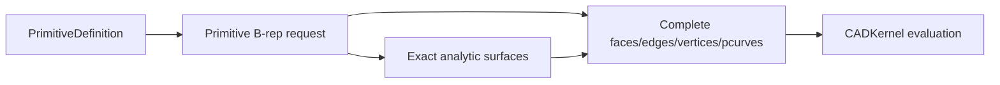

# CADModeling

## Purpose and Scope

`CADModeling` owns feature-evaluation requests and exact construction policies
for primitive and derived B-rep geometry. It is a child of the [Swift-CAD
package design](../../DESIGN.md) and has no children for this change.

## Responsibilities and Boundaries

[SpatialPath](SpatialPath/DESIGN.md) evaluates the explicit editable spatial
source into one exact B-spline curve and its sampled presentation.

The module owns primitive B-rep topology construction, including the sphere's
analytic surface patches, periodic seams, pole vertices, edge trims, and
surface parameter curves. It does not own the shared pcurve validation rules,
stable signature serialization, evaluation caching, or Rupa project authority.

## Related Designs

| Design | Relationship | Contract Used | Summary | Cautions |
|---|---|---|---|---|
| [Swift-CAD package](../../DESIGN.md) | parent | exact source-to-B-rep flow | Places modeling above geometry and below kernel orchestration. | Keep generated topology complete. |
| [CADGeometry](../CADGeometry/DESIGN.md) | depends on | analytic pcurve validation | Supplies the common structural contract. | Do not add a sphere-specific bypass. |
| [CADKernel](../CADKernel/DESIGN.md) | used by | evaluation and stable topology reads | Consumes the generated B-rep. | Stable reads must see every generated subshape. |

## Architecture

## Contracts and Invariants

All-edge box fillets retain the original outer bounds and replace a validated
orthogonal box by six inset planar faces, twelve quarter cylinders, and eight
spherical octants. Construction owns exact curves, trims and pcurves, not a
rounded display mesh. The nondegenerate domain is tolerance < radius < half the
shortest side minus tolerance; collapsed faces and unsupported topology fail
before publication. Existing single-edge behavior remains unchanged.
Verification checks volumetric validity, the 26-face topology, analytic volume,
unchanged bounds, exact-source round-trip, and invalid radius/target rejection.

1. A valid sphere creates one solid body with its complete analytic topology:
   eight faces, twelve edges, and six vertices, with pcurves on every coedge.
2. Seam and pole topology is a real part of the B-rep and remains available to
   stable-reference readers. It is not replaced by Mesh or omitted from a
   signature.
3. Primitive construction delegates parameter validity to `CADGeometry` and
   returns typed failure for invalid dimensions or malformed requests.

## Runtime Flows

Primitive evaluation builds exact topology, validates it at the kernel
boundary, and exposes it through the immutable evaluation snapshot.

## State, Ownership, and Lifecycle

Construction values are request-local. The resulting B-rep is owned by the
evaluation snapshot; derived Mesh remains separate presentation data.

## Failure, Concurrency, and Constraints

Construction is deterministic and side-effect free outside its result. It
fails before returning incomplete topology when a required surface, edge,
vertex, or pcurve cannot be built.

## Verification and Change Impact

Primitive tests assert exact topology counts, analytic volume, pcurve presence,
and stable-reference generation for every sphere subshape. Changes require
rechecking the shared geometry validation and stable signature owners.
