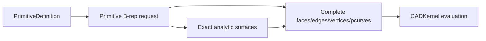

# CADModeling

## Purpose and Scope

`CADModeling` owns feature-evaluation requests and exact construction policies
for primitive and derived B-rep geometry. It is a child of the [Swift-CAD
package design](../../DESIGN.md). Children include
[InvoluteGear](InvoluteGear/DESIGN.md), [CertifiedTwist](CertifiedTwist/DESIGN.md)
and [SpatialPath](SpatialPath/DESIGN.md).

## Responsibilities and Boundaries

[SpatialPath](SpatialPath/DESIGN.md) evaluates the explicit editable spatial
source into one exact B-spline curve and its sampled presentation.

The module owns primitive B-rep topology construction, including the sphere's
analytic surface patches, periodic seams, pole vertices, edge trims, and
surface parameter curves. It does not own the shared pcurve validation rules,
stable signature serialization, evaluation caching, or Rupa project authority.

## Related Designs

| Design | Relationship | Contract Used | Summary | Cautions |
|---|---|---|---|---|
| [Swift-CAD package](../../DESIGN.md) | parent | exact source-to-B-rep flow | Places modeling above geometry and below kernel orchestration. | Keep generated topology complete. |
| [CADGeometry](../CADGeometry/DESIGN.md) | depends on | analytic pcurve validation | Supplies the common structural contract. | Do not add a sphere-specific bypass. |
| [CADKernel](../CADKernel/DESIGN.md) | used by | evaluation and stable topology reads | Consumes the generated B-rep. | Stable reads must see every generated subshape. |
| [InvoluteGear](InvoluteGear/DESIGN.md) | child | closed gear section | Composes flanks and analytic circular roots into Profile. | Resolved geometry only; no source or manufacturing certification. |

## Architecture

## Contracts and Invariants

Surface Creation expands the existing feature-evaluation path; it does not add
a second geometry authority. Extrude, Revolve, Loft, Sweep and Sweep preflight
share the source-section admission contract in
[SectionResolution](SectionResolution/DESIGN.md). This foundation does not yet
provide general boundary constraints or certify G1/G2 fitting. The approved
eleven-operation implementation remains incomplete until each actual evaluator,
source contract and application route meets its acceptance criteria.

### Revolve construction and closure

The existing rational surface-of-revolution builder owns both solid and sheet
construction. It consumes exact planar generator spans and the rotation axis;
curve sheets do not fabricate a closed Profile. One span construction path owns
surfaces, oriented pcurves, sewing and lineage. The requested body kind decides
whether partial-turn caps and solid shell ownership are built. Open generators
never receive caps. Angular seam splitting and whole-span radial half-space
validation remain common to both outputs. A sampled point may choose the radial
frame but cannot certify that the generator stays on one side of the axis.

`CurvedRevolveFeatureTests` owns solid regression; `RevolveSheetConstructionTests`
owns uncapped open-generator geometry, full-turn seams and invalid generators.
Source/API adoption is separately required before this builder is an exposed
Surface Creation operation.

### Loft section topology

Loft resolves exact curve sections without manufacturing a closed Profile.
The existing exact builder partitions section curves and owns both open-strip
and closed-loop topology. Open partitions have one more vertex than edge;
closed partitions wrap the final edge to the first vertex. Section closure is
independent of closing the sequence of sections. Only closed profiles admit
Solid output and planar caps. Common side-surface, connector, pcurve and lineage
construction is shared, including smooth connector generation.

Curve partitions retain each source span, subdividing at the union of normalized
boundary-progress breaks. Partitioning must preserve rational geometry, source
orientation and both open endpoints. Different closure kinds, disconnected
spans and degenerate correspondence are explicit failures. No triangulated or
sampled section substitutes for exact input. Advanced guide/continuity controls
remain separately tracked until connected to this same path.

### Bounded rotational Sweep construction

The implementation contract is owned by
[CertifiedTwist](CertifiedTwist/DESIGN.md), a child component of this module.

The precision-modeling extension retains the input profile exactly and stores
an explicit positional approximation allowance in Sweep source, separate from
modeling tolerance and presentation tessellation. A straight, profile-normal
path with unit section scale and no guides may use a piecewise-linear angle
law. The law includes both endpoints, has increasing normalized path positions,
and may reverse angular velocity at an explicit source knot; this represents a
double-helical construction without internal caps or a Boolean union.

Each constant-rate interval is subdivided into cubic Hermite rotation patches.
The rational profile basis/weights are retained in a tensor-product B-spline
surface. Numerical coefficient error and the whole-interval Hermite remainder
must together fit the explicit positional allowance. Sampled agreement alone
is not a certificate. Shared endpoint values and physical derivatives keep
artificial subdivision seams C1; a source-law velocity discontinuity is not
advertised as C1 or G2. No general C2 guarantee is made.

Admission verifies source-path straightness from exact span/control geometry,
not sampled frames, and rejects a singular rotation approximation or exhausted
patch/control-point budget before allocating the complete topology. Unsupported
scaling, guides, curved paths or unprovable numerical bounds fail explicitly.
The existing unannotated twist route does not silently acquire approximation.
Sewing, pcurves, caps, stable identity and exact validation remain the existing
kernel responsibilities. Success additionally requires source round-trip,
parameter re-evaluation, a closed double-helical solid and actual tessellation.

This subsection is an implementation acceptance contract, not a statement that
the extension has passed those tests.

All-edge fillets retain the original outer bounds and round every edge of a
validated box, circular cylinder, or convex prism. A box and a cylinder are told
apart by surface kind, not by topology counts, which are identical: six planar faces are a box,
four coincident cylindrical faces closed by two planar caps are a cylinder.
A box becomes six inset planar faces, twelve quarter cylinders, and eight
spherical octants. A cylinder becomes two inset planar caps, four cylindrical
band quarters, and eight toroidal fillet quarters, a fourteen-face shell with
twenty-eight edges and sixteen vertices. The cylinder frame is derived from the
two caps, so an extrusion that is symmetric or reversed about its sketch plane
is handled like one that starts at it. Construction owns exact curves, trims and
pcurves, not a rounded display mesh. The nondegenerate domain is tolerance <
radius, and for a box radius < half the shortest side minus tolerance. A box
rounds its corners with spherical octants, but a cylinder rounds its rims with
tori whose center circle must clear its own tube, so a cylinder admits twice the
radius < the cylinder radius minus tolerance with twice the radius < the height
minus tolerance. A cylinder is therefore bounded by half its own radius, and a
capsule is outside the domain.

Every other body reaches the general prism domain: a convex prism extruded
perpendicular to its cap, whose cap profile is one closed loop of straight
segments and circular arcs with every arc meeting its neighbours tangentially.
Its axis comes from a lateral cylinder when one exists and otherwise from a
plane normal that leaves exactly two caps and no oblique lateral face. A body
admitting two non-parallel such normals has only a, b and a x b as normals,
which is a rectangular box, and one rolling ball rounds a box to the same solid
down any of its three axes, so the candidates are signed canonically and the
smallest is taken. The frame is then read from the two caps rather than from
their order: the axis keeps that signed direction and the base is whichever cap
lies lower along it, so the same body yields the same solid however its faces
are enumerated. The profile is read from the bottom cap's outer loop, wound
counterclockwise about that axis and started at its lexicographically smallest
vertex, so one body yields the same stable identifiers on every evaluation. A profile of m segments
with C non-tangent corners becomes m inset lateral faces, two inset caps, C
vertical fillet cylinders, 2m cap fillet surfaces, and 2C corner spheres: a
regular N-gon prism is 6N + 2 faces and a straight stadium prism is twenty. A
tangent seam between an arc and its neighbour carries no corner and is left
unrounded. The domain excludes a reflex corner, a corner where either side is an
arc, an arc sweeping more than half a turn, and a lateral face that is neither a
plane containing its segment nor a cylinder coaxial with its arc. Its radius is
bounded by twice the radius < the height minus tolerance, by each segment
keeping trimmed length above tolerance once both its corners consume the radius
times the tangent of half their turn, and by each arc carrying its own torus
with twice the radius < the arc radius minus tolerance. A quadrilateral prism of
six planes is rounded as an orthogonal box before this domain is reached, so a
non-orthogonal quadrilateral is refused with the box message rather than
admitted here. Collapsed faces, unsupported topology, and a
radius the torus cannot carry fail before publication rather than during surface
construction. Existing single-edge behavior remains unchanged. Verification
checks volumetric validity, the per-shape topology, analytic volume, unchanged
bounds, exact-source round-trip, tessellation, and invalid radius/target
rejection. A box and a cylinder routed through this domain are compared vertex
for vertex against their own builders, which is what ties the three
constructions to one contract, and one document evaluated twice is compared
against itself, which is what holds the frame independent of face order.

1. A valid sphere creates one solid body with its complete analytic topology:
   eight faces, twelve edges, and six vertices, with pcurves on every coedge.
2. Seam and pole topology is a real part of the B-rep and remains available to
   stable-reference readers. It is not replaced by Mesh or omitted from a
   signature.
3. Primitive construction delegates parameter validity to `CADGeometry` and
   returns typed failure for invalid dimensions or malformed requests.

## Runtime Flows

Primitive evaluation builds exact topology, validates it at the kernel
boundary, and exposes it through the immutable evaluation snapshot.

## State, Ownership, and Lifecycle

Construction values are request-local. The resulting B-rep is owned by the
evaluation snapshot; derived Mesh remains separate presentation data.

## Failure, Concurrency, and Constraints

Construction is deterministic and side-effect free outside its result. It
fails before returning incomplete topology when a required surface, edge,
vertex, or pcurve cannot be built.

## Verification and Change Impact

Primitive tests assert exact topology counts, analytic volume, pcurve presence,
and stable-reference generation for every sphere subshape. All-edge fillet tests
drive a rectangle extrusion and a circle extrusion through the evaluator and
assert the two results the contract above names. Prism fillet tests drive a
hexagonal and a slot extrusion and assert the counts, surface kinds and Steiner
volume the contract names, reproduce both of the other two solids through the
general builder vertex for vertex, and assert the typed rejection of an
oversized radius, a non-convex profile, and a body outside every domain. Changes require rechecking the shared geometry validation,
the stable signature owners, and the `CADIR` all-edge fillet domain statement.
