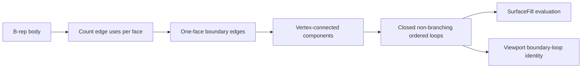

# CADTopology

## Purpose and Scope

`CADTopology` owns validated B-rep topology and topology-level queries. It is a
child of the [Swift-CAD package design](../../DESIGN.md) and owns
[OpenBoundaryLoop](OpenBoundaryLoop/DESIGN.md).

## Responsibilities and Boundaries

The module owns exact topological incidence, adjacency, ownership, and
validation. It does not construct NURBS surfaces, resolve Rupa selection, or
choose display behavior. Open-boundary loop discovery is shared topology
knowledge so feature evaluation and viewport presentation identify the same
eligible boundary components.

## Related Designs

| Design | Relationship | Contract Used | Summary | Cautions |
|---|---|---|---|---|
| [Swift-CAD package](../../DESIGN.md) | parent | exact B-rep topology | Defines topology's place in the package. | Mesh is not topology authority. |
| [OpenBoundaryLoop](OpenBoundaryLoop/DESIGN.md) | child | ordered boundary cycles and hole eligibility | Provides shared exact topology and rejects a lone face's outer perimeter as a fill target. | Geometry quality remains a modeling contract. |
| [CADModeling](../CADModeling/DESIGN.md) | used by | loop containing a stable seed edge | Builds a separate surface from an eligible boundary. | Curve conversion and surface quality remain CADModeling responsibilities. |
| [RupaCore](../../../RupaKit/Sources/RupaCore/DESIGN.md) | used by | loop edge membership | Marks the same open loop for viewport affordances. | Display identity comes from generated topology IDs. |

## Architecture

## Contracts and Invariants

- An eligible edge has exactly one coedge use in exactly one face owned by the
  requested body.
- A returned loop is connected, closed, has no repeated edge, and every vertex
  has degree two in that boundary component.
- Edge traversal records whether it follows the stored edge direction. A loop
  requested from a seed starts at that edge and follows its stored direction.
- Branches, open chains, non-boundary edges, and malformed components are not
  returned as closed loops. A lone face's outer perimeter is a valid boundary
  cycle but not a fillable hole; both modeling and presentation use the same
  predicate to refuse it.
- Loop discovery reads exact B-rep topology only. It never consults mesh edges
  or geometric endpoint proximity.
- `BRepModel.faceAreaMeasurement` (`TOPO-FACEAREA-001`) measures a face's area
  and area centroid from its coedge pcurves alone, never from a tessellation.
  A plane and a cylinder have a constant area element, so area and first
  moments are parameter-domain integrals of 1 and of the support's coordinate
  functions, each taken as the closed-form boundary integral −∮ G du with
  ∂G/∂v the integrand. Every G is periodic in u, so a cylindrical band bounded
  by two full circles measures correctly. Moments are divided by the signed
  area, so loop traversal sense cancels. Other supports, and pcurves with no
  closed form on the support (rational B-splines anywhere; harmonic,
  B-spline and certified pcurves on a cylinder), throw `unsupportedCapability`.
- Volume integrates each face loop as one chain on the periodic chart the
  `SurfaceParameterLoopUnwrapper` lifts it to. A great-circle pcurve on a
  sphere keeps the branch of longitude its chart lift starts on — a meridian
  along the seam reads as either end of the period — and a great circle split
  at the seam carries that branch on across it, so the integrated longitudes
  meet the unwrapper's translations. A projected analytic pcurve (a conic on
  a plane or a cone) reads a `Plane3D`'s parameters along the plane's own
  basis (`Plane3D.parameterBasis`, the one `Surface3D` places points by), so a
  hyperbolic edge on a floor or a side wall integrates on the chart its
  neighbouring pcurves share; `DraftFaceTests` own it by a cone-drafted wall's
  volume. A certified pcurve on a cylinder that runs round it (a crossed
  cylinder's intersection) reads its sheet off the start of the curve halved
  until its enclosure there spans less than a turn, and starts its cells
  halved until each does; a cell's enclosure may narrow to a point of the
  curve's own parameter (an endpoint's v enclosure). `CrossedCylindersTests`
  own it by a radial hole, a drilled hole and a tee.

## Verification and Change Impact

`CADTopologyTests` verifies deterministic ordered traversal, seed orientation,
multiple disjoint loops, and refusal to report branched or open boundary
components, and the single-face inner/outer fillability rule.
`FaceAreaMeasurementTests` (SwiftCADTests) prove box, L-shaped, full and half
cylinder areas and centroids against closed forms and the typed refusal.
`FilletShapeTests.everyEdgeOfABoxRoundsIntoARoundedBox` proves the sphere chain
at all eight octants of a box, including those whose meridians lie on the
seam, against the rounded box's closed-form volume. Changes affect
CADModeling Surface Fill and RupaCore body display topology; both consumers
must continue to agree on the exact cycle and whether it is actionable.
